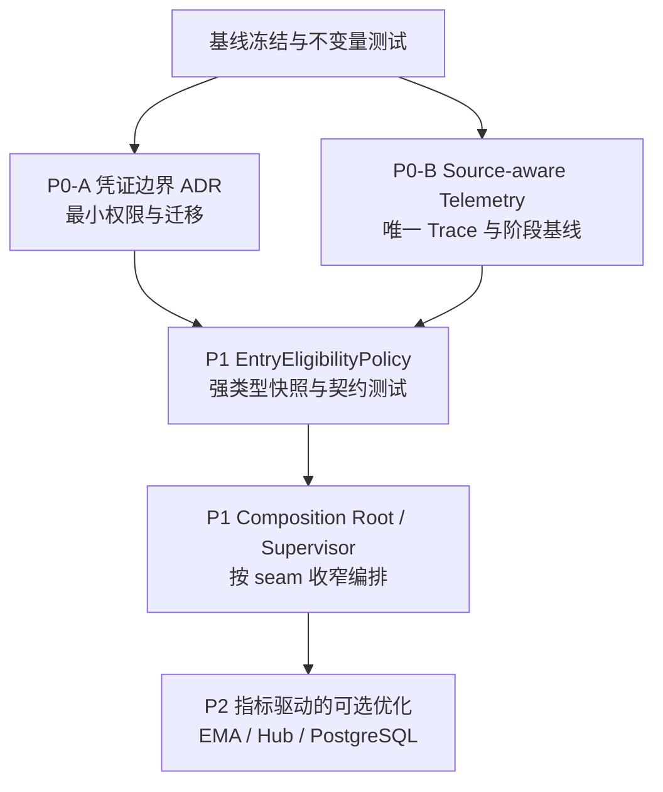

# Crypto Momentum Lab 重构计划

- **状态**：Draft — 已完成 source/terminal telemetry、服务器只读基线与 operation-aware 持久化 seam（默认行为未改变），尚未切换生产凭证或 Policy 主路径
- **计划日期**：2026-09-04
- **代码基线**：`ef85b97`（`feat: add research market-state collector`）
- **上位文档**：[`ARCHITECTURE_REVIEW.md`](ARCHITECTURE_REVIEW.md)、[`ARCHITECTURE_REVIEW_ASSESSMENT.md`](ARCHITECTURE_REVIEW_ASSESSMENT.md)
- **适用范围**：`live-strategy`、实盘遥测、Paper/Live 共享准入政策、Live 编排入口

## 1. 计划目标

本计划把架构评审中的判断转成可回滚、可观测、可验收的渐进式重构。目标不是重写交易系统，而是：

1. 在不改变交易安全不变量的前提下，先建立真实延迟和退出路径的观测能力；
2. 把 Paper/Live 共同拥有的准入政策放到一个小而深、可通过接口测试的领域模块中；
3. 逐步收窄 `main.py` 与 `LiveStrategyDaemon` 的编排接口和状态耦合；
4. 让凭证、遥测和架构规范与当前实盘行为一致。

### 非目标

- 不修改策略信号算法、特征定义或交易参数；
- 不把 Paper 与 Live 合并成一个执行 daemon；
- 不为了“架构整洁”删除现有 Hub 的序列、epoch、快照、重放和缺口 Fail-Closed 语义；
- 不在没有生产指标的情况下引入 Redis、Kafka、Kubernetes 或其他重量级中间件；
- 不把订单提交改造成普通内存异步队列。

## 2. 当前基线与不可变不变量

### 2.1 基线事实

- 实盘 `live-strategy` 直接持有 Binance 交易客户端并 REST 下单；当前 Compose 将同一组 `BINANCE_API_KEY/SECRET` 注入 `execution-account-live` 与 `live-strategy`，这是待解决的凭证复用风险（[`compose.server.yaml`](../compose.server.yaml#L434)、[`compose.server.yaml`](../compose.server.yaml#L496)）。
- 当前生产路径为 Top 10，并显式禁用 EMA5/10 价格准入过滤；历史 Top100+EMA 的 2.2～10.4 秒观测不能直接作为当前瓶颈基线（[`compose.server.yaml`](../compose.server.yaml#L540)、[`main.py`](../src/crypto_momentum_lab/apps/live_rollout/main.py#L1638)）。
- 退出入口包括 account、quote、market、15m candle 和 Grace timeout；account/quote 可独立入队，market 在本轮开仓评估后入队，candle/grace 走独立任务（[`daemon.py`](../src/crypto_momentum_lab/live_rollout/daemon.py#L277)、[`daemon.py`](../src/crypto_momentum_lab/live_rollout/daemon.py#L1395)）。
- 当前 telemetry 的 lane 是 `entry`/`exit`/`unknown`，Trace Key 仍是 `lane:symbol:bucket_start`，同桶多事件存在覆盖风险（[`telemetry.py`](../src/crypto_momentum_lab/live_rollout/telemetry.py#L30)、[`telemetry.py`](../src/crypto_momentum_lab/live_rollout/telemetry.py#L234)）。

### 2.2 必须持续成立的不变量

1. **下单前持久化屏障**：

   ```text
   risk approved
     -> durable intent + planned order + SUBMITTING
     -> Binance REST
     -> exchange/account reconciliation
   ```

   `prepare_submission` 必须在 REST 请求前同步完成；只能异步化 telemetry、signal 记录、checkpoint 和普通审计数据（[`order_repository.py`](../src/crypto_momentum_lab/persistence/postgres/order_repository.py#L82)）。

2. **单主交易租约**：失去租约、租约状态不明、Hub 缺口或关键上下文不可用时必须 Fail-Closed；任何重构不能放宽这一点。

3. **退出安全性**：所有退出分支仍必须经过既有退出协调器、标的锁和 reduce-only 执行流程；重构不得把 candle/grace 直接路径误改成普通 quote 队列。

4. **策略时间语义**：Runtime Strategy 消费显式事件时间；外围生命周期继续使用显式注入的 Wall Clock。不得在策略核心重新读取隐式系统时间。

5. **可回滚**：每个阶段保持独立提交和配置开关，任何阶段失败都能回退到 `ef85b97` 的行为路径。

## 3. 阶段总览



P0-A 与 P0-B 并行推进；P1 依赖两者提供的安全契约和观测基线；P2 永远不先于指标和回滚方案。

## 4. P0：基线冻结与安全护栏

### 4.1 工作内容

- 建立 `codex/` 前缀的重构分支，记录基线 commit、Compose 配置、策略 registry、当前 Top10/no-EMA 参数和数据库迁移状态；
- 重新运行全量测试并保存结果。现有 assessment 记录的参考基线是 `95 passed, 4 skipped`，应以本次重新运行结果为准；
- 为 `prepare_submission`、租约失效、Hub 缺口、退出锁和 reduce-only 路径补齐或确认回归测试；
- 建立“禁止异步化交易屏障”的 code review checklist；
- 为每个后续阶段定义 feature flag、灰度入口和回滚开关。

### 4.2 完成条件

- 能在干净环境重现基线测试结果；
- 至少有一个测试证明 REST 请求前已经写入 `SUBMITTING`；
- 至少有一个测试证明租约/关键上下文失效时不会发起新交易；
- 计划中的每个阶段都有明确的回滚路径和 owner。

## 5. P0-A：认证交易边界 ADR 与凭证迁移

### 5.1 目标

把当前“直连下单”从代码事实提升为经过批准的架构决策，并消除两个进程共享交易凭证的风险。建议新增：

`docs/adr/0001-live-trading-credential-boundary.md`

如果项目后续采用其他 ADR 编号约定，以仓库约定为准，但 ADR 必须保留以下内容。

### 5.2 ADR 必须回答的问题

- 为什么 `live-strategy` 需要直接 REST，而不是恢复跨进程 Outbox 执行 seam；收益只写成“移除一跳协调开销”，不写成已经证明的延迟结果；
- 哪个模块是交易租约的唯一持有者，租约丢失、续约失败、进程重启和网络分区时如何 Fail-Closed；
- `execution-account-live` 使用只读账户同步凭证，`live-strategy` 使用带 IP 白名单的交易凭证；两者的权限、Secret 名称、部署来源和审计责任；
- 进程重启、交易响应丢失、密钥轮换和旧订单对账的权威来源与状态转移；
- 熔断、人工解锁、密钥撤销和回滚流程，以及如何验证回滚不会重复下单。

### 5.3 迁移步骤

1. 为配置层增加环境中立的读/交易凭证字段，例如 `BINANCE_READ_API_KEY/SECRET` 与 `BINANCE_TRADE_API_KEY/SECRET`；旧变量只作为明确标记为 deprecated 的兼容入口。
2. 先让 `execution-account-live` 使用读凭证运行，只做账户 User Data Stream 和只读 REST，对照旧路径验证账户镜像、订单状态和 Hub 事件一致。
3. 让 `live-strategy` 使用交易凭证，交易凭证启用 IP 白名单和最小交易权限；在测试/影子环境验证租约、拒绝和熔断路径，不发送真实订单。
4. 生产灰度期间保留可撤销的旧凭证回滚窗口，监控账户事件、订单对账、权限错误和 lease 状态；确认无误后撤销旧凭证。
5. ADR 批准后，再同步修订 2026-06 设计规范中的 Invariant 1；批准前不把旧规范标记为已废止。

### 5.4 验收与回滚

- Compose 不再默认把同一组变量注入两个容器；
- 读凭证在配置/客户端测试中不能调用交易写接口；
- 交易凭证只出现在 `live-strategy` 的部署路径；
- 任何凭证缺失、权限不符、租约不明或对账失败都 Fail-Closed；
- 回滚只切换配置和 feature flag，不回滚已写入的订单状态或数据库迁移。

## 6. P0-B：Source-aware Telemetry 与阶段基线

### 6.1 目标

在不阻塞交易决策的前提下，让每一个退出触发实例都能被唯一追踪，并区分入口等待、规则计算、风险审批、持久化屏障和 Binance RTT。遥测失败只能影响观测，不能改变交易结果。

### 6.2 建议的接口与数据模型

在 [`live_rollout/telemetry.py`](../src/crypto_momentum_lab/live_rollout/telemetry.py) 增加或等价实现以下概念：

```text
SourceIngress:
  run_id
  source_event_id       # 在 ingress 处生成，重试时保持不变
  lane: entry | exit | unknown
  trigger_source: account | quote | market | candle | grace | None
  symbol
  bucket_start: datetime | None
  source_occurred_at    # 上游事件时间，可为空
  received_at           # 本地 ingress wall-clock UTC

TraceKey:
  run_id + source_event_id
  # symbol/bucket/source 作为可检索字段，而不是唯一性唯一依据
```

接口约束：

- `lane=exit` 时 `trigger_source` 必须非空且属于五元集合；`lane=entry` 才允许省略；
- `source_event_id` 必须在事件第一次进入进程时创建，不能在被 queue coalescing 后的 worker 内创建；
- `source_event_id` 的唯一性范围必须覆盖多 worker、多进程实例和重启 epoch；重试/重放要复用原 id，新的业务触发才生成新 id；
- 记录持久化使用 UTC wall-clock，阶段耗时使用同一进程的 monotonic clock，不能用交易所事件时间直接相减当作本地处理延迟；
- `source_received` 应是通用事件，不要把 account、quote、candle、grace 强行伪装成 `MarketState15s`。

### 6.3 迁移步骤

1. 保留现有 `lane` 枚举和旧 dashboard 字段，新增 `trigger_source`、`source_event_id`、`trace_id` 和时间字段；
2. 增加通用 `source_received` 接口，并让 `context_ready`、`candidate_accepted`、`risk_approved`、`intent_saved`、exchange 阶段接收同一个 trace context；
3. 先在内存 trace 中验证同一 symbol/bucket 的五种来源不会互相覆盖，再打开后台持久化；
4. 对拒绝、熔断、异常和未到达后续 phase 的 trace 记录 terminal reason，避免只统计成功路径；
5. 按 `lane + trigger_source` 统计：

   ```text
   source_received -> context_ready
   context_ready -> candidate_accepted
   candidate_accepted -> risk_approved
   risk_approved -> intent_saved
   intent_saved -> exchange_request_started
   exchange_request_started -> exchange_response_received
   ```

6. 建立当前 Top10/no-EMA 的生产基线，历史 Top100+EMA 数据单独归档，不混入同一 SLO。

### 6.4 验收与回滚

- 同一 15 秒桶内至少产生 account、quote、market、candle、grace 五类 trace 的测试，所有 Trace Key 唯一；
- 重试复用 `source_event_id`，重放不会重复计算为新的业务触发；
- `lane=exit` 缺失或伪造 `trigger_source` 时被拒绝/报警；
- telemetry sink 停止或数据库不可用时，交易路径继续按原逻辑运行；
- p50/p95/max 能分别显示队列等待、worker 执行、风险审批、持久化屏障和 REST RTT；
- 如果遥测开销或 schema 兼容性有问题，可关闭持久化和新字段，保留内存诊断与旧 lane。

## 7. P1：提炼 `EntryEligibilityPolicy` 深模块

### 7.1 Seam 与放置

Policy 是 Paper 和 Live 共同需要的领域政策，不应放在 `live_rollout`。建议以 `domain/strategy` 下的新模块为候选 seam，例如：

`src/crypto_momentum_lab/domain/strategy/entry_policy.py`

实际放置前先检查现有 `domain/strategy/models.py` 和 `domain/universe` 的类型复用；不要为了新建文件复制现有模型。

### 7.2 接口契约

```text
EntryEligibilityPolicy.evaluate(
    snapshot: PolicyInputSnapshot,
) -> EntryEligibilityDecision
```

`PolicyInputSnapshot` 应是深度不可变、UTC 明确、可序列化的快照：

```text
PolicyInputSnapshot:
  observed_at: datetime (UTC)
  candidate_expiry: datetime (UTC)
  entry_gate_result: EntryGateResult
  direction: StrategySide
  universe_snapshot: UniverseRankingSnapshot
  ema_state: EmaPolicyState
```

`EmaPolicyState` 的语义固定为：

- `disabled`：只跳过 EMA 谓词，仍继续检查过期、Entry Gate、Universe 和方向；
- `unavailable`：过滤开启但数据缺失、过期或不完整，Fail-Closed，返回 `ema_unavailable`；
- `valid(snapshot)`：先验证 symbol、周期、截面时间和最大年龄，再进行 EMA 比较。

Policy 只返回资格和显式拒绝原因，不读取账户余额、不获取网络数据、不写数据库、不驱动执行状态机。账户风险和订单执行继续由外围宿主负责。

### 7.3 迁移步骤

1. 定义 `EntryGateResult`、`EmaPolicyState`、`PolicyInputSnapshot` 和 `EntryEligibilityDecision`；嵌套 Universe/EMA 快照必须有版本、截面时间和稳定排序规则。
2. 先实现纯函数和 contract tests，不改变 Live/Paper 行为。
3. 在 Live 中以 compare-only 模式同时运行旧规则和新 Policy，只记录差异，不改变下单结果；差异必须带 source trace 和拒绝原因。
4. 差异归零后，让 Live 使用新 Policy，再让 Paper 使用同一个 Policy；保留短期 shadow comparison 以防配置漂移。
5. 删除已经被新 Policy 取代的重复政策实现和只测试内部细节的旧测试；保留通过 Policy 接口验证行为的测试。

### 7.4 验收与回滚

- disabled EMA 不会短路其他准入规则；unavailable 在启用过滤时始终拒绝；valid 只接受新鲜、匹配 symbol/周期的快照；
- 同一标准化 `PolicyInputSnapshot` 在 Paper/Live 输出完全一致；
- 不同环境的账户余额、网络、撮合和执行状态不会进入 Policy 接口；
- compare-only 阶段没有行为差异后才能切换主路径；
- 发现差异时关闭新 Policy flag 即可回到原规则，不能回滚已提交订单。

## 8. P1：收窄 Composition Root 与 `LiveStrategyDaemon`

### 8.1 先画状态和依赖图

对 [`main.py`](../src/crypto_momentum_lab/apps/live_rollout/main.py) 和 [`daemon.py`](../src/crypto_momentum_lab/live_rollout/daemon.py) 先做只读盘点：

- 启动配置和 CLI 校验；
- 资源构造与 Hub client；
- lease/watchdog 与 graceful shutdown；
- market loop、entry lifecycle、exit lane、candle/grace 任务；
- context provider、repository、execution port、telemetry、checkpoint writer。

按“谁拥有状态、谁能改变状态、谁只观察状态”标注依赖，先确定 seam，再决定是否新建模块。

### 8.2 推荐的重构顺序

1. **先抽 Supervisor seam**：把后台心跳、lease watchdog、Hub 保活、信号处理和 graceful shutdown 收进一个有实际行为的 `LiveProcessSupervisor`；其接口只暴露启动、停止、失败状态和等待，不暴露每个后台 task。
2. **保留 Composition Root**：`main.py` 继续负责依赖组装、配置验证和 adapter 选择；不要把每个函数机械搬到 `ConfigParser` 类。
3. **再收窄 Daemon 外部接口**：按配置、运行时服务和策略状态拆分依赖；优先使用已有的 context/repository/execution seam，避免再包一层浅 adapter。
4. **保持退出路径不变**：account/quote 的独立队列、market 的延后入队、candle/grace 的直接任务和标的锁必须有行为回归测试。
5. **每次只移动一个深模块**：先编译、跑单测和集成测试，再移动下一个状态簇；不进行跨模块大批量重命名。

### 8.3 验收与回滚

- Composition Root 的输出资源集合、配置 hash、Hub 连接和租约行为与基线一致；
- Supervisor 能在任一后台任务失败时触发原有 Fail-Closed/Shutdown 行为；
- Daemon 构造参数和可变状态减少，但调用方只需要学习更小的接口；
- 退出、订单提交、checkpoint 和 telemetry 的行为测试通过；
- 任一重构提交可独立回滚，不依赖后续模块已经迁移。

## 9. P2：按指标驱动的可选优化

只有 P0 telemetry 产生稳定基线后，才评估以下项目：

- 若 EMA 宽池重新启用，拆分 REST 等待、响应解析、EMA 计算、线程调度和事件循环 lag；
- 若 Hub 故障率或维护成本超出 SLO，设计保留 epoch、快照、重放和缺口 Fail-Closed 的替代实现，再比较 Redis Streams、UDS 等方案；
- 若 PostgreSQL 指标显示 checkpoint payload、分区淘汰或订单生命周期成为瓶颈，再调整连接池、写形状或保留策略。

任何优化都必须先有：基线数据、替代方案的可靠性契约、灰度开关、回滚方案和前后对比指标。

## 10. 测试与验证矩阵

| 阶段 | 主要测试 | 必须观察的指标 | 通过条件 |
| :--- | :--- | :--- | :--- |
| 基线 | 全量 pytest、ruff、mypy、关键集成测试 | 测试通过数、跳过原因 | 与基线无未解释回归 |
| 凭证 ADR | 配置解析、权限边界、lease/Fail-Closed、重启对账模拟 | 权限错误、租约状态、reconcile 结果 | 读 Key 不能交易，缺权限不发单 |
| Telemetry | 同桶多来源、防碰撞、重试复用 ID、终止原因汇总、sink 故障 | dropped events、persist failures、trace collision、reason cardinality | Trace 唯一，汇总不带高基数身份，交易路径不受 sink 影响 |
| Policy | 三态 EMA、过期、gate/universe/direction、Paper/Live contract | compare-only 差异计数 | 相同快照输出一致，差异可解释 |
| Supervisor | 后台任务失败、信号关闭、Hub 断线、优雅停止 | shutdown latency、lease state | 行为与基线一致且可回滚 |
| P2 优化 | 基准前后对比、故障注入、灰度回放 | p50/p95/max、事件循环 lag、DB/Hub 错误率 | 只有可证明收益才合入 |

推荐使用项目已有的 `pytest`、`ruff` 和严格 `mypy` 配置；live 标记测试仍需遵守其公共 Binance/长时间运行前提，不把网络不可用误报为单元测试失败。

## 11. 交付物与发布门槛

### 交付物

- `docs/adr/0001-live-trading-credential-boundary.md` 及设计规范同步变更；
- Source-aware telemetry schema、Trace 唯一性测试、阶段延迟报表和运行手册；
- `domain/strategy` 下的 `EntryEligibilityPolicy` 及 Paper/Live contract tests；
- `LiveProcessSupervisor` seam 设计、Daemon 依赖/状态图和逐步迁移提交；
- 每阶段的灰度、回滚和故障注入记录。

### 发布门槛

只有同时满足以下条件才允许进入下一结构性阶段：

1. 前一阶段的不变量测试和全量测试通过；
2. 没有未解释的 Policy compare-only 差异；
3. telemetry 能唯一追踪每个退出触发实例，且 sink 故障不影响交易；
4. 当前生产路径的阶段基线已保存，历史配置未混入；
5. 回滚演练成功，尤其是凭证切换、租约失效和进程重启对账；
6. 代码审查确认没有把 `prepare_submission`、退出锁或 Fail-Closed 路径异步化/旁路化。

## 12. 第一批实施切片

为了控制风险，第一批不做 God Module 拆分，建议只交付以下三个小切片：

1. 新增 ADR 草稿和凭证配置 schema（暂不切换生产凭证）；
2. 新增 `SourceIngress`/唯一 Trace 的内存模型与测试（暂不改变 dashboard）；
3. 新增 `PolicyInputSnapshot` 与 `EntryEligibilityPolicy` 的纯函数骨架和 contract tests（暂不接管 Live/Paper 主路径）。

这三个切片完成并通过门槛后，再分别进行凭证灰度、遥测持久化、Policy compare-only 和 Supervisor 重构。这样每一步都有清晰的 seam、可观察结果和回滚点，避免把架构计划变成一次高风险的全量迁移。

## 13. 第一批切片实施记录（历史记录，2026-09-04）

第一批切片已完成，且没有接管现有 Live/Paper 主路径：

1. 已新增 [`docs/adr/0001-live-trading-credential-boundary.md`](adr/0001-live-trading-credential-boundary.md)，并在 [`config/models.py`](../src/crypto_momentum_lab/config/models.py) 增加只保存环境变量名的 `BinanceCredentialConfig` schema。该 ADR 仍为 Proposed，schema 尚未接入运行时，因此没有切换任何生产环境变量。
2. 已在 [`live_rollout/telemetry.py`](../src/crypto_momentum_lab/live_rollout/telemetry.py) 增加 `SourceIngress`、结构化 `TraceKey` 和 `source_received` 记录接口。`TraceKey` 对 `run_id` 与 `source_event_id` 使用长度前缀，避免分隔符歧义；退出车道缺少五元 `trigger_source` 时直接拒绝构造。现有 `state_trace_id` 和仪表盘尚未迁移。
3. 已新增 [`domain/strategy/entry_policy.py`](../src/crypto_momentum_lab/domain/strategy/entry_policy.py) 的纯计算契约：不可变 `PolicyInputSnapshot`、`EntryGateResult`、方向感知的 `UniverseRankingSnapshot`、三态 `EmaPolicyState` 与 `EntryEligibilityPolicy`。`disabled` 只跳过 EMA 谓词，`unavailable` Fail-Closed，`valid` 校验 symbol、时间新鲜度及严格大于 EMA 的比较；尚未接入 Live/Paper。
4. 新增的 26 个定向测试全部通过；新增模块通过 `ruff` 和严格 `mypy` 检查。进入下一切片前仍需跑完整回归矩阵，并在真实部署上验证凭证权限和退出来源适配。

## 14. 第二批实施切片：退出 SourceIngress 调用方接线（历史记录，2026-09-04）

本切片把 P0-B 的 source-aware telemetry 从“可独立构造的模型”推进到实盘退出入口的适配边界。适配器只负责在进程入口规范化来源和身份，再把同一 ingress 沿既有退出 seam 传递；没有改变排队、合并、标的锁、风控或发单顺序。

### 已完成的接线

1. [`live_rollout/daemon.py`](../src/crypto_momentum_lab/live_rollout/daemon.py) 的账户、报价、闭合 15m candle、Grace timeout 公开方法均接受可选 `source_ingress`。入口在加载上下文前记录 `source_received`，上下文成功后记录带 `lane=exit` 的 `context_ready`；无 ingress 的旧调用保持原行为。
2. `account`、`quote`、`market` 三种队列工作以及 `candle`、`grace` 直接任务都会把 ingress 传入 worker、退出请求、未知订单恢复和候选/风险/意图阶段。候选 trace 以 source trace 为 parent，不再使用同桶状态 trace 作为唯一身份。
3. [`apps/live_rollout/main.py`](../src/crypto_momentum_lab/apps/live_rollout/main.py) 为账户、报价、收盘蜡烛和 Grace 四个外部入口创建稳定 source id；[`live_rollout/daemon.py`](../src/crypto_momentum_lab/live_rollout/daemon.py) 为 market state 创建 `symbol/bucket` 身份。重试复用同一 ingress；报价模型暂时没有上游 update id，因此其内容指纹仍是临时适配方案，本地 `received_at` 不参与身份。
4. market 入口在状态刚被观察时记录 source，再按原有时机（本轮开仓评估与 orphan 检查之后）入队；这保留了“独立 worker 执行、但不是从事件入口即完全并行”的原语义。account 携带 quote 的不可丢失直接快路径仍然保留。

### 验证与边界

- 定向退出、遥测和应用适配测试共 **82 passed**；相关文件通过 `ruff`，整个 Python 包通过严格 `mypy`（175 个源文件）。排除一个已有的 `deploy` 导入路径问题后，完整 `tests/unit` 为 **807 passed / 4 skipped**。
- 本切片未新增数据库列，也未改变 `PERSISTED_ORDER_TELEMETRY_EVENTS` 默认集合：source/context 事件主要留在内存 trace，订单阶段的持久化事件携带 source details。Quote 高频 source 的持久化采样和 terminal reason 仍需按生产容量与 SLO 决定。
- `prepare_submission`、单主租约、Fail-Closed、reduce-only、退出锁和 checkpoint 行为均未改动。生产凭证仍未切换，`EntryEligibilityPolicy` 仍未接管 Live/Paper。
- 先前完整回归的环境限制仍然存在：本地 PostgreSQL/loopback 不可用导致的集成、E2E 与 smoke 失败/错误不能用本切片的定向结果替代；进入生产基线前需在可用依赖环境重跑完整矩阵。

### 下一切片门槛

1. 在可用部署环境采集五种退出来源的 `source_received -> context_ready -> candidate -> risk -> intent` p50/p95/max，并明确 queue coalescing、直接快路径与 candle/grace 任务的样本范围。
2. 决定 source/context 的持久化策略（全量、低频采样或只在异常/有候选时落盘），补齐未到达后续阶段的 terminal reason，避免只看到成功订单。
3. 完成 ADR 批准前的凭证边界演练，再进入 Policy compare-only；Supervisor/Daemon 结构性拆分继续后置。

## 15. 第三批实施切片：退出 trace 的 terminal reason seam（2026-09-04）

本切片把“source 已收到但没有走到候选/风险/意图阶段”的事实收敛到 telemetry seam。它记录处理尝试的结束原因，不改变退出状态机、订单状态或交易安全屏障。

### 已完成的契约与接线

1. [`live_rollout/telemetry.py`](../src/crypto_momentum_lab/live_rollout/telemetry.py) 增加 `TRACE_TERMINATED` 事件和 `LiveTelemetrySink.trace_terminated()`。事件始终挂在 `SourceIngress.trace_id` 上，要求非空 reason，可附带低基数 details，并沿同一 `_PHASE_ORDER` 计算阶段耗时。
2. [`live_rollout/daemon.py`](../src/crypto_momentum_lab/live_rollout/daemon.py) 对 account、quote、market、closed candle、Grace 五种退出来源记录主要终止路径：退出未启用/未配置、上下文加载失败、symbol 不匹配、非托管持仓、gate/reconcile/lane 失败、recovery/request evaluation/execution 异常、无退出请求、退出意图已处理，以及 risk、执行上下文、quantization、交易所拒绝和待对账等细分原因。market/quote 的 latest-value coalescing 发生时，被替换的 source 也会收到 `coalesced_by_newer_source` 终止原因。
3. terminal telemetry 是 best-effort：sink 自身异常只写日志，不会把观测故障升级成交易故障；原有 queue coalescing、独立锁、`prepare_submission` 顺序和 reduce-only 执行路径没有改变。
4. 应用仍使用 `PERSISTED_ORDER_TELEMETRY_EVENTS`，因此 source/context/terminal 事件默认留在内存 trace；这避免把高频 quote 的“无请求”结果变成持续 WAL 生产者。全量、采样或只落异常的持久化策略留到生产容量和 SLO 基线之后决定。

### 验证与边界

- terminal reason 契约与退出调用方定向测试共 **86 passed**；相关代码通过 `ruff`，整个 Python 包严格 `mypy` 通过（175 个源文件）。排除已有的 `deploy` 导入路径问题后，完整 `tests/unit` 为 **811 passed / 4 skipped**。
- 终止事件表示一次 source-triggered processing attempt 已结束，不替代交易订单的 `REJECTED`、`UNKNOWN_PENDING_RECONCILIATION` 或 `FILLED` 状态；订单生命周期仍由既有 state machine 和持久化事件负责。
- 同一 `source_event_id` 的重试会复用 source trace，当前允许同一 trace 追加多个终止尝试事件；是否需要按 attempt 序列化或去重，必须先观察真实重试和容量，不在本切片引入隐式去重。
- 本切片没有把 entry market loop 的旧 `state_trace_id` 全面迁移到 SourceIngress，也没有新增数据库列或改变默认持久化集合；生产审计闭环仍未完成。

### 下一切片门槛

1. 在可用部署环境验证 context/recovery/request evaluation/风险拒绝等 terminal reason 的实际占比，并区分 queue coalescing、直接快路径和 candle/grace 任务。
2. 基于事件量和 SLO 决定 terminal/source/context 的持久化策略；如需落盘，优先设计低基数 reason、采样和容量上限，避免把 observability 变成执行库 WAL 压力。
3. 重新评估是否需要给报价上游补稳定 update id；在此之前保留内容指纹方案，不把本地 receive time 当作业务身份。
4. 完成凭证 ADR 批准前的权限/租约/重启对账演练，再进入 Policy compare-only；Supervisor/Daemon 结构性拆分继续后置。

## 16. 第四批实施切片：terminal reason 的只读基线汇总（2026-09-04）

本切片把第三批产生的终止事件收敛成一个可供运行手册、日志或后续指标 adapter 使用的只读汇总接口。它只增加内存计数，不打开高频 source/context/terminal 的默认持久化，也不改变退出执行顺序。

### 已完成的契约

1. [`live_rollout/telemetry.py`](../src/crypto_momentum_lab/live_rollout/telemetry.py) 新增 `TerminalReasonSummary` 和 `LiveRuntimeTelemetry.terminal_reason_summary()`。返回形状固定为 `lane -> trigger_source -> reason -> count`，值只包含 JSON 基础类型，调用方不需要知道 `_Trace`、事件队列或持久化 sink。
2. 计数在 `TRACE_TERMINATED` 成功写入有界内存 trace 后更新；只保留 lane、来源和 reason 三个维度，symbol、source event id、candidate/client order id 等身份继续留在详细事件中，避免把指标接口变成高基数索引。
3. 汇总每次返回脱离内部状态的新快照，读取不会修改 recorder；telemetry stop 日志同时输出该汇总，便于在不新增数据库写入的情况下提取一次 run 的基线。同一 source id 的重复尝试按事件次数计数，不在没有生产重试数据时引入去重语义。

### 验证与边界

- terminal reason、daemon 接线和汇总快照定向测试共 **87 passed**；相关代码通过 `ruff`，telemetry 模块通过严格 `mypy`。
- 排除已有的 `tests/unit/ops/test_cml_ops_monitor.py` `deploy` 导入路径问题后，完整 `tests/unit` 为 **812 passed / 4 skipped**；另有 Starlette/httpx 的既有弃用告警。
- 汇总是进程内、run-scoped 的诊断快照，重启后不会自动恢复；reason 仍由调用方提供，必须保持低基数，详细动态信息应放在 `details` 而不是 reason。默认持久化集合、数据库 schema 和交易安全屏障均未改变。

### 下一切片门槛

1. 在可用部署环境导出该汇总，并与五类退出来源的阶段延迟一起观察，确认 reason 的实际基数、重试/合并率和各入口样本量。
2. 依据事件量、重启审计要求和 SLO 选择全量、采样或异常落盘；若需要持久化，先固定 reason 枚举、容量上限和回滚开关，再修改 `PERSISTED_ORDER_TELEMETRY_EVENTS`。
3. 同步完成报价上游稳定 update id 的评估、凭证 ADR 的权限/租约演练；这些证据稳定后才进入 Policy compare-only，Supervisor/Daemon 拆分继续后置。

## 17. 服务器只读基线：exchange query 持久化占比（2026-09-04）

本节记录对服务器的只读核查结果。没有重启服务、读取 secret 值、修改配置或发送订单；查询对象是当前正在运行的旧镜像，因此不能把它当作第四批 source/terminal telemetry 的验证。

### 部署事实

- `live-strategy`、`execution-account-live`、`market-data`、PostgreSQL 和 dashboard 均为 healthy；`live-strategy` 容器当前 `restart=1`，本次核查时已连续运行约 5 小时。
- 服务器 checkout 和运行镜像都是 `ef85b9720e031172b0b8e250f3fbb7eaf2a64989`（`feat: add research market-state collector`），尚未包含本计划第四批的 `terminal_reason_summary()` 与 stop 日志字段。
- 服务器只有权限为 `0600` 的 `.env.server`，没有 `.env.live`；配置键名显示 `BINANCE_API_KEY` 与 `BINANCE_API_SECRET` 仍在同一配置文件中。这验证了凭证 ADR 仍是发布前置条件，但没有读取或记录任何 secret 值。

### 最近 24 小时的执行库遥测

| 事件/操作 | 数量 | 说明 |
| :--- | ---: | :--- |
| `candidate_accepted` / `risk_approved` / `intent_saved` / `submitting` | 68 / 68 / 68 / 68 | 形成完整下单前链路的候选数 |
| `exchange_request_started` | 1,216 | `query` 1,139，`submit` 68，`cancel` 7 |
| `exchange_response_received` | 1,218 | `query` 1,141，`submit` 68，`cancel` 7 |
| `exchange_filled` / `account_fill` | 64 / 106 | account fill 可能包含同一订单的多次成交 |

因此 exchange response 中约 **93.7%** 是 `query`，不是下单或撤单。当前 `PERSISTED_ORDER_TELEMETRY_EVENTS` 按事件类型筛选，无法区分 operation，生产库实际写入形状比“稀疏订单生命周期”假设更宽。

### 阶段延迟（UTC，最近 24 小时）

| 阶段 | 样本 | p50 | p95 | max |
| :--- | ---: | ---: | ---: | ---: |
| `candidate -> risk` | 68 | 0.157 ms | 1.900 ms | 7.150 ms |
| `risk -> intent` | 68 | 0.124 ms | 1.994 ms | 3.483 ms |
| `intent -> submitting` | 68 | 0 ms | 0 ms | 0 ms |
| exchange `submit` RTT | 68 | 42.265 ms | 473.783 ms | 1,328.147 ms |
| exchange `query` RTT | 1,137 | 42.892 ms | 186.165 ms | 1,566.226 ms |
| exchange `cancel` RTT | 7 | 155.326 ms | 1,765.282 ms | 1,797.281 ms |

`submit_response -> filled` 的 p50 约 49 秒、p95 约 22 分钟，代表 LIMIT 订单在市场上的停留时间，不应当误报为交易请求 RTT。过去 24 小时日志中出现 **7 次** `live_runtime_telemetry_persist_failed`（`TimeoutError`）；这证明遥测写入存在超时，但尚不足以单独证明 PostgreSQL 是交易延迟根因。遥测表约 96 MB、约 139k live rows，dead rows 仅 3，当前更需要先拆写入类型和批次压力。

### 基线结论与下一步

1. 当前没有 `source_received`、`context_ready` 或 `trace_terminated` 的持久化样本，不能从这台旧镜像得出退出来源/原因分布；必须先部署包含第四批汇总的可回滚镜像，或在隔离环境验证后再采样。
2. 现有证据不支持把 `candidate -> risk -> intent` 或 checkpoint I/O 视为主要瓶颈；优先设计 operation-aware 的持久化策略，明确 `query` 是否只需短期诊断、采样或完全留在内存。
3. 任何修改都应先在非真实下单路径验证，保留 `prepare_submission`、订单状态和 Fail-Closed 不变量；凭证隔离、租约和重启对账演练仍需先于生产凭证切换。

## 18. 第五批实施切片：operation-aware durable telemetry seam（2026-09-04）

服务器基线显示，最近 24 小时 `exchange_response_received` 中约 93.7% 是
`query`，且出现过 telemetry persistence timeout。先把“哪些 exchange
operation 进入 durable queue”收敛成一个可替换的显式 seam，再依据灰度数据决定
是否过滤 query；本切片不改变交易调用方或生产配置。

### 已完成的契约

1. [`live_rollout/telemetry.py`](../src/crypto_momentum_lab/live_rollout/telemetry.py)
   的 `LiveRuntimeTelemetry` 新增可选 `persist_exchange_operations` allow-list。
   它只作用于 `EXCHANGE_REQUEST_STARTED` 与
   `EXCHANGE_RESPONSE_RECEIVED`，按事件 `details.operation` 匹配；其他事件类型
   不受影响。
2. 参数为 `None` 时保持现有行为，`query`、`submit`、`cancel` 及未来的其他
   operation 都继续进入 durable queue。显式空集合表示不持久化 exchange boundary
   事件，显式集合可先只保留 `submit`/`cancel`，而内存 trace、延迟采样、
   `recorded_event_count` 和交易状态机均不变。
3. `cml-live-rollout run` 暴露 `--persist-exchange-operations`，以逗号分隔的值
   在 composition root 解析后传入 telemetry；省略或传空值映射为 `None`。服务器
   Compose 已预留同名的 `CML_LIVE_PERSIST_EXCHANGE_OPERATIONS` 插值，但默认传空，
   不会改变现网行为。operation 名称在构造时去除首尾空白并拒绝空值；未知或缺失
   operation 在启用 allow-list 时不会落盘，避免把不完整的 boundary 事件误当成可审计
   数据。stop 日志会输出当前 allow-list，便于灰度期间确认配置形状。

### 验证与边界

- telemetry、source、daemon 与 live app 定向测试共 **96 passed**；telemetry
  模块和新增测试通过 `ruff`，telemetry 严格 `mypy` 通过。
- 排除既有 `tests/unit/ops/test_cml_ops_monitor.py` 的 `deploy` 导入路径问题后，
  完整 `tests/unit` 为 **821 passed / 4 skipped**；全包严格 `mypy` 为 175 个源文件
  全部通过。
- 新测试同时证明：显式 allow-list 会保留 `submit`/`cancel` 的 request/response
  审计并过滤 `query`，而省略 allow-list 时仍持久化 `query`；所有事件仍保留在
  内存 trace 中。
- 应用入口和服务器 Compose 现在支持显式 allow-list，但服务器环境文件仍未设置该值，
  默认仍为 `None`；因此本切片没有改变服务器的写入量，也没有把未验证配置部署到远端。

### 下一切片门槛

1. 在隔离或影子环境设置 `CML_LIVE_PERSIST_EXCHANGE_OPERATIONS=submit,cancel`，把
   source/terminal 汇总和该 allow-list 接到可观测配置，验证
   `submit`/`cancel` 审计完整、`query` 过滤比例、批次耗时、dropped/persist
   failures 及重启窗口；不能只凭本地单测开启生产过滤。
2. 若灰度数据支持过滤 query，再增加明确的配置字段和回滚开关，并把审计要求
   写入 ADR；若不支持，保留 `None` 默认并优先优化 sink/批次，而不是静默丢事件。
3. 继续保持 `prepare_submission`、租约 Fail-Closed、退出锁和 reduce-only 执行
   seam 不变；凭证权限/重启对账演练完成后才推进 Policy compare-only。

## 19. 直接生产上线后的运行验收记录（2026-09-04）

按上线决策，未再等待隔离/影子环境，直接将 operation-aware durable telemetry
配置部署到服务器。此次部署的 release 为 `c165a82944b3d9e0155f9fe197d34def86f2eabb`，
服务器配置为 `CML_LIVE_PERSIST_EXCHANGE_OPERATIONS=submit,cancel`。这意味着
`query` 请求仍会执行并留在内存 trace/日志中，但 exchange boundary 的 durable
写入只保留 `submit`/`cancel`；候选、风险、意图、成交和对账事件不受该 allow-list
影响。

### 已观察到的结果

- `live-strategy` 容器自 `2026-09-04 14:05:06 UTC` 启动后观察超过 1 小时；健康检查
  持续为 healthy，观察窗口内 restart count 为 0，镜像 digest 与上述 commit 一致。
- 接管初期旧 lease 尚未过期，出现 3 次 `missing_active_lease` 的 Fail-Closed 重试，
  没有发起订单；旧 lease 过期后 `prepare` 成功，新的 lease 随后持续自动续租。这验证
  了切换窗口不会因为租约不明而绕过下单前屏障。
- 本次运行的 durable 事件形成了完整的下单前链路：
  `candidate_accepted`、`risk_approved`、`intent_saved`、`submitting` 各 9 条；
  `submit` 的 request/response 各 9 条，`exchange_filled` 7 条，`account_fill` 12 条。
  观察窗口内没有 `query` durable 行，也没有 `cancel` 样本；这与当前流量和 allow-list
  语义一致，不代表 query 调用被关闭。
- 账户对账在 `2026-09-04 15:20:32 UTC` 为 `ready`，mismatch 为 0，包含 3 个持仓和
  3 个 open orders。租约在成功接管后持续自动续租。
- 发现 1 条孤立的
  `live_strategy_signal_persist_failed (TimeoutError)`（约 `15:20:16 UTC`），同期
  checkpoint 出现约 230 ms 的尖峰；随后日志恢复正常，未观察到 submit/cancel 审计缺失、
  `live_latency_telemetry` 持久化失败、ERROR/CRITICAL 或租约续租失败。该异常属于
  signal recorder 的 best-effort 旁路写入，暂不足以证明交易路径故障，但应纳入告警。

### 当前结论与回滚条件

本次上线可以作为 operation-aware seam 的初步生产验收：核心交易状态机、
`prepare_submission`、租约 Fail-Closed、退出锁和 reduce-only seam 均保持不变，
submit 审计和账户对账在观察窗口内成立。当前 release 先保持运行，不因为单次旁路
写入超时回滚；但尚不能宣称长期数据库写入收益或重启后的 query 诊断完整性已经得到证明。

出现以下任一情况应暂停开新单并回滚到上一镜像/配置：submit 或 cancel 的 request/response
审计不成对、对账 mismatch 非零、租约续租失败或进入 Fail-Closed、容器重启/健康检查失败，
或 signal/telemetry persistence timeout 连续出现并伴随 checkpoint/数据库延迟上升。回滚时
先恢复上一镜像；若只需恢复旧写入形状，可清除
`CML_LIVE_PERSIST_EXCHANGE_OPERATIONS` 后仅重建 `live-strategy`，不改动其他服务。

### 下一步

1. 保持当前 release，补充 signal persistence timeout、submit/cancel 审计成对率、对账
   mismatch、租约续租和重启的告警阈值；在更长运行窗口收集趋势，不再扩大 live daemon
   的改动面。
2. 将凭证拆分（live read/write 权限、文件权限、轮换和回滚）写成 ADR，并先完成租约失效
   与重启对账演练；这是进入 Policy compare-only 的前置条件。
3. 在上述证据稳定后推进 Policy compare-only 的只读 seam；Supervisor/Daemon 拆分和
   更大范围执行状态机重写继续后置。

## 20. P0-A 凭证解析 seam（2026-09-04）

在不改变任何服务默认参数或生产环境变量的前提下，先把凭证读取收敛到配置层的一个
可测试 seam：[`config/credentials.py`](../src/crypto_momentum_lab/config/credentials.py)
的 `resolve_binance_credentials()` 接收角色配置和注入的环境映射，负责选择 read/trade
引用、拒绝缺失或空白值，并返回带安全 fingerprint 的 `ResolvedBinanceCredentials`。
原始 key/secret 只用于构造 Binance adapter，`repr`、metadata 和异常文本均不包含 secret。

### 验证结果与边界

- 凭证角色选择、共享引用显式开关、部分重叠拒绝、缺失/空白 Fail-Closed 和 secret-free
  diagnostics 共 **10 passed**；新增模块通过 `ruff` 和严格 `mypy`。
- 当前 `live-strategy` 与 `execution-account-live` 仍由旧 CLI 参数直接读取
  `BINANCE_API_KEY/BINANCE_API_SECRET`；本切片没有接管运行时，也没有改变线上配置。

### 下一门槛

1. 把两个长驻服务入口改为显式 role 配置，兼容旧变量的 fallback 必须是明确的迁移开关，
   不能隐式重新启用共享凭证。
2. 用假 Binance adapter/loopback 验证 read role 无法调用下单/撤单写接口，trade role
   才能通过交易客户端构造；补齐缺失凭证和权限错误的 Fail-Closed 启动测试。
3. 完成凭证轮换、租约失效和重启对账演练，并经 ADR 批准后，才为生产服务逐个切换变量；
   在此之前不部署这一步的运行时接线。

## 21. P0-A 长驻入口角色接入（2026-09-04）

将凭证 seam 接入两个长驻服务的 composition root，但保持当前生产镜像不变：

- `execution-account-live sync`/`sync-once` 默认解析 `read` role；
- `live-strategy run` 默认解析 `trade` role；
- `--api-key-env` 与 `--api-secret-env` 只有成对提供才接受自定义 secret store；
- `--allow-legacy-credential-fallback` 是唯一允许回退到
  `BINANCE_API_KEY/BINANCE_API_SECRET` 的显式迁移开关，默认关闭；部分角色变量不会
  与旧变量混合。

服务器 Compose 已将 `BINANCE_READ_*`/`BINANCE_TRADE_*` 变量接入对应容器，并暂时显式
传入该兼容开关，以便未来发布新镜像时保持旧环境可回滚；角色 key 尚未 provision 时，
这仍然是共享凭证兼容模式，不是目标安全状态。手动 `submit-plan`、`resolve-missing-order`
等命令继续保留原有显式变量，避免把人工运维路径与长驻服务迁移混在一起。

### 验证与发布边界

- 凭证、两个长驻入口和服务器 manifest 定向测试共 **58 passed**；相关代码通过 `ruff`
  和严格 `mypy`。
- 本切片未把任何 secret 写入仓库，未执行远端重启，也未改变正在运行的
  `c165a82` 服务。生产切换前仍必须完成两个角色的权限验证、假 adapter 写接口拒绝、
  轮换回滚、租约失效与重启对账演练，并经 ADR 批准后删除 Compose 中的兼容开关。

## 22. 双角色凭证生产预检（2026-09-05）

用户已在服务器 `/opt/crypto-momentum-lab/.env.server` 配置
`BINANCE_READ_API_KEY/SECRET` 与 `BINANCE_TRADE_API_KEY/SECRET`。只读检查确认文件权限为
`0600`，四个变量均为非空；检查过程没有输出或持久化 secret 值。

在服务器上分别使用两组凭证签名调用 Binance Futures `GET /fapi/v2/account`，两次均返回
`HTTP 200`（`binance_code=ok`）。这证明网络、签名和账户读取路径可用，但没有、也不应通过
真实下单来证明写权限；read role 的写接口拒绝仍需假 adapter/权限配置测试覆盖。

本次预检没有重启生产服务，线上仍运行 `c165a82`；下一步是从当前工作区提取角色接入的
聚焦提交并推送，然后先重启 `execution-account-live`、再重启 `live-strategy`，逐项检查健康、
对账和租约，再保留观察窗口后移除兼容 fallback。

## 23. 角色凭证迁移收口（2026-09-05）

在 `00e09a6` 上线后观察窗口内，`execution-account-live` 与 `live-strategy` 持续 healthy，
账户 User Data Stream、live lease 和 Top10 entry lane 均正常，无异常、熔断或对账错误日志。
容器实际只注入对应的 `BINANCE_READ_*` 或 `BINANCE_TRADE_*` 变量。

因此下一版 Compose 移除两个长驻服务的 `--allow-legacy-credential-fallback`，同时不再把
`BINANCE_API_KEY/SECRET` 注入 live 容器；解析器仍保留显式 CLI fallback 作为人工迁移工具，
但生产服务默认和实际运行态均为 role-only、Fail-Closed。此变更不发送真实订单测试；发布后
仍需继续观察权限错误、账户对账和 lease 状态。

## 24. P1 `EntryEligibilityPolicy` compare-only 适配层（2026-09-05）

凭证迁移收口且生产观察窗口无异常后，开始推进下一条架构 seam。此次只实现本地、默认关闭的
compare-only 适配，不改变生产镜像或 Live 的下单结果。

### 已完成

1. `PolicyInputSnapshot` 增加 `universe_required`，把“未配置 universe”与“已配置但当前不可用”
   分开；前者只跳过 universe 谓词，后者仍 Fail-Closed 为 `universe_unavailable`。
2. 新增 [`live_rollout/entry_policy_compare.py`](../src/crypto_momentum_lab/live_rollout/entry_policy_compare.py)，
   将现有 Live 候选、entry gate、symbol pool 和 EMA 值转换为 Policy 输入，同时保留旧规则的
   rejection reason。输出包含稳定的 market-state source trace、两套资格结果和显式原因，适配器
   本身不执行下单。
3. `LiveDaemonConfig.entry_policy_compare_only` 默认 `False`。打开时只把比较结果附加到已有
   signal recorder 的 filter context；执行循环仍使用旧的 `_live_entry_candidate_rejection_reason`。
   compare-only 测试证明实际 submit 数量不变。

### 验证结果与边界

- Policy、compare adapter 和 Live daemon 定向测试共 **56 passed**；相关文件通过 `ruff` 和严格
  `mypy`。
- 当前适配器会在边界处使用 adapter 的 `observed_at` 作为 EMA snapshot 时间，因为旧的
  `LiveEntryFilterContext` 尚未携带上游 candle 的真实时间；因此还不能据此宣称 stale-EMA 行为
  已经完成等价迁移。
- compare-only 开关尚未接到 production CLI/Compose，也没有部署到服务器；`fa991f6` 生产运行态
  不受本切片影响。

### 下一门槛

1. 扩充 EMA/universe 快照契约，携带真实 `observed_at`、snapshot id 和配置 hash，再补齐 stale、
   future、snapshot 漂移的 contract tests。
2. 将 compare-only 开关接到 composition root 的显式配置，仍保持默认关闭；先在 Paper/Replay
   和非下单路径收集差异，再考虑单独的 Live 观测发布。
3. 只有差异按原因归零、source trace 可追溯且不影响 submit/cancel 审计后，才允许评估让 Policy
   接管主路径；Supervisor/Daemon 拆分继续后置。

## 25. P1 输入快照元数据接线（2026-09-05）

为避免 compare-only 用当前时间伪造 EMA 新鲜度，输入快照现在保留来源身份：

1. `ClosedCandleEmaSnapshot` 增加 `symbol`、闭合 candle boundary 的 `observed_at`、稳定的
   `snapshot_id` 和 EMA 配置哈希；Provider 的缓存值和 Live/Paper filter context 都会传递这些字段。
2. `EmaSnapshot` 和 `UniverseRankingSnapshot` 保留可选 `snapshot_id/config_hash`，不把网络、账户
   或数据库依赖带入 Policy；缺少启用中 EMA 过滤所需的来源时间时，compare-only 结果为
   `ema_unavailable`，而不是假装数据新鲜。
3. Live composition root 为 entry cache 提供 universe policy snapshot adapter，保留实际 pool 的
   snapshot id、观察时间和 config hash；旧的纯 symbol loader 仍可通过合成 snapshot 兼容，但会被
   标记为 legacy 形状。

本次只读改动只在 CLI composition root 暴露了默认关闭的 compare-only 开关，尚未接入生产 Compose，
也没有改变旧 entry rejection 或订单执行。核心 EMA、cache、
Live daemon 和 Policy 定向回归 **66 passed**；连同两个应用入口回归共 **112 passed**，相关源文件
通过 `ruff` 与严格 `mypy`。

下一步是把该开关以同样的默认关闭语义接入 Paper/Replay 运行入口，收集 source trace 下的差异；
在确认 stale/future/universe snapshot 漂移均可解释前，不发布到生产 Live。

## 26. P1 Paper/Replay compare-only 接入（2026-09-05）

为了避免 Live adapter 变成唯一实现，比较契约已下沉到
[`domain/strategy/entry_policy_compare.py`](../src/crypto_momentum_lab/domain/strategy/entry_policy_compare.py)。
Live 只保留兼容导出，Paper/Replay 与 Live 现在共享同一个纯计算 adapter。

`run_paper_live_daemon` 增加默认关闭的 `entry_policy_compare_only` 配置，以及可选的
`entry_policy_comparison_observer`。开启时，Paper 会在原有 `_filter_decision` 之前同时评估
Legacy entry filter 与 `EntryEligibilityPolicy`；比较结果带 paper source trace、候选 ID、旧规则
拒绝原因、新 Policy 原因和 `matched`，observer 失败只记录 warning，不会影响 simulated fill。
未提供 observer 时使用结构化日志，便于离线 Replay 收集差异。

Paper CLI `paper-live-daemon` 已暴露 `--entry-policy-compare-only/--no-entry-policy-compare-only`，
默认关闭；没有接入生产 Compose，也没有修改默认 Paper/Replay 结果。Paper daemon、应用入口、Live
兼容路径和 Policy 契约定向回归共 **49 passed**，ruff/mypy 通过。

下一步是用固定 Replay 窗口收集比较报告，按 `ema_unavailable`、`ema_stale`、universe 和 Paper
专属 gate 原因分类；差异未解释前不把 Policy 结果接管主路径，也不部署生产 Live。

## 27. P1 固定 Replay 窗口验证（2026-09-05）

已使用服务器导出的只读状态文件完成一个固定窗口验证，详细结果见
[`docs/research/entry-policy-compare-replay-2026-09-05.md`](research/entry-policy-compare-replay-2026-09-05.md)。
窗口取前 100,000 条 15 秒状态（约 8 小时、116 个 symbol），策略核心产生 11 个 entry
candidate；没有连接网络、数据库或交易所，也没有改变任何 Paper/Live 下单路径。

真实闭合 15m EMA5/EMA10 快照下，旧规则与 Policy 均放行 5 个候选、拒绝 6 个，布尔差异为
0。故障注入把快照回拨 16 分钟后，Policy 识别 11 个 `ema_stale`，其中 5 个会改变资格；
把快照放到未来 1 分钟后识别 2 个 `ema_snapshot_from_future`，其中 1 个会改变资格。这
证明 compare-only 能捕获旧规则仅看 EMA 数值而忽略快照时间的语义漂移。

### 重要边界

这次运行调用了共享的纯比较 adapter，但离线 `cml-strategy-runner replay` 本身仍只运行
策略核心，尚未提供正式的 `--entry-policy-compare-only` 选项，也没有把 EMA/universe 快照
 纳入 Replay 报告输入；因此不能宣称 Replay CLI 集成已经完成。下一切片应先定义候选对应的
universe/EMA/source-trace 输入契约，再增加可序列化比较报告和 CLI。差异未解释前，不让 Policy
接管主路径，也不部署生产 Live。

## 28. P1 Replay 比较输入契约与报告 seam（2026-09-05）

固定窗口验证暴露的“离线 Replay 只有策略核心、没有准入快照”的边界已收敛为显式接口：

1. `EntryPolicyComparisonRequest` 是不可变的 host-to-Policy 输入，包含候选、旧规则拒绝
   原因、entry gate、方向/池配置、EMA 值及其 `observed_at`、snapshot id/config hash 和
   source trace；Policy 仍不读取网络、数据库或账户状态。
2. `build_entry_policy_replay_report()` 对 Replay 中每个非 reduce-only candidate 要求恰好
   一个 request，缺失、重复、未知 candidate 或 payload 不一致都会 Fail-Closed；因此不会
   把不完整的对照误报为“无差异”。
3. `EntryPolicyReplayReport`/`write_entry_policy_replay_report()` 输出有界 JSON，只保留
   source、候选结果、matched/mismatched、旧/新资格数、全部低基数 Policy reason 及其中
   mismatch reason 的汇总，不把 candidate 的完整特征或高基数身份复制进摘要。

新增契约与报告测试 **11 passed**，相关源码严格 `mypy` 和 `ruff` 通过；仍未改变 Replay
策略核心、Paper/Live 过滤或任何下单路径。

### 下一门槛

在 composition root 增加快照输入文件的明确 schema 和 `replay` compare-only CLI，先用同一
固定窗口生成正式 JSON 报告；解析失败、快照缺失和 source-trace 不完整必须阻止报告生成，
而不是静默降级。完成前不让 Policy 接管主路径，也不部署生产 Live。

## 29. P1 Replay compare-only composition root 接入（2026-09-05）

上一节定义的契约现已接入 `cml-strategy-runner replay`，但仍保持独立报告和默认关闭：

1. `--entry-policy-compare-only` 必须同时提供 `--entry-policy-compare-input`；输入是
   `schema_version=1` 的 JSON，按 `candidate_id` 提供旧规则结果、entry gate、EMA 值与
   时间/身份元数据、universe snapshot 和 source trace。候选的订单字段不从输入文件读取，
   而是绑定本次 Replay 新生成的 candidate。
2. `--entry-policy-compare-output` 未提供时使用 Replay 输出路径的
   `*-entry-policy.json`；比较报告与原 Replay 报告分离，simulated fill 和策略报告格式
   不变。
3. 输入解析和候选集合严格对齐：缺失、重复、未知 candidate，候选 payload 不一致，或
   快照/时间/Decimal 类型非法，都会 Fail-Closed；不会把不完整输入降级成空比较。

相关 Replay 输入解析、报告、CLI composition root 和原有 Replay 回归均通过；连同 Live/Paper
准入契约的定向组合回归共 **154 passed**，相关源码严格 `mypy` 与 `ruff` 通过。生产没有
启用该开关，Live/Paper 主路径和真实订单均未改变。

### 下一步

固定窗口正式报告已经生成：100,000 条状态产生 11 个 candidate，`matched=11`、
`mismatched=0`，旧规则与 Policy 均放行 5 个，Policy reason 为 6 个
`ema_filter_failed`。过期/未来快照故障注入仍分别产生 5/1 个资格差异，说明正常数据和
异常时间语义都可区分。

下一切片是把真实 Paper/Live snapshot adapter 按同一 schema 接入非下单观测路径，并连续
收集 `ema_unavailable`、`ema_stale`、`ema_snapshot_from_future`、universe 和 Paper gate
的低基数汇总；只有真实快照输入完整、差异都有解释且报告可重复后，才评估让 Policy 接管
非 reduce-only 主路径。不把 compare-only 开关直接开到生产 Live。

## 30. P1 Paper/Live 运行时输入契约收口（2026-09-05）

本切片把 Replay 已使用的 `EntryPolicyComparisonRequest` seam 接回真实运行时 adapter：

1. Paper 的 compare-only 路径现在先构造不可变 request，再调用共享的
   `compare_entry_policy_request()`；原有 simulated fill、旧 entry filter 和 observer 接口
   不变。
2. Live signal recorder 的 compare-only 路径采用同一 request 构造方式；结果仍只写入既有
   filter context，完全不参与 submit/cancel 决策。
3. 新增共享 `EntryPolicyComparisonSummary`，Replay、Paper 日志和 Live filter context 使用
   相同的有界计数与低基数 reason 汇总（`matched`、`mismatched`、资格数、
   `ema_stale`/`ema_unavailable`/universe 等原因）。候选 ID 只保留在逐候选比较中，不进入汇总，
   避免把运行时 telemetry 变成无界高基数数据。

相关 adapter、daemon、Replay 和契约测试已通过；compare-only 仍默认关闭，本切片没有修改
生产 Compose、没有重启服务器，也没有改变真实订单路径。下一步是在明确的非下单 Paper 观测
运行中持续收集该汇总，核对 source trace、快照新鲜度和差异原因，再决定是否扩大观测范围；
在此之前不把 Policy 接管生产 Live 主路径。

## 31. P1 Paper 非下单观测与候选集合边界（2026-09-05）

已用固定历史窗口实际运行 Paper daemon 的 compare-only 路径，结果见
[`paper-entry-policy-observation-2026-09-05.md`](research/paper-entry-policy-observation-2026-09-05.md)。
100,000 条状态、116 个 symbol 在内存 repository 中运行，未连接数据库、交易所或生产服务器，
也没有 artifact/fill 写入。共同的 10 个候选全部 `matched`，Policy 和旧规则均放行，说明
运行时 request seam 本身没有改变资格结果。

同时发现固定 Replay 报告的 11 个候选与 Paper 的 10 个候选并不天然相同：`VELVETUSDT` 在
窗口中有 5,400 秒数据缺口，Paper 按 `max_gap_seconds=30` 清空 warmup 后不生成该候选，
而当前 Replay 核心没有执行同样的 gap reset。这个是候选生成边界差异，不是 Policy mismatch；
若不先处理，会把两个不同输入集合误合并成一份“等价性”结论。

下一步先确定 Replay 的 gap reset 语义（复用 Paper reset，或从同一运行时 candidate export
读取），并在报告中显式标记 candidate-set mismatch。候选集合对齐后，再接入真实 EMA snapshot
做 Paper 非下单观测；compare-only 仍默认关闭，不部署生产 Live。

## 32. P1 Replay/Paper gap reset 对齐（2026-09-05）

为消除上一节发现的候选集合差异，`ReplayConfig` 增加 `reset_on_gap`，默认开启。Replay 按
symbol 记录上一个处理时间；当间隔超过策略 `max_gap_seconds` 时调用策略的
`reset_symbol()`，与 Paper daemon 的 warmup reset 语义一致。CLI 暴露
`--reset-on-gap/--no-reset-on-gap`，旧报告需要复现时可以显式关闭；Replay 及其 compare-only
报告记录 `reset_on_gap` 和 `max_gap_seconds`，保证运行边界可追溯。

固定窗口重新运行结果：Replay 和 Paper 都产生 10 个候选；用同一候选集合生成的 compare-only
报告为 `matched=10`、`mismatched=0`。原先额外的 `VELVETUSDT` 候选因 5,400 秒缺口被双方
一致清除，不再把候选生成差异误报为 Policy 差异。相关 Replay、CLI、报告和 gap contract
测试通过；没有连接生产服务，也没有修改订单路径。

下一步是为这 10 个共同候选接入真实闭合 EMA snapshot，验证 `ema_unavailable`、`ema_stale`
和 `ema_snapshot_from_future` 的运行时分类；compare-only 仍默认关闭，不部署生产 Live。

## 33. P1 Paper 真实 EMA snapshot 观测（2026-09-05）

已在 gap-reset 对齐后的同一固定窗口运行 Paper compare-only，并接入历史闭合 EMA5/EMA10
snapshot（含 observed_at、snapshot id 和 config hash）。100,000 条状态产生 10 个共同候选，
结果为 `matched=10`、`mismatched=0`、`legacy_eligible=5`、`policy_eligible=5`，全部
Policy reason 中有 5 个 `ema_filter_failed`，与对齐后的 Replay compare-only 报告一致。
缺失 EMA 数值按原始空值传递，没有在 adapter 中填充；本次仍没有订单、fill、数据库或交易所
副作用。

下一步对同一 Paper adapter 做过期/未来时间故障注入，确认 `ema_stale`、
`ema_snapshot_from_future` 和缺少来源时间时的 `ema_unavailable` 都能稳定区分；在这些原因
有明确处置前，compare-only 不打开生产 Live，Policy 不接管主路径。

## 34. P1 Paper EMA 时间语义故障注入（2026-09-05）

同一 Paper 非下单窗口完成三组 EMA snapshot 时间故障注入：

| 场景 | candidates | legacy eligible | policy eligible | matched | mismatched |
|---|---:|---:|---:|---:|---:|
| snapshot 回拨 16 分钟 | 10 | 5 | 0 | 5 | 5 (`ema_stale`) |
| snapshot 前移 1 分钟 | 10 | 5 | 4 | 9 | 1 (`ema_snapshot_from_future`) |
| 缺少 `ema_observed_at` | 10 | 5 | 0 | 5 | 5 (`ema_unavailable`) |

Policy 在运行时正确区分了数据来源时间问题与 EMA 数值过滤问题；所有结果只进入内存
observer，未连接交易所、数据库或订单路径。未来场景中 Policy reason 出现 2 个
`ema_snapshot_from_future`，但只有 1 个改变资格，说明 `policy_reasons` 与
`mismatch_reasons` 的分层统计是必要的。

下一步可以把 Paper observer 接到一个明确的非下单持久化 sink，连续收集正常/异常汇总并设置
差异告警阈值；在告警处置和回滚演练完成前，compare-only 仍不在生产 Live 默认开启，Policy
不接管主路径。

## 35. P1 Paper compare-only 非下单 JSONL sink（2026-09-05）

Paper observer 现在可以显式写入独立的本地 JSONL 文件：
`PaperEntryPolicyComparisonJsonlSink` 为每个 state/candidate batch 追加一条观测记录，包含
`schema_version`、symbol/bucket、run id（若 composition root 提供）、有界 summary 和逐候选
的 compare-only 详情。summary 覆盖整批候选的计数与低基数 reason；逐候选详情默认最多保留
128 条，并通过 `comparison_detail_count` 与 `comparisons_truncated` 明确是否截断，因此不会
因为候选数量异常把单条 telemetry 写成无界记录。
没有候选的 market state 不写空记录，避免长时间运行时被无意义的空 batch 放大。

`paper-live-daemon` 增加 `--entry-policy-compare-output PATH`。它必须与
`--entry-policy-compare-only` 同时使用，默认仍关闭；sink 只追加观测，不复用 Paper artifact
repository，也不写订单、fill、position 或 submit/cancel 审计。observer 写入失败仍由 daemon
隔离为 warning，不会改变旧 Paper filter 或 simulated fill 行为。

本切片新增 sink 序列化、截断、关闭后写入保护及 CLI 参数约束测试；相关测试、`ruff` 和严格
`mypy` 通过。当前只在本地代码和测试中实现，未启用生产 Compose、未写入生产服务器。下一步
是用该 sink 连续跑非下单 Paper 窗口，按低基数 mismatch reason 形成时间序列并设置告警阈值，
再做告警/回滚演练；在此之前不让 Policy 接管生产主路径。

## 36. P1 Paper 观测窗口汇总与阈值判定（2026-09-05）

在 JSONL sink 之上增加了只读的 `entry-policy-observation-report` 命令。它严格读取
`schema_version=1` 的观测行，按窗口合并 `candidates`、`matched/mismatched`、资格数和
`policy_reasons`/`mismatch_reasons`，并输出首末 `observed_at`、mismatch rate、当前状态和
阈值触发原因；空文件也会得到明确的零计数 `ok` 报告，损坏行不会被静默跳过。

阈值通过 `--max-mismatches` 与 `--max-mismatch-rate` 提供，默认均为 0，表示任何差异都会
标记 `alert`。`--fail-on-alert` 可把告警转换为退出码 2，适合本地观察脚本或 CI；默认不强制
退出，便于先保存报告再人工判断。该命令只读取观测 JSONL，不连接数据库、交易所或订单路径。

本切片新增聚合、reason 合并、坏行拒绝、阈值和 CLI 输出测试；相关测试、`ruff` 和严格
`mypy` 通过。下一步是用真实 Paper 非下单窗口持续生成 JSONL，按固定时间窗运行该汇总命令，
记录正常基线，再进行告警触发和回滚演练；在演练通过前不把 Policy 接入主准入路径。

## 37. P1 固定窗口 Paper sink 基线（2026-09-05）

已用本地固定窗口完成一次端到端观测：读取 100,000 条 15 秒状态、覆盖 116 个 symbol，运行
内存 Paper daemon，`artifact_repository=None`，通过 JSONL sink 写出 10 个有候选 batch；随后
使用 `entry-policy-observation-report` 汇总，得到 `candidates=10`、`matched=10`、
`mismatched=0`、`mismatch_rate=0`、`status=ok`。这次运行没有连接数据库、交易所或生产服务器。

第一次试跑把 clock 固定在窗口末尾，10 个候选全部因为 Policy 的 candidate expiry 变成
`mismatched`；改为随每个历史 state 推进的 state-aligned clock 后恢复为零差异。这证明观测
harness 自身的时间语义必须与 Replay/Paper 的 observed_at 对齐，否则会制造假告警。下一步
应在相同时间语义下做故障注入告警和回滚演练，而不是直接把固定时钟的结果当成策略差异。

## 38. P1 观测告警退出码演练（2026-09-05）

用第一次固定 clock 造成的 10 个过期假 mismatch 作为受控故障输入运行汇总命令：在
`--max-mismatches 0 --max-mismatch-rate 0 --fail-on-alert` 下报告状态为 `alert`，命令按约定
返回退出码 **2**；对齐后的基线在相同阈值下为 `ok` 和退出码 0。告警通道和正常通道已经分开
验证，但尚未接入任何生产调度器或通知系统。下一步是做 compare-only 开关关闭后的回滚演练，
确认旧 Paper 路径仍可独立运行。

## 39. P1 compare-only 关闭回滚 seam（2026-09-05）

补充了回滚 contract test：`entry_policy_compare_only=False` 时，即使传入 observer，Paper
daemon 也不会调用它；旧 Paper decision/fill 路径保持独立。该测试只验证本地控制流，不打开
生产配置。下一步是把基线、故障告警和关闭开关三项证据整理成验收清单，再由人工决定是否扩大
到更长的非下单窗口。

## 40. P1 Paper/Policy 观测验收清单（2026-09-05）

新增 [`paper-entry-policy-acceptance-checklist-2026-09-05.md`](research/paper-entry-policy-acceptance-checklist-2026-09-05.md)，
把当前证据分成“已通过、部分通过、未完成”和明确禁止动作。当前固定窗口基线、时间语义、
JSONL 有界性、告警退出码以及 compare-only 回滚 seam 已通过；当时尚未完成的
stale/future/missing EMA sink/report 链路和更长窗口，已在后续第 41 节补齐。

因此下一步仍是本地非下单延长观测和故障报告复核，不是生产部署或 Policy 主路径切换。

## 41. P1 长窗口与 EMA 故障链路验收（2026-09-05）

使用同一 state-aligned harness 读取本地历史 CSV 的前 200,000 条状态，覆盖约 36 小时和
138 个 symbol；Paper daemon 仍使用内存 repository、`artifact_repository=None`。正常基线写出
32 个候选 batch，报告为 `candidates=32`、`matched=32`、`mismatched=0`、`status=ok`，且
零容忍 `--fail-on-alert` 返回 0。

随后让 EMA 数值保持通过、只改变 snapshot 时间/元数据，并完整经过 JSONL sink 与汇总命令：

| 故障 | candidates | mismatched | mismatch reason | status |
|---|---:|---:|---|---|
| 回拨 16 分钟 | 32 | 32 | `ema_stale` | `alert` |
| 前移 1 分钟 | 32 | 32 | `ema_snapshot_from_future` | `alert` |
| 缺少 observed_at | 32 | 32 | `ema_unavailable` | `alert` |

这是受控故障注入：旧规则被刻意设置为全部放行，因此三种来源问题都应造成全量 mismatch；
它验证的是 sink/report 的分类和告警链路，不是生产数据结论。至此清单中的长窗口、故障分类、
阈值告警和关闭回滚门槛均已有本地证据。下一步是整理人工验收记录；在此之前不把 Policy
接入主准入路径，不部署生产 Live。
