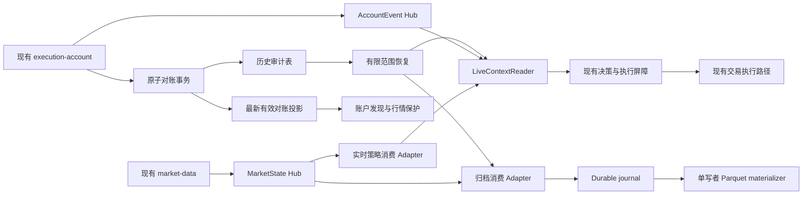
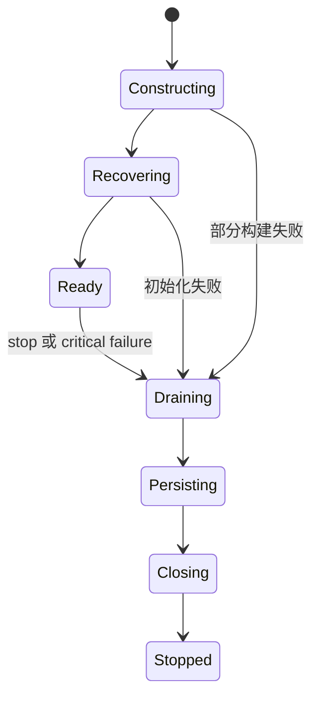

# 实盘系统架构演进实施设计

状态：**设计提案，尚未实施**。基线：`2c141687aa59322f0be68ef81d34dfa48fcffa14`，2026-09-18。

本文将下一阶段拆成可单独验证、发布和回退的工作包。事实与修复状态见[本次复核](runbooks/server-audit-verification-20260918.md)，历史背景见[9 月 11 日架构审阅](architecture-improvement-review-2026-09-11.md)。本文中的新名称、文件、表、指标和阈值均是拟议设计，除非明确标注为已有实现。

## 1. 决策与实施顺序

保留现有单机、多进程部署，围绕恢复、归档、账户当前视图和运行时生命周期形成更深的 module（模块）。每个 module 用少量 interface（接口）封装一致性、资源限制和失败处理，让调用方不再拼装这些规则。

推荐顺序：

1. **G0：补齐恢复与停机契约**，覆盖账户通道漏修、其他 Hub 同形逻辑及取消传播。
2. **A：可靠归档流水线**，将接收并持久化与 Parquet 合并解耦。
3. **B：账户最新有效对账投影**，逐步移除热路径历史扫描。
4. **C：持仓重建与运行时上下文拆分**，让业务规则独立于 SQL 和缓存。
5. **D：统一运行时资源所有权与停机协议**，收拢现有 supervisor/lifecycle，而不是再套一层转发。
6. **E：checkpoint 调度和可观测性收尾**，完成相同负载下的性能验收。

A、B 可在 G0 后分别实施；C 的纯计算提取可提前，接入新投影须等 B；D 的契约测试在 G0 开始，实际生命周期切换最后做。E 的指标定义从 G0 开始，不等到末尾才测量。

本轮不以引入 Kafka、Redis、Kubernetes、拆数据库实例或集中全部交易写权限为交付目标。若后续测量证明必须跨机隔离，再依据明确瓶颈另立决策。现有凭证角色遵循 [ADR-0001](adr/0001-live-trading-credential-boundary.md)，本设计不调整交易权限归属。

## 2. 验收目标与不变量

### 2.1 要解决的问题

| 当前维护成本 | 目标 | 可观察的验收证据 |
|---|---|---|
| 多个 Hub 复制计时和重连逻辑，修复遗漏 | 相同故障预算由同一个小 module 定义，协议恢复仍各自拥有 | 所有客户端通过同一故障场景矩阵 |
| 归档 ingest 等待 Parquet/检查点，阻塞下一批消费 | 接收端只等待有界 durable journal 接纳 | 延迟落盘不会阻塞已接纳批次的接收；队列/磁盘有硬上限 |
| 每次账户发现扫描整个历史表 | 最新有效对账查询成本随账户数增长 | 10 倍历史数据下热查询不新增历史扫描 |
| SQL、批次归属、缓存 fencing 混在同一实现 | 纯批次重建 + 明确的上下文读取契约 | 相同输入得到相同批次与决策，测试无需数据库启动 |
| 多处 stop/cancel/close，取消所有权不清楚 | 每项资源只有一个生命周期 owner | 正常停止、失败停止、初始化失败均可复现并限时完成 |
| 改配置即宣称性能改善 | 固定窗口和分阶段指标决定是否结案 | 相同数据负载前后对照，不能只看启动后 RSS |

### 2.2 演进期间必须保持

1. **交易身份**：不修改 `client_order_id`、intent、session、account、lease generation 的绑定和幂等性规则。
2. **提交屏障**：读缓存、账户投影或 Hub 的 ready 状态不替代提交前数据库 lease/halt/approval 检查；失败时保留现有拒绝提交行为。
3. **不确定订单**：超时不等于没下单；维持 `UNKNOWN_PENDING_RECONCILIATION` 及重建流程，不能自动重复提交。
4. **持仓批次语义**：遵循 `CONTEXT.md`。平仓单**提交**构成平仓边界；之前的追加开仓仍属于当前批次，之后的开仓形成新批次。不能用“平仓成交时间”替代。
5. **保护标的**：账户服务停机不等于账户无持仓。最后有效对账仍有仓的账户继续参与行情保护；包括未托管仓位、待确认订单相关标的的现有保护规则。
6. **游标**：epoch 之间的 sequence 不可比较；可恢复进度不得超前于持久化。桶时间最大值不等于区间无缺口。
7. **顺序与版本**：同 epoch 的可比较进度单调；乱序旧快照、旧回填、旧缓存不能覆盖更高版本。
8. **运行限制**：所有内存队列、磁盘 journal、恢复任务数和重试预算有上限；归档故障不能阻塞实盘行情发布。
9. **影子路径无交易副作用**：双读/双算可以并存；同账户的下单执行者不能因灰度而出现两个。
10. **可回退**：在新格式或新读路径启用前确定旧版本能否读取。不能只保留旧镜像而没有状态回退协议。

## 3. 目标结构与数据归属



投影和 journal 都是可重建的读取/恢复设施，不产生新的交易事实。交易所观测、持久化订单/成交与现有提交屏障仍保留各自权威。初期投影仅用于账户发现；不让它立即承担实时余额、交易风险或完整持仓恢复。

| 数据 | 唯一写入职责 | 读取者 | 恢复来源 |
|---|---|---|---|
| 市场消息 epoch/sequence | 现有市场 Hub | 两类消费者 | Hub 有界 replay；超窗用持久化市场状态 |
| 归档 accepted cursor | journal 单写者 | 接收器、恢复器 | journal manifest 和已校验记录 |
| 归档 materialized cursor | Parquet materializer | 清理器、观测 | 窗口提交记录 + journal |
| ready reconciliation head | 原子对账事务 | 账户发现 | 对账历史的确定性 latest-ready 查询 |
| 上下文 epoch/失效序号 | LiveContextReader | 决策 lanes | 账户/控制事件 + 数据库重新加载 |
| 订单与持仓批次 | 现有订单/成交事实，纯重建函数不写入 | entry/exit/reconcile | 现有历史和账户观测 |
| runtime task/resource 生命周期 | 每进程唯一 RuntimeSession | CLI、监控 | 重新构建资源并恢复持久化状态 |

## 4. G0：恢复契约与遗留补漏

### 4.1 提炼 FaultBudget，不统一整个 Hub 客户端

真实差异存在于市场 replay、账户 full+delta、风险控制恢复及 quote 新鲜度。共享点仅为连续故障计时、重试退避和就绪观测，协议解码与恢复决策留在各 Adapter 内。

建议小 interface：

```python
class FaultBudget:
    def mark_unavailable(self, reason: str) -> None: ...
    def mark_usable(self) -> None: ...
    def retry_decision(self) -> RetryDecision: ...
```

时钟注入在内部 seam；`RetryDecision` 只提供下一次等待、剩余预算或终止原因。预算 module 不执行网络调用、不管理 asyncio task，也不持有数据库。

契约：

- 第一次不可用时开始计时；健康运行时间永远不计入故障时长。
- 首次启动从 connecting 开始具有有限预算。
- “握手完成”不自动等于 usable。市场需要连续进度/可接受 replay；账户需要有效 full snapshot 或可证明连续的 delta；风险控制需要其已有完整状态条件。
- 网络超时、数据新鲜度超时、恢复超过预算是三个不同原因，不能都输出“Hub 不可用”。
- 连续建立 TCP/WS 但无法达到 usable，仍要在预算内失败。
- 消费者处理耗时单独记录，避免将慢 Parquet 与断网混淆。
- 空闲账户通道没有事件不一定异常；采用协议 liveness 和快照状态，而非要求固定频率出现订单事件。
- asyncio cancellation 立即向 owner 传播，不被当作网络错误重试。

实施先覆盖 `execution_account/hub.py` 的已复现漏修，再检查 quote/volume/risk-control；不以文本替换代替协议级测试。

### 4.2 G0 必须输出的结果

1. 已确认的 AccountEvent 复现变绿；MarketState 的两个新增测试保持通过。
2. 其他 Hub 同形逻辑逐项记录“已复现修复”或“不适用及理由”。
3. 将 account-3 停机 traceback 转成最小生命周期测试；区分“等待自己已取消的子任务”与“外部正在取消当前 stop”。前者应完成清理，后者不应无条件吞掉。
4. 定时 flatten 在初始化期间缺少行情时有明确 pending/retry 状态，恢复后动作有最终结果；不把错误日志静默降级当作修复。
5. 现版本 24 小时观察窗口覆盖一次宇宙池变更、归档窗口滚动及定时风控窗口；具体观察由实施阶段执行，本次没有创建自动监控任务。

退出门槛：没有未归因的实盘异常退出；已知启动/取消场景都有测试和最终状态证据。纯计算与影子读取开发不必等待 24 小时，但扩大实盘切换须满足此门槛。

## 5. A：可靠归档 module

### 5.1 当前可复用的实现

`research_collector/storage.py` 已有 `LocalBatchSpool`、原子文件写入、fsync、`ParquetWindowSink`、自然键去重和来源优先级；`service.py` 已有 PostgreSQL 回补、容量检查及恢复检查点。保留这些行为，将调用顺序和进度所有权整理清楚。

当前主要耦合是 `_consume_source_once → ingest → spool.write → sink.append → flush → checkpoint` 串行执行。增加到 128 个 batch 能吸收突发，但不能证明吞吐足够，也不提供字节级内存上限。

### 5.2 两段流水线与窄 interface

对外 module 拟为 `DurableMarketArchive`，只提供 `run()`、`stop(deadline)`、`status()`。内部 seam：

```python
class ArchiveJournal:
    async def accept(self, batch, selection) -> DurableReceipt: ...
    async def pending(self, after) -> AsyncIterator[JournalRecord]: ...
    async def commit_materialization(self, receipt) -> None: ...
```

- **Ingress 单写者**：验证 epoch/sequence → 固化 selection → 写 journal 并 fsync → 更新 accepted 进度 → 允许消费者继续取下一批。
- **Materializer 单写者**：从 journal 顺序读取 → 同窗口批量合并 → 原子替换 Parquet → fsync → 提交 materialized 进度 → 才允许回收已完全覆盖记录。
- 网络 reader 不直接调用 Parquet；materializer 不操作网络游标。没有两个 writer 同时修改同一窗口。
- 大小计数在接受/删除时增量维护，启动时校验重建；避免每个 batch 都递归扫描 pending 目录。当前 `LocalBatchSpool.pending_bytes()` 的扫描可作为校验路径保留。
- 默认仍使用本地磁盘 Adapter。真实临时目录与故障注入文件系统 Adapter 用于测试；不增加消息中间件。

### 5.3 三种进度，不能混用

| 进度 | 含义 | 能否作为重连依据 |
|---|---|---|
| received | 内存中已经收到 | 否，崩溃会丢失 |
| accepted | journal 已持久化且同 epoch 连续 | 是，但须先校验该 epoch 的 journal 完整性 |
| materialized | 对应选中状态已进入已提交 Parquet 窗口 | 是；也是 journal 回收依据 |

三者在同 epoch 内满足 `materialized ≤ accepted ≤ received`。并非所有窗口按顺序完成，所以记录每批覆盖关系，materialized 只能推进到**连续已覆盖前缀**，不能简单取最大 sequence。

无选中标的的 batch 也写轻量 durable receipt，否则恢复时无法证明中间序列是有意跳过。回补数据采用独立 `(environment, bucket_start, symbol)` 覆盖记录；不伪造 Hub sequence。

epoch 切换时保存 `RecoveryCoverage`：旧 epoch 已接受前缀、持久化回补区间与缺口、新 epoch 开始消费基线。新 epoch 的小 sequence 不覆盖旧 epoch 的大 sequence。新流切换前必须证明交接范围已覆盖，未证明的区间保持 degraded。

### 5.4 容量、背压与失败语义

- 第一版保留 128 batch 上限，同时增加 `max_queue_bytes`；候选预算 24 MiB（192 MiB collector 上限的 12.5%），必须用实际解码对象内存测量调整，不能只算 JSON 长度。
- 单条超过预算进入明确的 oversize/recovery 路径，不在内存无限等待。
- journal 默认沿用 1 GiB 上限及当前磁盘 reserve；到达上限停止接纳并公开 paused 原因，不能先确认再丢弃。
- 背压只作用于该 collector 连接；服务器 publisher 对其他实时订阅者继续独立发送。服务端 replay 淘汰后走数据库补齐。
- journal 可用时间约等于 `remaining_bytes / recent_ingress_bytes_per_second`；该时间小于预计恢复耗时就提前告警。
- Hub replay 和数据库保留范围都无法覆盖时，显式持久化缺口范围、进入 degraded；禁止以 latest bucket 假装“无缺口恢复完成”。
- 不声称 exactly-once 传输；采用至少一次接纳 + 幂等自然键物化，验收最终内容和覆盖，而非只比较行数。

### 5.5 崩溃矩阵与格式迁移

| 崩溃点 | 重启后应发生什么 |
|---|---|
| journal fsync 前 | 不承认 accepted；从旧游标重取 |
| fsync 后、accepted manifest 前 | 扫描可恢复记录、校验并推进；重取同批也不改变结果 |
| Parquet 替换前 | 保留旧窗口，从 journal 重做 |
| Parquet 替换后、materialized manifest 前 | 幂等重做，确认覆盖后再推进 |
| materialized 后、journal 删除前 | 重复记录可安全清理 |
| 单批跨多个窗口只完成一部分 | 不回收该批；记录各自然键覆盖，直到全部完成 |

第一阶段保持旧 spool 格式和旧 materialized checkpoint 可读，只新增 versioned manifest。新 accepted cursor 不写入旧 checkpoint 的 `last_sequence`，否则旧程序可能误解其持久化含义。

回退：停止 ingress → 尝试限时物化 → 保留 journal → 若旧程序不识别新记录，运行离线兼容转换并校验后才切回；转换未完成不允许删除 journal 或盲目启动旧 collector。校验工具本身不接触交易路径。

### 5.6 数据冲突与 selection

维持现有来源优先级和 Decimal/时间语义。相同自然键、相同 payload 是幂等重复；不同 payload 留来源、摘要、冲突类型与有限样本。日志按窗口聚合，指标保留完整计数。

selection 在 accept 时固化；恢复不拿“当前 Top N”重新筛选历史批次。历史无 selection 的回补需使用可追溯的历史快照；无法恢复时标注来源/选择不确定，不将回测集合悄悄改写。

验收：暂停 materializer 后接收可在配额内继续；超配额时明确 paused；在每个崩溃点重启后，结果自然键、payload、来源决策、缺口清单与无故障基线一致。

## 6. B：账户最新有效对账投影

### 6.1 先解决真实热点，再扩展范围

当前 `load_active_position_account_labels()` 的 DISTINCT ON 仍扫描历史。第一步可验证以下**候选索引形状**：

```text
(environment, account_label, observed_at DESC, reconciliation_id DESC)
INCLUDE(position_count) WHERE status = 'ready'
```

它可能减少排序/回表，但 DISTINCT ON 仍可能扫描全部有效历史索引项，不能把建索引等同于实现按账户数增长的查询。索引只在测试库验证，再通过独立迁移发布；并发建索引需由迁移流程处理事务限制、锁等待和无效索引残留。本次未执行建索引。

最终初期投影拟为 `account_reconciliation_heads`：**每个 environment/account 一条 latest-ready 摘要**。不命名为笼统的 account_current，避免被误当作实时交易余额。

| 字段 | 含义 |
|---|---|
| environment, account_label | 联合主键 |
| reconciliation_id | 摘要的来源标识，支持审计追踪 |
| observed_at | 来源有效对账时间 |
| position_count | 源记录的持仓数 |
| balance_count, open_order_count | 源摘要，按实际读取需要决定是否保留 |
| projection_schema_version | 投影语义版本 |
| projected_at | 投影写入时间，用于观测，不用于业务排序 |

### 6.2 写入原子性和单调性

`save_reconciliation_snapshot()` 中历史写入和 head 更新使用**同一个数据库事务**。只有 `status='ready'` 的完整有效对账可推进 head。独立 `save_reconciliation_run()` 的调用也要经过相同推进规则，不允许另一个入口绕过投影。

采用与现有账户发现查询相同的稳定排序 `(observed_at, reconciliation_id)`，在 upsert WHERE 中阻止旧版本覆盖。ID 的排序是同时间戳的确定性 tie-break，不声称它表示真实事件先后。

空仓是显式的有效状态：position_count=0 推进 head；不能删除 head 来表达空仓。非 ready 观测不覆盖最近 ready 摘要；最新进程健康信息走独立现有状态来源。

缺失 head 是 **unknown**，不是空仓：回退旧查询并报警。停止的账户保持 head；保留规则不能按容器存活清除其持仓保护。

### 6.3 symbol 投影分两步

第一版只替换 account label discovery，`load_active_position_symbols()` 保留原有单 SQL 的 run fence 与 position timestamp 语义。

第二版才考虑 `account_protected_symbols`，每行带 environment/account/symbol/position_side 和对应完整快照版本。新对账事务同时替换该账户全量投影，包括确认零仓后移除旧 symbol。轻量 delta 不能因未携带某 symbol 就推断其已平仓。

原因：现有 position snapshot 与 reconciliation run 没有直接逐行外键，且已有重复快照合并优化。不能简单把本轮入库 rows 当作“完整当前持仓”。必须从生产写入契约证明完整性，再实现投影；证明不充分时留在第一版。

### 6.4 历史回填与读切换

1. 增加新表和版本字段；旧读路径继续工作。
2. 发布事务内双写。所有可能写对账的程序版本纳入部署核对，旧 writer 未升级期间不启用新读路径。
3. 在一致性快照下按 account 分批回填；新旧竞争通过上述单调 upsert 解决，旧回填不能回滚 live head。
4. 校验每个环境的账户集合：新 head 覆盖全部历史 ready 账户，包括已停止账户；缺失则禁止切换。
5. ShadowReader 在**同一数据库 snapshot**下比较旧/新结果；跨事务竞态不作为假差异。记录明确的 head 版本和差异，不记录凭证。
6. 对一个只读调用方启用新路径，保留按配置回退旧查询能力；观察后扩大。
7. 至少一个完整观察周期内没有不一致，再停止常态双读；历史仍按审计需求保留。

回退只切读路径，保留新表和双写，不在事故回退时 DROP TABLE。若旧镜像不再维护投影，标记投影状态 stale；再次启用前重新补齐并比对。历史清理与 head 来源保留需有明确契约，不能级联删除当前 head。

### 6.5 验收

- 旧/新结果对停止账户、新账户、空仓、乱序写入、同时间戳不同 ID、failed→ready→failed 均一致。
- 写事务失败后历史与投影一起回滚。
- 4/100/1000 账户以及历史量扩大 10 倍的数据集；新热查询只读 head，EXPLAIN 不进入历史表。
- 同环境候选目标：本机匹配负载下新账户发现查询 P95 ≤10 ms；这是待验证门槛，不是已实现成绩。
- 一致性差异为零优先于速度收益。任何“有仓账户变为空”差异阻止切换。

## 7. C：持仓重建与上下文读取

### 7.1 先提取纯计算，避免以文件拆分代替职责拆分

`live_rollout/postgres_runtime.py` 同时包含数据库读取、缓存、交易规则、风险上下文和 `_build_position_batches()`。已有 `LiveContextProvider` 窄接口及 `LiveContextRuntime`，应深化这些 module，不再并列创建一个“新上下文管理器”。

第一步提取纯 `PositionBatchRebuilder`。位置候选 `domain/execution/position_batches.py`，由真实业务依赖决定最终目录，不以单文件行数作为验收指标。

```python
def rebuild_position_batches(
    observation: PositionObservation,
    history: PositionHistory,
) -> PositionRebuildResult: ...
```

接口输入是不可变领域值：symbol/side、Decimal 数量、订单生命周期事实、成交身份和时间、已持久化绑定。SQLAlchemy Row、session、网络 client、当前系统时间不出现在接口中。

`PositionRebuildResult` 返回批次、未归属数量、数据完整性状态及 attribution diagnostics。日志在外层按结果记录；纯函数不“顺手”写数据库、记录遥测或修复订单身份。

保留的重要事实：

- 以提交平仓单的时刻划分批次；追加开仓更新当前批次锚点。
- 部分成交、撤单后成交、重复成交必须用稳定身份处理。
- 历史截断不足以重建时，显式返回 insufficient history；不编造零持仓或丢弃未知数量。
- legacy identity / fallback attribution 先保持现有行为，诊断其触发情况；改变规则另开语义变更，不与代码搬移同时发布。
- FIFO 用于寻找安全历史窗口的实现，不应被误提升为全部策略批次归属的业务定义。

现网重复 `live_exit_batch_binding_reassigned` 日志作为对照样本，不直接当作错平仓证据。比较新旧结果中的 batch ID、数量、opened_at、exit boundary、绑定来源及 diagnostics，不能只比较总持仓。

### 7.2 上下文 seam 与 DTO 去耦

深化现有 `LiveContextProvider` 为 `LiveContextReader` 契约，候选 interface：

```python
class LiveContextReader:
    async def for_state(self, state: MarketState15s) -> ContextEnvelope: ...
    def invalidate(self, event: ContextInvalidation) -> None: ...
    def is_current(self, token: ContextToken) -> bool: ...
```

生产 Adapter 封装 PostgreSQL、账户 full/delta 快照及已有缓存；测试 Adapter 用可控制版本的内存事实。SQL 与 schema 类型集中在 persistence Adapter 内。现有 `LiveDaemonRuntimeContext` 引用的 repository DTO 逐步转为独立领域值，但保持内容和序列化兼容。

`ContextEnvelope` 包括上下文及 token。token 明确区分 account stream epoch/sequence、context invalidation generation、租约标识/代际；不能把不同来源的 version 简化为一个无法解释的数字。

接口契约：

1. 获取开始时捕获 generation，查询完成后重验；变化则在有限预算内重试或返回 unavailable，不能发布已失效组合。
2. `is_current` 只表示该 token 未被本地已知事件作废，不证明远端没有新 halt；提交前数据库屏障仍负责最终授权。
3. 缓存失效原因采用有限枚举：account_update、lease_change、control_change、rules_change、recovery。未知原因不能默认为无影响。
4. 同 token 并发读取采用已有 single-flight 能力，避免 N 个 symbol 重做相同账户查询；symbol trading rules 与账户公共状态分开缓存。
5. 部分查询失败不返回半成品；返回明确 unavailable 原因，决策层按现有安全策略处理。
6. 多个独立 SQL 事务获得的数据不能宣称同一 MVCC 快照。需要原子观察的一组事实放在同事务读取，其余通过版本/fencing 明确限制。
7. B 的 head 投影最初只用于账户发现，不直接替换上下文风险数据；接入风险路径需额外 freshness 和一致性验收。

### 7.3 渐进替换步骤

- C1：旧 provider 调用新纯重建函数；字段逐项对照，外部接口不变。
- C2：Adapter 将 ORM/repository DTO 映射成领域值；旧调用点通过单一兼容入口过渡。
- C3：把失效/currentness 从 `getattr` 隐式能力迁入显式 interface；适配器和测试桩同时更新。
- C4：让 entry/exit/reconcile 跨同一 seam 获取上下文；清理绕过该接口的重复 SQL，仅保留真正不同的一致性要求。
- C5：删除已经没有调用者的旧 facade；迁移契约测试后删除镜像实现细节的测试，不双倍维护两套内部结构断言。

退出门槛：相同冻结输入的新旧重建结果完全一致；失效竞态测试无旧 context 发布；未改变交易意图、价格/数量量化、审批或持仓批次语义。

## 8. D：资源所有权与停机协议

### 8.1 在现有 module 上收拢

现有 `LiveRuntimeSupervisor` 负责 task 监控/取消，`LiveResourceLifecycle` 负责具体资源关闭，`runtime_orchestrator.py` 负责装配。三者功能不应全部推入一个更大的类。

对 CLI 提供一个 `RuntimeSession` interface：`run()`、`request_stop(reason)`、`close(deadline)`。内部继续使用现有 supervisor/lifecycle，实现唯一 ownership registry；registry 只记录已构建成功资源的关闭函数与依赖，不暴露成可任意拼接的全局 service locator。

| 资源 | 唯一 owner | 失败如何影响 session |
|---|---|---|
| market/account/control reader task | session supervisor | 必需通道异常触发受控停止或已有有限恢复 |
| entry submit queue / coordinator | execution runtime | 停止接纳、结算 in-flight 身份后关闭 |
| checkpoint writer | checkpoint coordinator | 记录 dirty、限时最终落盘及结果 |
| DB engines / REST clients | resource lifecycle | 初始化成功即登记，逆依赖关闭 |
| 可选遥测 flush | telemetry module | 限额重试，不能无限阻止停机 |
| entry caches | 各 cache task owner，session 只发送停止请求 | 正常 stop 应处理自己拥有的已取消任务 |

每个 task 只能有一个负责 cancel/join 的 owner；上层发 stop 请求，不在多条 finally 中竞争取消同一个 task。

### 8.2 明确 session 状态



每个状态有进入原因、deadline、允许的动作。Ready 是完整恢复条件，不是 socket 已连通。启动中触发定时风控窗口时，动作挂起/重试必须可观测并有终态；不绕过风控，也不以缺少 market state 直接完成任务。

### 8.3 建议停机顺序与取消规则

1. 原子关闭新 entry 接纳，标记 draining。
2. 冻结新策略决策/输入生产；为已经 in-flight 的执行保留有界的结果处理、账户核对和租约维护。
3. 等待已开始提交的命令在 deadline 内到达明确状态；无法证明未提交时保留 unknown/reconciliation 状态，不能丢弃意图。
4. 完成需要的最终 checkpoint/恢复标记；失败写入 shutdown result，不返回假成功。
5. 停止剩余 channel/cache/heartbeat task 并 join；不晚于失去租约后继续允许提交。
6. 关闭 exchange/HTTP transport，再释放数据库资源；最后写本地 stopped marker。

上述顺序在接入时需要交易生命周期契约测试，尤其是租约持有与 drain 的相互作用；不能只调整调用次序就上线。

- 外部取消当前 session 与等待已取消子任务分开判断。
- 正常请求停止的 child `CancelledError` 是可预期结果；非预期取消仍标为 failure。
- 不使用无上限 `shield`。对必须完成的持久化步骤设置独立且共享总预算的 deadline。
- close 幂等；重复 SIGTERM、critical task 失败与部署停止并发也只执行一次状态迁移。
- 日志同时保留原始运行失败与清理失败，避免清理 traceback 覆盖首次故障。

部署目前实盘 grace 为 90 秒。候选总停机预算 60 秒，留出 30 秒进程/容器终止余量；内部步骤分配待根据实际 flush/reconcile 耗时验证，所有步骤共享总 deadline，不把多层 timeout 简单相加。

验收：在第 N 个资源创建失败、每个关键 task 异常、停机期间网络/数据库故障、外部取消与重复停止时，无遗留 task/engine、无超预算无限等待、无新 entry 穿透、未完成执行可恢复。

## 9. E：checkpoint 作为独立进度 module

已有 `LiveCheckpointCoordinator` + `CheckpointWriter` 已形成可复用 module，保持 latest-wins 合并与交易提交屏障分离。不要为统一命名重写它们。

当前 phase 依据 `bucket_end` 精确落点，而不是独立墙钟调度；数量阈值又能额外触发。后续明确定义：

- **进度时间**：最后处理的市场桶，决定 checkpoint 内容。
- **调度时间**：monotonic clock，决定多久必须尝试提交 dirty 状态。
- **phase**：用于分散正常周期工作，不是丢失特定桶后永远不写的条件。
- **最大 dirty age**：与最新一次“成功持久化”比较，不能仅以 submit/reset dirty 代替持久化成功。
- **final flush**：不等待下一 phase，返回成功/失败与最后 durable token。

候选验收：dirty 且数据库健康时最长 90 秒内持久化（现有周期 60 秒 + 30 秒容差）；停机强制 flush 使用独立 deadline。数据库故障时年龄可超阈值，但必须进入现有告警/恢复策略，不伪报已完成。

应补测试：错过 phase 桶、长时间只回填不新决策、state threshold 与 phase 同时命中、同桶多个 symbol、墙钟回拨、无新市场事件、writer 连续失败后恢复。对于 float interval、非 15 秒 phase，要么明确拒绝不支持值，要么提供不依赖整数取模的完整语义。

观测字段区分 `checkpoint_build_ms`、`enqueue_to_start_ms`、连接获取、SQL、commit、`durable_age_seconds`、coalesced/failure count。现有 `sleep(0)` 计时标成 yield latency；不要将它解释为整个系统的 event-loop 最大阻塞。

## 10. 文件与依赖改动地图

下表是实施定位，不要求现在创建所有文件。先在真实调用点验证 seam，再按职责命名，避免空壳 Protocol、泛型 EventBus 或只转发参数的 facade。

| 工作包 | 现有入口 | 拟新增/收拢的位置 | 必须移走的复杂度 |
|---|---|---|---|
| G0 | market/account/quote/risk-control Hub clients | `transport/recovery_budget.py`，名称可随现有包风格调整 | 故障预算与退避计时，协议恢复留原 Adapter |
| A | `research_collector/service.py`, `storage.py`, CLI | `research_collector/journal.py`, `materializer.py`, `recovery.py` | 接纳/物化游标、窗口单写者与恢复覆盖 |
| B | `persistence/postgres/account_repository.py`, `models.py`，Alembic migrations | 内部 head repository 或现有 repository 私有实现 | latest-ready 推进、回填、一致性验证；外部只读投影接口 |
| C | `live_rollout/postgres_runtime.py`, `context.py` | 领域批次重建 + persistence context Adapter | SQL 类型映射、纯归属规则、cache/version fencing 分离 |
| D | `runtime_orchestrator.py`, `runtime_supervisor.py`, `resource_lifecycle.py` | 现有三者内部收拢，单一 RuntimeSession 入口 | 分散的 task cancel/join、部分初始化清理 |
| E | `checkpoint_coordinator.py`, `checkpoint_writer.py` | 沿用现有位置 | 进度与调度时钟区别、持久化年龄和最终 flush |

依赖方向：CLI → runtime module → domain interfaces；persistence/network Adapter 实现这些接口；domain 不导入 CLI、ORM 或 HTTP client。测试通过同一 interface 验证行为，Adapter 级协议与真实 PostgreSQL 语义仍保留专门测试。

## 11. 分 PR 实施清单

每项应独立可回退，范围不跨越“结构迁移”和“业务规则变化”。以下工作量为单人集中开发的粗估，不是交付承诺，数据恢复和观察时间另计。

| PR | 工作内容 | 依赖 | 主要交付物 / 验收 | 粗估 |
|---|---|---|---|---|
| 01 | 补齐 AccountEvent 健康后短断线回归；检查其他 Hub | 无 | 所有客户端故障矩阵；已复现缺陷修复；协议 ready 条件逐项说明 | 1–2 天 |
| 02 | 提炼 FaultBudget，迁移已验证客户端 | 01 | 两个以上真实 Adapter 使用；删除重复计时；既有恢复测试通过 | 1–2 天 |
| 03 | 取消所有权与启动期定时动作契约 | 无，可先测试 | account-3 对应场景可复现，原始失败与清理失败均保留 | 1–2 天 |
| 04 | journal 双进度 manifest 与崩溃恢复 | 01/02 | accepted/materialized、空 selection receipt、兼容读取与故障矩阵 | 2–3 天 |
| 05 | ingress/materializer 解耦、字节配额和背压 | 04 | 10 倍回放突发、慢物化、满磁盘，不破坏最终内容 | 2–3 天 |
| 06 | 对账查询基线、索引实验和 head schema | 无 | EXPLAIN 对照、迁移锁预算、旧读不变 | 1–2 天 |
| 07 | 原子双写、历史回填、同 snapshot shadow reader | 06 | 零结果差异；乱序/零仓/停机账户测试；回填可重入 | 2–3 天 |
| 08 | 账户发现只读切换与历史热扫描移除 | 07 | 投影覆盖率、查询 P95、回退开关验证 | 1 天 + 观察 |
| 09 | 纯 PositionBatchRebuilder 提取 | 无，先冻结样本 | 新旧 batch/绑定/数量/时间完全相等，交易规则未变 | 2–3 天 |
| 10 | 显式 ContextReader/currentness，移除重复能力探测 | 09；用投影时依赖 08 | generation 竞态、失效传播、单飞读取与屏障测试 | 2–3 天 |
| 11 | RuntimeSession 所有权与停机收拢 | 03、10 | 初始化失败/critical failure/SIGTERM/重复 close 全矩阵 | 2–3 天 |
| 12 | checkpoint 最大 dirty age、观测口径、清理兼容层 | 02、11 | phase 缺失仍有期限，最终 flush 保证；相同负载性能验收 | 1–2 天 |

每个 PR 描述记录：基线 commit、改变的 interface/invariant、验证命令、迁移及回退方式、仍未覆盖的情形。没有测试证据的 PR 不以“重构无逻辑变化”替代说明。

## 12. 测试与验证矩阵

| 层级 | 场景 | 通过标准 |
|---|---|---|
| 故障预算契约 | 健康 5 分钟后一次短断线；持续拒绝连接；握手成功但始终不可用 | 前者重试并恢复；后两者预算耗尽且原因正确 |
| 协议集成 | epoch 变化、duplicate、sequence gap、full/delta 顺序 | 不跳过缺口，不用 delta 替代缺失 full，不错误清空持仓 |
| 文件恢复 | fsync/replace/manifest/delete 每个间隙崩溃 | journal 和窗口幂等恢复，accepted 不超前于可恢复记录 |
| 回放压力 | 当前 128 batch 队列基线、10 倍突发、materializer 停顿 | 内存和 journal 受限，内容完整或显式缺口，无静默丢弃 |
| 真实 PostgreSQL | 乱序事务、空仓、同时间戳、回填与 live writer 并发、事务回滚 | head 与 latest-ready 一致；索引/锁行为真实可测 |
| ContextReader | 读取中 account/lease/halt 变化、并发 symbol、交易规则失败 | 失效 context 不发布；有限重试；最终提交屏障仍有效 |
| 批次领域 | 追加开仓、提交后再开、部分平仓、重复 fill、legacy binding、历史缺失 | 与既有已确认语义一致，未知状态显式表达 |
| 生命周期 | 任意构建步骤失败、SIGTERM、child cancellation、外部 cancellation、DB down | 有界完成、owner 唯一、无假成功、无重复下单 |
| checkpoint | phase 缺桶、无消息、墙钟跳变、writer 故障与恢复 | 最大 dirty age 可解释，成功 durable 进度不倒退 |
| 只读影子 | 相同 snapshot 下旧/新账户发现、相同输入下旧/新重建 | 无语义差异；资源开销受限；不调用交易接口 |

SQL 的 DISTINCT ON、advisory lock、MVCC 和 upsert fencing 使用 PostgreSQL 集成测试，不用 SQLite 模拟其语义。真实交易所只通过现有可控环境/Adapter 契约验证，不在生产主动注入断网、杀进程或制造订单来完成测试。

现有 90 项定向测试通过仅作为基线，不替代这些新增场景。对外 interface 的行为测试稳定后，删除只反映被移除内部结构的测试；保留不可替代的数据库、协议、量化及交易屏障测试。

## 13. 性能、健康和观测验收

所有数字是**候选验收门槛**，实施时先冻结负载与采样方法，确需调整就记录理由，而不是事后按结果移动标准。

| 维度 | 指标 / 方法 | 候选门槛 |
|---|---|---|
| 账户发现 | 相同数据库规模及负载，热查询 EXPLAIN + 多次耗时 | P95 ≤10 ms，执行计划不扫描历史表 |
| 归档 | journal accept、物化耗时、队列字节、oldest pending age、缺口覆盖 | 正常负载 journal accept P95 <1 s；无未解释缺口；资源不越配额 |
| 窗口落盘 | window end → materialized；排除尚未到封窗时间 | 900 s 窗口 + 30 s 容忍语义下，正常封窗后额外延迟 ≤60 s |
| checkpoint | 成功事务 total、durable age，至少同负载 30 分钟 | 稳态 P95 ≤250 ms 为初始目标；dirty 持久化年龄 ≤90 s |
| 实盘时效 | 行情接收→决策分位数，entry/exit failure、unknown pending 年龄 | 与匹配基线相比无 >10% 的持续退化；不增加未恢复失败 |
| 内存 | 每容器 anon/working set、swap、queue bytes，覆盖至少 24 h | 稳态无持续增长；常态工作集候选 ≤限制的 75%，峰值受控 |
| 生命周期 | shutdown duration、resource/task 未关闭数量、原始错误 | 60 s 总预算内结束，未关闭项为 0 或明确可恢复失败记录 |

30 分钟计时样本不能替代 24 小时稳定性观察；若样本数不足，报告样本数与范围，不输出看似精确的 P99。

健康状态至少区分：process alive、transport usable、recovery complete、archive durable/current、trading permitted。保留本地探针成本优势，增加业务状态观测；不能以“容器 healthy”隐藏归档落后，也不能把归档暂停直接变成实盘下单授权。

指标标签限制为 service/account/reason/source 等有限集合。symbol、client_order_id、event_id 放有限日志样本，不作为常态高基数指标标签。日志中不输出账户凭证。

## 14. 发布、回退与部署一致性

### 14.1 发布前

- 固定 commit 和迁移版本；核对源码、镜像与运行参数三者一致。
- 把上述契约测试及相关现有测试跑在变更后的代码上；数据库变更先在隔离库恢复副本验证。
- 保存可读取的现有 checkpoint/journal 格式清单、迁移覆盖状态、回退镜像与对应读路径配置。
- 明确哪些开关只是读取选择、哪些改变文件格式；所有拟议开关实施时再确定名字并纳入配置校验。

### 14.2 切换顺序

1. G0 的兼容修复先上线，确认账户/行情恢复没有新增问题。
2. collector 从独立影子输出目录做内容对照；两个实例不能共同写生产 Parquet 根目录。通过后单独切换 collector。
3. head 表先 schema，再双写，再回填，再同 snapshot 对照，最后切只读账户发现。
4. 纯持仓重建先离线 frozen replay，再只计算的 shadow 对照；shadow 执行器不持有下单能力。
5. RuntimeSession/ContextReader 涉及实盘时，沿用已有受控部署、账户租约和代际 fencing，一次切一个账户；旧执行者退出后新执行者才接管。
6. 稳定后再扩大其余账户，最后删除兼容路径；保留足够回退观察期。

只读比较路径会增加 SQL/CPU，必须限频并能独立关闭。重构版本间不得隐式更换策略配置 hash、订单身份算法或批次规则；如确需变化另立语义迁移。

### 14.3 回退条件与动作

| 触发条件 | 动作 |
|---|---|
| 新旧 head 结果不同，尤其漏保护标的 | 立即回退旧读路径，继续保留证据和双写；禁止扩大 |
| journal 缺失/格式不可读/游标不一致 | 暂停该 collector 接纳，保留原文件；使用已验证恢复流程，不能删除后重跑 |
| 新旧批次 ID、数量或边界不同 | 禁止切换执行路径，定位语义差异；影子输出不写交易事实 |
| 实盘 critical task 新异常、unknown 状态增加 | 按现有运行手册处理并停止扩大，保持 lease/订单核对，不盲目启动第二执行者 |
| 停机超时或外部取消导致资源遗留 | 保留退出记录，按有界回退流程处理；不得把“容器被强杀”当作停机成功 |
| 指标持续超门槛但语义正确 | 关闭影子负载、回退相应读/写调度变更，保留诊断 |

## 15. 本轮的完成定义

本轮完成需同时满足：

1. V1 原缺陷保持修复；AccountEvent 漏修和其余 Hub 候选点有逐项结论。
2. 归档 journal/物化进度、崩溃恢复、容量与覆盖契约全部通过，正常突发不再依靠无限增大队列。
3. 账户发现热路径不扫描历史；停止账户/零仓/乱序等一致性场景通过。
4. 持仓重建纯化且结果无变化；上下文 currentness 与提交屏障职责明确。
5. 每个 task/resource owner 唯一，正常停机和初始化失败可在预算内完成并留下准确结果。
6. checkpoint 错峰与性能用匹配负载验证；最大 dirty age 和最终 flush 有明确保证。
7. 完成生产观察、回退演练、旧入口清理；文档记录最终 commit、迁移版本、测试证据和残余风险。

在此之前使用“已部署”“已缓解”“已验证”“未闭环”分别表达状态，不把一项测试通过或一个版本发布等同于整轮架构完成。

## 16. 文档维护与首批执行建议

本设计的五项架构决策——消费策略分离、latest-ready 投影、纯持仓重建、单一生命周期 owner、进度/调度时钟分离——当前均为 Proposed。对应工作包实施前，将最终选择及排除方案形成单独 ADR；不预占现有迁移编号或声称已经 Accepted。

**首批建议执行 PR 01、03、06、09 的测试/只读验证部分**：它们分别确认恢复缺陷、停机问题、数据库收益和持仓语义，无需先改变交易执行结构。随后推进 PR 02/04/07；避免同时重写归档、账户投影和实盘生命周期，使问题能够定位到单个变化。

本文件尚未加入 Git 索引，原因是现有 `.gitignore` 忽略 `/docs/` 下新文件。后续提交时显式纳入本文件及复核报告即可；本次未调整忽略规则、未暂存用户正在进行的代码改动。
