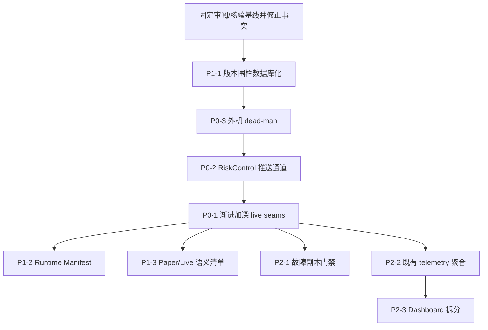

# 架构改进审阅

- 审阅日期：2026-09-11
- 代码基线：`10e2048`（`fix: close race condition review gaps`）
- 本次核验基线：当前 `HEAD` 为 `bd273016`（`10e2048` 之后的 `fix: preserve account hub bootstrap on overflow`）；因此下文区分“审阅基线”和“核验基线”，不把后续修复倒灌到原审阅结论中。
- 审阅范围：系统设计与架构演进，不重复逐条竞态缺陷
- 对照前置：
  - [ARCHITECTURE_REVIEW_ASSESSMENT.md](./ARCHITECTURE_REVIEW_ASSESSMENT.md)（2026-09-04）
  - [REFACTOR_PLAN.md](./REFACTOR_PLAN.md)（2026-09-04 Draft）
  - [race-condition-review-2026-09-11.md](./race-condition-review-2026-09-11.md)
  - [docs/superpowers/specs/2026-06-14-project-architecture-design.md](./superpowers/specs/2026-06-14-project-architecture-design.md)
  - [docs/runbooks/market-state-hub.md](./runbooks/market-state-hub.md)
  - [docs/runbooks/operational-alert-monitor.md](./runbooks/operational-alert-monitor.md)
- 适用范围：单机、单交易所、多账户小资金实盘；15 秒时钟；不追求亚秒竞速

---

## 1. 总体判断

在「单账户 / 多账户小资金、单机、Binance USD-M、15s 动量策略」这一定位下，系统**已经具备相当完整的核心安全骨架**；但以下几项仍需按实际代码边界理解：

| 能力 | 现状 |
|---|---|
| 凭证边界 | 角色分离已部署：execution-account 使用 read key，live-strategy 使用 trade key；execution-account 独占私有写路径尚未落地 |
| 交易租约 | 单主 lease + owner/account/strategy 绑定 |
| 订单状态机 | 细粒度 `ExchangeOrderState`，含 `UNKNOWN_PENDING_RECONCILIATION` |
| 执行仲裁 | Coordinator 按 key 串行 + 优先级；prepare/execute 同操作 |
| 数据新鲜度 | Hub gap/recovery、lease、readiness、entry-cache 等保护会 fail-closed；live 并非统一启用 market/account/EMA age TTL |
| 热路径 | Market/Account Hub 移除了正常行情/账户增量的数据库传输；PostgreSQL 仍承担控制面、执行上下文和 durable authority，不只是 recovery adapter |
| 确定性 | 策略 core 共享；config hash / code commit 纳入 preflight |

竞态审查（2026-09-11）表明：3 月 P1 与本轮 #1–#7 的**代码保护已基本落地**。当前阶段的主要矛盾不再是「缺某一条 if」，而是：

1. **演进成本**：`live_rollout` 决策巨石继续膨胀，每修一个并发洞都在加厚同一个类；
2. **控制面延迟**：drain / disable-entry 的传播仍主要依赖 PostgreSQL context refresh；RiskHalt 则已有提交前数据库 fencing，二者不能混为一谈；
3. **单机死盲区**：监控与被监控同命运；
4. **发布正确性仍需演练**：混跑窗口的 generation 围栏已落到数据库不变量，但迁移、旧 worker 退出和重启恢复仍需发布演练验证。

因此本审阅**不建议**再堆风控规则或引入重量级中间件，而建议把资源投向**结构拆分、控制面通道、外部 dead-man 与发布围栏**。

---

## 2. 当前架构速写

```text
Binance market WS
        |
        v
   market-data ── normalize ──> MarketStateHub ──> live-strategy (per account)
        |                                              |
        +──> PostgreSQL (durable)                      +──> RiskGateway
                                                       +──> OrderCoordinator ──> Binance trade REST
Binance account WS                                     |
        |                                              v
 execution-account ──> AccountEventHub ──> live exit/reconcile lane
        |
        +──> PostgreSQL snapshots / orders / fills

operator CLI ──(durable command / transition)──> PostgreSQL ──(context refresh / pre-submit fence)──> live-strategy
operator dashboard ──(read-only)──> PostgreSQL
ops-monitor ──(read / alert; optional external webhook)──> host / PostgreSQL
```

正常行情与账户增量不经过 PostgreSQL transport；但 live 决策仍会从 PostgreSQL 加载 lease、halt、approval、风险配置、未完成订单和持久化上下文，且提交前屏障仍写入 PostgreSQL。因此更准确的说法是：Hub 承担实时增量传输，PostgreSQL 仍是控制面与执行屏障的一部分。`disable-new-entries` / draining 主要依赖 context refresh；RiskHalt 在提交前已有直接数据库检查。

### 关键模块体量（架构压力指标）

| 模块 | 约行数 | 备注 |
|---|---:|---|
| `apps/live_rollout/main.py` | 5381 | CLI + preflight + 装配 + 部分编排 |
| `live_rollout/daemon.py` | 1149 | market loop / lease 与 lane 生命周期编排 |
| `live_rollout/context.py` | 95 | runtime context、entry filter context 与窄的异步 `LiveContextProvider` 契约 |
| `live_rollout/context_prefetch.py` | 139 | 保持 market state 顺序的 context 预取、generation 校验数据与任务清理 |
| `live_rollout/checkpoint_coordinator.py` | 154 | processed progress、周期 checkpoint 与退出前 final flush |
| `live_rollout/runtime_cache.py` | 152 | managed/order/pending symbol 保护与 strategy/telemetry 冷缓存淘汰 |
| `live_rollout/market_admission.py` | 113 | context generation 复核、context reload、gate evaluation 与 admission telemetry |
| `live_rollout/entry_control.py` | 170 | prerequisite/risk/scheduled/pending-position entry gate 的 fail-closed 组合 |
| `live_rollout/pending_entries.py` | 114 | pending entry reservation、durable sync 与 terminal event release |
| `live_rollout/runtime_manifest.py` | 347 | desired runtime manifest 的环境展开、schema 校验、strategy inputs 与 account lookup |
| `live_rollout/entry_lane.py` | 842 | entry filter、policy、signal recording 与 candidate admission |
| `live_rollout/exit_lane.py` | 354 | 四路 exit lane 的队列、最新值合并、worker lifecycle 与 outcome 聚合 |
| `live_rollout/exit_processor.py` | 958 | 四类 exit 触发、共享 decision lock、recovery backoff 与 request fallback |
| `live_rollout/scheduled_controller.py` | 743 | 定时风控窗口、入场封锁、撤单、平仓与交易所持仓核验 |
| `live_rollout/submission.py` | 537 | entry/exit 共用的提交前校验、durable prepare、coordinator 调用与提交后 bookkeeping |
| `operator_dashboard/queries.py` | 3431 | 查询域未拆分 |
| `execution_account/hub.py` | 1882 | 已含序列/epoch/快照恢复 |
| `market_data/hub.py` | 1164 | 同上 |

体量本身不是缺陷；**单一类同时拥有过多生命周期与并发车道**才是演进风险。

---

## 3. 已成熟、不应推倒的部分

以下设计与 2026-06 架构文档、9 月评估结论一致，**禁止**在后续重构中为“整洁”而破坏：

1. **下单前持久化屏障**（REFACTOR_PLAN §2.2）：`risk approved → durable intent + SUBMITTING → REST` 不得异步化。
2. **Binance 为交易状态权威、PostgreSQL 为控制面与 durable authority**：Hub 不是第二真相源。
3. **单主租约 + Fail-Closed**：lease / hub gap / stale / unresolved order 阻断新敞口。
4. **Hub 语义**（序列、epoch、有界重放、缺口 fail-closed）重于传输介质；不得用“换成 Redis Pub/Sub”替换语义。
5. **策略 core 共享、Paper/Live 执行环境分离**：共享 `EntryEligibilityPolicy` 类纯函数，而不是共享整条 daemon。
6. **单机排除 Kafka / K8s / 微服务**：在当前负载与资金规模下仍然正确。

---

## 4. 改进建议（按优先级）

### P0-1 拆分 `live_rollout` 决策巨石

**问题**

竞态修复（退出共享决策锁、durable episode reservation、exposure claim、context currentness 复检）全部收敛在 `LiveStrategyDaemon` 内。结果：

- 入场、报价退出、K 线退出、grace、recovery 与 checkpoint 的编排状态仍集中在 daemon；lease 和持久化 writer 已有独立模块，但生命周期耦合仍由 daemon 连接；
- 新车道（若未来需要）只能继续往 daemon 加方法；
- 部分交错测试仍需构造整个 daemon，车道契约还不够窄。

但这里不能把“存在大类”误写成“所有职责都没有 seam”：当前已经有 `EntryExecutionLane`、`ExitExecutionLane`、`exits.py`、`lease.py`、`checkpoint_writer.py`、`postgres_runtime.py` 等内部模块。下一步的目标应是**加深已有 seam、收窄接口并转移所有权**，而不是按文件名机械搬代码或新增一层薄包装。

**建议目标结构**

```text
apps/live_rollout/main.py
  └── parse / assemble / lifecycle only

live_rollout/
  ├── session.py          # 逐步承接生命周期；当前实现尚不是完整 orchestrator
  ├── context.py          # ContextProvider: epoch, cache invalidation, currentness
  ├── context_prefetch.py # 有序 context 预取与 generation 失效处理
  ├── market_loop.py      # 有序状态消费、gap/reconcile 与 lane dispatch
  ├── checkpoint_coordinator.py # market progress 与 checkpoint 生命周期
  ├── runtime_cache.py    # managed symbol 保护与冷缓存维护
  ├── market_admission.py # context reload、gate admission 与 telemetry
  ├── entry_control.py    # entry gate 组合与 coordinator 重开围栏
  ├── exit_control.py     # reduce-only exit enable/disable 控制闸门
  ├── pending_entries.py  # pending entry reservation 与 durable sync
  ├── entry_lane.py       # 入场决策与 claim
  ├── exit_lane.py        # quote + candle + grace 的队列与最新值合并
  ├── exit_processor.py   # exit decision、recovery 与 request fallback
  ├── exit_event_coordinator.py # account/quote/candle/grace context 与路由
  ├── scheduled_controller.py # 定时风控窗口与平仓核验状态机
  ├── submission.py       # entry/exit 共用的提交安全流水线
  ├── lease.py            # 已有，保持
  ├── checkpoint_writer.py
  └── daemon.py           # 仅编排 lanes，不再持有业务细节
```

**约束**

- 退出四通道**继续共用**同一 decision lock / episode claim（竞态 #4 的修复语义不得回退）。
- Coordinator 仍只串行「交易所 I/O」，不替代决策层去重。
- 每个 lane 暴露窄接口（输入 context + 事件，输出 intents / outcomes），便于 Fake 注入。

**本次调整状态（2026-09-11）**

- 已将四路 exit lane 的队列、最新值合并、worker lifecycle 和 outcome 聚合转移到
  `live_rollout/exit_lane.py`；daemon 负责组装该 lane 与管理其生命周期。
- 已将 exit processor 的四类触发、共享 per-symbol decision lock、unknown-order
  recovery backoff、cancel/fallback request 处理转移到 `live_rollout/exit_processor.py`；
  scheduled flatten 与普通 exit 现在共用同一处理器锁，daemon 只负责加载 context、
  注入依赖和管理 lane 生命周期。
- 已将 `LiveDaemonRuntimeContext` 与 `LiveContextProvider` 契约移到
  `live_rollout/context.py`；PostgreSQL provider 仍可保留额外的 cache invalidation
  与 currentness 能力，但不再成为 daemon 的具体类型依赖。
- 已将 context generation、provider currentness 检查、cache invalidation 和
  managed-position/order symbol 发布收拢到 `live_rollout/context.py` 的
  `LiveContextRuntime`；prefetch、admission、submission、exit 与 scheduled controller
  只接收其窄方法回调，daemon 不再持有 context epoch 或发布实现。
- 已将 entry-side 的 symbol/EMA filter 刷新、policy compare/enforce、signal recording
  和 candidate admission 转移到 `live_rollout/entry_lane.py`；daemon 仍保留 market
  loop 生命周期、共享 context invalidation，以及注入给 lane 的提交回调。
- 已将 entry/exit 共用的 candidate submission pipeline 转移到
  `live_rollout/submission.py`：提交前 currentness/risk/limit 检查、量化、lease
  与 code-generation/session fencing 参数、durable `prepare_submission`、
  coordinator 的 prepare/execute 顺序，以及 pending-entry/lifecycle bookkeeping
  由该模块统一持有；daemon 只注入上下文与状态回调。
- 已将 `session.py` 对执行层的依赖收窄为单方法 `LivePlanExecutor`；session
  现在只负责 preflight/shadow-preflight、gate 状态转移和调用已批准 plan，
  coordinator 作为 composition root 注入的 adapter。
- 已将定时风控窗口的状态机转移到 `live_rollout/scheduled_controller.py`；该模块
  独立持有入场封锁、开仓挂单撤销、reduce-only flatten、重试和交易所持仓核验，
  scheduled flatten 仍通过共享的 `LiveExitProcessor`，daemon 只保留状态观察、
  任务启动和兼容性调用适配。
- 已将有序 context 预取与未完成任务清理转移到
  `live_rollout/context_prefetch.py`；market loop 仍严格按状态顺序执行，
  但下一状态的 context I/O 可与当前决策重叠，generation 变化时由 daemon 重新加载。
- 已将 market loop 的 processed-symbol 进度、周期性 compact checkpoint 和退出前
  final flush 转移到 `live_rollout/checkpoint_coordinator.py`；它复用现有
  `CheckpointWriter` 的异步持久化与重试，不改变 durable checkpoint 的写入顺序。
- 已将 strategy/telemetry 冷缓存的保护集合、维护间隔、淘汰调用和低基数日志转移到
  `live_rollout/runtime_cache.py`；daemon 只在 context 发布后更新 managed symbols，
  在 market loop 中触发维护，不再持有缓存淘汰实现。
- 已将单个 market state 的 context generation 复核、失效 context reload、pending
  order 同步、managed-position 发布、gate evaluation 和 admission telemetry 转移到
  `live_rollout/market_admission.py`；策略连续性处理和实际 lane 执行仍由 daemon 编排。
- 已将 prerequisite、risk-control、scheduled window 和 pending-position 的 entry gate
  组合转移到 `live_rollout/entry_control.py`；coordinator 的 block/unblock 由该模块
  统一执行，重开失败时保持 fail-closed，daemon 只保留兼容性委托方法。
- `LiveEntryControlGate` 进一步接管 exit failure、entry-cache warming，以及 lease、
  draining、market 和 account 外部前置条件的优先级；`main.py` 不再持有这些 entry
  gate 的字典/布尔状态。
- 已将 pending entry 的本地 reservation、terminal order event release、durable
  unresolved-order sync 和 exposure reservation 转移到 `live_rollout/pending_entries.py`；
  submission、scheduled controller 和 runtime cache 通过窄 adapter 使用它，daemon
  不再持有 pending-entry 字典或其同步细节。
- 已将有序 market-state loop、gap reset、reconcile retry、admission/lane dispatch
  转移到 `live_rollout/market_loop.py`；daemon 只保留生命周期启动/停止、exit/account
  事件入口和 composition wiring，旧的 `_is_transient_live_gate` helper 仅保留兼容导出。
- 已将 checkpoint、exit lane、scheduled risk-window task 的启动/停止及 lane outcome
  合并转移到 `live_rollout/daemon_lifecycle.py`；`LiveStrategyDaemon.run()` 现在只是
  对外兼容入口，`daemon.py` 不再持有这些生命周期状态。
- 已将 account、quote、closed-candle、grace 四类退出事件的 context 准备、pending
  entry 同步、managed-position 发布和 lane/processor 路由转移到
  `live_rollout/exit_event_coordinator.py`；daemon 仅保留兼容性的事件入口与组合 wiring，
  四路仍共用原有 `LiveExitProcessor` decision lock 与 episode claim。
- 已将 operator-controlled `exit_enabled` 状态转移到
  `live_rollout/exit_control.py` 的 `LiveExitControlGate`；daemon 仍保留原公开属性和
  setter，但退出处理器、market loop 与 event coordinator 直接读取同一控制闸门。
- 已为 `LiveExitEventCoordinator` 增加独立契约测试，覆盖 account lane、quote symbol
  mismatch、closed-candle synthetic state 和 grace-timeout 路由；这些入口不再只能
  通过完整 daemon fixture 间接验证。
- 已将四路事件通道共享的 per-symbol 最新 market state/quote cache 转移到
  `live_rollout/market_cache.py`；account、quote、candle、grace channel 和 lease
  recovery 通过同一窄 cache 接口读写，`main.py` 不再定义缓存实现。
- 已将 market state、quote、account event 和 risk-control Hub 的重连/退避策略统一
  到 `live_rollout/stream_recovery.py`；应用层只保留各 channel 的业务处理，不再复制
  四份 transport retry loop。
- 已将 RiskControlHub 的连接状态、durable state reload、fail-closed entry gate、
  one-shot action dispatch、reconcile task 和 telemetry 转移到
  `live_rollout/risk_control.py` 的 `LiveRiskControlRuntime`；`main.py` 只负责创建
  source、注入 callback 和收尾任务，PostgreSQL 仍是控制面权威。
- 已将账户快照恢复、租约心跳降级/恢复、市场 Hub 可用性、双 context provider
  发布和租约自动恢复转移到 `live_rollout/control_plane.py` 的
  `LiveControlPlaneRuntime`；`main.py` 只负责组装数据库恢复策略、heartbeat、
  gap 通知和 entry gate 回调，控制面状态不再由 composition root 的嵌套闭包持有。
- 已将本地 health marker 的周期 heartbeat、关键 task 停止时的 degraded 状态和
  marker 写入异常隔离到 `live_rollout/health_monitor.py` 的 `LiveHealthMonitor`；
  live 装配层只提供 task 状态谓词并管理 task 生命周期。
- 这是 P0-1 的渐进切片，属于转移实现所有权而非增加转发壳；`session.py` 当前仍是
  手工 one-shot session，不应把本次改动写成整个 P0-1 已完成。

**验收**

- `daemon.py` 目标是显著降低跨职责耦合；行数只能作为诊断信号，不设脱离接口质量的硬门槛。每个 lane 应能通过窄接口独立单测；
- 既有 `tests/unit/live_rollout/*` 与 e2e 全绿；
- 新增「卡在 prepare 与 execute 之间」「双通道同仓位」类测试改为针对 `ExitLane` / Coordinator 契约。

**非目标**：拆成多个操作系统进程；Paper/Live 合并 daemon。

---

### P0-2 风险控制推送通道（Risk Control Event Stream）

**问题**

`market-state-hub.md` 已将「typed risk-event stream」列为 next optional seam。当前：

- operator `disable_new_entries` / halt 写入 PostgreSQL；
- drain / disable-entry 主要在下一次 context refresh 时被 live 观察到；
- `RiskHalt` 已在 `prepare_submission` 的提交前数据库 fencing 中直接检查，因此“刚 POST 完立刻 halt”的安全性和传播延迟是两个不同问题；
- 多账户一致性仍依赖各账户的状态传播与确认。

**建议**

复用 AccountEventHub 模式，新增轻量 `RiskControlHub`（可嵌在 execution-account 或独立极小进程）：

| 事件 | 语义 |
|---|---|
| `halt` | 阻断新敞口，允许 reduce-only |
| `drain` | 进入 draining |
| `disable_entry` | 仅禁开仓 |
| `cancel_all_open_entries` | 撤销未成交开仓挂单 |
| `request_flatten` | 请求归零（仍走既有 flatten 编排） |

**不变量**

- PostgreSQL 中的 halt / strategy_live_state **仍是权威与审计**；
- Hub 事件是加速通道：收到即生效，DB 随后确认；
- 事件丢失或序列空洞 → Fail-Closed 回退到现有轮询 + 数据库读，**不得**放宽。

事件还需要明确 account/global scope、command id、sequence/epoch、授权来源、重复投递和撤销语义；`request_flatten` 与 `cancel_all_open_entries` 不能被设计成绕过现有 durable intent、Coordinator 或 reconcile 流程的旁路。

**验收**

- 从 operator 写入到 live worker 观察到 halt 的 p99 延迟 << 一个 15s bucket；
- 断开 control hub 时行为与今天一致（仍安全）。

**本次调整状态（2026-09-11）**

- 已在 `execution-account` 内落地 `RiskControlHub`，默认监听 `8769`；事件带有 typed action、`command_id`、account/strategy/session scope、`sequence` 和 `stream_epoch`；
- `disable-new-entries` 现在先提交 PostgreSQL `DRAINING` transition，再尝试发布通知；发布失败仍保留数据库回退；
- live worker 收到 `drain` / `halt` / `disable_entries` 即关闭本地 entry gate，并在重连、序列空洞、队列溢出或状态重载失败时保持 fail-closed；恢复 entry 前重新读取 PostgreSQL；
- `prepare_submission` 额外检查 live session 的最新 durable state，仍不允许控制推送绕过 intent、Coordinator、reconcile 或既有 RiskHalt fence；
- 新增 `cancel-all-open-entries` 和 `request-flatten` CLI：先写入已有 `live_rollback_commands`，再发布 typed event；worker 以 account/strategy/session scope 原子 claim，重复投递不会重复执行，授权短语不匹配或 command 不存在时不触碰交易所；
- `cancel_all_open_entries` 复用 scheduled controller 的 entry-order cancellation seam（Coordinator/state machine + exchange orphan scan）；`request_flatten` 复用同一 controller 的 market reduce-only request 和 `LiveExitProcessor`，因此不绕过 durable intent、Coordinator 或 reconcile。动作失败保持 entry gate 关闭，成功后仍由 durable state reload 决定 gate 是否恢复；

---

### P0-3 外机 Dead-Man / 第二观察者

**问题**

`operational-alert-monitor.md` 明确：监控跑在交易主机上，整机断电/断网无人通知。

**建议（最小实现）**

1. 本机 ops-monitor 周期性 POST **经过认证的健康心跳**到**外机** checker（checkpoint 新鲜度、lease、容器状态、DB 可达）；
2. 外机 N 分钟无心跳或心跳字段不健康 → Server酱 / 其他 webhook 告警；
3. 心跳不得携带交易 API key；可使用专用 heartbeat token、签名或 mTLS。外机只读告警，不写交易系统。

这是成本最低的「成熟度」跃迁：单机死盲区从已知缺陷变为已缓解风险。

**当前实施状态（核验 HEAD）**

现有 `cml_ops_monitor` 已增加可选的 HTTPS 外部 heartbeat sender：使用
专用 Bearer token、低敏感度状态 payload 和超时保护；token 不进入 JSON 或
日志。外部 checker、告警阈值和部署地址仍需由运维环境提供，未把任何交易
写权限交给 checker。

**非目标**：完整 Prometheus + 远程 metrics 集群。

---

### P1-1 发布版本围栏数据库化

**问题**

竞态审查指出剩余风险集中在**混跑窗口**：旧 worker 可能绕过新 claim 继续 POST。目前依赖 runbook（先迁移、确认旧 worker 失去 lease）；当前 lease/提交事务还没有 `code_generation` / `image_commit` writer fence。

**建议**

1. active lease 记录 `code_generation` / `image_commit`（preflight 已有 commit 校验，需落到 lease 行）；
2. `prepare_submission` 事务仅接受与当前 active lease generation 一致的 writer；
3. 旧进程即使仍在运行，DB 层拒绝新 POST。

把「发布纪律」变成「数据库不变量」。滚动发布三项运行验收（先迁移、旧 worker 失去下单资格、SIGTERM/撤单/flatten 演练）仍保留，但正确性不再单靠人。

**当前实施状态（核验 HEAD）**

已落地 `20260911_0035`：`trading_leases.code_generation` 为必填字段，迁移
时将旧 active lease 置为 expired；live gate、主循环、手工 `submit-plan` 和
`prepare_submission` 均校验当前 worker generation。旧 worker 无法重新获取
缺少 generation 的 lease，也无法通过提交前 fencing。

---

### P1-2 运行时拓扑 Manifest

**问题**

多账户扩展（`multi-live-accounts.md` + `compose.live.accounts.yaml` + 大量 `CML_LIVE_*`）使「系统当前应当是什么样」分散在 YAML 与环境变量中，漏配风险随账户数上升。现有 runbook 已有 per-account hash、approval、preflight 和 readiness 检查；manifest 的价值是把这些约束收敛成单一声明源，而不是从零建立发布校验。

**建议**

引入单一 **desired-runtime manifest**（建议 YAML，纳入版本库）：

```yaml
accounts:
  - label: account-2
    strategy: orderflow_impulse
    profile_ref: profiles/orderflow_b2_long.yaml
    image_commit: ${CML_CODE_COMMIT}
    limits_ref: risk/account-2.yaml
```

- `preflight` / `prepare` 读 manifest 做机器校验（hash、migration、approval、lease owner 一致性）；
- Compose 只回答「进程如何启动」，manifest 回答「系统应当处于什么状态」。

**非目标**：完整 GitOps / 控制器。

**本次调整状态（2026-09-11）**

- 已新增版本库内的 `deploy/live-runtime.yaml`，声明 primary、account-2/3/4
  的 strategy、session、lease owner、image/migration、profile/limits 引用和
  Compose service pair；不保存任何交易凭证。
- 已新增 `live_rollout/runtime_manifest.py` 作为 manifest seam：只展开显式的
  `${NAME}` / `${NAME:-default}` / `${NAME:?message}` 引用，校验 schema、account
  唯一性、必填 identity 和 service pair，并提供按 label 查找的窄接口。
- `cml-live-rollout preflight --runtime-manifest ...` 与
  `prepare --runtime-manifest ...` 已将 manifest 的 strategy、image commit、
  migration revision、lease owner 和 strategy hash 纳入 fail-closed 检查；preflight
  未通过 `--strict` 时返回非零退出码，prepare 则在写入 risk gates 前拒绝不一致的
  identity。
- `strategy-config-hash --runtime-manifest ...` 可以直接从 manifest 的 typed
  `strategy_config` 生成 hash；`prepare` 也使用同一组 profile、entry policy、
  order type/TTL 输入，避免校验端与写入端各自解析一套字段。
- 长运行 `run --runtime-manifest ...` 现在在启动前读取同一组 typed strategy inputs，
  并以 manifest 覆盖 session、lease、commit、migration 和策略 hash；若 Compose 或
  操作者显式传入冲突值则 fail closed。`compose.server.yaml` 与三个多账户 Live
  service 都已传入该参数，Docker 镜像也会携带 `deploy/live-runtime.yaml`。
- 这仍是第二阶段的 strategy-input seam：退出参数、杠杆、风险限额和交易凭证等
  运行细节继续由 Compose/环境变量提供，因此 manifest 尚未被伪装成完整的单一配置源。

---

### P1-3 Paper / Live 执行语义差异清单

**问题**

架构不变量 12 要求确定性。Live 已具备 GTD 本地撤销、position batch、recovery 限价、exposure claim 等语义；Paper/Replay 是否一一对应需要显式文档，否则 shadow 通过不能外推到 live 边界。

**建议**

在 `docs/` 增加一页对照表（或扩展既有 replay 规格）：

| 语义 | Replay | Paper | Live |
|---|---|---|---|
| GTD 到期本地撤销 | ? | ? | 有（`LiveLimitOrderLifecycle`） |
| 持仓批次 / 平仓边界 | ? | 有 portfolio / positions，但需确认是否等价 | 有（`ManagedLivePositionBatch`） |
| partial fill recovery | ? | ? | 有 |
| exposure claim / max positions 仲裁 | 无 | 无 | 有 |
| 信号衰减（成交时 edge 复核） | 无 | 无 | 需明确当前契约 |

「故意不一致」合法，但必须写明，避免把 Paper 绿灯当成 Live 边界行为绿灯。

**本次核验状态（2026-09-11）**

- 已新增 `docs/paper-live-replay-execution-semantics.md`，将候选到期、持仓批次、
  partial fill/recovery、exposure claim、信号衰减和模拟 latency 的 `?` 全部替换为
  当前代码事实，并标出不能跨环境外推的发布结论。
- 核验结果与原建议一致：Paper/Replay 的执行模拟不是 Live 订单生命周期的等价
  实现；这些差异可以保留，但必须作为发布门禁和报告解释的一部分。

可选增强（产品向，非架构强制）：入场成交时对决策锚点做漂移阈值检查——把「机会窗口 ≠ 下单时刻」从隐式变为显式。

---

### P2-1 故障剧本门禁（Fault-Injection）

现有测试以**精确交错**为主。建议固定 3–5 个可重复故障剧本作为发布门禁（可复用 runbook 中的人工验收）：

1. Hub 断连 + 序列空洞 + replay 窗口外；
2. `SUBMITTING` 中途 SIGTERM + 重启 reconcile；
3. operator halt 与 entry POST 并发；
4. 账户 WS 溢出 → deferred buffer → full recovery；
5. 时钟回拨 / exchange event time 倒退。

不必上完整 chaos 工程；e2e + fake exchange 扩展即可。

**本次落地状态（2026-09-11）**

- 已新增 `tests/e2e/test_fault_injection_scenarios.py`，固定上述 5 个可重复剧本：Hub
  断连/序列空洞/replay 窗口外、`SUBMITTING` 中断后重启 reconcile、operator halt 与
  entry prepare 竞态、账户 WS 溢出与 deferred/full recovery、exchange event time 倒退。
- 断言直接落在既有 seam 的安全结果上：不可重放时 fail closed、订单只 query 不重复
  submit、halt 时不写 prepare/不触发 exchange、账户恢复后只 replay 一次、旧时间戳不覆盖
  新状态。
- 已新增 `docs/runbooks/fault-injection-gates.md` 作为发布前执行说明；门禁命令为
  `.venv/bin/python -m pytest -q tests/e2e/test_fault_injection_scenarios.py`，当前
  5 个场景全部通过。

---

### P2-2 决策 SLO 遥测

当前 telemetry 已有阶段点、lane/source、内存中的 p50/p95/max 延迟以及低基数 terminal-reason rollup；缺口主要是历史持久化、Dashboard 聚合、consumer lag/recovery SLO，而不是从零增加全部阶段埋点。建议优先把现有 telemetry 接到聚合表或查询接口：

- `market_state_received → context_ready`
- `context_ready → candidate_accepted`
- `candidate_accepted → intent_saved`
- `intent_saved → exchange_request_started`
- hub consumer lag、recovery 次数、reject reason 分布

目标是回答「系统是否健康在交易」，而不是引入完整 metrics 栈。9 月评估中的 P0 延迟审计思路仍然有效，应在固定的核验 HEAD 上重跑。

**本次落地状态（2026-09-11）**

- 已沿用 `LiveRuntimeTelemetry` 的深模块 seam：稀疏的
  `candidate_accepted`、`intent_saved` 和首次 submit 请求事件携带四段决策
  SLO 的历史延迟样本，不把每个 15 秒行情/策略事件写入 PostgreSQL。
- 已新增低基数 `consumer_health` 事件，接入 market-state、account-event 和
  risk-control hub 的不可用、恢复与 lag/overflow/sequence-gap 状态；Dashboard
  同时区分 recovery、unavailable 和 lag 计数。
- 已将 `terminal_reason` rollup 接入同一 best-effort observability writer，并在
  `GET /api/decision-slo?window=1h|6h|24h|7d` 聚合 p50/p95/max、consumer health
  与 lane/source/reason 分布；查询最多读取 50,000 行并显式返回 `truncated`。
- 该接口是历史观测面而非交易安全闸门：持久化仍可能因数据库/有界队列故障丢失，
  lease、Hub fail-closed、durable intent 和 reconcile 不依赖它。具体字段与核验命令见
  [`docs/runbooks/decision-slo-telemetry.md`](./runbooks/decision-slo-telemetry.md)。

---

### P2-3 Dashboard 查询域拆分

`operator_dashboard/queries.py`（当前约 0.45k 行）按 API 域拆分（overview / risk / execution / equity）。优先级低于 live 巨石与控制面。

**本次落地状态（2026-09-11）**

- 已先抽出历史运行 telemetry 查询域：新增 `operator_dashboard/telemetry_queries.py`，由 `DecisionSLOQueries` 独立负责决策 SLO 的时间窗口校验、事件查询上限和聚合；模块接口只有 `decision_slo(window)`。
- 又抽出 operational overview 域：新增 `operator_dashboard/overview_queries.py`，集中负责 health、collector、live accounts、system overview 和 universe 查询，并对外提供窄的 live-account summary seam。
- 再抽出 risk / execution 域：新增 `operator_dashboard/risk_execution_queries.py`，集中负责 active halt、risk decision、exchange order 查询，以及未知订单状态的 fail-closed 分类。
- equity 域开始分阶段抽取：新增 `operator_dashboard/live_account_metrics_queries.py`，集中负责 live account 的时间范围、限点采样、权益 / 保证金查询及回撤指标聚合。
- common-equity 计算也已独立到 `operator_dashboard/common_equity.py`，负责纸面 / 实盘观测归一化、现金流校正、共同起点和 bounded 曲线。
- paper equity SQL 编排已独立到 `operator_dashboard/paper_equity_queries.py`，集中负责纸面权益的 bounded bucket 查询、实盘共同权益查询和 `PaperAccountsEquityResponse` 组装；run selection 与 exit labeling 通过窄回调注入，避免模块反向依赖 facade。
- paper account read model 已独立到 `operator_dashboard/paper_account_queries.py`，集中负责 paper run selection、account summary、history、strategy-run detail 及 position/event projection；原有 `strategy_run(..., _session=...)` facade 签名保持不变。
- live account detail 已独立到 `operator_dashboard/account_queries.py`，集中负责 process、reconciliation、bounded equity、positions、orders、fills、signals 和 intent metadata 的组装；`DashboardQueries.account(...)` 仍保持原有入口。
- `DashboardQueries` 保留原有外部接口与 API 路由，只作为兼容 facade 组合各查询模块；因此本次不会改变 Dashboard API 的调用方式或响应契约。
- reports 有意保留在 facade：它目前只是两张 session/transition 表各取 10 行的简单摘要，没有独立的策略、采样或一致性边界；继续拆分只会制造浅 wrapper。P2-3 的深 read-model seam 已完成，后续若 reports 复杂度增长再单独建域。

---

## 5. 明确不建议

| 选项 | 理由 |
|---|---|
| Kafka / Redis / 微服务 / K8s | 2026-06 架构已正确排除；单机 15s 时钟用不上；增加运维面 |
| 多个 PostgreSQL 物理拆分先行 | plane URL 钩子已预留；无指标前不拆 |
| 为延迟换语言 / 重写 core | 瓶颈在交易所与 I/O，不在 Python |
| 继续在 daemon 内叠 if 修竞态 | 边际收益递减；应走 P0-1 结构拆分 |
| 用 Redis Pub/Sub「替换」Hub | 丢失序列/epoch/重放/fail-closed 语义；seam 是接口不是传输 |
| 把订单日志改成普通异步队列 | 破坏下单前持久化屏障 |

---

## 6. 建议落地顺序



若资源只够做三件事，按顺序：

1. **P1-1** 版本围栏数据库化（把混跑期间的下单资格变成数据库不变量）；
2. **P0-3** 外机 dead-man（消灭单机死盲区）；
3. **P0-2** 风险控制推送（降低 drain / disable-entry 的传播延迟，且不削弱现有 DB fencing）。

P0-1 仍是重要的结构工程，但应在上述安全与运维护栏明确后，按已有 seam 渐进实施；不要以行数门槛驱动重构。

---

## 7. 与既有文档的关系

| 文档 | 关系 |
|---|---|
| 2026-06 架构设计 | 不变；本文是演进建议，不修改核心不变量 |
| ARCHITECTURE_REVIEW_ASSESSMENT（09-04） | 本文不重开延迟根因争论；接受其对单机/Hub/租约优点的判断 |
| REFACTOR_PLAN（09-04 Draft） | P0-1 与其中 Composition Root / 收窄编排方向一致；本文补充控制面推送与外机监控 |
| race-condition-review（09-11） | 以固定 commit 上的代码缺口验证为前提；本文聚焦结构与运行时架构，而非再列竞态条目 |

---

## 8. 结论

系统在限定的小资金实盘场景下已具备可用的核心安全骨架，但“成熟”不等于所有控制面与发布不变量已经闭合。下一阶段不应追求更多策略规则或更炫的中间件，而应：

1. 把 **live 决策巨石**拆成可测试的车道；
2. 把 **紧急控制面**从轮询改为推送（数据库仍权威）；
3. 把 **监控**移出被监控主机；
4. 用 **数据库版本围栏**约束发布混跑，并用演练验证迁移、旧 worker 退出和恢复路径。

以上四点决定系统在账户数、策略数与代码复杂度继续上升时，是否仍能保持可安全演进。
