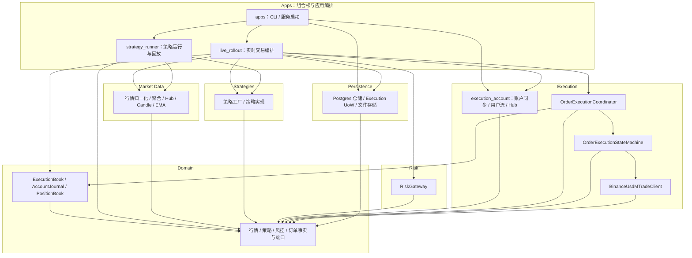
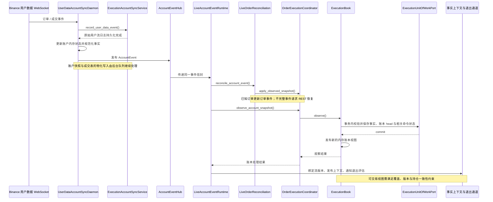
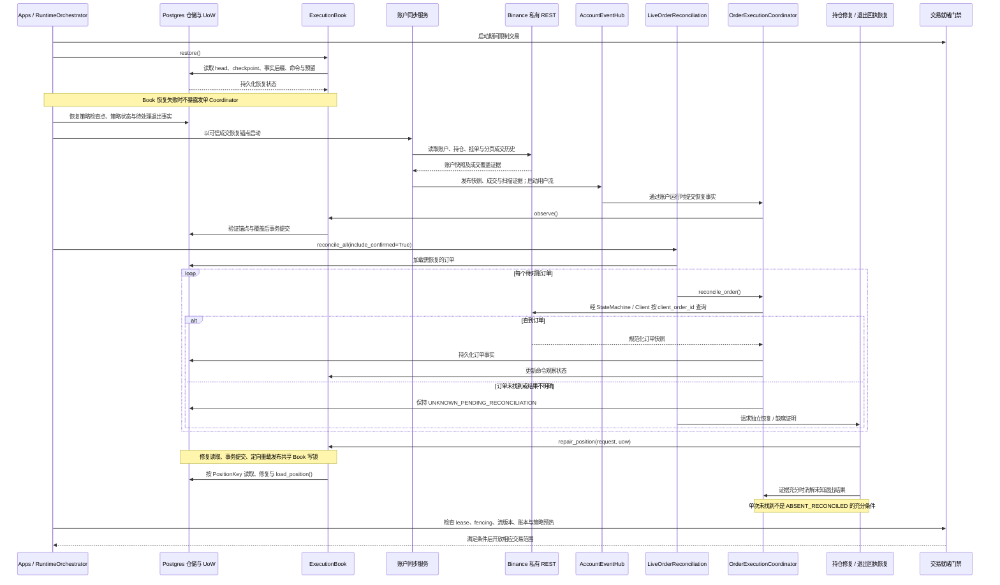
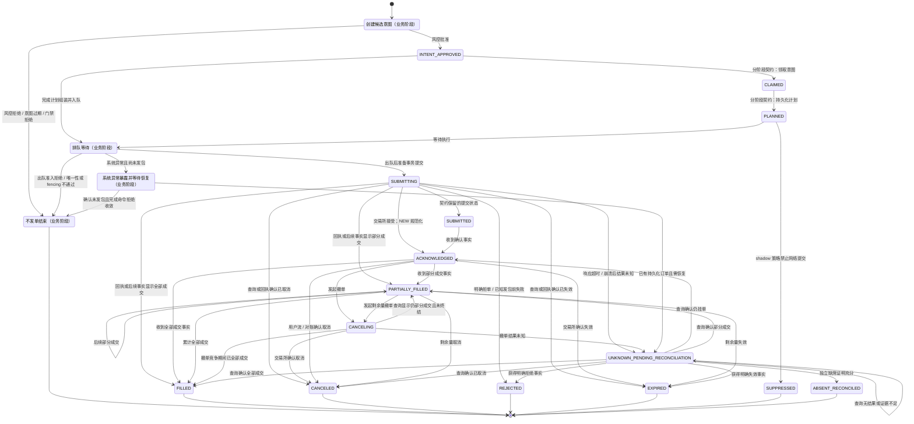
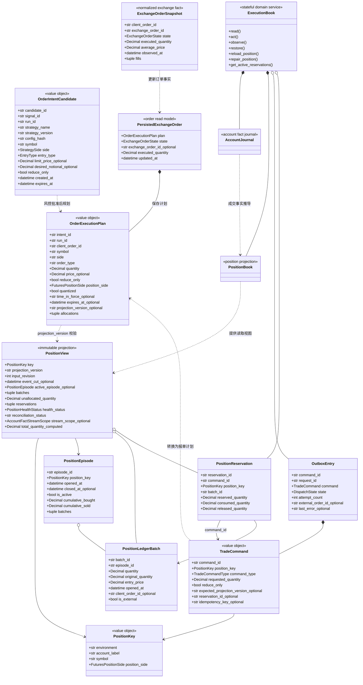

# 后端完整架构全景文档

归档日期：2026-10-02。依据当前工作区源码，基线提交 `72d40fd4`。本文描述架构与事实契约，不代表实盘健康检查或性能测量结果。图中省略内部算法、日志与遥测调用。

## 1. 静态组件图

箭头表示代码依赖：调用者或引用者指向被依赖模块。Apps 包括 CLI 组合根，以及 `live_rollout`、`strategy_runner` 等应用运行时；这不是把这些运行时物理归入 `apps` 包。



应用层组装具体仓储与客户端，并将其注入领域端口。执行层经端口访问仓储，因此图中没有 `Execution → Persistence` 的具体包依赖；Persistence 实现 Domain 定义的契约。源码聚合导入检查显示，其余五个业务/基础设施模块均依赖 Domain，Domain 没有反向引用这些模块。

`live_rollout` 直接引用 `strategies` 和 `market_data`，不再经 `strategy_runner` 获取策略工厂或行情设施。`ExecutionBook` 位于 Domain，负责账本不变式；应用层负责它的生命周期与基础设施装配。

## 2. 三大核心时序

### 2.1 场景 A：行情触发到报单确认

```mermaid
sequenceDiagram
    participant Loop as LiveMarketLoop
    participant Strategy as Strategy
    participant Lane as EntryExecutionLane
    participant Submission as LiveCandidateSubmission
    participant Risk as RiskGateway
    participant Planner as TradeCommandExecutor
    participant Coord as OrderExecutionCoordinator
    participant Book as ExecutionBook
    participant Admission as LiveSubmissionAdmission
    participant Repo as OrderSubmissionRepository
    participant Machine as OrderExecutionStateMachine
    participant Client as BinanceUsdMTradeClient
    Loop->>Strategy: on_market_state()
    Strategy-->>Loop: StrategyDecision
    Loop->>Lane: process()
    Note over Lane: 池过滤、就绪检查、开仓准入与熔断
    Lane->>Submission: execute()
    Submission->>Risk: evaluate()
    Risk-->>Submission: RiskEvaluation
    alt 风控拒绝或前置条件不满足
        Submission-->>Lane: 无订单提交结果
    else 风控批准
        Submission->>Planner: plan_execution()
        Planner-->>Submission: OrderExecutionPlan
        Submission->>Coord: prepare_and_execute()
        Note over Coord: 按账户、环境、交易对、持仓方向排队后出队
        Coord->>Book: read() / act()
        Book-->>Coord: 接受命令与 Outbox
        Coord->>Book: 标记 DISPATCHING
        Coord->>Admission: rejection_reason()
        Admission-->>Coord: 最终准入结果
        alt 最终准入拒绝
            Coord->>Book: mark_rejected()
            Coord-->>Submission: 无提交结果
        else 最终准入通过
            Coord->>Repo: prepare_submission()
            Note over Repo: 一个事务检查 fencing / 限额 / 唯一性<br/>写入 intent、order、SUBMITTING 事件
            Repo-->>Coord: 提交事务后返回 PreparedOrderSubmission
            alt 仓储拒绝准备
                Coord->>Book: mark_rejected()
                Coord-->>Submission: 无提交结果
            else 准备成功
                Coord->>Machine: submit()
                Machine->>Client: submit_order()
                Note over Machine,Client: 交易所网络请求发生在准备事务之外
                Client-->>Machine: ExchangeOrderSnapshot
                Machine->>Repo: 经订单事件/成交仓储端口持久化回执
                Machine-->>Coord: OrderExecutionResult
                Coord->>Book: 观察订单结果并更新命令状态
                Coord-->>Submission: OrderExecutionResult
                Submission-->>Lane: 提交结果
            end
        end
    end
```

策略评估发生在 Lane 之前；Lane 负责开仓管道控制，Submission 负责风控与命令组装，Coordinator 负责串行执行和出队后的最终准备。Coordinator 不回调 Submission。

图中的 Repo 汇总显示准备、事件及成交仓储端口，实际是不同接口。Book 命令接受事务与订单准备事务也不是同一个全局事务。准备与网络发单处于同一队列任务，同一执行键的撤单/对账任务不能插入两者之间；这不等于所有账户或进程全局串行化。

正常主调用路径为 `Loop → Lane → Submission → Coordinator → StateMachine → Client`，共六个对象、五次跨对象主链调用；策略、风控、规划、准入和仓储是旁支调用，不应把所有箭头相加当作栈深或性能结论。交易所 NEW 被规范化为 ACKNOWLEDGED；报单确认不等于真实成交入账。发包超时进入同一 `client_order_id` 的查询/对账流程，不自动重发 POST。

### 2.2 场景 B：WebSocket 成交事件到 ExecutionBook



生产端先保存原始用户流日志，再发布规范化 `AccountEvent`；Hub 发布不等待账户物化表全部写完。消费端先处理订单状态，再提交账户真实成交事实到 Book。`AccountJournal` 保存事实，`PositionBook` 推导持仓视图，`ExecutionBook` 统一控制接受、持久化与发布。

订单累计成交数量与账户成交事实用途不同：前者确认订单状态，后者用于批次、成本和持仓账本，不能仅凭订单回执制造成交事实。事件信封保留流 epoch 与 sequence；瞬态失败重试同一信封，证据冲突或覆盖不足仍会限制可交易性。

### 2.3 场景 C：崩溃重启后的恢复与对账



图把账户生产服务与策略交易进程的协作按逻辑顺序展开，具体部署可分进程运行。恢复不是简单加载最后一条账户快照：可信检查点、成交覆盖、流版本、未完成命令与资产预留必须一起校验。普通零持仓快照不能直接抹掉既有持久化账本。

“准备事务已提交、POST 尚未发送”与“POST 已发送、响应丢失”在重启时都可能表现为 SUBMITTING/未知状态。恢复依据同一 `client_order_id` 查询，证据充分才消解；不能盲目重新发单。健康 WebSocket 期间也保留周期性完整成交扫描，补齐乱序或遗漏事实。

## 3. 订单生命周期状态机

下图包含业务阶段与代码订单状态。中文业务节点不是新增持久化枚举；主链的原子准备直接写入 SUBMITTING，INTENT_APPROVED、CLAIMED、PLANNED 属于契约中保留的阶段，并非本链路每次必经。



这是按事件与恢复条件整理的生命周期视图，不表示代码有一张强制执行所有边的集中转移表。没有通用持久化 `ABORTED` 状态；明确未发包的失败收敛为不发单/拒绝，不能确定是否发包的失败必须保留未知状态。ABSENT_RECONCILED 表示经过独立证明消解缺席，不表示交易所发回取消回执。

ExecutionBook 的命令 Outbox 使用独立 `DispatchState`：

| 状态 | 含义 |
| --- | --- |
| PREPARED | 命令已被 Book 接受 |
| DISPATCHING | 出队开始执行，随后进行最终准入和仓储准备 |
| ACKNOWLEDGED | 已观察到命令对应的接受结果 |
| REJECTED | 命令被明确拒绝 |
| UNKNOWN | 执行结果未确定，需要恢复 |
| TERMINAL | 命令已观察到终态 |

订单终态、Outbox 终态与持仓账本成交覆盖是三个不同条件；退出预留与恢复门禁不能仅凭一个状态字符串清除。

## 4. 核心领域模型

业务名称与源码对应：TradeIntent = `OrderIntentCandidate`；ExecutionPlan = `OrderExecutionPlan`；Order = `PersistedExchangeOrder`；Position 的交易读取契约 = `PositionView`，其成交周期与批次由 `PositionEpisode`、`PositionLedgerBatch` 描述。下图使用实际类名，并列出架构相关字段，完整字段以源码为准。



字段名中的 `_optional`、`_computed` 是图示标记，不是源码字段名。`Decimal` 表达数量与价格；报单计划在进入执行时必须已量化。`client_order_id` 是稳定的订单查询与幂等键，`projection_version` 防止依据过时位置决策，`PositionKey` 隔离环境、账户、交易对与持仓方向。

命令与事实载体主要使用 `frozen=True` dataclass；但 frozen 只冻结属性绑定，包含 dict/Mapping 的字段不自动获得深度不可变性。ExecutionBook 是有状态领域服务，维护事实、视图、预留和 Outbox，不应标为不可变实体。

Binance 专有状态先规范化为 `ExchangeOrderSnapshot` / 账户事件，再进入状态机与 Book。当前契约没有名为 `OrderAck` 或 `OrderReceipt` 的返回类，文档不引入这些不存在的类型。

## 源码索引

- 组合与主流程：`apps/`、`live_rollout/runtime_orchestrator.py`、`live_rollout/market_loop.py`、`entry_lane.py`、`submission.py`、`execution_runtime.py`。
- 执行与交易所隔离：`execution_account/orders/coordinator.py`、`state_machine.py`、`trade_command_executor.py`、`execution_account/binance/client.py`、`order_status.py`。
- 账户事实与恢复：`execution_account/daemon.py`、`user_data_sync.py`、`sync.py`、`live_rollout/account_channel.py`、`order_reconciliation.py`、持仓恢复/修复模块。
- 领域契约：`domain/strategy/models.py`、`domain/execution/order_state.py`、`execution_book.py`、位置、命令、预留与 Outbox 模型。
- 事务实现：`persistence/postgres/order_submission_repository.py`、Execution UoW、账户日志与持仓检查点仓储。
