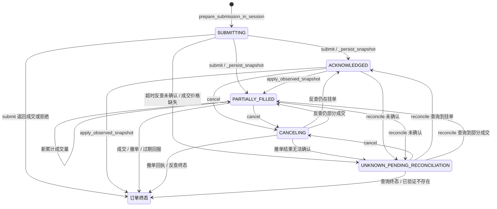
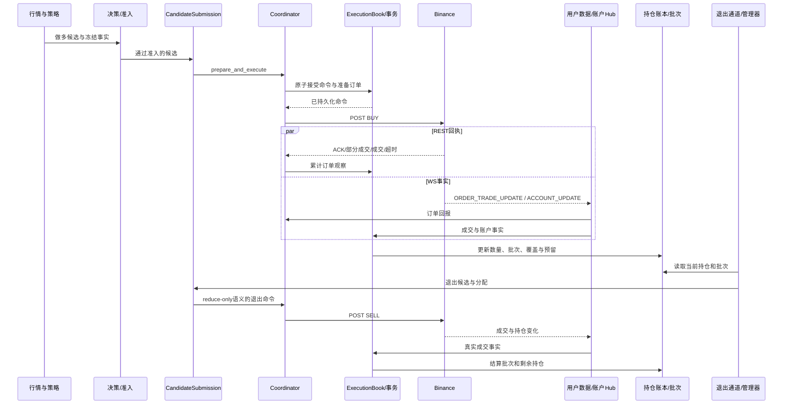

# 系统状态机与执行拓扑审计报告

- 审计日期：2026-10-10。
- 审计基线：当前工作树，HEAD `b73da9a9a864788ec4f62ae30d1378bc83902ec9`。
- 审计范围：Binance 合约实盘的信号、订单、账户、持仓、批次、退出、恢复与持久化链路。
- 方法：静态扫描全部 372 个 Python 源文件，重点追踪 290 个相关文件的状态定义与关键调用点；对关键竞态进行了不访问网络、不写数据库的内存隔离验证。
- 边界：未连接实盘；审计期间受 Git 管理的文件内容指纹保持一致。本文是该基线的审计快照，不证明服务器正在运行同一版本，也不代表已实施修复。

**核心结论：当前系统维护了多套相互关联的状态，数据库的终态保护没有完整贯穿到事件入口和内存预留。确认了三项可复现缺陷，另识别出两项条件性执行风险和一项队列容量风险。**

本文只描述代码实态、复现条件及概念性的状态收敛，不提供重构代码、补丁或伪代码。源码链接使用相对路径，行号对应审计基线。

## 一、现状状态全景图与状态转移矩阵

### 1. 显式状态清单

系统存在以下独立状态维度。它们分别描述订单、命令、事实完整性和运行控制，不能直接拼成一条线性状态机。

| 维度 | 实际定义的状态 | 定义位置 |
|---|---|---|
| 交易所订单及本地执行阶段 | `INTENT_APPROVED`、`CLAIMED`、`PLANNED`、`SUBMITTING`、`CANCELING`、`SUBMITTED`、`ACKNOWLEDGED`、`PARTIALLY_FILLED`、`FILLED`、`CANCELED`、`ABSENT_RECONCILED`、`REJECTED`、`EXPIRED`、`SUPPRESSED`、`UNKNOWN_PENDING_RECONCILIATION` | [order_state.py:24](../../src/crypto_momentum_lab/domain/execution/order_state.py#L24) |
| 执行命令 Outbox | `PREPARED`、`DISPATCHING`、`ACKNOWLEDGED`、`REJECTED`、`UNKNOWN`、`TERMINAL` | [command_models.py:12](../../src/crypto_momentum_lab/domain/execution/command_models.py#L12) |
| 持仓预留的数据库状态字符串 | `ACTIVE`、`COMMITTED`、`RELEASED`；由剩余预留量和已消费量推导 | [position_reservation_repository.py:458](../../src/crypto_momentum_lab/persistence/postgres/position_reservation_repository.py#L458) |
| 决策退出 Outbox 状态字符串 | `PENDING`、`DISPATCHED`、`SUPERSEDED` | [ports.py:59](../../src/crypto_momentum_lab/domain/decision/ports.py#L59) |
| 持仓事实健康度 | `READY`、`CATCHING_UP`、`INCOMPLETE`、`CONFLICT` | [position_ledger_models.py:195](../../src/crypto_momentum_lab/domain/execution/position_ledger_models.py#L195) |
| 成交事实覆盖度 | `CONFIRMED`、`GAP_DETECTED`、`PENDING` | [position_ledger_models.py:35](../../src/crypto_momentum_lab/domain/execution/position_ledger_models.py#L35) |
| 持仓差异类型 | `INPUT_MISSING`、`TIME_MISALIGNED`、`QUANTITY_MISMATCH`、`PRICE_MISMATCH`、`IDENTITY_MISMATCH`、`BOUNDARY_MISMATCH`、`PENDING_BINDING` | [position_ledger_models.py:207](../../src/crypto_momentum_lab/domain/execution/position_ledger_models.py#L207) |
| 实盘业务会话 | `PREFLIGHT`、`LIVE_ENABLED`、`DRAINING`、`HALTED`、`RECONCILING`、`COMPLETED` | [models.py:13](../../src/crypto_momentum_lab/domain/live_rollout/models.py#L13) |
| 进程关闭阶段 | `RUNNING`、`DRAINING`、`PERSISTING`、`CLOSING`、`STOPPED` | [runtime_session.py:42](../../src/crypto_momentum_lab/live_rollout/runtime_session.py#L42) |
| 执行账户服务 | `STARTING`、`RUNNING`、`SYNCING`、`READY_READONLY`、`DEGRADED`、`HALTED_READONLY`、`STOPPED` | [models.py:11](../../src/crypto_momentum_lab/domain/account/models.py#L11) |
| 行情服务 | `STARTING`、`SYNCING`、`READY`、`DEGRADED`、`HALTED`、`STOPPED` | [models.py:26](../../src/crypto_momentum_lab/domain/market/models.py#L26) |
| 流可用性 | `CONNECTING`、`RECOVERING`、`READY`、`DISRUPTED` | [stream_availability.py:22](../../src/crypto_momentum_lab/health/stream_availability.py#L22) |
| 行情 WS 内部连接阶段 | `DISCONNECTED`、`SYNCING`、`READY` | [websocket.py:76](../../src/crypto_momentum_lab/market_data/binance/websocket.py#L76) |
| 策略风控状态 | `ACTIVE`、`DRAINING`、`HALTED` | [models.py:22](../../src/crypto_momentum_lab/domain/risk/models.py#L22) |
| 风控结果／交易租约 | `APPROVED`、`REJECTED`、`HALTED`／`ACTIVE`、`RELEASED`、`EXPIRED` | [models.py:10](../../src/crypto_momentum_lab/domain/risk/models.py#L10) |
| 定时风险窗口 | `PRE_WINDOW`、`FLATTENING`、`DEADLINE`、`VERIFYING`、`REOPENED` | [scheduled_risk_window.py:23](../../src/crypto_momentum_lab/live_rollout/scheduled_risk_window.py#L23) |
| EMA 准入状态 | `DISABLED`、`UNAVAILABLE`、`VALID` | [entry_policy.py:19](../../src/crypto_momentum_lab/domain/strategy/entry_policy.py#L19) |
| 策略拒绝原因 | `INSUFFICIENT_WARMUP`、`MISSING_REQUIRED_PRICE`、`MISSING_REQUIRED_FIELD`、`COOLDOWN_ACTIVE`、`NO_SIGNAL`、`CANDIDATE_EXPIRED`、`HOLDING_POSITION`、`BELOW_ENTRY_THRESHOLD` | [models.py:26](../../src/crypto_momentum_lab/domain/strategy/models.py#L26) |
| 证据等待原因 | `STREAM_RECOVERY_PROOF_REQUIRED`、`PARENT_CHECKPOINT_UNAVAILABLE` | [observation_models.py:30](../../src/crypto_momentum_lab/domain/execution/observation_models.py#L30) |

还存在两组通过结果类型表达的状态：

- 执行接受结果：`Accepted`、`AlreadyAccepted`、`StaleView`、`Blocked`、`PositionNotReady`、`ExecutionRecoveryPending`、`CommandConflict`。定义于 [execution_action_models.py:66](../../src/crypto_momentum_lab/domain/execution/execution_action_models.py#L66)。
- 证据处理结果：`Applied`、`Duplicate`、`EvidenceConflict`、`WaitingForEvidence`。定义于 [observation_models.py:8](../../src/crypto_momentum_lab/domain/execution/observation_models.py#L8)。

其他定义与口径：

- `LONG/SHORT`、`BUY/SELL`、`BOTH/LONG/SHORT`、`MARKET/LIMIT`、`ENTRY/EXIT`、退出分配模式是方向或动作标签，分别见 [trading.py:6](../../src/crypto_momentum_lab/domain/trading.py#L6)、[order_state.py:53](../../src/crypto_momentum_lab/domain/execution/order_state.py#L53)、[trade_command.py:28](../../src/crypto_momentum_lab/domain/execution/trade_command.py#L28)。
- 当前 `PositionExitMode` 只有 `CANDLE_15M`，见 [position_exit.py:20](../../src/crypto_momentum_lab/domain/strategy/position_exit.py#L20)。策略方向还有 `LONG_ONLY/SHORT_ONLY/BOTH`，订单流事件方向为 `UP/DOWN`，运行模式为 `REPLAY/PAPER/LIVE`。
- 研究模型定义了模拟成交 `FILLED/EXPIRED/REJECTED/PENDING` 和模拟持仓 `OPEN/CLOSED`，见 [paper_models.py:19](../../src/crypto_momentum_lab/domain/strategy/paper_models.py#L19)。不能据此推断实盘也有一套 `OPEN/CLOSED` 枚举状态机。
- `PositionView.reconciliation_status` 是 `OK` 或健康度名称的派生字符串，见 [position_book.py:293](../../src/crypto_momentum_lab/domain/execution/position_book.py#L293)。
- 控制命令另有 `requested → executing → completed/failed`，见 [live_rollout_repository.py:223](../../src/crypto_momentum_lab/persistence/postgres/live_rollout_repository.py#L223)。账户同步记录使用 `halted/catching_up/ready` 等字符串，见 [sync.py:232](../../src/crypto_momentum_lab/execution_account/sync.py#L232)及 [sync.py:594](../../src/crypto_momentum_lab/execution_account/sync.py#L594)。

**定义存在与运行可达性有区别：**

- 在生产源码中未找到 `CLAIMED`、`PLANNED`、`SUPPRESSED` 的明确写入路径。
- `INTENT_APPROVED` 用于意图记录；当前原子准备主路径直接写入 `SUBMITTING`。
- `SUBMITTED` 出现在外部订单收养路径。
- `LiveSessionState.RECONCILING` 有定义，但未找到当前编排器实际进入它的调用。

### 2. 隐式状态与复合状态

隐式状态不仅来自布尔字段，也来自集合成员、数量、任务是否存在和版本是否匹配。

| 状态载体 | 标记及组合 | 实际含义与位置 |
|---|---|---|
| 策略运行缓存 | warmup 计数、`cooldown_remaining`、`last_processed`、`signal_sequence` | 未预热／可评估／冷却／已处理。冷却在产生信号时推进。[runtime_state.py:22](../../src/crypto_momentum_lab/strategies/runtime_state.py#L22) |
| 持久化策略政策 | cooldown 截止时间、active intent、anchor、grace、holding deadline 等映射 | 另一组策略时序状态。[decision_engine.py:123](../../src/crypto_momentum_lab/domain/decision/decision_engine.py#L123) |
| 入场门控 | `_entry_enabled`、风险阻断、定时阻断、过滤缓存 ready；另结合预热和行情可用性 | 多个条件共同决定能否入场。[entry_control.py:44](../../src/crypto_momentum_lab/live_rollout/entry_control.py#L44) |
| 守护进程 | `_run_active`、`_exit_enabled` | 进程仍运行但入场关闭、退出仍启用等组合。[daemon.py:227](../../src/crypto_momentum_lab/live_rollout/daemon.py#L227) |
| 本地入场注册表 | `_pending`、`_uncertain`、`_settled`、`_counted_entries`、交易所 ID 映射 | 等待成交／结果不明／已终态但批次尚未观察到／已经计入批次。[pending_entries.py:22](../../src/crypto_momentum_lab/live_rollout/pending_entries.py#L22) |
| 命令调度器 | queued command、started event、future、closed、active submission count | 已排队／已开始网络操作／调用方已取消但操作仍在执行。[coordinator.py:128](../../src/crypto_momentum_lab/execution_account/orders/coordinator.py#L128) |
| 执行账本 | persistence failed、recovery-required 集合、dispatch-reconciliation 集合、stream scope、去重集合、累计成交水位 | 命令终态与事实结算完成是两件事。[execution_evidence_state.py:33](../../src/crypto_momentum_lab/domain/execution/execution_evidence_state.py#L33) |
| 持仓视图 | `is_comparable`、零仓确认、episode active、批次数量、unallocated quantity | 本地数量为零不等于已证明交易所平仓。[position_ledger_models.py:649](../../src/crypto_momentum_lab/domain/execution/position_ledger_models.py#L649) |
| 成交日志与覆盖证明 | late events、synthetic fills、prefix complete、conflicts、page exhausted、not truncated、known gaps | 决定事实是否足以允许交易。[account_journal.py:75](../../src/crypto_momentum_lab/domain/execution/account_journal.py#L75) |
| 批次退出视图 | `closing_order_filled`、recovery order、recovery 起始时间、剩余数量、batch ID | 正常持有／退出挂单覆盖／宽限期／超时补平／等待成交事实。[exits.py:45](../../src/crypto_momentum_lab/live_rollout/exits.py#L45) |
| 退出与修复任务 | requested recoveries、attempt、next attempt、checked-until、重试 deadline、任务是否存在 | 已请求恢复、等待重试、已评估蜡烛等隐式阶段。[exit_processor.py:244](../../src/crypto_momentum_lab/live_rollout/exit_processor.py#L244) |
| 账户同步管线 | `_accept_events`、`_reconciliation_active`、pipeline recovery event、generation、deferred events | 正常接收／暂存事件／重建快照／恢复后重放。[daemon.py:211](../../src/crypto_momentum_lab/execution_account/daemon.py#L211) |
| Hub 客户端 | require-full-snapshot、stream ID/epoch/sequence、连接与停止标记 | 增量消费／序列缺口／等待完整快照。[hub.py:871](../../src/crypto_momentum_lab/execution_account/hub.py#L871) |
| 定时清仓 | entry orders cancelled、deadline cancellation done、positions verified、flatten attempt | 同一时间阶段内还有未撤单／已撤单／未验证／已验证等子状态。[scheduled_controller.py:144](../../src/crypto_momentum_lab/live_rollout/scheduled_controller.py#L144) |
| 生命周期与后台写入 | lifecycle lock closed/draining；checkpoint dirty/pending/inflight/stopping；退出 lane started 与待处理任务 | 控制接受任务、排空、持久化和关闭。[position_lifecycle.py:28](../../src/crypto_momentum_lab/live_rollout/position_lifecycle.py#L28) |

代码中实际存在这些复合状态：

- 订单 `FILLED`，Outbox `TERMINAL`，真实成交事实尚不完整，退出预留仍保留。这是代码明确设计的恢复状态。
- 订单 `CANCELED`，已部分成交，持仓仍大于零。这是正常业务状态。
- 数据库订单已终态，本地 `_pending` 仍存在。这是本次复现的错误组合。
- 已经持有仓位，同时仍有入场挂单。系统允许后续加仓批次，不能用一个“正在开仓／正在持仓”互斥枚举完整表达。

### 3. 实际订单状态图

下图表示当前主提交路径。终态节点合并展示，具体终态见转移表。

关键限制：单次 GET 查不到订单，并不自动进入 `ABSENT_RECONCILED`。该终态要求额外的缺失确认路径。

### 4. 实际状态转移矩阵

| 源状态 | 事件／条件 | 目标状态 | 触发入口 |
|---|---|---|---|
| 未接受命令 | 版本、身份、容量检查通过并提交事务 | Outbox `PREPARED`；订单 `SUBMITTING` | `ExecutionBook.act` → `accept_execution_command` → `prepare_submission_in_session` |
| 未接受命令 | 投影版本不匹配 | `StaleView`，不形成新执行命令 | `accept_execution_command` |
| 已存在相同请求 | 相同请求 ID、相同内容 | `AlreadyAccepted` | `accept_execution_command` |
| 已存在相同请求 | 相同 ID、不同内容 | `CommandConflict` | `accept_execution_command` |
| Outbox `PREPARED` | 直接提交路径开始派发 | `DISPATCHING` | `mark_dispatching` |
| Outbox `PREPARED/DISPATCHING/UNKNOWN` | 已确认订单身份的 ACK 或部分成交 | `ACKNOWLEDGED` | `mutate_evidence` → `plan_order_event` |
| 订单 `SUBMITTING` | REST 返回 NEW／部分成交／完全成交 | `ACKNOWLEDGED/PARTIALLY_FILLED/FILLED` | `OrderExecutionStateMachine.submit` |
| 订单 `SUBMITTING` | 明确拒绝或提交前保护拒绝 | `REJECTED` | `submit` |
| 非终态订单 | POST 超时，反查仍不能确认 | `UNKNOWN_PENDING_RECONCILIATION` | `submit` → `_query_order_with_retry` |
| 任意可观察订单 | 有成交数量但成交价格未完整 | `UNKNOWN_PENDING_RECONCILIATION` | `_persist_snapshot` |
| 挂单／部分成交／结果不明 | 发起撤单 | `CANCELING` | `cancel` |
| `CANCELING` | 撤单响应或反查确认终态 | `CANCELED/FILLED/EXPIRED` 等 | `cancel` → `_persist_snapshot` |
| `CANCELING` | 反查仍挂单或部分成交 | `ACKNOWLEDGED/PARTIALLY_FILLED` | `cancel` |
| `CANCELING` | 无法确认撤单结果 | `UNKNOWN_PENDING_RECONCILIATION` | `cancel` |
| 结果不明 | 订单查询、挂单等证据确认不存在 | `ABSENT_RECONCILED` | `mark_absent_reconciled`及缺失恢复路径 |
| Outbox 非终态 | 订单结果不明 | `UNKNOWN`，登记派发恢复要求 | `plan_order_event` |
| Outbox 非终态 | 撤单、过期、拒绝、确认不存在 | `TERMINAL/REJECTED`，释放剩余预留 | `plan_order_event` |
| Outbox 非终态 | FILLED 且真实成交事实完整 | `TERMINAL`，完成结算／释放余量 | `plan_order_event` |
| Outbox 非终态 | FILLED 但真实成交事实不足 | `TERMINAL`，保留恢复标记，可能保留预留 | `plan_order_event` |
| 预留 `ACTIVE` | 累计退出成交量推进 | 已消费量增加，剩余预留下降 | `plan_reservation_settlement` |
| 预留剩余量归零 | 消费量大于零／完全未消费 | `COMMITTED/RELEASED` | reservation repository |
| 持仓事实完整 | 新缺口、滞后或冲突事实 | `CATCHING_UP/INCOMPLETE/CONFLICT` | `PositionLedger.project`、`PositionBook.get_view` |
| 持仓事实不完整 | 完整成交扫描、覆盖证明与快照收敛 | `READY` | 证据观察／持仓修复后重新投影 |
| 流 `CONNECTING/DISRUPTED` | 连接建立并开始恢复 | `RECOVERING` | `mark_connected/mark_recovering` |
| 流 `RECOVERING` | 完整快照／恢复完成 | `READY` | `mark_ready` |
| 流任意阶段 | 断线、序列缺口、消费异常 | `DISRUPTED`或重新恢复 | Hub source／availability clock |
| 风险窗口 `PRE_WINDOW` | 到达停止入场时间 | `FLATTENING` | `ScheduledRiskWindowConfig.phase` |
| `FLATTENING → DEADLINE → VERIFYING` | 到达各时间边界 | 下一阶段 | `phase`、controller `process` |
| `VERIFYING` | 到达 reopen 时间且清仓验证通过 | `REOPENED`并解除入场阻断 | controller `process` |

关键入口依据：[命令接受:60](../../src/crypto_momentum_lab/domain/execution/execution_action_processor.py#L60)、[原子准备:123](../../src/crypto_momentum_lab/persistence/postgres/order_submission_repository.py#L123)、[提交:104](../../src/crypto_momentum_lab/execution_account/orders/state_machine.py#L104)、[撤单:260](../../src/crypto_momentum_lab/execution_account/orders/state_machine.py#L260)、[证据生命周期:47](../../src/crypto_momentum_lab/domain/execution/evidence_lifecycle.py#L47)。

当前 `prepare_and_execute` 路径没有单独调用 `mark_dispatching`，因此 Outbox 可以停留在 `PREPARED`，等待交易所观察后直接进入 ACK／终态；订单表则已经是 `SUBMITTING`。见 [coordinator.py:1385](../../src/crypto_momentum_lab/execution_account/orders/coordinator.py#L1385)。

### 5. 外部事件、指标与时间输入

| 输入源 | 接收与解析入口 | 如何影响执行 |
|---|---|---|
| `aggTrade` | `normalize_binance_envelope` → `MarketState15sAccumulator.observe/_update_trade` | 按 `m` 字段判定主动买卖方向，累计主动买／卖成交额及价格、成交额等 |
| 15 秒行情状态 | `LiveMarketLoop._run_prefetched` → `OrderFlowImpulseRuntimeStrategy.on_market_state` | 更新策略缓冲、预热、冷却，计算冲击与确认信号 |
| `ORDER_TRADE_UPDATE` | `BinanceUsdMUserDataStream._run_connection` → `parse_user_data_event` → `AccountUserDataState._apply_order_trade_update` | 更新挂单视图；`x=TRADE` 时提取真实成交的 trade ID、数量、价格、手续费 |
| `ACCOUNT_UPDATE` | `AccountUserDataState._apply_account_update` | 合并余额与持仓快照，经账户 Hub 传递给实盘执行层 |
| REST POST／GET／DELETE 响应 | `BinanceUsdMTradeClient` → `order_snapshot_from_response` | 形成累计订单观察，再写订单记录及执行账本 |
| 15 分钟已关闭蜡烛 | closed-candle feed → `LiveExitChannelRuntime` → `requests_for_closed_candle` | 当前主要策略退出触发源 |
| 本地入场 TTL／交易所 GTD | `LiveLimitOrderLifecycle._expire`／交易所回报 | 本地尝试撤单；交易所拥有 GTD 的权威过期状态 |
| 宽限期计时器 | `run_grace_timeout_channel` → `requests_for_grace_timeout` | 撤销恢复限价单，按剩余持仓形成市场退出请求 |
| 定时清仓 | `ScheduledRiskWindowController.process` | 停入场、撤入场单、平仓、验证交易所剩余持仓 |
| 断线、溢出、序列缺口 | 用户数据 daemon、Hub source、stream availability | 暂存／恢复快照／重放；失败时保持入场阻断 |
| 恢复请求与退避 | `LiveOrderReconciliation.run_requested` | 分别处理 positions、orders、exits；每类有超时及后续重试 |

接收入口依据：[用户数据 WS:222](../../src/crypto_momentum_lab/execution_account/binance/user_data.py#L222)、[账户更新:149](../../src/crypto_momentum_lab/execution_account/user_data_sync.py#L149)、[订单与成交更新:296](../../src/crypto_momentum_lab/execution_account/user_data_sync.py#L296)、[恢复循环:286](../../src/crypto_momentum_lab/live_rollout/order_reconciliation.py#L286)。

订单流指标的实际输入形式是 15 秒聚合状态：

- 主动买卖量在这条策略链中主要使用成交额。
- 失衡计算为“主动买成交额减主动卖成交额，再除以两者之和”。
- 还使用收益率、冲击成交强度、突破及确认条件。
- 未看到一个独立的、持续累计的“数量 Delta 状态机”直接驱动下单。

依据：[归一化方向:62](../../src/crypto_momentum_lab/market_data/normalization/binance.py#L62)、[成交额聚合:355](../../src/crypto_momentum_lab/market_data/aggregation/state_15s.py#L355)、[策略指标:455](../../src/crypto_momentum_lab/strategies/order_flow_impulse/event_study.py#L455)。

账户数据传播还存在一个明确边界：原始事件先记日志，内存应用结果可以先发布到 Hub，派生账户快照与成交记录随后异步持久化。不能把“收到 Hub 事件”直接等同于“全部派生表已经提交”。见 [daemon.py:546](../../src/crypto_momentum_lab/execution_account/daemon.py#L546)及 [发布接线:691](../../src/crypto_momentum_lab/apps/execution_account/main.py#L691)。

## 二、执行链路复杂度评估

### 1. 从信号到平仓的真实链路

主链路按顺序经过：

1. 行情归一化与 15 秒聚合。
2. 策略缓存更新，冲击／确认条件判断，生成候选。
3. 冻结账户与持仓事实，经过统一决策过滤和持久化决策提交。
4. 入场 universe／排名／EMA／方向门控。
5. `LiveCandidateSubmission.execute`：生命周期锁、风险评估、计划构建、量化、GTD 参数。
6. `OrderExecutionCoordinator.prepare_and_execute`：按账户、币种、position side 排队。
7. `ExecutionBook.act`：版本校验、退出预留、Outbox 与订单准备事务。
8. `OrderExecutionStateMachine.submit` → Binance POST。
9. REST 回执与 WS 事件分别进入订单记录及证据观察。
10. `AccountJournal` → `PositionLedger` → `PositionBook`：形成真实持仓与批次视图。
11. 15 分钟收盘／宽限期／定时清仓触发退出管理。
12. 退出分配、预留、提交 SELL，经过相同执行底层。
13. 累计成交结算、真实成交归属、账户零仓证据共同完成收敛。

订单终态与生命周期完成存在时间差。REST 累计成交用于推进订单观察和预留结算；代码没有把它直接伪造成真实账户成交。批次与完整性仍依赖真实成交事实和账户证据。

另有一条已经接线的持久化决策退出支路：

`LiveDecisionFactSource.commit_decision/recover_pending_exits → _handle_decision_exit → prepare_and_execute`

它维护自己的 `PENDING/DISPATCHED/SUPERSEDED`，并包含旧退出原因的恢复处理。见 [decision_facts.py:370](../../src/crypto_momentum_lab/live_rollout/decision_facts.py#L370)及 [runtime_orchestrator.py:555](../../src/crypto_momentum_lab/live_rollout/runtime_orchestrator.py#L555)。

### 2. 类、文件和抽象层数量

按有行为的运行组件统计，以下可核对的链路集合包含 34 个具体类，分布在 32 个文件。不计数据模型、Protocol、异常类及薄函数模块，因此这是生命周期复杂度的下限。

| 分组 | 纳入统计的类 |
|---|---|
| 行情聚合，1 个 | `MarketState15sAccumulator` |
| 信号与准入，4 个 | `LiveMarketLoop`、`OrderFlowImpulseRuntimeStrategy`、`EntryExecutionLane`、`RiskGateway` |
| 决策事实，1 个 | `LiveDecisionFactSource` |
| 提交与派发，4 个 | `LiveCandidateSubmission`、`OrderExecutionCoordinator`、`_KeyCommandScheduler`、`OrderExecutionStateMachine` |
| 账本与事务，8 个 | `ExecutionBook`、`PositionBook`、`PositionLedger`、`AccountJournal`、`ReservationRegistry`、`AsyncPostgresExecutionUnitOfWork`、`PostgresOrderSubmissionRepository`、`PostgresOrderEventRepository` |
| 交易 REST，1 个 | `BinanceUsdMTradeClient` |
| 账户传播，7 个 | `BinanceUsdMUserDataStream`、`UserDataAccountSyncDaemon`、`AccountUserDataState`、`ExecutionAccountSyncService`、`AccountEventHub`、`WebSocketAccountEventSource`、`LiveAccountEventRuntime` |
| 退出编排，5 个 | `LiveExitChannelRuntime`、`LiveExitEventCoordinator`、`ExitExecutionLane`、`LiveExitProcessor`、`LiveExitManager` |
| 预留与恢复，3 个 | `LivePendingEntryRegistry`、`LiveLimitOrderLifecycle`、`LiveOrderReconciliation` |

按职责可分为 8 层：行情输入、策略计算、决策准入、候选编排、命令与事务、交易所适配、账户事实传播、退出与恢复。

### 3. 识别出的过度设计点

#### ① 同一个“订单是否还占用额度”存在多个状态权威

订单表、Outbox、持仓预留、暴露 claim、本地 `_pending/_settled` 都参与判断。它们各有用途，但本地注册表再次维护了生命周期事实，且没有完整终态水位保护。本次“终态后重新 pending”的缺陷发生在这里。

#### ② 证据模块拆分后仍大量访问执行账本私有内部状态

`ExecutionBook.observe` 委托事务函数；事务函数接受 `book: object`，直接访问 `_mutation_lock`、`_persistence_failed`、`_stream_scopes`、`_head_revisions`、`_staged_copy` 等私有成员。文件拆开了，但没有形成独立、稳定的接口边界。

依据：[execution_evidence_transaction.py:59](../../src/crypto_momentum_lab/domain/execution/execution_evidence_transaction.py#L59)。

#### ③ 退出链路的职责切分偏碎

`ChannelRuntime → EventCoordinator → Lane → Processor → Manager → Submission → Coordinator` 逐级传递 context、trigger、failure 和恢复结果。Lane 的并发隔离、Manager 的策略判断都有作用；多个编排层之间重复协调上下文与恢复，是理解成本较高的部分。

#### ④ 两类退出 Outbox 与多种恢复机制并存

决策退出 Outbox、执行 Outbox、退出 episode reservation、未知退出恢复、订单恢复、持仓修复同时存在。代码已经需要识别旧的 `max_holding_period` 退出原因。这些兼容状态增加了排查“到底哪层还认为退出未完成”的成本。

#### ⑤ 异常文本承担业务分发

`order_identity_errors.py` 根据 `conflicts with its durable identity` 等字符串决定是否按身份冲突处理。异常信息的措辞参与控制流，跨模块耦合比较脆弱。

依据：[order_identity_errors.py:10](../../src/crypto_momentum_lab/live_rollout/order_identity_errors.py#L10)。

没有看到大规模 Base 类继承树或通用反射式 EventBus 支配交易主链路。主要复杂度来自回调接线、多份状态副本、恢复协议及事务外的投影同步。账户 Hub 的进程边界、命令幂等、真实成交去重和事务原子性具有明确职责，不能仅因层数多就判定冗余。

## 三、竞态与 Bug 根因清单

严重度口径：P1 为可影响持仓退出、执行状态或实盘准入的问题；P2 为配置行为或容量边界问题。严重度不表示已经在生产发生。

### P1-1：较早时间戳的 WS 终态，被入口过滤掉

**【[live_rollout/order_reconciliation.py:189](../../src/crypto_momentum_lab/live_rollout/order_reconciliation.py#L189)】**

**复现场景：**本地持久化订单为 ACK，累计成交量为零；随后收到累计量仍为零的 CANCELED 回报，其交易所时间早于本地 REST 观察时间。

**Bug 机理：**入口遇到“累计量相同且时间更早”就直接返回，未考虑终态优先级。两者时间来自不同观察点：REST 使用客户端收到／解析响应时的 `_now()`；WS 使用交易所订单字段 `T`。网络延迟即可制造这个顺序。

数据库本来允许确认的终态覆盖较晚的非终态，但事件没有到达数据库层。数据库保护见 [order_event_repository.py:81](../../src/crypto_momentum_lab/persistence/postgres/order_event_repository.py#L81)。时间来源见 [client.py:1183](../../src/crypto_momentum_lab/execution_account/binance/client.py#L1183)及 [user_data_parser.py:189](../../src/crypto_momentum_lab/execution_account/binance/user_data_parser.py#L189)。

**验证结果：**隔离验证中，较早的 CANCELED 没有调用执行协调器；仅把时间调整为更晚，便正常调用。

**影响：**订单表和本地执行状态可能保留为挂单。默认 `reconcile_all` 又跳过已确认 ACK／部分成交订单，不能保证普通恢复轮次立即纠正；GTD、TTL、完整账户恢复等后续事件仍可能使其收敛。

### P1-2：终态先到、REST ACK 后到，本地入场预留重新建立

**【[live_rollout/submission.py:494](../../src/crypto_momentum_lab/live_rollout/submission.py#L494)】**

**【[live_rollout/pending_entries.py:36](../../src/crypto_momentum_lab/live_rollout/pending_entries.py#L36)】**

**复现场景：**

1. POST 已发出，调用方仍等待 REST。
2. WS 先报告撤单或成交终态，`observe_order_event` 清除 `_pending`。
3. REST 返回较旧的 ACK。
4. submission 调用 `remember(plan, result)`，重新加入 `_pending`。

**Bug 机理：**`remember` 按原始返回结果覆盖本地状态，没有记录“这个订单已观察到终态”的不可回退水位。

`sync` 只从 `unresolved_orders` 合并。终态订单已经不在 unresolved 集合中时，代码采用 `continue` 保留本地记录，因此数据库正确也不能主动清除这条幽灵预留。对应位置：[pending_entries.py:133](../../src/crypto_momentum_lab/live_rollout/pending_entries.py#L133)。

**验证结果：**先观察 CANCELED，再记入迟到 ACK，再同步空的 unresolved／position 上下文：本地仍留下 1 条 pending、1000 的预留名义金额。直接记入终态的对照组可以清除。

**影响：**入场额度、持仓槽位和后续准入可能被错误占用。带到期时间的 LIMIT 单，后续 TTL 撤单／查询可能纠正；无到期计时器的路径可能持续保留到其他终态通知或重启。

### P1-3：同币种入场网络操作占用生命周期锁，退出无法及时进入

**【[live_rollout/submission.py:209](../../src/crypto_momentum_lab/live_rollout/submission.py#L209)】**

**【[live_rollout/exit_processor.py:152](../../src/crypto_momentum_lab/live_rollout/exit_processor.py#L152)】**

**触发场景：**已有多头持仓，同时提交该币种的后续入场单；POST 超时后进行原订单反查。此时收盘退出或宽限期退出到达。

**机理：**入场在同币种生命周期锁内等待 `prepare_and_execute`；退出也需要这把锁。POST 超时后的查询与退避仍处于持锁区间。

默认反查有四次间隔，合计 15 秒退避，另加 HTTP 时间；`Retry-After` 可以进一步延长等待，代码没有在这里设置统一总时限。见 [state_machine.py:390](../../src/crypto_momentum_lab/execution_account/orders/state_machine.py#L390)。

**影响与证据边界：**这是源码可确定的退出延迟路径，未做实盘网络故障验证。协调器虽然给退出任务更高优先级，但退出可能还没获得生命周期锁；已经运行的网络操作也不会被优先级抢占。不能将它称为必然永久死锁，但对已有仓位的及时退出有实际影响。

### P1-4：Hedge 退出语义与 WS 的 reduceOnly 字段校验可能冲突

**【[execution_account/binance/client.py:1101](../../src/crypto_momentum_lab/execution_account/binance/client.py#L1101)】**

**【[execution_account/binance/user_data_parser.py:195](../../src/crypto_momentum_lab/execution_account/binance/user_data_parser.py#L195)】**

**触发场景：**退出计划为 `SELL + LONG + reduce_only=True`。Hedge 请求实际只发送 `positionSide=LONG`，没有发送 `reduceOnly`；若交易所回报 `R=false`，其余订单身份字段一致。

**机理：**解析器要求 `order["R"] == plan.reduce_only`，把内部的“只减仓业务语义”与报文中的 reduceOnly 字段当成同一事实，抛出 durable identity conflict。

账户消费层先做订单协调，再应用该 envelope 的账户事实；身份冲突分支请求恢复后返回，当前 envelope 不继续正常应用。见 [account_channel.py:235](../../src/crypto_momentum_lab/live_rollout/account_channel.py#L235)。

**验证结果与边界：**内存验证确认：上述 `R=false` 回报抛错；只把 `R` 改为 true 则通过。本次没有核验交易所真实回报，故结论是条件性的协议映射缺陷。原始日志和账户恢复路径仍在，不能据此宣称全系统永久丢失成交。

### P2-1：flatten_start_at 配置被阶段判断忽略

**【[live_rollout/scheduled_risk_window.py:124](../../src/crypto_momentum_lab/live_rollout/scheduled_risk_window.py#L124)】**

**复现场景：**配置停止入场为 07:45，开始平仓为 07:50，在 07:46 调用阶段判断。

**Bug 机理：**配置校验允许两者不同，但 `phase()` 在到达 `entry_stop_at` 后直接进入 `FLATTENING`，完全没有读取 `flatten_start_at`。Controller 在该阶段直接发起清仓。见 [scheduled_controller.py:261](../../src/crypto_momentum_lab/live_rollout/scheduled_controller.py#L261)。

**验证结果：**配置接受成功，07:46 返回 `flattening`。

**影响：**会早于配置时间平仓。默认两项时间相同，因此默认配置掩盖了该缺陷。

### P2-2：REST 结果投影队列没有容量边界

**【[execution_account/orders/coordinator.py:463](../../src/crypto_momentum_lab/execution_account/orders/coordinator.py#L463)】**

**【[execution_account/orders/coordinator.py:1243](../../src/crypto_momentum_lab/execution_account/orders/coordinator.py#L1243)】**

**触发场景：**订单结果持续进入，账本投影因数据库等待等原因长期落后。

**机理：**`_order_observation_queue` 是无界 `asyncio.Queue`，生产侧直接 `put_nowait`，消费侧单任务串行应用。

**影响与边界：**可能积累内存和投影延迟。这是容量风险，未观察生产队列长度，不能据此认定它造成了历史存储或内存告警。

### 四类重点边界的审计结论

| 审计项 | 已有防护 | 剩余问题 |
|---|---|---|
| REST／WS 倒挂 | 原子准备先于 POST；证据可从 PREPARED 绑定交易所身份；数据库阻止迟到 ACK 覆盖 FILLED | 入口终态过滤和本地 pending 回退仍有缺陷 |
| 部分成交后撤单 | 先结算累计成交，再释放剩余预留；真实成交按 trade ID 与水位去重 | 终态未到达或语义校验失败时，可能延迟后续收敛 |
| POST 超时重试 | 反查原 `clientOrderId`；主链路未发现 Timeout 后盲目重发 POST | 反查过程可能阻塞同币种退出 |
| 中间状态悬挂 | 后台修复按任务重试；关键任务异常由 supervisor 使 worker 停止；未知结果保留恢复要求 | 已确认 ACK 默认跳过反查，以及无终态水位的内存副本，削弱自动收敛 |

退出补单还有明确防护：未知退出先检查原单、其他活动退出单和交易所剩余持仓；撤单后的 fallback 会重新读取持仓，限制补单数量。见 [exit_processor.py:413](../../src/crypto_momentum_lab/live_rollout/exit_processor.py#L413)。

### 隔离验证记录

以下是审计时的输出摘录，不是生产日志：

| 验证 | 结果 |
|---|---|
| 同累计量、较早 CANCELED | 协调器调用记录 `[]` |
| 同累计量、较晚 CANCELED，对照组 | 协调器调用记录 `['canceled']` |
| CANCELED → 迟到 ACK → 同步空上下文 | pending 数量 `1`，reserved notional `1000` |
| 直接记入终态，对照组 | pending 数量 `0` |
| Hedge 退出计划，WS `R=false` | `ValueError: WS order update conflicts with its durable identity` |
| 同一计划，WS `R=true`，对照组 | `filled` |
| 停入场 07:45、开始平仓 07:50，观察 07:46 | 配置接受成功；阶段为 `flattening` |

前三项可复现缺陷指 P1-1、P1-2、P2-1。Hedge 的解析器行为虽已隔离复现，交易所实际是否提供该触发报文仍未核验。锁等待和无界队列为源码路径／容量分析，未做生产压力或故障注入。

## 四、状态收敛与简化推导

从实际业务边界出发，必须保存四类不同事实：

1. 交易命令是否已发出、是否仍可能在交易所生效。
2. 已成交多少、还剩多少仓位。
3. 当前事实是否完整可信。
4. 当前是否允许新的入场或退出操作。

在这四类事实之上，状态可以自然收敛为以下几个维度：

| 维度 | 可收敛的核心状态 | 推导 |
|---|---|---|
| 每条执行命令：5 个 | 已准备、提交中、活动中、结果不明、终态 | 提交前后必须区分，才能处理崩溃与未知 POST；ACK 和部分成交可以共享“活动中”，成交程度由数量表达 |
| 持仓：2 个 | 空仓、有仓 | 持仓是否存在由真实剩余数量决定；部分成交、加仓和减仓是数量及批次变化 |
| 事实可信度：3 个 | 可用、待补齐、冲突 | `CATCHING_UP/INCOMPLETE` 的具体原因可以保留为诊断信息，而不必全部成为交易生命周期状态 |
| 交易门控：3 个 | 正常、只退出、停止 | 风险窗口、人工控制、预热与流可用性提供原因；进程关闭阶段独立保留为运维生命周期 |

这是 5＋2＋3＋3 个维度标签，不是 13 个互斥全局状态，也不是已经实施的设计。

不能把整个系统强行压成“空仓→开仓→持仓→平仓”一条链，因为当前允许：

- 部分成交后继续挂单。
- 有仓时仍存在后续入场单。
- 部分仓位已分配给退出单，其余批次仍持有。
- 订单已终态但真实成交事实尚未完整。

现有复杂度中可以自然收敛的部分：

- `CLAIMED/PLANNED/SUPPRESSED` 等未发现主路径写入的定义，不能当成必需运行阶段。
- ACK／部分成交的差别主要体现为数量。
- `FILLED/CANCELED/EXPIRED/REJECTED/ABSENT_RECONCILED` 可以作为终态结果原因，保留累计成交量，避免把“订单结束”误读成“仓位归零”。
- 本地 pending、订单表和 Outbox 对终态的判断需要服从一致的事实优先级。
- 恢复可以作为“事实待补齐”的工作，而不是在多个模块中各自形成独立业务生命周期。

**当前最需要收敛的是状态权威和更新规则。**保留命令身份、真实成交、批次分配与覆盖证明的边界，同时减少对同一订单生命周期的重复维护，才能降低这次已经复现的终态过滤和预留回退问题。
