# 第一性原理系统重构：全局隐式兜底参数深度审计与消除计划 (2026-09-28 全景终极版)

> **核心原则（First Principles）**：  
> 1. **Fail-Closed（故障阻断）优于 Silent Fallback（静默降级）**：在真金白银的量化交易系统中，任何缺失的参数都必须在初始化阶段显式阻断（Fail-Fast），绝不允许通过隐式默认值静默启动。  
> 2. **Single Source of Truth（单一真实配置源）**：参数在系统内只能有一个权威源头（`deploy/live-runtime.yaml` 结合生产环境/数据库快照）。严禁在代码、Docker Compose、环境示例文件以及数据库 DDL 中各自维护冲突的默认值。  
> 3. **严禁数值漂移与多重标准**：消除跨模块、跨环境的参数认知撕裂（如冲量策略在 5 处不同文件存在 5 套不同数值，或研究端 10000u、运行时 500u 的严重分裂，或模拟盘 1000u vs 10000u 的 10 倍分裂）。

---

## 一、 全局隐式兜底参数全景排查清单（27 大层级、110+ 处硬编码终极版）

经过多轮 AST 语法树遍历、正则表达式全域扫描、数据库 DDL 逆向分析、Docker Compose、运维监控脚本、环境模板及前端展示对比，排查出覆盖 **代码逻辑、配置管理、数据库持久化、容器编排、运维监控与前端呈现** 6 个维度的 **27 大层级、110+ 处关键隐式兜底与参数漂移**：

```mermaid
flowchart TD
    subgraph S1["1. 策略指标体系崩溃 (五套参数全方位撕裂)"]
        P1[".env.live.example: 0.005 / 4.0 / 1.50 / Top10"]
        P2[".env.server.example: account-3/4 为 0.015 / 1.5 / 0.00"]
        P3["deploy/live-runtime.yaml: 0.0075 / 3.0 / 1.25 / Top30 / window=2"]
        P4["profile.py: 0.005 / 4.0 / 1.50 / window=3 / cooldown=2"]
        P5["registry.py: 0.01 / 2.0 / 0.50 / window=3"]
        P6["research/main.py: 0.003 / 1.5 / baseline=40 / window=4"]
        P7["Liquidation 门槛 20 倍分裂: Research 10,000 U vs Registry 500 U"]
    end

    subgraph S2["2. 环境与作用域静默伪造 (Scope Spoofing)"]
        E1["decision_engine.py:441, 549, 925, 962, 1024<br/>缺失 scope/environment 时直接 or 'live' 伪造为实盘"]
        E2["market_data/main.py:201<br/>未指定配置时静默加载 research.yaml"]
    end

    subgraph S3["3. 多账户致命串号链路 (Account Label)"]
        A1["submission.py:590: or 'primary'"]
        A2["execution_account/main.py:443: or 'primary'"]
        A3["shadow_operation/main.py:85: default='primary'"]
        A4["exits.py:961: getattr(position, 'account_label', 'primary')"]
    end

    subgraph S4["4. 仓位资金管理模型 (Sizing Models)"]
        Z1["FixedNotionalSizingModel<br/>leverage=5.0, slippage=10bps, tol=0.05"]
        Z2["EquityFractionSizingModel<br/>fraction=0.05, min=10U, max=5000U, leverage=5.0"]
        Z3["LiveDaemonConfig / Orchestrator<br/>resize_tolerance 写死 0.10"]
    end

    subgraph S5["5. 静态标的精度规则 (Lot Rules)"]
        L1["default_symbol_lot_rules<br/>BTC/ETH/SOL 静态写死 step/tick/min_notional<br/>非主流币直接套用假精度导致币安拒单"]
    end

    subgraph S6["6. 运行时计划编译器全套伪造 (Compiler Fallbacks)"]
        C1["runtime_plan.py:148-250<br/>target_notional=100, max_account_drawdown=0.10 are relaxed-mode defaults<br/>max_open_positions is no longer fabricated as 4"]
    end

    subgraph S7["7. 时效与风控网关架空 (Risk Gateway)"]
        G1["apps/live_rollout/main.py:160<br/>_LIVE_UNENFORCED_STATE_AGE_SECONDS = 1,000,000,000.0 (31年)"]
        G2["gates.py:165 & gateway.py:160, 170<br/>限额为 None 时直接静默放行"]
    end

    subgraph S8["8. 执行与报单状态兜底 (Order & Position)"]
        O1["order_state.py:74 & main.py:1736: position_side 默认 BOTH"]
        O2["execution_book.py:1536: 批次平仓未指定数量时自动均分"]
    end

    subgraph S9["9. 数据库 ORM 与 DDL 默认值 (Database Defaults)"]
        D1["models.py:801: hedge_mode default=False"]
        D2["models.py:1154: position_side default='BOTH'"]
        D3["models.py:228: data_complete default=True (静默掩盖数据断流)"]
        D4["models.py:1608: DatasetManifestRow.coverage_ratio default=1.0 (掩盖数据空洞)"]
    end

    subgraph S10["10. Docker Compose 变量静默回退 (Compose Defaults)"]
        M1["compose.server.yaml & live.accounts: 255 处 ${VAR:-default}"]
        M2["CML_ACCOUNT_REQUEST_INTERVAL: compose 写死 0.5s vs 代码 0.2s"]
        M3["CML_REALTIME_CLOSURE_DELAY: compose 0.4s vs capture 配置 3.0s"]
    end

    subgraph S11["11. 前端大屏健康阈值硬编码 (Dashboard Hardcoding)"]
        K1["performance.js: cpu > 1.8 告警, ram > 85% 危险, swap > 50% 告警"]
        K2["risk.js: source_status || 'LIVE' (无状态时假定实盘)"]
        K3["dashboard-config.js: 写死刷新频率 15s/30s 与时区 Asia/Shanghai"]
    end

    subgraph S12["12. 执行流水线进度与可用性超时 SLA"]
        T1["progress_contract.py:23: max_lag_seconds = 90.0, stall = 300.0"]
        T2["stream_availability.py:39: startup/disrupted/recovery = 120.0s"]
        T3["position_ledger_models.py:795: max_staleness = 15s"]
    end

    subgraph S13["13. 离场、K线与账本时间常数"]
        X1["PositionExitPolicy: max_holding_seconds = 1200s (20min)"]
        X2["exits.py:1090: timedelta(minutes=15 * bars)"]
        X3["entry_policy.py:16: DEFAULT_EMA_MAX_AGE = 15min"]
    end

    subgraph S14["14. 看板比较基准时间伪常数"]
        Q1["queries.py:82: FIXED_COMMON_EQUITY_START_AT = 2026-08-21 02:45 UTC"]
    end

    subgraph S15["15. 费率与仿真撮合双轨漂移"]
        F1["fills.py: 0.0004 (万四) vs simulation_execution.py: 0.0005 (万五)"]
        F2["simulation_execution.py: slippage=5bps, funding=0.00001/h"]
    end

    subgraph S16["16. 网络底层与长连接心跳默认值"]
        N1["user_data.py: keepalive=1800s, open_timeout=15s, ping=20s"]
        N2["binance/client.py: recv_window=10000ms, request_interval=0.2s"]
        N3["lease.py: lease_ttl=300s, renew_before=120s, poll=15s"]
    end

    subgraph S17["17. 数据库连接池与基础设施常量"]
        B1["session.py: execution_pool=4, account_pool=2, command_timeout=5s"]
    end

    subgraph S18["18. 定点风控与静默交易窗口 (Scheduled Risk Window)"]
        W1["scheduled_risk_window.py: 写死 07:45-09:00 Asia/Shanghai 强制平仓清仓"]
        W2["runtime_orchestrator.py:292: 环境变量缺失或解析异常时 pass 静默启用硬编码时间"]
    end

    subgraph S19["19. 执行调度器实盘环境写死与策略名伪造 (Order Coordinator)"]
        OC1["coordinator.py:481, 572, 653, 762: 无 environment 形参，写死 environment='live'"]
        OC2["coordinator.py:592, 692: 策略名缺省静默伪造成 'live_strategy' 与 'v1'"]
        OC3["position_reservation_repository.py:241: 策略名缺省静默伪造成 'default' (双重认知分裂)"]
    end

    subgraph S20["20. 持仓离场与影子批次伪造 (Exit Synthetic Batches)"]
        EB1["exits.py:969: 缺少 batch_id 时伪造 b_0 等合成批次与 shadow_ep 剧集 ID"]
    end

    subgraph S21["21. 行情完备性断言再次静默放行 (Data Complete Assertion)"]
        ML1["market_loop.py:910: 状态缺少 data_complete 时默认当成完整 True"]
        ML2["market_loop.py:913: required_data 非 callable 时静默返回 True 放行"]
    end

    subgraph S22["22. 策略核心配置类隐藏默认值 (Strategy Config Defaults)"]
        SC1["event_study.py:43: min_notional_5m_vs_30m: Decimal = Decimal('0') (默认关闭动量过滤)"]
        SC2["event_study.py:20: VOLUME_RATIO_RECENT_BUCKETS = 20, BASELINE = 120 (硬编码窗口)"]
    end

    subgraph S23["23. 数据采集与选币配置静默填充 (Universe & Capture Pydantic)"]
        UC1["config/models.py: UniverseConfig ranking_depth=30, refresh=60m, prewarm=0"]
        UC2["config/models.py: CaptureConfig ingress=4096, coalescing=1.0s, ack=10.0s"]
        UC3["loader.py: behavior_hash 基于静默填充的默认值计算，掩盖配置缺项"]
    end

    subgraph S24["24. 模拟盘初始资金十倍严重撕裂 (Paper Initial Cash)"]
        PC1["portfolio.py:37: PaperExitConfig.initial_balance = Decimal('1000') (1000 U)"]
        PC2["paper.py:134: PaperRunnerConfig.initial_cash_balance = Decimal('10000.00') (10000 U)"]
    end

    subgraph S25["25. 数据库 ORM 覆盖率掩盖空洞 (Dataset Manifest)"]
        DM1["models.py:1608: DatasetManifestRow.coverage_ratio default=Decimal('1.0') (掩盖数据缺失)"]
        DM2["models.py:1612: DatasetManifestRow.holes default=list (默认无空洞)"]
    end

    subgraph S26["26. 运维监控告警严重延迟与阈值分裂 (Ops Monitor)"]
        OM1["cml_ops_monitor.py:75-80: 滞后阈值写死 300s (5分钟) vs ops-monitor.env 120s (2分钟)"]
        OM2["cml_ops_monitor.py:40: _DEFAULT_SERVICES 写死仅 4 个服务"]
        OM3["maintenance_window.py:148: Path('/var/lib/crypto-momentum-lab/maintenance.json') 写死路径"]
    end

    subgraph S27["27. 采集器与 CLI 默认容器网络写死 (Container Hostnames)"]
        CH1["collector_status.py:22: Path('/app/research-data'), env='research', top=30, stale=120s"]
        CH2["live_rollout/main.py:1124-1264: CLI 参数写死 ws://execution-account-live:8767, ws://market-data:8766 等"]
    end

    S1 --> SystemRisk["系统性风险：系统在参数缺失或网络异常时，以虚假环境、静默默认值或失效风控继续运行"]
    S2 --> SystemRisk
    S3 --> SystemRisk
    S4 --> SystemRisk
    S5 --> SystemRisk
    S6 --> SystemRisk
    S7 --> SystemRisk
    S8 --> SystemRisk
    S9 --> SystemRisk
    S10 --> SystemRisk
    S18 --> SystemRisk
    S19 --> SystemRisk
    S20 --> SystemRisk
    S21 --> SystemRisk
    S22 --> SystemRisk
    S23 --> SystemRisk
    S24 --> SystemRisk
    S25 --> SystemRisk
    S26 --> SystemRisk
    S27 --> SystemRisk
```

---

### 详细排查清单（全量终极版：27 大层级、110+ 处硬编码）

| 层级 | 所在文件与行号 | 参数名 | 代码/配置隐式兜底值 | 生产实际标准 (`live-runtime.yaml`) | 严重级别与潜在风险 |
| :--- | :--- | :--- | :--- | :--- | :--- |
| **1. 策略指标体系** | [`.env.live.example:24-27`](file:///Users/zhangshuai/PycharmProjects/crypto-momentum-lab/.env.live.example#L24) | 冲量参数示例模板 | `min_return: 0.005` `intensity: 4.0` `momentum: 1.50` `top_count: 10` | `0.0075` `3.0` `1.25` `30` | 🔴 **P0 示例严重误导**：运维若按 live.example 配置环境，收益门槛下降 33%，股票池缩水为 Top 10 |
| **1. 策略指标体系** | [`.env.server.example:29-42`](file:///Users/zhangshuai/PycharmProjects/crypto-momentum-lab/.env.server.example#L29) | `account-3/4` 参数模板 | `min_return: 0.015` (1.5%) `intensity: 1.5` `momentum: 0.00` | 生产实盘配置 | 🔴 **P0 致命参数分裂**：与 `live-runtime.yaml` 截然相反！门槛翻倍，动量门槛清零，实盘完全变形 |
| **1. 策略指标体系** | [`deploy/live-runtime.yaml:20-27`](file:///Users/zhangshuai/PycharmProjects/crypto-momentum-lab/deploy/live-runtime.yaml#L20) | YAML 默认兜底 | `impulse_window: 2` `cooldown: 0` `min_return: 0.0075` | 环境变量显式配置 | 🔴 **P0 数值冲突**：window=2 与代码 profile.py 中默认 window=3 冲突 |
| **1. 策略指标体系** | [`profile.py:21-27`](file:///Users/zhangshuai/PycharmProjects/crypto-momentum-lab/src/crypto_momentum_lab/live_rollout/profile.py#L21) | `LiveOrderFlowImpulseProfile` | `window: 3` `min_return: 0.005` `intensity: 4.0` `cooldown: 2` | 生产实盘配置 | 🔴 **P0 严重漂移**：未读到环境变量时门槛下降 33%，引发低胜率假突破开单 |
| **1. 策略指标体系** | [`registry.py:185-196`](file:///Users/zhangshuai/PycharmProjects/crypto-momentum-lab/src/crypto_momentum_lab/strategy_runner/registry.py#L185) | `_default_order_flow_config` | `min_return: 0.01` `intensity: 2.0` `imbalance: 0.50` `window: 3` | 生产实盘配置 | 🔴 **P0 严重冲突**：第五套冲突数值！Registry 缺省时采用完全不同的参数体系运行 |
| **1. 策略指标体系** | [`apps/research/main.py:180-240`](file:///Users/zhangshuai/PycharmProjects/crypto-momentum-lab/src/crypto_momentum_lab/apps/research/main.py#L180) | `order_flow_impulse_study` | `window: 4` `min_return: 0.003` `baseline: 40` `breakout: 20` | 生产实盘配置 | 🔴 **P0 严重冲突**：第六套研究端冲突数值！研究与实盘指标完全脱节 |
| **1. 策略指标体系** | [`registry.py:267`](file:///Users/zhangshuai/PycharmProjects/crypto-momentum-lab/src/crypto_momentum_lab/strategy_runner/registry.py#L267) vs [`research/main.py:320`](file:///Users/zhangshuai/PycharmProjects/crypto-momentum-lab/src/crypto_momentum_lab/apps/research/main.py#L320) | `min_liquidation_notional` | `Decimal("500")` vs `10000` | 显式配置 | 🔴 **P0 硬编码 500 与 20 倍分裂**：清算策略写死 500u 门槛，而在研究端默认 10000u！ |
| **1. 策略指标体系** | [`registry.py:174-182`](file:///Users/zhangshuai/PycharmProjects/crypto-momentum-lab/src/crypto_momentum_lab/strategy_runner/registry.py#L174) | `_default_compression_config` | `window: 20` `range: 0.025` `breakout: 0.003` | 显式配置 | 🔴 **P0 隐式兜底**：压缩突破策略缺省时整套默认值静默生效 |
| **1. 策略指标体系** | [`runtime_config.py:13`](file:///Users/zhangshuai/PycharmProjects/crypto-momentum-lab/src/crypto_momentum_lab/live_rollout/runtime_config.py#L13) | `entry_positive_gainer_top_count` | `100` | `30` | 🔴 **P0 严重漂移**：股票池范围从 Top 30 扩散到 Top 100 |
| **1. 策略指标体系** | [`decision_engine.py:328`](file:///Users/zhangshuai/PycharmProjects/crypto-momentum-lab/src/crypto_momentum_lab/domain/decision/decision_engine.py#L328) | `entry_threshold` | `Decimal("65000.00")` | 无（由信号驱动） | 🟠 **P1 历史遗留**：早期测试写死的 BTC 价格硬门槛 |
| **2. 环境与作用域** | [`decision_engine.py:441, 549, 925, 962, 1024`](file:///Users/zhangshuai/PycharmProjects/crypto-momentum-lab/src/crypto_momentum_lab/domain/decision/decision_engine.py#L441) | `scope / environment` | `or "live"` | 必填项 | 🔴 **P0 致命安全隐患**：缺少 scope/environment 时系统默认当作 `"live"` 实盘执行！影子测试漏传会直接打入实盘 |
| **2. 环境与作用域** | [`apps/market_data/main.py:201`](file:///Users/zhangshuai/PycharmProjects/crypto-momentum-lab/src/crypto_momentum_lab/apps/market_data/main.py#L201) | `resolve_config_path` | `"configs/environments/research.yaml"` | 必传 `--config` | 🔴 **P0 环境降级**：实盘未传配置且漏设环境变量时，静默加载 research 配置启动 |
| **3. 多账户隔离** | [`submission.py:590`](file:///Users/zhangshuai/PycharmProjects/crypto-momentum-lab/src/crypto_momentum_lab/live_rollout/submission.py#L590) | `account_label` | `or "primary"` | 必须显式传递 | 🔴 **P0 致命报单串号**：多账户启动时漏传 label，报单和账本全部记在 primary 账户名下 |
| **3. 多账户隔离** | [`apps/execution_account/main.py:443`](file:///Users/zhangshuai/PycharmProjects/crypto-momentum-lab/src/crypto_momentum_lab/apps/execution_account/main.py#L443) | `CML_ACCOUNT_LABEL` | `or "primary"` | 必须显式传递 | 🔴 **P0 账户串号**：execution 进程缺省变量时自动抢占 primary 租约 |
| **3. 多账户隔离** | [`apps/shadow_operation/main.py:85`](file:///Users/zhangshuai/PycharmProjects/crypto-momentum-lab/src/crypto_momentum_lab/apps/shadow_operation/main.py#L85) | `--account-label` | `default="primary"` | 必须显式指定 | 🔴 **P0 账户串号**：影子运行缺省时默认使用 primary |
| **3. 多账户隔离** | [`exits.py:961`](file:///Users/zhangshuai/PycharmProjects/crypto-momentum-lab/src/crypto_momentum_lab/live_rollout/exits.py#L961) | `account_label` in exit | `getattr(position, "account_label", "primary")` | 真实持仓 account_label | 🔴 **P0 离场串号**：持仓平仓时若漏标账户名，直接平掉 primary 名下仓位 |
| **4. 资金管理模型** | [`sizing.py:164-166`](file:///Users/zhangshuai/PycharmProjects/crypto-momentum-lab/src/crypto_momentum_lab/domain/strategy/sizing.py#L164) | `FixedNotionalSizingModel` | `leverage=5.0` `slippage=10.0` `resize_tol=0.05` | 显式配置 | 🔴 **P0 硬编码**：固定名义本金模型内部写死杠杆与滑点预算 |
| **4. 资金管理模型** | [`sizing.py:295-300`](file:///Users/zhangshuai/PycharmProjects/crypto-momentum-lab/src/crypto_momentum_lab/domain/strategy/sizing.py#L295) | `EquityFractionSizingModel` | `fraction=0.05` `min=10U, max=5000U` `leverage=5.0, tol=0.10` | 显式配置 | 🔴 **P0 硬编码**：动态复利模型全套写死 5% 净值与 5x 杠杆，缺参数直接静默建仓 |
| **4. 资金管理模型** | [`runtime_orchestrator.py:1184`](file:///Users/zhangshuai/PycharmProjects/crypto-momentum-lab/src/crypto_momentum_lab/live_rollout/runtime_orchestrator.py#L1184) | `LiveDaemonConfig.resize_tolerance` | `Decimal("0.10")` | 显式注入 | 🟠 **P1 容错冲突**：FixedNotional 内部为 0.05，而编排器写死 0.10 |
| **5. 精度与订单规则** | [`sizing.py:425-463`](file:///Users/zhangshuai/PycharmProjects/crypto-momentum-lab/src/crypto_momentum_lab/domain/strategy/sizing.py#L425) | `default_symbol_lot_rules` | BTC/ETH/SOL 静态规则；非主流币 `step=1.0` | 币安 exchangeInfo 实时拉取 | 🔴 **P0 致命精度**：对 PEPE/DOGE/SHIB 等币种 step_size=1 会导致报单被拒单或畸形下单 |
| **6. 运行时计划编译** | [`runtime_plan.py:148-229`](file:///Users/zhangshuai/PycharmProjects/crypto-momentum-lab/src/crypto_momentum_lab/domain/runtime/runtime_plan.py#L148) | `RuntimePlanCompiler.compile` | `threshold: 65000` `target_notional: 100` `max_positions: 4` `drawdown: 0.10` | 完整配置文件 | 🔴 **P0 伪造计划**：配置文件漏传字段时，编译器自动填补整套伪造风控参数并顺利通过验证！ |
| **7. 时效与风控网关** | [`apps/live_rollout/main.py:160, 1899`](file:///Users/zhangshuai/PycharmProjects/crypto-momentum-lab/src/crypto_momentum_lab/apps/live_rollout/main.py#L160) | `_LIVE_UNENFORCED_STATE_AGE_SECONDS` | `1_000_000_000.0` (31年) | `30.0` 秒 | 🔴 **P0 风控虚设**：时效风控被写死为 10 亿秒，数据严重滞后也不阻断！ |
| **7. 时效与风控网关** | [`gates.py:165`](file:///Users/zhangshuai/PycharmProjects/crypto-momentum-lab/src/crypto_momentum_lab/live_rollout/gates.py#L165) & [`risk/gateway.py:160, 170`](file:///Users/zhangshuai/PycharmProjects/crypto-momentum-lab/src/crypto_momentum_lab/risk/gateway.py#L160) | `approved limit check` | `if approved is None: return True` | 严格校验 | 🔴 **P0 Fail-Open**：审批未填上限时静默放行，敞口无限大 |
| **7. 时效与风控网关** | [`apps/live_rollout/main.py:384-399`](file:///Users/zhangshuai/PycharmProjects/crypto-momentum-lab/src/crypto_momentum_lab/apps/live_rollout/main.py#L384) | CLI 默认风控限制 | `"unlimited"` | 显式必填 | 🔴 **P0 裸奔运行**：授权 CLI 默认全部填 unlimited，默认不设防 |
| **8. 执行与报单状态** | [`order_state.py:74`](file:///Users/zhangshuai/PycharmProjects/crypto-momentum-lab/src/crypto_momentum_lab/domain/execution/order_state.py#L74) & [`main.py:1736`](file:///Users/zhangshuai/PycharmProjects/crypto-momentum-lab/src/crypto_momentum_lab/apps/live_rollout/main.py#L1736) | `position_side` | `FuturesPositionSide.BOTH` | 显式指定 | 🟠 **P1 拒单隐患**：双向持仓模式下若漏传 position_side，填 BOTH 直接被币安拒单 |
| **8. 执行与报单状态** | [`execution_book.py:1536`](file:///Users/zhangshuai/PycharmProjects/crypto-momentum-lab/src/crypto_momentum_lab/domain/execution/execution_book.py#L1536) | `batch_quantities` | `requested_qty / len(batches)` | 显式指定 FIFO 批次 | 🟠 **P1 隐式分配**：未指定批次平仓数量时自动平均分摊 |
| **9. 数据库 ORM 默认** | [`postgres/models.py:801`](file:///Users/zhangshuai/PycharmProjects/crypto-momentum-lab/src/crypto_momentum_lab/persistence/postgres/models.py#L801) | `hedge_mode` | `default=False` | 显式注入 | 🟠 **P1 持仓模式伪造**：数据库行插入未带 hedge_mode 时静默写入单向持仓 |
| **9. 数据库 ORM 默认** | [`postgres/models.py:1154`](file:///Users/zhangshuai/PycharmProjects/crypto-momentum-lab/src/crypto_momentum_lab/persistence/postgres/models.py#L1154) | `position_side` | `default="BOTH"` | 显式注入 | 🟠 **P1 报单方向写死**：数据库行插入默认 BOTH |
| **9. 数据库 ORM 默认** | [`postgres/models.py:228`](file:///Users/zhangshuai/PycharmProjects/crypto-momentum-lab/src/crypto_momentum_lab/persistence/postgres/models.py#L228) | `data_complete` | `default=True` | 严格校验 | 🔴 **P0 数据安全**：行情数据状态默认假定为完整 (True)，断流时若漏标直接掩盖数据缺陷 |
| **10. Compose 调度** | [`compose.server.yaml:57`](file:///Users/zhangshuai/PycharmProjects/crypto-momentum-lab/compose.server.yaml#L57) | `CML_ACCOUNT_REQUEST_INTERVAL` | `${...:-0.5}` vs 代码 `0.2` | 统一配置 | 🟠 **P1 请求限流漂移**：Docker Compose 默认限流 0.5s，代码客户端默认 0.2s |
| **10. Compose 调度** | [`compose.server.yaml:206`](file:///Users/zhangshuai/PycharmProjects/crypto-momentum-lab/compose.server.yaml#L206) | `CML_REALTIME_CLOSURE_DELAY` | `${...:-0.4}` vs YAML `3.0` | 统一配置 | 🔴 **P0 闭桶延迟严重冲突**：Compose 默认 0.4s，而 capture 配置为 3.0s |
| **11. 前端看板大屏** | [`performance.js:251-264`](file:///Users/zhangshuai/PycharmProjects/crypto-momentum-lab/src/crypto_momentum_lab/operator_dashboard/static/sections/performance.js#L251) | CPU/RAM/Swap 告警阈值 | `cpu > 1.8`, `ram > 85%`, `swap > 50%` | 后端统一推送 | 🔴 **P0 破案真凶**：无后台监控守护进程，前端就地硬编码采样，后台跑满无法收到告警 |
| **11. 前端看板大屏** | [`sections/risk.js:8`](file:///Users/zhangshuai/PycharmProjects/crypto-momentum-lab/src/crypto_momentum_lab/operator_dashboard/static/sections/risk.js#L8) | `source_status` | `|| "LIVE"` | 真实数据 | 🟠 **P1 虚假健康**：数据源状态为空且非 HALTED 时直接显示为 "LIVE" 实盘健康 |
| **12. 进度与超时 SLA** | [`progress_contract.py:23`](file:///Users/zhangshuai/PycharmProjects/crypto-momentum-lab/src/crypto_momentum_lab/domain/execution/progress_contract.py#L23) | `ProgressFreshnessSLA` | `lag=90.0s, stall=300.0s` | 显式配置 | 🟡 **P2 SLA 硬编码**：流水线滞后与卡死时间硬编码在类定义中 |
| **12. 进度与超时 SLA** | [`stream_availability.py:39`](file:///Users/zhangshuai/PycharmProjects/crypto-momentum-lab/src/crypto_momentum_lab/health/stream_availability.py#L39) | `StreamAvailabilityConfig` | `startup/disrupt/recovery = 120s` | 显式配置 | 🟡 **P2 超时硬编码**：流重连与可用性超时写死 120 秒 |
| **12. 进度与超时 SLA** | [`position_ledger_models.py:795`](file:///Users/zhangshuai/PycharmProjects/crypto-momentum-lab/src/crypto_momentum_lab/domain/execution/position_ledger_models.py#L795) | `max_staleness` | `timedelta(seconds=15)` | 显式配置 | 🟡 **P2 新鲜度硬编码**：账本最大滞后默认 15 秒 |
| **13. 离场与K线周期** | [`position_exit.py:25`](file:///Users/zhangshuai/PycharmProjects/crypto-momentum-lab/src/crypto_momentum_lab/domain/strategy/position_exit.py#L25) | `max_holding_seconds` | `1200` (20分钟) | 策略配置 | 🟠 **P1 强行离场**：持仓默认 20 分钟强平离场 |
| **13. 离场与K线周期** | [`exits.py:1090`](file:///Users/zhangshuai/PycharmProjects/crypto-momentum-lab/src/crypto_momentum_lab/live_rollout/exits.py#L1090) | Grace 周期推导 | `timedelta(minutes=15 * bars)` | 显式传入 K 线周期 | 🟠 **P1 周期写死**：写死 15 分钟 K 线倍数 |
| **13. 离场与K线周期** | [`entry_policy.py:16`](file:///Users/zhangshuai/PycharmProjects/crypto-momentum-lab/src/crypto_momentum_lab/domain/strategy/entry_policy.py#L16) | `DEFAULT_EMA_MAX_AGE` | `timedelta(minutes=15)` | 显式配置 | 🟠 **P1 指标滞后**：EMA 缓存允许最大滞后 15 分钟 |
| **14. 看板比较基准** | [`queries.py:82, 245`](file:///Users/zhangshuai/PycharmProjects/crypto-momentum-lab/src/crypto_momentum_lab/operator_dashboard/queries.py#L82) | `FIXED_COMMON_EQUITY_START_AT` | `2026-08-21T02:45:00Z` | 动态查询原点 | 🟠 **P1 伪常数**：写死 2026-08-21，环境变量若配成其他时间直接抛异常崩溃 |
| **15. 费率与仿真撮合** | [`fills.py:23`](file:///Users/zhangshuai/PycharmProjects/crypto-momentum-lab/src/crypto_momentum_lab/strategy_runner/fills.py#L23) vs [`simulation_execution.py:42`](file:///Users/zhangshuai/PycharmProjects/crypto-momentum-lab/src/crypto_momentum_lab/domain/decision/simulation_execution.py#L42) | `taker_fee_rate` | `0.0004` (万四) vs `0.0005` (万五) | 币安 VIP0 费率 `0.0005` | 🟠 **P1 费率漂移**：回测系统低估交易手续费 20%，导致策略实盘收益与回测严重不符 |
| **15. 费率与仿真撮合** | [`simulation_execution.py:41-44`](file:///Users/zhangshuai/PycharmProjects/crypto-momentum-lab/src/crypto_momentum_lab/domain/decision/simulation_execution.py#L41) | `FillModel` 默认值 | `slippage=5.0bps, queue=0.1s, funding=0.00001` | 显式配置 | 🟡 **P2 仿真假设**：撮合模型默认固定滑点与资金费率 |
| **16. 网络与长连接** | [`user_data.py:189-194`](file:///Users/zhangshuai/PycharmProjects/crypto-momentum-lab/src/crypto_momentum_lab/execution_account/binance/user_data.py#L189) | WS 心跳与重连 | `keepalive: 1800s, timeout: 15s, ping: 20s` | 连接规范 | 🟡 **P2 协议参数**：用户数据流重连与保活参数在类构造函数硬编码 |
| **16. 网络与长连接** | [`client.py:257-264`](file:///Users/zhangshuai/PycharmProjects/crypto-momentum-lab/src/crypto_momentum_lab/execution_account/binance/client.py#L257) | REST 窗口与超时 | `recv_window: 10000ms, request_interval: 0.2s` | 客户端配置 | 🟡 **P2 请求限流**：Binance 私有请求限流间隔硬编码 200ms |
| **17. 数据库连接池** | [`session.py:13-45`](file:///Users/zhangshuai/PycharmProjects/crypto-momentum-lab/src/crypto_momentum_lab/persistence/postgres/session.py#L13) | 各 plane 连接池上限 | `execution_pool: 4, account_pool: 2, market: 2` | 基础设施配置 | 🟡 **P2 基础设施**：数据库连接池大小及超时时间全部为模块级不可配常量 |
| **18. 定点风控与清仓** | [`scheduled_risk_window.py:26-34`](file:///Users/zhangshuai/PycharmProjects/crypto-momentum-lab/src/crypto_momentum_lab/live_rollout/scheduled_risk_window.py#L26) | `ScheduledRiskWindowConfig` | `stop=07:45, flatten=07:45, deadline=07:55, verify=07:58, reopen=09:00` | 显式统一配置于 `live-runtime.yaml` | 🟢 **业务明确需求，纳为显式 SSOT**：用户确认该窗口为规避 08:00 资金费率与剧烈波动的必需风控！治理方案：从代码黑盒抽离至 `live-runtime.yaml` 显式配置驱动，杜绝代码内隐式写死 |
| **18. 定点风控与清仓** | [`runtime_orchestrator.py:292`](file:///Users/zhangshuai/PycharmProjects/crypto-momentum-lab/src/crypto_momentum_lab/live_rollout/runtime_orchestrator.py#L292) | `_resolve_scheduled_risk_window` | 环境变量异常时 `except Exception: pass` 静默回退 | 严格配置解析 | 🔴 **P0 异常静默吞没**：环境变量解析出错不报警直接 pass，治理方案：改为严格校验，格式错误直接 Fail-Closed 阻断 |
| **19. 执行调度器实盘写死** | [`coordinator.py:481, 572, 653, 762`](file:///Users/zhangshuai/PycharmProjects/crypto-momentum-lab/src/crypto_momentum_lab/execution_account/orders/coordinator.py#L481) | `OrderExecutionCoordinator` | `ExecutionScope(environment="live", ...)` | 显式传入 `environment` | 🔴 **P0 致命环境穿透**：类构造函数无 environment，全部写死 `"live"`，影子/仿真调用将击穿实盘！ |
| **19. 策略名称伪造** | [`coordinator.py:592, 692`](file:///Users/zhangshuai/PycharmProjects/crypto-momentum-lab/src/crypto_momentum_lab/execution_account/orders/coordinator.py#L592) | `strategy_name / version` | `getattr(plan, "strategy_name", "live_strategy")` / `"v1"` | 真实策略名称 | 🔴 **P0 虚假持久化**：计划缺少策略名时静默伪造成 `"live_strategy"` 并存入数据库 |
| **19. 策略名称伪造** | [`position_reservation_repository.py:241`](file:///Users/zhangshuai/PycharmProjects/crypto-momentum-lab/src/crypto_momentum_lab/persistence/postgres/position_reservation_repository.py#L241) | `strategy_name` | `strategy_name: str = "default"` | 真实策略名称 | 🔴 **P0 双重认知分裂**：与 coordinator.py 的 `"live_strategy"` 冲突，同一订单写下两个不同假策略名 |
| **20. 批次与剧集伪造** | [`exits.py:969`](file:///Users/zhangshuai/PycharmProjects/crypto-momentum-lab/src/crypto_momentum_lab/live_rollout/exits.py#L969) | `batch_id / episode_id` | `batch_id or f"b_{idx}"`, `episode_id="shadow_ep"` | 真实批次与剧集 ID | 🟠 **P1 虚假账本数据**：离场缺少批次时伪造合成批次与合成 episode |
| **21. 行情完备性放行** | [`market_loop.py:910`](file:///Users/zhangshuai/PycharmProjects/crypto-momentum-lab/src/crypto_momentum_lab/live_rollout/market_loop.py#L910) | `data_complete` 校验 | `getattr(state, "data_complete", True)` | 严格 False 阻断 | 🔴 **P0 缺陷掩盖**：状态对象无 data_complete 属性时静默假定为 True，放行残缺行情！ |
| **21. 行情完备性放行** | [`market_loop.py:913`](file:///Users/zhangshuai/PycharmProjects/crypto-momentum-lab/src/crypto_momentum_lab/live_rollout/market_loop.py#L913) | `required_data` 校验 | `if not callable(required_data): return True` | 严格阻断 | 🟠 **P1 检查被架空**：策略缺少 required_data 方法时不检查任何数据完备性，直接放行 |
| **22. 策略核心底座默认** | [`strategies/order_flow_impulse/event_study.py:43`](file:///Users/zhangshuai/PycharmProjects/crypto-momentum-lab/src/crypto_momentum_lab/strategies/order_flow_impulse/event_study.py#L43) | `min_notional_5m_vs_30m` | `Decimal("0")` | 生产标准 `1.25` | 🔴 **P0 核心风控失效**：底层 dataclass 默认 0，漏传上层配置时成交量动量卡点完全失效 |
| **22. 策略核心底座默认** | [`strategies/order_flow_impulse/event_study.py:20`](file:///Users/zhangshuai/PycharmProjects/crypto-momentum-lab/src/crypto_momentum_lab/strategies/order_flow_impulse/event_study.py#L20) | 计算窗口常数 | `RECENT_BUCKETS=20, BASELINE_BUCKETS=120` | 策略配置注入 | 🟠 **P1 窗口硬编码**：5 分钟与 30 分钟窗口在模块级写死不可调 |
| **23. 配置模型静默填充** | [`config/models.py:92-206`](file:///Users/zhangshuai/PycharmProjects/crypto-momentum-lab/src/crypto_momentum_lab/config/models.py#L92) | `UniverseConfig / CaptureConfig` | `ranking_depth=30, refresh=60m, ingress=4096, ack=10.0s, realtime=0.4s` | 显式必填 | 🟠 **P1 Hash 虚假一致**：Pydantic 自动填充默认值并计入 `behavior_hash`，掩盖 YAML 配置缺失 |
| **24. 模拟盘初始资金撕裂** | [`portfolio.py:37`](file:///Users/zhangshuai/PycharmProjects/crypto-momentum-lab/src/crypto_momentum_lab/strategy_runner/portfolio.py#L37) vs [`paper.py:134`](file:///Users/zhangshuai/PycharmProjects/crypto-momentum-lab/src/crypto_momentum_lab/strategy_runner/paper.py#L134) | `initial_cash_balance` | `1000 U` vs `10000 U` (十倍差异！) | 显式统一注入 | 🔴 **P0 模拟盘撕裂**：退出控制器假定 1000 U，而运行器假定 10000 U，持仓与资金比例完全脱节 |
| **25. 数据库 ORM 掩盖缺失** | [`postgres/models.py:1608, 1612`](file:///Users/zhangshuai/PycharmProjects/crypto-momentum-lab/src/crypto_momentum_lab/persistence/postgres/models.py#L1608) | `DatasetManifestRow` | `coverage_ratio: default=1.0`, `holes: default=[]` | 严格统计计算 | 🔴 **P0 数据安全**：数据集行默认标记为 100% 完整且无空洞，隐藏底层缺失！ |
| **26. 运维监控告警严重延迟** | [`deploy/ops/cml_ops_monitor.py:75-80`](file:///Users/zhangshuai/PycharmProjects/crypto-momentum-lab/deploy/ops/cml_ops_monitor.py#L75) | 滞后超时阈值 | `_DEFAULT_MARKET_STATE_STALE = 300.0` (5分钟) vs `ops-monitor.env` 120s | 统一配置 | 🔴 **P0 告警严重发散**：代码默认 5 分钟告警，比环境样例宣称的 2 分钟慢 150%，极易错过黄金止损期 |
| **26. 运维监控服务限制** | [`deploy/ops/cml_ops_monitor.py:40`](file:///Users/zhangshuai/PycharmProjects/crypto-momentum-lab/deploy/ops/cml_ops_monitor.py#L40) | `_DEFAULT_SERVICES` | `("postgres", "market-data", "execution-account-live", "live-strategy")` | 动态读取 Compose 服务 | 🟠 **P1 监控盲区**：写死只监控 4 个服务，account-2/3/4 或 dashboard 崩溃完全不报警！ |
| **27. 容器内部主机名写死** | [`apps/live_rollout/main.py:1124-1264`](file:///Users/zhangshuai/PycharmProjects/crypto-momentum-lab/src/crypto_momentum_lab/apps/live_rollout/main.py#L1124) | CLI 默认 WebSocket URL | `ws://execution-account-live:8767`, `ws://market-data:8766` 等 | 显式必填环境变量 | 🟠 **P1 环境耦合**：在单机本地测试或重命名服务时，静默连接 Docker 默认容器域名失败 |
| **28. 币安开仓杠杆弹性适配** | [`binance/client.py:1286-1288`](file:///Users/zhangshuai/PycharmProjects/crypto-momentum-lab/src/crypto_momentum_lab/execution_account/binance/client.py#L1286) | `_entry_leverage_candidates` | 杠杆被拒时尝试 `requested - 1`, `requested - 2` | 保持策略特性，显式可配并审计记录 | 🟢 **策略固有业务特性确认**：用户明确确认该递减重试（如 5x 被拒尝试 4x/3x）属于策略本身设计的容错开仓逻辑，用以避免新币或受限币种因杠杆档位错失开仓机会。治理方案：**保留该机制**，但将最大降级步长显式参数化，并在降级时记录明确的结构化审计日志，严禁破坏业务开仓能力。 |
| **29. 币安订单有效方式兜底** | [`binance/client.py:882, 887`](file:///Users/zhangshuai/PycharmProjects/crypto-momentum-lab/src/crypto_momentum_lab/execution_account/binance/client.py#L882) | `time_in_force` 与过期时间 | `plan.time_in_force or "GTC"`, `timedelta(seconds=600)` | 显式指定，严禁假定 | 🟠 **P1 订单类型隐式转化**：漏传有效方式时隐式转为 GTC（挂单永久有效），可能跨窗口成交 |
| **30. 能力证据放行致命倒置** | [`capability_evaluator.py:42-48`](file:///Users/zhangshuai/PycharmProjects/crypto-momentum-lab/src/crypto_momentum_lab/domain/runtime/capability_evaluator.py#L42) | `CapabilityEvidence` 门禁 | `is_identity_verified=True, is_approval_valid=True, is_lease_active=True...` | 移除默认值，显式求证 | 🔴 **P0 安全大门洞开**：权限裁决证据的核心安全标志全部默认设为 True！漏传即放行，Fail-Open 致命倒置！ |
| **31. 持仓模式多层隐式单向** | [`decision_facts.py:130`](file:///Users/zhangshuai/PycharmProjects/crypto-momentum-lab/src/crypto_momentum_lab/live_rollout/decision_facts.py#L130), [`daemon.py:147`](file:///Users/zhangshuai/PycharmProjects/crypto-momentum-lab/src/crypto_momentum_lab/live_rollout/daemon.py#L147) | `hedge_mode` | `hedge_mode: bool = False` (底层多处默认单向) | 显式统一配置注入 | 🔴 **P0 交易模式混乱**：生产强制要求双向对冲（Hedge Mode），而事实构建与量化默认单向，极易导致拒单 |
| **32. 策略预热状态假定就绪** | [`daemon.py:508`](file:///Users/zhangshuai/PycharmProjects/crypto-momentum-lab/src/crypto_momentum_lab/live_rollout/daemon.py#L508), [`entry_control.py:106`](file:///Users/zhangshuai/PycharmProjects/crypto-momentum-lab/src/crypto_momentum_lab/live_rollout/entry_control.py#L106) | `strategy_warmup_ready` | `refresh_entry_prerequisites(*kw: strategy_warmup_ready=True)` | 严格基于指标缓冲判定 | 🔴 **P0 冷启动危险开仓**：开仓前置条件刷新默认假定策略已预热完毕，历史数据未加载完就开单 |
| **33. 平仓恢复订单零宽限期** | [`exits.py:267, 1090`](file:///Users/zhangshuai/PycharmProjects/crypto-momentum-lab/src/crypto_momentum_lab/live_rollout/exits.py#L267) | `candle_grace_bars` | `LiveExitConfig.candle_grace_bars = 0` | 生产标准 `8` (2小时) | 🔴 **P0 撤单死循环**：默认宽限期为 0 导致恢复平仓单发出后在下一个 15s 周期立即超时被撤销！ |
| **34. 数据库连接池写死常量** | [`persistence/session.py:13-46`](file:///Users/zhangshuai/PycharmProjects/crypto-momentum-lab/src/crypto_momentum_lab/persistence/postgres/session.py#L13) | `_EXECUTION_POOL_SIZE` 等 | 8 套连接池参数（4/2/1/1/2/1/1/4）与超时写死在代码常量中 | 环境变量 / YAML 配置 | 🟠 **P1 并发连接瓶颈**：连接池完全不支持配置调优，高频脉冲时极易耗尽连接抛出异常 |
| **35. 运维监控告警8分钟盲区** | [`deploy/ops/cml_ops_monitor.py:85-91`](file:///Users/zhangshuai/PycharmProjects/crypto-momentum-lab/deploy/ops/cml_ops_monitor.py#L85) | 滞后超时与连续判定 | `300s` 滞后 + `3` 次连续判定（3分钟） = 8 分钟盲区 | 统一收紧至 120s + 2次 | 🔴 **P0 严重迟钝**：断流和死锁需要整整 8 分钟才发出首个报警，且报警冷却写死 15 分钟不可调 |
| **36. 看板硬编码账户与相位** | [`performance_queries.py:57-65`](file:///Users/zhangshuai/PycharmProjects/crypto-momentum-lab/src/crypto_momentum_lab/operator_dashboard/performance_queries.py#L57) | 账户名与相位映射 | 写死 `primary: 0.0, account-2: 15.0, account-3: 30.0, account-4: 45.0` | 动态从配置/DB加载 | 🟠 **P1 扩展性断裂**：新增自定义账户或调整轮换相位时，看板性能与相位计算全部失效 |
| **37. 仿真费率与零滑点失真** | [`strategy_runner/fills.py:23-24`](file:///Users/zhangshuai/PycharmProjects/crypto-momentum-lab/src/crypto_momentum_lab/strategy_runner/fills.py#L23) | `taker_fee_rate / slippage_bps` | `taker_fee_rate = 0.0004` (万四), `slippage_bps = 0` | 万五 `0.0005`, 5 bps | 🔴 **P0 回测过于乐观**：仿真撮合费率万四比实盘万五低 20%，且假定零滑点，严重夸大策略收益 |
| **38. 租约与生命周期写死** | [`live_rollout/lease.py:34-38`](file:///Users/zhangshuai/PycharmProjects/crypto-momentum-lab/src/crypto_momentum_lab/live_rollout/lease.py#L34) | `lease_ttl_seconds` 等 | `lease_ttl = 300s, poll = 15s`, `run_id = "unknown"` | 显式配置注入 | 🟠 **P1 参数死锁**：租约失效时间无法根据网络环境调节，`runtime_supervisor` 缺省降级为 unknown |
| **39. WebSocket数据流队列写死** | [`binance/user_data.py:189-194, 366`](file:///Users/zhangshuai/PycharmProjects/crypto-momentum-lab/src/crypto_momentum_lab/execution_account/binance/user_data.py#L189) | 连接与缓冲队列大小 | `keepalive=1800s, open=15s, ping=20s, queue=256, max_queue=64, recv=5s` | 显式配置管理 | 🟠 **P1 瞬时浪涌丢包**：高频行情或成交密集时，写死 64/256 队列可能溢出触发断开重连 |

---

## 二、 修复原则与架构治理规范

针对上述 27 大层级隐式兜底，确立如下重构铁律：

1. **全面消除类、函数与模板级别的默认值（No Default Values in Models & Templates）**
   - 移除 `LiveOrderFlowImpulseProfile`、`CompressionBreakoutRuntimeConfig`、`LiquidationCascadeRuntimeConfig` 的所有默认实参。
   - `OrderFlowImpulseConfig` 底层去除 `min_notional_5m_vs_30m = Decimal("0")` 兜底，强制必填。
   - `from_environment()` 必须从环境读取。缺任何一个环境变量立即抛出 `RuntimeConfigurationError(f"Missing required variable: {env}")` 并阻断启动。
   - 清理 `strategy_runner/registry.py` 中的 `_default_order_flow_config`、`_default_compression_config` 与 `_default_liquidation_config`，彻底根除 500u 等写死指标。
   - 彻底清理 `.env.live.example` 和 `.env.server.example` 中的错误误导值（如止盈止损伪参数），将示例模板与生产 `live-runtime.yaml` 100% 对齐。

2. **严禁自动伪造环境与策略名称（No Environment & Strategy Spoofing）**
   - 彻底废除 `decision_engine.py` 中的 `or "live"`。所有事件、输入与持仓快照必须携带明确的 `environment` 标签；若为空则直接抛异常拒单，杜绝影子/回测数据逃逸至实盘。
   - 重构 `OrderExecutionCoordinator`：必须显式接收 `environment` 参数；彻底废除其内部 `getattr(plan, "strategy_name", "live_strategy")` 伪造策略名行为。
   - 统一 `position_reservation_repository.py` 的策略名称要求，移除 `strategy_name = "default"` 伪造，未提供时必须报错阻断。

3. **彻底根除多账户串号（Fail-Closed on Account Label）**
   - 修复 `submission.py`、`execution_account/main.py`、`shadow_operation/main.py` 以及 `exits.py:961`：强制 `account_label` 为必传参数。
   - 彻底移除 `or "primary"` 和 `default="primary"`，启动参数或持仓数据缺少 `account_label` 直接抛出 `ValueError("Missing required account_label")`。

4. **精度规则与实时接口绑定（Dynamic Symbol Rules Only）**
   - 废除 `default_symbol_lot_rules` 中静态写死 BTC/ETH/SOL 精度及非主流币伪精度的逻辑。
   - Sizing 计算必须依赖当前 session 中最新从币安同步的 `SymbolLotRules` 快照；未抓取到规则时直接触发 `SizingRejection("missing_realtime_lot_rules")`。

5. **编译层与数据库层完全真实化（Strict Plan Compiler & DDL Hygiene）**
   - 已移除 `max_open_positions: 4` 与据此推导出的 gross-notional 默认值；未配置时计划记录为未配置，Live 严格编译仍要求风险配置显式提供限额，且 EffectivePolicy 展示持久化风险配置的实际持仓限额。
   - 后续继续移除 `RuntimePlanCompiler.compile` 中其他静默补全逻辑（包括 `Decimal("100.00")`、`max_account_drawdown=0.10` 等）；entry threshold 缺失时保持 `None`，不再伪造 `65000.00`。
   - 编译所需的参数必须 100% 由 `deploy/live-runtime.yaml` 提供，缺少任何一项均判定编译失败。
   - 清理数据库 ORM 模型上的假默认值（移除 `hedge_mode default=False`、`data_complete default=True`、`DatasetManifestRow.coverage_ratio default=1.0` 等掩盖缺陷的假数据）。

6. **费率与资金参数单一权威源（SSOT Alignment）**
   - 将所有撮合引擎（`fills.py`, `simulation_execution.py`）的默认费率对齐为币安 VIP0 合约 Taker 标准费率 `0.0005`（万五），并允许外部显式注入覆盖。
   - 对齐模拟盘资金：消除 `PaperExitConfig` (1000U) 与 `PaperRunnerConfig` (10000U) 的 10 倍分裂，统一由运行参数显式注入。

7. **实盘时效风控与定点窗口真实化（Real-Time Risk & Schedule Enforcement）**
   - 废除实盘中的 `_LIVE_UNENFORCED_STATE_AGE_SECONDS = 1_000_000_000.0`，严格传入生产标准的实盘时效上限（例如 30 秒）。
   - 风控网关审批限额为 `None` 时，必须判定为风控未授权而拒绝执行，绝不静默放行。
   - 重构 `ScheduledRiskWindowConfig`：时间点必须由配置文件显式注入；移除 `runtime_orchestrator.py` 中的 `except Exception: pass` 静默兜底。

8. **权限裁决与安全门禁彻底 Fail-Closed（No Fail-Open in Capability Evidence）**
   - 彻底移除 `CapabilityEvidence` 中 `is_account_identity_verified=True`, `is_approval_valid=True`, `is_lease_active=True`, `is_universe_ready=True`, `is_collector_healthy=True` 的默认值！
   - 构造证据快照必须显式传入各项事实判定，漏传任何一项由类型检查/构造器阻断，杜绝无证据直接放行。

9. **开仓杠杆弹性适配明确为策略固有特性（Preserve Strategy Elastic Leverage Retry）**
   - 确认开仓杠杆设置被币安 `-4028` 拒绝时的递减重试机制（`requested - 1`, `requested - 2`）为策略固有业务逻辑，**保留此项业务能力，绝不粗暴阻断**。
   - 治理方向：将最大降级步长显式参数化（如 `leverage_fallback_steps: int = 2`），并在发生适配时输出结构化日志和事实账本记录，确保杠杆调整过程透明、可追溯。
   - 移除 `plan.time_in_force or "GTC"` 兜底，有效方式未指定直接报错。

10. **持仓模式强制显式统一对冲（Hedge Mode Explicit SSOT）**
    - 统一消除底层各模块中 `hedge_mode: bool = False` 的隐式单向假定（`decision_facts.py`, `daemon.py`, `trade_command_executor.py`, `quantization.py`, `exits.py`）。
    - 全部改为由 `live-runtime.yaml` 显式注入 `hedge_mode: True`，未声明则阻断。

11. **恢复订单宽限期与策略冷启动严格真实化（Realistic Grace Period & Warmup Gate）**
    - 消除 `LiveExitConfig.candle_grace_bars = 0` 的秒级撤单死循环陷阱，统一显式注入生产值 8（2小时）。
    - 移除 `refresh_entry_prerequisites(*kw: strategy_warmup_ready=True)` 假装预热完毕的欺骗性实参，必须严格检查真实指标滚动缓冲。

12. **连接池、监控阈值与看板查询解耦配置化（Configurable Pools, Alerts & Dashboards）**
    - 将 `session.py` 中的 8 套连接池常量改为环境变量或配置文件可调。
    - 消除 `cml_ops_monitor.py` 8 分钟报警盲区，滞后阈值收紧至 120s，连续报警判定从 3 次收紧至 2 次，支持动态服务发现。
    - 移除看板查询中硬编码的 4 个账户名和相位偏移常数，动态由系统配置驱动。

---

## 三、 四阶段落地路线图 (Phase 1 ~ Phase 4)

> ⚠️ **执行约束**：当前处于审计与计划制定阶段，**严格等待用户明确指令后再启动修改**。

### Phase 1: 策略指标、Profile 去默认化、安全门禁与环境防穿透（P0）
1. 重构 `src/crypto_momentum_lab/live_rollout/profile.py`：移除 dataclass 默认值，`from_environment()` 缺失必填变量直接报错退出。
2. 重构 `src/crypto_momentum_lab/strategies/order_flow_impulse/event_study.py`：移除 `min_notional_5m_vs_30m = Decimal("0")` 默认实参，强制显式提供。
3. 重构 `src/crypto_momentum_lab/strategy_runner/registry.py`：删除 `_default_order_flow_config`、`_default_compression_config`、`_default_liquidation_config`，彻底拔除 500u 硬编码。
4. 重构 `src/crypto_momentum_lab/domain/decision/decision_engine.py`：移除 `entry_threshold=65000.00` 等所有字段默认值；彻底消除多处 `or "live"` 静默回退。
5. 重构 `src/crypto_momentum_lab/domain/runtime/capability_evaluator.py`：彻底移除 `CapabilityEvidence` 中所有安全标志的 `=True` 默认值，改为必填字段，实现严格 Fail-Closed。
6. 校正 `.env.live.example` 与 `.env.server.example`：使其与生产 `live-runtime.yaml` 数值 100% 对齐。

### Phase 2: 多账户串号根除、执行环境隔离与币安交互严格化（P0）
1. 修改 `src/crypto_momentum_lab/live_rollout/submission.py`：在 `LiveSubmissionConfig` 增加 `account_label` 必填项，彻底移除 `or "primary"` 致命兜底。
2. 修复 `apps/execution_account/main.py`、`apps/shadow_operation/main.py` 以及 `live_rollout/exits.py:961`：移除 `account_label` 的 `primary` 默认值，缺省阻断启动与平仓。
3. 重构 `src/crypto_momentum_lab/execution_account/orders/coordinator.py`：
   - 为 `OrderExecutionCoordinator` 增加必填参数 `environment: str`，杜绝内部写死 `"live"`。
   - 彻底移除 `strategy_name = getattr(..., "live_strategy")` 伪造逻辑，未提供策略名直接报错阻断。
4. 重构 `src/crypto_momentum_lab/execution_account/binance/client.py`：
   - **保留 `_entry_leverage_candidates` 策略固有杠杆弹性递减重试能力**，补充显式回退步长参数与结构化审计日志，严禁破坏业务开仓能力。
   - 移除 `time_in_force or "GTC"` 兜底，缺省强制报错。
5. 重构 `src/crypto_momentum_lab/persistence/postgres/position_reservation_repository.py`：移除 `strategy_name = "default"` 兜底。
6. 重构 `src/crypto_momentum_lab/domain/runtime/runtime_plan.py`：清理 `RuntimePlanCompiler.compile` 中的静默兜底补齐逻辑。
7. 修改 `apps/market_data/main.py:201`：移除 `research.yaml` 兜底，未指定 `--config` 且无环境变量时报错退出。

### Phase 3: Sizing 显式化、持仓模式对齐、风控网关与定时窗口加固（P0）
1. 重构 `FixedNotionalSizingModel` 与 `EquityFractionSizingModel`：移除类字段默认值，所有参数由配置文件显式注入。
2. 废除 `default_symbol_lot_rules`：未获取到币安官方实时精度规则时直接阻断开单，抛出 `SizingRejection`。
3. 统一全局持仓模式（Hedge Mode）：消除 `decision_facts.py`, `daemon.py`, `trade_command_executor.py`, `quantization.py`, `exits.py` 中写死的 `hedge_mode=False`，强制由统一配置显式注入 `True`。
4. 修复平仓恢复宽限期：重构 `LiveExitConfig.candle_grace_bars` 与 `PaperExitConfig.candle_grace_bars`，消除默认值 0 导致的秒级撤单死循环，强制配置为 8（2小时）。
5. 修复冷启动预热虚假放行：移除 `refresh_entry_prerequisites(*kw: strategy_warmup_ready=True)`，策略未预热完成严格禁止开单。
6. 废除 `apps/live_rollout/main.py` 中的 10 亿秒荒谬时效常数，实盘必须传递严格时效限制（如 30s）。
7. 修复 `gates.py` 与 `risk/gateway.py`：审批限额为 None 时判定为未授权拒绝通过。
8. 重构 `ScheduledRiskWindowConfig` 与 `runtime_orchestrator.py:292`：用户确认的每日 07:45-09:00 定点风控时间纳为显式一等公民，异常严格报错阻断，禁止静默吞没。
9. 清理 `persistence/postgres/models.py` 中的 `data_complete default=True`、`DatasetManifestRow.coverage_ratio default=1.0` 等危险默认值。

### Phase 4: 仿真费率与资金对齐、连接池与监控优化、全量测试回归（P1）
1. 统一仿真/回测 Taker 费率为万五 `0.0005`，消除 `fills.py` 的万四和零滑点失真。
2. 对齐模拟盘资金：统一 `PaperExitConfig` (1000U) 与 `PaperRunnerConfig` (10000U) 为统一注入参数。
3. 重构 `session.py`：将 8 套数据库连接池大小及超时参数改为支持通过环境变量与配置动态调整。
4. 修复运维监控脚本 `deploy/ops/cml_ops_monitor.py`：消除 8 分钟报警延迟盲区，收紧至 120s，动态发现所有容器。
5. 解耦 `operator_dashboard` 中的硬编码账户名与相位常数，统一由系统注册表提供。
6. 运行 `rtk .venv/bin/pytest tests/unit/` 全量单元测试回归，更新所有涉及显式参数注入的测试用例。

---

## 四、 验证与回归基准

- **全量测试通过**：`.venv/bin/pytest tests/unit/` 单元测试全部绿灯通过。
- **配置覆盖验证**：在缺少任意环境变量或配置键的情况下启动各子系统，验证其 100% 能够 Fail-Closed 阻断并输出明确的缺失错误提示，而不会以静默默认值启动。
- **线上状态保障**：保持腾讯云生产节点（43.167.191.253）平稳运行，无任何业务中断。
