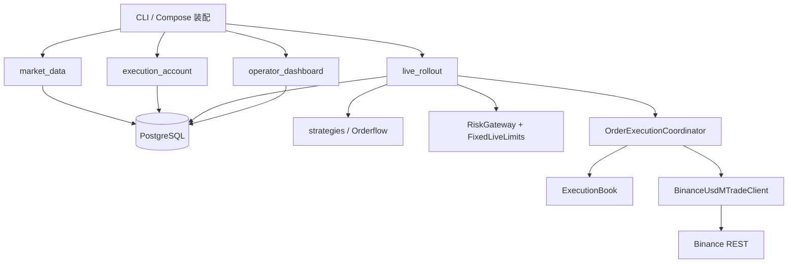
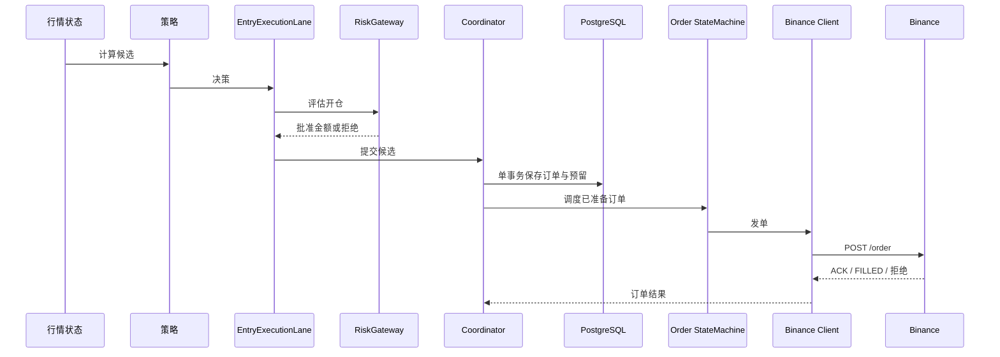

# 系统架构与交易契约

核对日期：2026-10-10。本文集中记录模块职责、Hub 数据流、交易不变量和核心术语；服务器告警及已确认问题见[运维手册](../runbooks/operational-alert-monitor.md)。



`market_data` 提供公共行情，`execution_account` 吸收账户与订单事件，`live_rollout` 为每个账户运行策略和订单编排，`operator_dashboard` 只读 PostgreSQL。不同进程通过 Hub 与 PostgreSQL 交换事实；交易内核不是分布式事务。

边界按数据所有权划分：`market_data` 管规范行情修订，`execution_account` 管交易所账户与订单事实，`live_rollout` 管账户级策略和订单编排。研究使用版本化行情与账本，不执行实盘订单；看板只读，不参与交易准入。

## 下单链路



从行情候选到 POST 的主要职责层为：策略、EntryExecutionLane、RiskGateway、Coordinator、OrderExecutionStateMachine、Client，共 6 层；数据库保存和交易所响应是边界调用。开仓使用一次内存评估与一次数据库终审，避免重复门禁。订单超时不重发，进入原订单反查；后台账户同步和对账只纠正事实，不阻断正常退出。

## 所有者与底线

|对象|唯一职责|
|---|---|
|`EntryExecutionLane`|候选白名单、策略过滤和逐笔释放|
|`RiskGateway`|开仓硬上限；`reduce_only` 退出直接放行|
|`OrderExecutionCoordinator`|同键串行、原子准备、预留和结果交接|
|`ExecutionBook`|成交、批次、预留和恢复投影|
|`BinanceUsdMTradeClient`|签名、发包、明确拒绝和未知网络结果分类|
|账户同步/对账|后台吸收交易所事实并校正本地状态|
|看板与告警|只读、通知和诊断，不参与交易准入|

`reduce_only` 退出不受对账状态、开仓白名单或账户异常通知阻断。5 倍杠杆被拒后尝试 4 倍、3 倍是唯一保留的降档策略。`CapabilityEvaluator`、Shadow、重复围栏、运行期 Git/migration 校验、旧订单身份、旧账户表和旧命令水位重建已删除。

## Hub 与流连续性

```text
Binance 公共行情 → market-data → MarketState15s Hub → 各账户策略
                          └→ PostgreSQL / 研究采集器
Binance 私有 WS / REST → execution-account → AccountEventHub → 本账户交易进程
                                           └→ 持久化账户与成交事实
正式 15m 收盘 WS → 独立退出事件通道 → LiveExitProcessor
```

|服务|内部端口|用途|
|---|---:|---|
|market-data|8766|15 秒状态|
|market-data|8768|实时报价与成交额|
|execution-account|8767|本账户事件|
|execution-account|8769|低频操作推送|

实时策略默认从 Hub 读取行情；PostgreSQL 是显式诊断或恢复来源。正式收盘退出拥有独立 Binance K 线订阅。Hub 使用 epoch、sequence 和有界缓冲；每个消费者有独立 reader，避免策略或数据库工作阻塞 socket。行情缺口清除受影响标的的旧滚动指标并重新预热，不能把有限实时回放说成完整历史。账户流先接收完整快照，再应用 delta；缺口或 epoch 改变后重新取快照。只有提交持久化的事件才能发布为事实。恢复和重连不得阻塞其他健康标的退出。

disable-new-entries、cancel-all-open-entries、request-flatten 先写持久化操作记录，再通过 RiskControlHub 推送 command_id。推送失败仍可读取记录；flatten 被接受不代表交易所仓位已经归零。订单耗时应分段测量候选、准备、请求、响应和成交事实；15 秒桶起点不是信号创建时间。

## 订单与事务

1. 每次提交使用稳定 `client_order_id`；相同身份、相同请求幂等，相同身份、不同载荷冲突。网络超时不能换身份重发。
2. 先在事务中保存订单、意图和预留，再请求交易所。网络请求在事务之外；响应或成交事实另行持久化。
3. 明确未发包或业务拒绝，与“可能已到达交易所”分开。发包后超时、5xx 或无法解析响应属于未知结果；保留原订单反查，不盲目重发或释放占用。
4. `ExchangeOrderRow` 是交易所订单状态权威。命令状态记录本地发送与结算责任；终态但缺实际成交事实时不能提前释放批次责任。
5. 尚未执行的排队请求可取消且不 POST；已经发包的取消不能推断订单不存在。不同标的独立调度，退出和撤单优先。
6. 数量按交易所步长量化，金额和配置硬顶不能因量化向上突破；在途订单计入敞口。

## 成交、批次与退出

同方向追加开仓在平仓订单提交前属于同一批次，之后的新成交进入新批次。数量、成本、身份和剩余预留来自真实成交，不能从账户总量或时间接近度猜测。两笔开仓共用一个退出批次；价格按实际成交数量加权，时间锚点由最新开仓推进，迟到的旧订单成交不改写新锚点。准入按开仓订单身份计数：部分成交及其挂单只算一次，结果未知的订单继续阻止加仓。

提交退出即封闭该批次，不再向它追加；封闭不表示仓位已归零。之后的新开仓属于新批次，旧批次的退出由已持久化订单和预留继续负责。重复成交不重复计量，累计成交水位不回退，旧 ACK 不覆盖已确认终态。数据库提交失败不能发布新的内存事实；重启必须恢复原状态。

旧批次的 `reduce_only` 预留可能仍作用于交易所聚合仓位。宽限到期退出前，若旧订单仍占用该仓位，先确认或撤销原订单责任，再处理剩余数量。正式 15 分钟收盘事件独立驱动退出；跳过最新开仓所在 K 线。宽限限价单关联原批次和首次截止时间，重试不能重置计时；到期先撤单，再对剩余数量请求 `reduce_only` 市价退出，无需等待新行情。

当前默认宽限为 8 根，直接退出阈值 0.001，目标 0.0088。截止时间按持久化 `recovery_exit_started_at + 15m × bars` 计算；应核实实际边界来源，不能将“8 根”解释为额外等到每日定时平仓。具体阈值以完整运行配置为准，见[实盘手册](../runbooks/small-capital-live-session.md)。

恢复检查点格式 4 保存批次内所有开仓订单身份；旧格式缺少证据时不能猜成一笔或直接改版本。升级时需停止旧消费者，依据完整成交事实核对仓位、成本、数量、批次锚点和订单计数；证据不全则禁止新开仓。旧批次订单的撤销责任须在宽限退出中保留。

## 恢复、资源与格式

- 等待覆盖证据不等于身份冲突；恢复按仓位隔离，不能把缺少历史数据改成虚构空仓。
- 后台恢复有独立预算和轮转；慢恢复不能占住其他标的的发单通道。
- 创建资源的装配者负责释放；装配失败、关闭和取消路径都要释放已创建的池与客户端。监控失败不能改变订单执行结果。
- PostgreSQL 是恢复与审计边界；保留期须保护活动批次、未知订单、未完成结算和恢复水位。
- 当前凭证按 read/trade 角色配置；无通用密钥回退。恢复检查点 schema 为 4，账户事实 schema 为 3，Collector 日志和检查点 schema 为 2。旧配置和日志不自动升级。

影子运行、重复准入围栏、运行期 Git/migration 比对、旧账户表恢复、旧订单身份重建和旧命令成交水位重建已退役。实盘收盘退出不回退到普通行情触发的 REST K 线加载。看板和遥测只读，不能拦截退出。

## 核心术语

- **规范行情修订**：每个标的、周期和时间桶选定的权威行情版本。
- **数据集清单**：固定时间范围及其中确切行情修订的输入说明。
- **决策重放**：按记录的输入和结果重建过去决策；使用规范行情的重放可能是反事实分析。
- **开仓订单**：一次独立委托；部分成交仍属于同一订单。
- **持仓批次**：同方向、平仓提交边界前的实际开仓成交集合，共享退出规则。
- **平仓边界**：提交平仓订单的时刻；结束该批次的开仓归属并开始退出责任。
- **追加开仓**：尚未跨过平仓边界时增加的同方向成交，仍归入当前批次。
- **开仓订单数**：批次内不同开仓订单身份数；部分成交只计一次，待成交订单也占用名额。

回归命令及关键行为见[测试说明](../testing/behavior-tests.md)。
