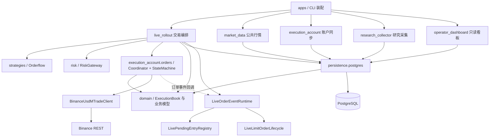

# 当前交易架构

核对：2026-10-04，`3c652c4d` 加本次本地架构简化。本文描述当前结构；待改项见[简化状态](simplification.md)。

## 物理边界与依赖

同一仓库包含多个进程。每个账户的交易编排在单个策略进程内，账户同步和公共行情服务通过 Hub 提供输入。数据库默认是单体 PostgreSQL；不同连接池隔离执行、行情和观测负载。



箭头表示代码依赖；Hub 的输入数据流另见[传输手册](../runbooks/market-state-hub.md)。Client 使用独立执行契约；Submission 使用公共候选工具，不引用 Lane 私有函数。共享上下文和遥测类型已放回契约模块。携带恢复检查点的 AccountFacts 与编码缓存集中在 recovery_models；position_ledger_models 只提供基础仓位值。扫描 349 个源码模块（包含 TYPE_CHECKING）未发现静态模块环。

## 最简单下单流程

```mermaid
sequenceDiagram
    participant Loop as 行情处理
    participant Strategy as Orderflow 策略
    participant Lane as EntryExecutionLane
    participant Submission as LiveCandidateSubmission
    participant Risk as RiskGateway
    participant Coordinator as OrderExecutionCoordinator
    participant DB as PostgreSQL
    participant SM as OrderExecutionStateMachine
    participant Client as BinanceUsdMTradeClient
    participant Exchange as Binance
    Loop->>Strategy: 计算决策
    Loop->>Lane: process()
    Lane->>Submission: execute()
    Submission->>Risk: evaluate()
    Risk-->>Submission: 候选与批准金额
    Submission->>Coordinator: prepare_and_execute()
    Coordinator->>DB: 原子保存本次准备数据
    DB-->>Coordinator: 提交完成
    Coordinator->>SM: submit()
    SM->>Client: submit_order()
    Client->>Exchange: POST order
    Exchange-->>Client: ACK / FILLED
    Client-->>SM: 订单结果
    SM-->>Coordinator: 结果与持久化观察
    Coordinator-->>Submission: 本次执行结果
```

图是公开职责流转，不是固定函数调用计数：一次候选处理还会调用账本、纯函数量化与仓储。ACK 表示订单被接受，FILLED 才表示全部成交；二者均不自动证明批次结算完成。REST 发生在事务提交之后，不与数据库组成原子事务。

## 所有者

|对象|职责|
|---|---|
|EntryExecutionLane|入场资格和候选释放|
|LiveCandidateSubmission|风险评估、计划量化及交给队列|
|RiskGateway|组合 FixedLiveLimits，统一评估候选；开仓上限与量化金额检查|
|OrderExecutionCoordinator|同键排序、准备事务、真实数量预留和结果观察|
|OrderExecutionStateMachine / Client|订单网络生命周期、明确拒绝与未知结果分类|
|ExecutionBook|真实成交、批次分配、幂等身份、预留与恢复投影|
|LiveExitProcessor.handle_trigger|统一退出入口；保持行情、报价、正式收盘及宽限计时语义|
|LiveOrderReconciliation.run_requested|统一后台调度订单、退出和仓位恢复，按任务预算重试|
|监控 / 看板|读状态、通知和诊断；不决定交易准入|

LiveCandidateSubmission 仅暴露 execute：开仓在该入口取得账户/标的生命周期锁，退出由 LiveExitProcessor 持锁覆盖决策、撤单与剩余数量下单。同键订单队列负责网络命令排序和退出优先；StateMachine 不再维护第二把命令串行锁。两种锁范围有实际区别，不合并成一次发包锁。

订单事件直接通知待成交登记表和到期计时器，不持有整个 Daemon。缓存失效和事实版本由 PostgresLiveContextProvider 维护，LiveContextRuntime 只准备预取结果和发布内存视图；预取读取同一 generation。无缓存的函数型输入由 Runtime 维护预取代次。

订单主模型提供交易所状态，Book 将其投影为派发与结算责任。投影失败请求 Book 恢复，不改写成功的交易所结果；终态但缺真实成交的恢复责任仍保留。

正常退出不等待全账户历史对账。尚未确认的同订单结果、真实预留冲突或缺失批次事实仍需恢复，不能通过重复发单消除。具体底线见[执行契约](execution-contracts.md)。

仓储协议统一位于 domain/execution/ports.py。成交量输入由 WebSocketQuoteVolumeProvider 直接维护历史；旧 REST 缓存已删除。正常 RuntimeSession 为 RUNNING；停机仍经过实际资源关闭阶段。Readiness 只保留已接线的预热、开仓控制与行情推进报告，遥测不再维护无消费者的来源追踪旁路。

实盘策略配置直接由 build_live_policy 构建 EffectivePolicy，RuntimePlan 编译包装与虚拟部署元数据已删除。下单方式读取 LiveRuntimeStrategy.entry_order_type；旧包装读取不存在的 market_orders，曾使该处总选择限价。策略配置不注入额外的 20 分钟退出；真实 policy_id 仍用于持久化决策身份。实盘 run 不再接收租约所有者或 migration 参数，四账户 Compose 已同步。

后台恢复器直接持有 ExecutionBook，recover_restored_commands 应用本地持久收据后返回待反查订单；恢复器将它们与未解决订单合并，再统一去重、轮转并限制查询预算。装配不再注入恢复收集回调。OrderExecutionCoordinator 的领域协调器来自唯一账本，始终启用账本的旧开关及不可达分支已删除。

LiveContextRuntime 要求完整 LiveContextReader，由提供者统一负责 generation、invalidate 和 is_current，不兼容纯加载函数。退出账户和逆向 K 线决策阈值在 LiveExitConfig 装配时明确传入，不再由 Daemon 补写私有配置。预热查询和开仓排空等待是必需接口。交易所明确空仓时，定时平仓不会再使用旧本地状态制造退出请求。

仓位分类与批次重建明确接收 environment/account_label；数据库读取方传入自身账户，ManagedLivePosition 保留同一归属，不再默认 primary。订单身份转换要求完整 OrderObservation 字段，不通过缺字段默认值切换到另一套身份。历史事件展开与累计成交合并承担真实历史恢复职责，仍保留。
