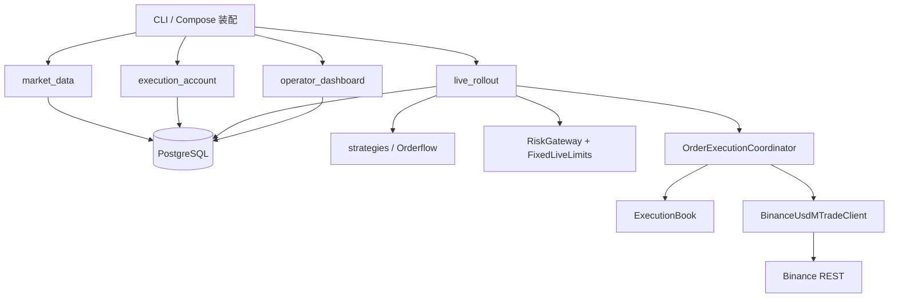
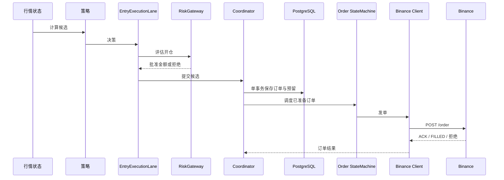

# 当前交易架构

核对日期：2026-10-05。本文描述当前工作树的职责边界；服务器事实见 [故障记录](../diagnostics/incidents.md)。

`market_data` 提供公共行情，`execution_account` 吸收账户与订单事件，`live_rollout` 为每个账户运行策略和订单编排，`operator_dashboard` 只读 PostgreSQL。不同进程通过 Hub 与 PostgreSQL 交换事实；交易内核不是分布式事务。

## 下单链路

从行情候选到 POST 的主要职责层为：策略、EntryExecutionLane、RiskGateway、Coordinator、OrderExecutionStateMachine、Client，共 6 层；数据库保存和交易所响应是边界调用。开仓使用一次内存评估与一次数据库终审，避免重复门禁。订单超时不重发，进入原订单反查；后台账户同步和对账只纠正事实，不阻断正常退出。

## 所有者与底线

|对象|唯一职责|
|---|---|
|`EntryExecutionLane`|候选白名单、策略过滤和逐笔释放|
|`RiskGateway`|开仓硬上限；`reduce_only` 退出直接放行|
|`OrderExecutionCoordinator`|同键串行、原子准备、预留和结果交接|
|`ExecutionBook`|成交、批次、预留和恢复投影|
|`BinanceUsdMTradeClient`|签名、发包、明确拒绝和未知网络结果分类|
|账户同步/对账|后台吸收交易所事实并校正本地状态|
|看板与告警|只读、通知和诊断，不参与交易准入|

`reduce_only` 退出不受对账状态、开仓白名单或账户异常通知阻断。5 倍杠杆被拒后尝试 4 倍、3 倍是唯一保留的降档策略。`CapabilityEvaluator`、Shadow、重复围栏、运行期 Git/migration 校验、旧订单身份、旧账户表和旧命令水位重建已删除。

订单、成交、批次和恢复的精确约束见 [执行契约](execution-contracts.md)。
