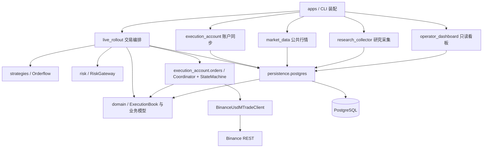

# 当前交易架构

核对：2026-10-04，`f2ffacf6` 加本地未提交修改。本文描述当前结构；待改项见[简化状态](simplification.md)。

## 物理边界与依赖

同一仓库包含多个进程。每个账户的交易编排在单个策略进程内，账户同步和公共行情服务通过 Hub 提供输入。数据库默认是单体 PostgreSQL；不同连接池隔离执行、行情和观测负载。



箭头表示代码依赖；Hub 的输入数据流另见[传输手册](../runbooks/market-state-hub.md)。Client 使用独立执行契约；Submission 使用公共候选工具，不引用 Lane 私有函数。共享上下文和遥测类型已放回契约模块。领域模型的类型依赖仍有待收敛项，不能把 TYPE_CHECKING 引用写成已证实的运行时循环。

## 最简单下单流程

```mermaid
sequenceDiagram
    participant Loop as 行情处理
    participant Strategy as Orderflow 策略
    participant Lane as EntryExecutionLane
    participant Submission as LiveCandidateSubmission
    participant Risk as RiskGateway
    participant Coordinator as OrderExecutionCoordinator
    participant DB as PostgreSQL
    participant SM as OrderExecutionStateMachine
    participant Client as BinanceUsdMTradeClient
    participant Exchange as Binance
    Loop->>Strategy: 计算决策
    Loop->>Lane: process()
    Lane->>Submission: execute_entry() / execute()
    Submission->>Risk: evaluate()
    Risk-->>Submission: 候选与批准金额
    Submission->>Coordinator: prepare_and_execute()
    Coordinator->>DB: 原子保存本次准备数据
    DB-->>Coordinator: 提交完成
    Coordinator->>SM: submit()
    SM->>Client: submit_order()
    Client->>Exchange: POST order
    Exchange-->>Client: ACK / FILLED
    Client-->>SM: 订单结果
    SM-->>Coordinator: 结果与持久化观察
    Coordinator-->>Submission: 本次执行结果
```

图是公开职责流转，不是固定函数调用计数：一次候选处理还会调用账本、纯函数量化与仓储。ACK 表示订单被接受，FILLED 才表示全部成交；二者均不自动证明批次结算完成。REST 发生在事务提交之后，不与数据库组成原子事务。

## 所有者

|对象|职责|
|---|---|
|EntryExecutionLane|入场资格和候选释放|
|LiveCandidateSubmission|风险评估、计划量化及交给队列|
|RiskGateway|组合 FixedLiveLimits，统一评估候选；开仓上限与量化金额检查|
|OrderExecutionCoordinator|同键排序、准备事务、真实数量预留和结果观察|
|OrderExecutionStateMachine / Client|订单网络生命周期、明确拒绝与未知结果分类|
|ExecutionBook|真实成交、批次分配、幂等身份、预留与恢复投影|
|LiveExitProcessor.handle_trigger|统一退出入口；保持行情、报价、正式收盘及宽限计时语义|
|LiveOrderReconciliation.run_requested|统一后台调度订单、退出和仓位恢复，按任务预算重试|
|监控 / 看板|读状态、通知和诊断；不决定交易准入|

正常退出不等待全账户历史对账。尚未确认的同订单结果、真实预留冲突或缺失批次事实仍需恢复，不能通过重复发单消除。具体底线见[执行契约](execution-contracts.md)。
