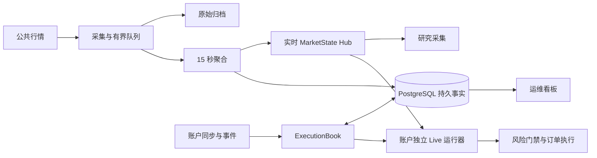

# 数据结构、I/O 与运行架构审查（2026-09-29）

本轮结论：最值得验证和优化的是“每次增量输入重复处理历史全量”的路径。增加线程、连接池或引入树结构，不能直接解决这一类工作量放大。

审查基线为本地 HEAD `dfa35e39e2f15da5ab85e82ec60b63b0eecc5ebb`。审查当前受 Git 管理的行情、执行账本、运行上下文与持久化代码；不是全仓库无遗漏证明。没有连接服务器、修改生产逻辑、部署或运行交易。旧文档中的服务器快照不作为当前线上证据。忽略目录中的本地研究程序不作为这个提交的缺陷。

## 运行结构与已有保护

已有合理设计：Hub 集中分发行情；聚合桶截止时间已经使用最小堆；采集队列有容量与背压；上下文有缓存、失效代次和有限预取；检查点写入在后台合并；空账户跳过 Book 读取；持仓视图有 revision/cut 缓存。建议保留这些机制，优化它们尚未覆盖的重复工作。

## 1. 首要问题：增量事实触发全历史逐条 SQL

证据链：

- [ExecutionBook.observe](../../src/crypto_momentum_lab/domain/execution/execution_book.py#L2926) 获取完整 `read_cut()`，交给 `persist_facts`。
- [事务适配器](../../src/crypto_momentum_lab/persistence/postgres/execution_unit_of_work.py#L184) 将完整 facts 交给 journal store。
- [journal store](../../src/crypto_momentum_lab/persistence/postgres/account_journal_store.py#L94) 枚举事件，逐条编码、哈希、构造 INSERT，然后逐条 `await session.execute`。
- [_fact_event_specs](../../src/crypto_momentum_lab/persistence/postgres/account_journal_store.py#L574) 枚举 fills、snapshots、boundaries 等历史，并生成 facts_state。`ON CONFLICT DO NOTHING` 避免重复行，却没有避免重复编码、传输、执行和索引检查。

设单仓当前保留 H 个事实，一次新事实的持久化调用量仍为 O(H)，而不是 O(新增事实数)。如果连续增加事实且没有压缩，累计工作可达到 O(N²)。这是客户端调用和算法结构的结论，尚未测量生产 PostgreSQL 的总耗时、WAL 或磁盘负载。真正空仓的快速路径会绕过该逻辑，不能把问题描述为所有账户每条消息都触发。

| 方案 | 改善 | 保留的问题/验证要求 |
|---|---|---|
| A：分块批量 INSERT | 将 H 次执行降为约 ceil(H/B) 次；改动较局部 | 仍编码和哈希完整历史；需保持幂等键、冲突事实和事务原子性 |
| B：Journal 输出新增事实 delta | SQL 写入次数与新增事实量相关 | 重试、迟到事实、修订冲突、epoch 切换、coverage/provenance 与事实提交须在同一事务 |
| C：验证检查点 + 后缀事实 | 缩小恢复与投影规模 | 必须支持历史 cut、迟到事实和保留水位；不能直接截断历史 |

建议先用 A 做低风险对照，同时设计 B；C 是恢复协议工程，不能用“保留最近几条”代替。

最小横向实验调用真实 store，使用 recording session 代替 PostgreSQL，构造 N 条 fills + 1 条 facts_state，并模拟所有行已经存在：

| fills | 当前单条 INSERT execute 次数 | 500 行一批的原型 execute 次数 |
|---:|---:|---:|
| 100 | 101 | 1 |
| 1,000 | 1,001 | 3 |
| 10,000 | 10,001 | 21 |

三组均验证 baseline、批量原型与预期数据的绑定行总数、顺序及内容摘要一致。这验证客户端提交内容和调用数量，不验证 PostgreSQL 约束/事务行为，不声称数据库延迟加速 476 倍。样例未包含 checkpoint、coverage 或迟到冲突分支。

delta 写入也不会自动消除完整 facts hash 与投影的 CPU 成本。若以后用持久化树/分块摘要实现结构共享和增量校验，必须明确摘要协议版本与迁移；Merkle 根不能直接替换当前序列化内容的 hash 而仍声称版本身份相同。先减少 SQL 往返，再测这些成本是否成为主要瓶颈。

## 2. 同一执行模块内：同步深拷贝与全局锁放大历史成本

[`_staged_copy`](../../src/crypto_momentum_lab/domain/execution/execution_book.py#L626) 深拷贝目标仓位的 Book 和 Journal，同时复制多个全局字典/集合。它是在 async 调用路径中同步运行的。[_mutation_lock](../../src/crypto_momentum_lab/domain/execution/execution_book.py#L622) 忽略 position key，返回本 ExecutionBook 实例的全局锁，锁还覆盖后续事务。这会让同一实例中的其他仓位等待；不意味着不同账户进程共享一把锁。

[record_snapshot](../../src/crypto_momentum_lab/domain/execution/account_journal.py#L190) 追加历史；`set_recovery_checkpoint` 设置检查点但不自动清空这些列表。已有单仓复制优化避免了深拷贝整个账户，但没有消除单仓历史增长的成本。

本地真实 `_staged_copy`，7 次顺序执行取中位数，合成快照、无数据库：

| 单仓快照数 | 单次复制 |
|---:|---:|
| 100 | 1.1175 ms |
| 1,000 | 11.6735 ms |
| 10,000 | 120.7213 ms |

这不是服务器 P99。同步 CPU 工作会占用事件循环线程，因而可能同时延迟其他协程；这一机制见 [Python asyncio 官方说明](https://docs.python.org/3/library/asyncio-dev.html#running-blocking-code)。

可选方案：A，专门实现事务候选拷贝，只复制可变容器，不复制派生视图缓存；B，将已提交事实改为真正不可变的数据，事务仅保存增量，提交后原子发布；C，长期按仓位划分状态与提交范围，再考虑锁分片。仅把锁换成 per-key lock 不安全：现在提交会发布多个全局集合，两个并发候选可能覆盖彼此结果。简单把 deepcopy 移入线程也不能减少总工作量，且需要明确线程读取的状态一致性。

实验中的“仅复制容器”原语很快，但**不作为可上线等价方案**：快照虽是 frozen dataclass，`raw_payload` 仍是可变字典。必须先建立嵌套不可变或所有权约束。

## 3. 行情热路径：每条消息扫描全部已观察标的

[`_observe`](../../src/crypto_momentum_lab/market_data/runtime_states.py#L586) 每个成功归一化事件调用 `_materialize_empty_buckets_through`。[实现](../../src/crypto_momentum_lab/market_data/runtime_states.py#L728) 每次排序 `_observed_symbol_keys`，对每个标的检查补桶；即使没有新桶到期也执行。启动代码设置 expected symbols，因此不是仅在未启用配置下存在的死路径。

设输入速率 R，已观察标的数 S，常态开销含 O(R·S log S)；退出当前池的标的仍可留在 observed 集合中，虽然 dense 检查会拒绝补桶，扫描成本仍在。

| 方案 | 数据结构与复杂度 | 适用与约束 |
|---|---|---|
| A：按 watermark 桶边界触发扫描 | 同一边界内 O(1) 门禁，每次边界推进再 O(S log S) | 最小改动候选；标的池变动、首次出现与重入必须失效门禁 |
| B：每标的 next_due 最小堆 | 无到期工作时 O(1) 查看堆顶，到期 K 个约 O(K log S) | 适合稀疏到期；generation/tombstone 处理池变动与陈旧堆项 |
| C：15 秒时间轮/桶队列 | 按到期桶处理标的 | 当前统一周期适合；跳时、长缺口和重入逻辑更复杂 |

倾向先验证 A；B/C 不应只因为“用了树/ACM 算法”就被认为更好。现有 `_realtime_deadlines`、`_durable_deadlines` 已经用堆做关闭调度，问题是补空桶检查的触发粒度。

最小对照调用真实补桶函数，先让 baseline 与桶门禁原型各补一个桶，比较 accumulators、每标的游标和两个截止堆，然后测量同一 watermark 下重复调用的常态无新增工作分支：

| 已观察标的数 | 当前扫描，平均每次 | 桶门禁原型，平均每次 |
|---:|---:|---:|
| 100 | 66.720 μs | 0.671 μs |
| 500 | 368.493 μs | 0.685 μs |
| 1,000 | 781.060 μs | 0.827 μs |

此处是单次循环内多次调用的均值，不是前述 7 次中位数。各组前后状态比较通过；不包括 normalization、完整 observe、池变化、网络和持久化。不能把这个局部常态路径的加速比外推为整个行情系统加速比，也没有测量真实输入速率。最小堆和时间轮目前仅作设计候选，未实现或跑分。

必须比较有序输出的完整状态与时间戳，覆盖无事件、迟到/恢复事件、池退出重入和 watermark 跨多个桶；只比较“生成条数相同”不足以证明可替换。

## 4. 有持仓时，读取范围仍是所有历史仓位

[`_with_execution_book`](../../src/crypto_momentum_lab/live_rollout/postgres_runtime.py#L585) 空仓会直接返回，且同 bucket 有缓存；但非空时调用 [`list_position_views`](../../src/crypto_momentum_lab/domain/execution/execution_book.py#L1643)，排序并逐个读取该账户的全部已建立 Book，随后才按真实账户持仓过滤。

注意：多数最新视图有内存缓存，因此**不能把它直接称作每次 N 条 SQL**。当指定 event_cut 早于当前视图时，[read](../../src/crypto_momentum_lab/domain/execution/execution_book.py#L1585) 才会进入 durable historical cut 读取，并新建历史 PositionBook。

本地 warm cache、无 DB、一个目标 scope，7 次中位数：

| 历史 scopes | 现有全量读取 | 已知 scope 定点读取 |
|---:|---:|---:|
| 10 | 0.0543 ms | 0.0047 ms |
| 100 | 0.5013 ms | 0.0045 ms |
| 1,000 | 6.1236 ms | 0.0058 ms |

两者只校验目标 scope 的视图一致，不声称整个函数输出等价。全量扫描还承担 Book-only drift 诊断，不能直接删去。

方案 A：交易路径用账户当前持仓 identity 集合做定点查询，漂移全扫描独立周期运行；账户身份必须包含 environment/account/symbol/position_side。方案 B：Book 维护活跃仓位索引，随事实提交事务性更新，并定期对账。方案 C：确需多仓历史 cut 时批量读取事实再投影，限制并发。优先 A，保留原有 unmanaged position 保护和不确定账户视图下的失败关闭行为。

## 验证范围与下一轮比较

复现实验位于本地 `reports/performance-audit-20260929/`（此目录被仓库忽略）。`benchmark_execution.py`、`execution-results.json` 包含上述真实函数微基准与结果。运行环境：macOS arm64，Python 3.13.3。顺序重复计时用于减少不同方案互相争抢 CPU；独立审查任务并行进行。

`persist_facts_sql_count.py` 与同名 `.json` 为持久化对照实验。两份脚本均可在仓库根目录使用 `rtk proxy env PYTHONPATH=src .venv/bin/python reports/performance-audit-20260929/<脚本名>` 复现；execution 脚本输出到 stdout，SQL 脚本同时重写自己的 JSON 结果文件。

`dense_fill_bench.py` 与同名 `.csv` 为行情补桶对照；同样用 `PYTHONPATH=src` 运行。CSV 另有 2,000/5,000 标的压力规模，仅作复杂度验证，不代表生产标的数。

已有定向测试：`test_authority_book_reads.py`、`test_hub.py`、`test_context_prefetch.py` 合计 28 passed、1 skipped；跳过项要求本地 loopback socket 权限。它们验证当前基础契约，不验证尚未实施的替代方案，也不是全量测试或数据库集成测试。

下一轮的上线判断应使用部署版本和真实规模：单仓事实数、每次 observation 的 SQL 次数、锁等待/持锁时间、事件循环 lag、行情输入速率和 dense 扫描次数，以及端到端处理延迟。数据库方案需要真实 PostgreSQL 上事务回滚、并发冲突、恢复重放验证。索引修改应基于实际查询计划；不能因为查询慢就直接新增 B-tree。复合索引依赖过滤条件与列序，见 [PostgreSQL 官方说明](https://www.postgresql.org/docs/current/indexes-multicolumn.html)。

建议实施优先级：账本 SQL 批写与增量写协议 → 事务候选复制 → dense 调度 → 持仓读取范围。实际资源画像若显示行情 CPU 更紧张，可把 dense 调度提前；此处没有生产观测，不能宣称已经知道唯一最佳方案。
