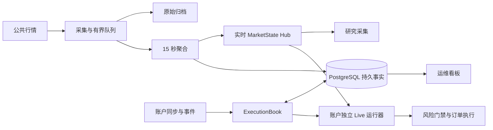

# 数据结构、I/O 与运行架构审查（2026-09-29）

本轮复核结论：四项候选都已实现。账本持久化只发送新增的 append-only 事实（delta），首次全量写入仍按 500 条分块；行情补空桶用 watermark 门禁跳过同桶扫描；事务候选改为容器级拷贝、共享冻结事实；有持仓时只读取当前敞口 scope，Book-only 漂移扫描改为独立周期运行。每项剩余的 O(history) 成本或语义约束见对应章节。

首轮审查基线是 `dfa35e39e2f15da5ab85e82ec60b63b0eecc5ebb`；复核起点 HEAD 为 `91395f54c19fa10564971fca903d03affbcd8a6b`，本轮修复实现基于其后的 `6aac14a`。审查受 Git 管理的行情、执行账本、运行上下文、持久化与前端看板代码；不是全仓库无遗漏证明。未部署、未运行交易，未修改任何生产数据。生产侧核对以只读为主（部署版本、容器状态与库统计）；另外在生产主机上用独立的临时 `postgres:16-alpine` 容器和一份跑完即删的代码副本跑过一遍 `tests/integration/persistence`（结果与本地相同），全程未接触生产库。

## 运行结构与已有保护

已有合理设计：Hub 集中分发行情；聚合桶截止时间已经使用最小堆；采集队列有容量与背压；上下文有缓存、失效代次和有限预取；检查点写入在后台合并；空账户跳过 Book 读取；持仓视图有 revision/cut 缓存。建议保留这些机制，优化它们尚未覆盖的重复工作。

## 1. 已解决：账本增量持久化（append-only delta）

[AccountJournal](../../src/crypto_momentum_lab/domain/execution/account_journal.py#L52) 现在跟踪“自上次成功持久化以来记录的 append-only 事实”，即 [pending_fact_delta](../../src/crypto_momentum_lab/domain/execution/account_journal.py#L393)：fills、snapshots、exit boundaries。这些事实记录后不会改变，重复发送整个历史是纯粹的重复客户端工作。

写入路径：

- [ExecutionBook.observe](../../src/crypto_momentum_lab/domain/execution/execution_book.py#L2579) 在事务内取 `journal.read_cut()`（完整 facts，供投影与状态行）并连同 `delta=journal.pending_fact_delta()` 交给 [事务适配器](../../src/crypto_momentum_lab/persistence/postgres/execution_unit_of_work.py#L184)。
- [journal store](../../src/crypto_momentum_lab/persistence/postgres/account_journal_store.py#L60) 的 `_fact_event_specs` 只在 append-only 类别上使用 delta；`facts_state`、coverage、checkpoint、cursor/load provenance、conflicts、integrity issues 仍来自完整 facts，因此状态行保持完整。
- 事务提交并发布候选后，[_publish_candidate](../../src/crypto_momentum_lab/domain/execution/execution_book.py#L696) 调用 `mark_facts_persisted()` 清空 delta。回滚的候选不会被发布，因此其 pending 保留并在下次观察时重发；`ON CONFLICT DO NOTHING` 使重发幂等，不会丢事实。没有持久化事务（内存模式）时也会清空，避免无界增长。

提交 `13f29a3` 已将 SQL 执行次数从 H 降至约 ceil(H/500)；本次把每次观察的写入量从 O(H) 降到 O(新增事实 + 状态行)。

| 方案 | 状态与保留问题 |
|---|---|
| A：分块批量 INSERT | **已实现**（chunk size 500），仍是首次全量写入的路径 |
| B：Journal 输出新增事实 delta | **已实现**（append-only 类别）。重试/迟到事实/epoch 切换/coverage 与事实提交仍在同一事务内 |
| C：验证检查点 + 后缀事实 | 未实现；缩小恢复与投影规模，仍需支持历史 cut、迟到事实和保留水位 |

**仍然存在的 O(H) 成本，不能读成“只剩小尾巴”**：每次观察都要 `read_cut()` 重建完整 facts（投影需要）、调用 `compute_facts_hash()` 作为 `facts_state` 的 event_id，并且 [_max_fact_time](../../src/crypto_momentum_lab/persistence/postgres/account_journal_store.py#L1007) 每次都会再遍历一遍全部 fills/snapshots/boundaries；冲突/issue 行也仍是全量。delta 消除的是历史事件的行构造、编码与 SQL 传输，不是完整 facts 摘要本身。

本机 `readcut_probe.py`（合成 fills，每轮让 `_cached_facts_none` 失效以模拟新事实到达，7 次取中位数）：

| fills | 摘要（修复前） | 摘要（规范化缓存后） | 修复前单仓 deepcopy | 当前容器拷贝 |
|---:|---:|---:|---:|---:|
| 100 | 1.29 ms | 0.29 ms | 1.12 ms | 0.003 ms |
| 1,000 | 13.46 ms | 2.68 ms | 11.67 ms | 0.005 ms |
| 10,000 | 134.79 ms | 28.05 ms | 120.7 ms | 0.028 ms |

（snapshots 口径同量级：10,000 条 142.87 → 26.66 ms。）

deepcopy 与摘要两组数字口径不同（前者来自 `benchmark_execution.py` 的合成 snapshots，后者是合成 fills 的 `read_cut` 重建加摘要），但同机、同量级可比。这两组同量级的成本现在都被压了下去：deepcopy 由容器级拷贝消除，摘要由规范化缓存（提交 `236bf07`）压到约五分之一 —— profile 显示主导项是 canonical 遍历（10k 条约 0.16 s）与逐元素 `json.dumps`（约 0.05 s），排序只有约 0.01 s，SHA-256 更小；缓存同时把 `fields()` 反射按类型 memo 掉（探针 `facts_hash_profile.py`）。10,000 条事实时一次观察因此约从 **255 ms（deepcopy 120.7 + 摘要 134.8）降到约 28 ms**。按线上规模（单仓事实数见下）外推，摘要落在亚毫秒量级；**仍然保留**的 O(H) 项是 `_max_fact_time`（每次写入仍遍历全部事实）、排序（O(H log H)）与最终的 SHA-256。容器拷贝一列波动较大（100 条处多次运行在 0.003–0.019 ms 之间），但始终比另两列小几个数量级。

**线上规模核对（生产库只读查询，2026-09-29）**：`position_fact_journal_events` 共 20,632 行、6,685 个 scope；构成是 `facts_state` 10,314 + `snapshot` 10,307 + `fill` 9 + `integrity_issue` 2，每 scope 中位 2 行、最大 274 行。`pk_position_fact_journal_events (event_record_id)` 唯一索引存在，说明 delta 依赖的 `ON CONFLICT DO NOTHING` 幂等前提在线上成立。

这同时校正了上表的适用范围：10,000 条事实是压力外推，线上单仓历史最多 274 行，所以 delta 在**当前**线上规模每次观察少发送的是“最多数百行”；`snapshot` 与 `facts_state` 各占约一半，说明重复发送的主要对象正是快照，而 `facts_state`（每次观察一行、与观察次数同阶）无论如何都要写。只有单仓历史继续增长，§1 消除的 O(H) 客户端成本才会成为主要矛盾。

若以后用持久化树/分块摘要实现结构共享和增量校验，必须明确摘要协议版本与迁移；Merkle 根不能直接替换当前序列化内容的 hash 而仍声称版本身份相同。生产 PostgreSQL 的端到端耗时、WAL 与磁盘负载仍未测量。

最小横向实验调用真实 store，使用 recording session 代替 PostgreSQL，构造 N 条 fills + 1 条 facts_state，并模拟所有行已经存在：

| fills | 修复前单行方案 | 当前实现（首次全量） | 等价分块原型 | 后续观察（delta） |
|---:|---:|---:|---:|---:|
| 100 | 101 | 1 | 1 | 1 次 execute / 2 行 |
| 1,000 | 1,001 | 3 | 3 | 1 次 execute / 2 行 |
| 10,000 | 10,001 | 21 | 21 | 1 次 execute / 2 行 |

本次 recording-session 实验调用当前 store，并与重建的修复前单行方案、等价分块原型比较。三组的绑定行总数、顺序及内容摘要相同；后续观察一列只写入“1 条新 fill + 1 条 facts_state”，与历史规模无关。它验证当前客户端调用数量，不验证 PostgreSQL 约束/事务行为，也不声称数据库延迟加速 476 倍。样例未包含 checkpoint、coverage 或迟到冲突分支。

新增单测：`tests/unit/execution/test_journal_fact_delta.py` 覆盖 delta 累积/清空、候选隔离、重复 fill 不入队、drained delta 只写状态行、无 delta 时保持全量写、重试重发，以及 `ExecutionBook.observe` 连续两次观察只发送各自的新增事实。

## 2. 已解决主要部分：事务候选改为容器级拷贝

[`_staged_copy`](../../src/crypto_momentum_lab/domain/execution/execution_book.py#L638) 不再深拷贝目标仓位的 Book 和 Journal：它调用 [AccountJournal.copy_for_transaction](../../src/crypto_momentum_lab/domain/execution/account_journal.py#L358) 与 [PositionBook.copy_for_transaction](../../src/crypto_momentum_lab/domain/execution/position_book.py#L99)，只重建可变容器（`_fills_by_id`、`_snapshots`、`_boundaries`、`_conflicts`、`_fact_conflicts`、`_integrity_issues`、`_late_trade_ids`、`_view_cache`），共享记录后不再就地修改的冻结事实对象，并让候选 Book 指向候选 Journal。其余全局字典/集合的复制保持不变。

[`_mutation_lock`](../../src/crypto_momentum_lab/domain/execution/execution_book.py#L634) 仍然忽略 position key，返回本 ExecutionBook 实例的全局锁，锁还覆盖后续事务。这会让同一实例中的其他仓位等待；不意味着不同账户进程共享一把锁。本轮只消除了同步深拷贝，没有改变锁粒度。

[record_snapshot](../../src/crypto_momentum_lab/domain/execution/account_journal.py#L192) 追加历史；`set_recovery_checkpoint` 设置检查点但不自动清空这些列表。这些容器现在按事务候选重建，因此候选追加不再触发整仓深拷贝。

本地真实 `_staged_copy`，7 次顺序执行取中位数，合成快照、无数据库（同一脚本、同一机器）：

| 单仓快照数 | 修复前 | 当前实现 |
|---:|---:|---:|
| 100 | 1.1175 ms | 0.0091 ms |
| 1,000 | 11.6735 ms | 0.0078 ms |
| 10,000 | 120.7213 ms | 0.0180 ms |

这不是服务器 P99。消除的是每次 mutation 在事件循环线程上同步执行的 O(历史) 拷贝；这一机制见 [Python asyncio 官方说明](https://docs.python.org/3/library/asyncio-dev.html#running-blocking-code)。

容器重构本身仍是 O(历史)：只复制容器指针、不深拷贝事实对象。同一探针测得容器复制仍随历史增长（同机 1,000→10,000 条事实：约 0.005→0.028 ms，`readcut_probe.py`），常数极小但在长历史下仍会增长。全局 mutation lock 也仍然存在，未改动。

**共享所有权约束（目前是约定 + 测试，不是类型强制）**：事实对象（fill、snapshot、boundary、coverage、checkpoint）均为 frozen dataclass，记录之后仓库内没有就地写入路径（已核对 `raw_payload` / `details` 上不存在 `[key] =`、`update`、`setdefault` 等写法）。`raw_payload` 本身仍是可变 `dict`，所以这条约束由回归测试锁定：`test_staged_copy_shares_frozen_facts_without_leaking_candidate_writes` 断言候选写入不会改变已发布的 facts、facts hash、revision 与视图；`benchmark_execution.py` 同时断言容器不共享、事实内容相等且共享是有意的。任何将来对事实对象的就地修改都会破坏事务隔离。

| 方案 | 状态与约束 |
|---|---|
| A：事务候选只复制可变容器 | **已实现**；事实对象共享，派生视图缓存只复制映射 |
| B：已提交事实改为真正不可变 + 增量事务 | 未实现；可同时去掉全局锁，但需要嵌套不可变（`raw_payload`）或所有权类型 |
| C：按仓位划分状态与提交范围 | 未实现；仅把锁换成 per-key lock 不安全：提交会发布多个全局集合，两个并发候选可能覆盖彼此结果 |

## 3. 部分解决：同桶扫描已门禁，补桶前驱查找的二次项已修复

[`_observe`](../../src/crypto_momentum_lab/market_data/runtime_states.py#L586) 仍对每个成功归一化事件调用 `_materialize_empty_buckets_through`。当前实现在 [补桶方法](../../src/crypto_momentum_lab/market_data/runtime_states.py#L732) 记录已扫描到的 watermark 桶；同一桶内立即返回。expected-symbol 集合改变或首次观察新标的时会使门禁失效。提交 `93b2919` 已加入实现及失效处理，单元测试覆盖重复 watermark、成员变化和新标的。

目前同一 watermark 桶内每条后续事件为 O(1) 门禁检查；watermark 桶推进时仍需排序和检查所有已观察标的，约 O(S log S)。已退出池的 observed 标的仍会参与该次扫描。此为每桶一次的工作，已不再随桶内每条行情重复。

**补桶前驱查找的二次项（本次修复）**：[`_previous_state_for_symbol`](../../src/crypto_momentum_lab/market_data/runtime_states.py#L797) 要为某个标的找上一个桶时，会遍历 `_accumulators_by_bucket` 的全部条目；而 [`_materialize_buckets_until`](../../src/crypto_momentum_lab/market_data/runtime_states.py#L764) 的 `while` 循环**每个新桶都调用它一次**。于是一次水位推进若补 B 个桶、当时已有 T 个桶，成本是 **O(B×T)** —— 长缺口、重启恢复、新标的加入都会放大它。watermark 门禁只消除同一桶内的重复扫描，完全不触及这一项。

本机 `bucket_lookup_probe.py`（调用真实补桶函数，统计该查找内部遍历过的条目数），修复前：

| 标的数 | 桶/标的 | 新增桶 | 前驱查找次数 | 扫描条目 | 耗时 |
|---:|---:|---:|---:|---:|---:|
| 100 | 4 | 400 | 400 | 79,800 | 7.74 ms |
| 200 | 4 | 800 | 800 | 319,600 | 24.40 ms |
| 400 | 4 | 1,600 | 1,600 | 1,279,200 | 80.73 ms |
| 35 | 20 | 700 | 700 | 244,650 | 20.82 ms |
| 35 | 80 | 2,800 | 2,800 | 3,918,600 | 248.70 ms |

最后两行按线上标的数（`monitoring_symbols=35`）取值：**20 分钟缺口对应单次 248.70 ms 的同步阻塞**，与线上观察到的部署/重启恢复形态一致，不是理论担忧。

修复（提交 `4ac51ea`）：只对首个新桶做一次前驱查找，循环内把刚激活（或已存在）的那个桶作为下一桶的前驱。修复后同一组场景：

| 标的数 | 桶/标的 | 新增桶 | 前驱查找次数 | 扫描条目 | 耗时 |
|---:|---:|---:|---:|---:|---:|
| 100 | 4 | 400 | 100 | 19,800 | 4.69 ms |
| 400 | 4 | 1,600 | 400 | 319,200 | 36.79 ms |
| 35 | 20 | 700 | 35 | 11,900 | 7.76 ms |
| 35 | 80 | 2,800 | 35 | 47,600 | 30.26 ms |

查找次数从 O(桶数) 降到 O(标的数)；跳桶与逐桶两条路径产出完全相同的 accumulators、每标的游标与两个截止堆（`test_one_jump_fill_matches_bucket_by_bucket_fill`），另有 `test_materializing_many_buckets_looks_up_predecessor_once_per_symbol` 锁定查找次数。**仍保留**：每个标的每批仍有一次全表扫描（O(标的数 × 桶总数)），彻底消除需要按标的维护桶索引（账户+symbol → 有序桶），尚未实现。

| 方案 | 数据结构与复杂度 | 适用与约束 |
|---|---|---|
| A：watermark 桶门禁 | **已实现**；同桶 O(1)；补桶前驱查找的二次项已修复，降为每标的每批一次查找 | 门禁失效规则与查找次数均有测试 |
| B：每标的 next_due 最小堆 | 无到期工作时 O(1)，到期 K 个约 O(K log S) | 不解决前驱查找；需处理池变化与陈旧堆项 |
| C：15 秒时间轮/桶队列 | 按到期桶处理标的 | 当前统一周期适合；跳时、长缺口和重入逻辑更复杂 |

现有 `_realtime_deadlines`、`_durable_deadlines` 已经用堆做关闭调度；同桶重复扫描也已通过水位游标消除。是否用 B/C 替代每桶全量扫描，取决于线上 S 与事件循环耗时，而不是数据结构本身。

最小对照用真实补桶函数比较修复前全量扫描与当前门禁。两边先各补一个桶，再比较 accumulators、每标的游标和两个截止堆；状态完全相同后测重复调用：

| 已观察标的数 | 修复前全量扫描 | 当前实现 |
|---:|---:|---:|
| 100 | 87.737 μs | 2.374 μs |
| 500 | 573.128 μs | 0.760 μs |
| 1,000 | 951.414 μs | 0.785 μs |

此处是单次循环内多次调用的均值，不是服务器结果。各组状态比较通过；不包括 normalization、完整 observe、池变化、网络和持久化。不能把局部常态路径的比例外推为系统整体加速比。最小堆和时间轮仍只是候选，未实现或跑分。

若继续替换每桶全量扫描，仍须比较完整状态和时间戳，覆盖无事件、迟到/恢复事件、池退出重入和 watermark 跨多个桶。

## 4. 已解决：有持仓时只读取当前敞口 scope

[`_with_execution_book`](../../src/crypto_momentum_lab/live_rollout/postgres_runtime.py#L585) 空仓会直接返回，且同 bucket 有缓存；非空时不再读取该账户的全部已建立 Book，而是把账户当前持仓 symbol 集合传给 [`list_position_views`](../../src/crypto_momentum_lab/domain/execution/execution_book.py#L1689) 的 `symbols` 过滤器，只投影仍可能代表当前敞口的 scope，随后才按真实账户持仓过滤。账户快照缺失时过滤器被丢弃（`symbols=None`），仍读取全部 scope，保留不确定账户视图下的失败关闭行为。

**减少的是投影，不是遍历**：`list_position_views` 仍然遍历该实例全部已加载的 `_books`，只是对不匹配的 symbol 直接 `continue`（不做投影、不做 historical cut 读取）。命中 scope 的读取也是**串行** `await read(...)`（原实现同样串行，本次未改），因此持仓 symbol 数一多，串行投影仍是下一个瓶颈。除每次 bucket 的定点读取之外，Book-only 漂移扫描按 300 秒一次做完整读取，属于刻意保留的诊断路径。

注意：多数最新视图有内存缓存，因此**不能把它直接称作每次 N 条 SQL**。当指定 event_cut 早于当前视图时，[read](../../src/crypto_momentum_lab/domain/execution/execution_book.py#L1585) 才会进入 durable historical cut 读取，并新建历史 PositionBook；定点读取把这一步从“每个历史 scope”限制到“每个持仓 symbol”。

本地 warm cache、无 DB、一个目标 scope，7 次中位数：

| 历史 scopes | 现有全量读取 | 已知 scope 定点读取 |
|---:|---:|---:|
| 10 | 0.0543 ms | 0.0047 ms |
| 100 | 0.5013 ms | 0.0045 ms |
| 1,000 | 6.1236 ms | 0.0058 ms |

这两组数字来自同一台机器上的旧微基准，`read` 段这次未重新测量（脚本的 read 段仍是“`list_position_views` 全量 vs `read` 单 scope”对照）。定点路径的实际收益取决于持仓 symbol 数与历史 scope 数之比，不是固定倍数。

Book-only drift 诊断没有删除，而是移到独立周期：[`_observe_book_drift`](../../src/crypto_momentum_lab/live_rollout/postgres_runtime.py#L675) 首次调用即做一次全账户扫描，之后按 `_BOOK_DRIFT_SCAN_INTERVAL_SECONDS`（默认 300 秒）节流。因此 `stale_book_symbols` 告警从“每个 bucket”变为“首次 + 每 5 分钟”。`unmanaged_position_symbols` 的计算不依赖全量读取，语义未变。

新增测试：`test_list_position_views_narrows_the_read_to_requested_symbols`、`test_execution_book_reads_only_current_exposure_scopes`（含 drift 节流断言）、`test_execution_book_reads_all_scopes_without_an_account_snapshot`（账户快照缺失时仍全量读取）。原有 `test_execution_book_reports_stale_positions_only_when_set_changes` 与 `test_execution_book_does_not_manage_position_absent_from_account_view` 继续通过。

方案 B/C 未实现：Book 维护活跃仓位索引（随事实提交事务性更新并定期对账），以及多仓历史 cut 时批量读取事实再投影并限制并发。

## 验证范围与下一轮比较

复现实验位于本地 `reports/performance-audit-20260929/`（此目录被仓库忽略）。`benchmark_execution.py`、`execution-results.json` 包含 `_staged_copy` 和仓位读取微基准；`_staged_copy` 已在本次修复中改为容器级拷贝，脚本断言同步更新，`read` 段仍是全量 vs 单 scope 对照。运行环境：macOS arm64，Python 3.13.3。顺序重复计时用于减少不同方案互相争抢 CPU。

`persist_facts_sql_count.py` 与同名 `.json` 为持久化对照实验；它比较当前真实 store、修复前单行方案和等价批写原型，并额外记录“后续观察只传 delta”的 execute 次数与行数。两份脚本均可在仓库根目录使用 `rtk proxy env PYTHONPATH=src .venv/bin/python reports/performance-audit-20260929/<脚本名>` 复现；execution 脚本输出到 stdout，SQL 脚本同时重写自己的 JSON 结果文件。

`dense_fill_bench.py` 与同名 `.csv` 为修复前全量扫描和当前 watermark 门禁的对照；同样用 `PYTHONPATH=src` 运行。CSV 另有 2,000/5,000 标的压力规模，仅作复杂度验证，不代表生产标的数。

`bucket_lookup_probe.py` 复现第 3 节的补桶前驱查找计数与耗时（`PYTHONPATH=src .venv/bin/python reports/performance-audit-20260929/bucket_lookup_probe.py`），同样只用合成数据、不连数据库。

`readcut_probe.py` 量化 delta 之后仍留在每次观察上的 O(历史) 成本：`read_cut()` 重建、`compute_facts_hash()` 与 `copy_for_transaction()` 容器拷贝（见第 1 节表格）。它同样只用合成数据、不连数据库，运行方式为 `PYTHONPATH=src .venv/bin/python reports/performance-audit-20260929/readcut_probe.py`。

本次验证：`tests/unit` 全量运行 1919 passed / 4 skipped（跳过项需要 loopback socket 权限），其中 `tests/unit/market_data/test_runtime_states.py` 21 passed（新增跳桶/逐桶等价与前驱查找次数两项），`tests/unit/execution/test_canonical_fact_cache.py` 3 passed（缓存与无缓存编码哈希一致、重复调用命中缓存、候选共享缓存）。Recording-session 脚本确认首次全量写入对 100/1,000/10,000 条事实分别发出 1/3/21 次 INSERT execute，后续观察固定 1 次 execute / 2 行，且首次的绑定行与修复前实现及等价原型一致。PostgreSQL 集成测试已在本机 `postgres:16-alpine` + `alembic upgrade head` 上运行 `tests/integration/persistence`：**72 passed**（生产主机上用独立临时容器与代码副本跑过同一套件；临时容器与副本跑完即删，未接触生产库）。其中 `test_nonzero_checkpoint_adoption_survives_restart_and_carries_batches` 曾长期失败（期望 `total_quantity == 1.5`，实际 0.5，重启后读 0），已在提交 `4ae5b25` 定位并修复：`set_recovery_checkpoint` 改变 journal 报告的 facts（并清掉 facts 缓存）却用 `max(...)` 赋值 revision，而 `PositionBook` 的视图缓存以 revision 为键 → 一直命中 adoption 中途算出的“仅 suffix”投影。修复改用独立的 `facts_generation` 计数（revision 不能前进：durable 行与 late-fact 判定都以 `revision > checkpoint.source_revision` 为条件，前进会把 adoption 自己写的 snapshot/coverage/fill 误判为 late，使重启后投影归零）。该测试断言本身也有两处笔误（`PositionView` 没有 `active_batches`；把整份 batch 对象与 parent 比较，与同一次观察携带 0.5 卖出矛盾），一并修正。事务回滚、并发冲突与恢复重放仍需要在真实环境进一步验证。

前端改动无法用 node 验证（本机无 node）：P0 与 P1 均用 JavaScriptCore（`osascript -l JavaScript`）执行从 `dashboard.js` / `dashboard-ui.js` 抽取的真实函数体，并做语法解析检查。

下一轮的上线判断应使用部署版本和真实规模：单仓事实数、每次 observation 的 SQL 次数、锁等待/持锁时间、事件循环 lag、行情输入速率和 dense 扫描次数，以及端到端处理延迟。数据库方案需要真实 PostgreSQL 上事务回滚、并发冲突、恢复重放验证（尤其要确认 delta 在回滚后重发、以及 `facts_state` 行仍保持完整语义）。索引修改应基于实际查询计划；不能因为查询慢就直接新增 B-tree。复合索引依赖过滤条件与列序，见 [PostgreSQL 官方说明](https://www.postgresql.org/docs/current/indexes-multicolumn.html)。

当前剩余优先级：把每次观察仍需的完整 `read_cut()` + `compute_facts_hash()` 成本降下来（需要分块摘要与版本化摘要协议）；把全局 mutation lock 换成安全的按仓位划分提交范围；Book 活跃仓位索引以取代按 symbol 过滤的读取。每桶一次的行情全量扫描已门禁化；只有生产指标显示仍是热点时，才评估最小堆或时间轮。目前只有 journal 表规模与部署版本这两项线上画像（见 §1 与验证范围），缺少 CPU、事件循环 lag 与 SQL 时延画像，因此仍无法断言剩余问题的线上优先级。
