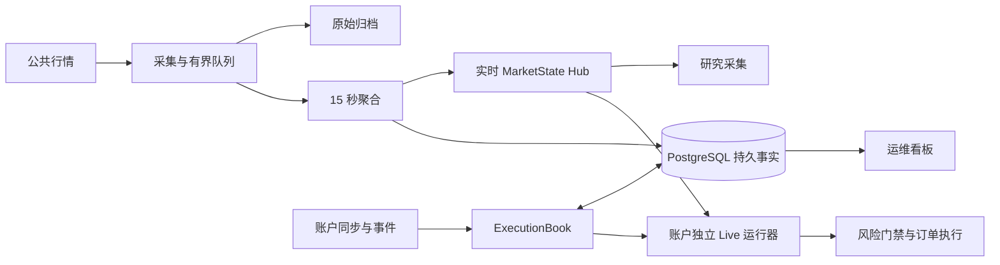

# 数据结构、I/O 与运行架构审查（2026-09-29）

本轮复核结论：四项候选中两项已经落地：持久化改为每 500 条事实分块写入；行情补空桶增加 watermark 门禁。另两项仍待处理：事务候选复制随仓位历史增长，以及有持仓时读取所有历史 scope。批写减少了 SQL 往返，但每次仍重新扫描、编码和哈希全部 facts。

首轮审查基线是 `dfa35e39e2f15da5ab85e82ec60b63b0eecc5ebb`；本次复核 HEAD 为 `91395f54c19fa10564971fca903d03affbcd8a6b`。复核开始时工作区干净；当前只有本报告有未提交修订，生产代码没有工作区改动。当前历史包含 500 行分块写入和行情 watermark 门禁。审查受 Git 管理的行情、执行账本、运行上下文与持久化代码；不是全仓库无遗漏证明。未连接服务器、部署或运行交易。

## 运行结构与已有保护

已有合理设计：Hub 集中分发行情；聚合桶截止时间已经使用最小堆；采集队列有容量与背压；上下文有缓存、失效代次和有限预取；检查点写入在后台合并；空账户跳过 Book 读取；持仓视图有 revision/cut 缓存。建议保留这些机制，优化它们尚未覆盖的重复工作。

## 1. 部分解决：增量事实仍触发全历史扫描与编码

证据链：

- [ExecutionBook.observe](../../src/crypto_momentum_lab/domain/execution/execution_book.py#L2926) 获取完整 `read_cut()`，交给 `persist_facts`。
- [事务适配器](../../src/crypto_momentum_lab/persistence/postgres/execution_unit_of_work.py#L184) 将完整 facts 交给 journal store。
- [journal store](../../src/crypto_momentum_lab/persistence/postgres/account_journal_store.py#L94) 枚举事件，逐条编码、哈希并构造 INSERT 行，再按 500 行分块执行。
- [_fact_event_specs](../../src/crypto_momentum_lab/persistence/postgres/account_journal_store.py#L583) 每次枚举 fills、snapshots、boundaries 等完整历史并生成 facts_state。`ON CONFLICT DO NOTHING` 避免重复行，但每次观察仍会重新编码、哈希并发送历史事实。

提交 `13f29a3` 已将 SQL 执行次数从 H 降至约 ceil(H/500)。剩余客户端遍历、序列化、哈希与行字典分配仍为 O(H) 每次观察；`_fact_event_specs` 的历史 payload 列表和新的 `row_dicts` 会同时驻留，增加峰值内存。若事实数持续增长且无压缩，累计客户端工作仍可达 O(N²)。生产 PostgreSQL 的端到端耗时、WAL 与磁盘负载尚未测量。真正空仓的快速路径会绕过这条逻辑。

| 方案 | 改善 | 保留的问题/验证要求 |
|---|---|---|
| A：分块批量 INSERT | **已实现**，chunk size 为 500 | 仍编码和哈希完整历史；需在数据库上验证事务与冲突行为 |
| B：Journal 输出新增事实 delta | 将遍历/编码与 SQL 写入量都压到新增事实及变化状态 | 重试、迟到事实、修订冲突、epoch 切换、coverage/provenance 与事实提交须在同一事务 |
| C：验证检查点 + 后缀事实 | 缩小恢复与投影规模 | 必须支持历史 cut、迟到事实和保留水位；不能直接截断历史 |

下一步应为 B 设计 append/delta 契约；C 是恢复协议工程，不能用“保留最近几条”代替。

最小横向实验调用真实 store，使用 recording session 代替 PostgreSQL，构造 N 条 fills + 1 条 facts_state，并模拟所有行已经存在：

| fills | 修复前单行方案 | 当前实现 | 等价分块原型 |
|---:|---:|---:|---:|
| 100 | 101 | 1 | 1 |
| 1,000 | 1,001 | 3 | 3 |
| 10,000 | 10,001 | 21 | 21 |

本次 recording-session 实验调用当前 store，并与重建的修复前单行方案、等价分块原型比较。三组的绑定行总数、顺序及内容摘要相同。它验证当前客户端调用数量，不验证 PostgreSQL 约束/事务行为，也不声称数据库延迟加速 476 倍。样例未包含 checkpoint、coverage 或迟到冲突分支。

delta 写入也不会自动消除完整 facts hash 与投影的 CPU 成本。若以后用持久化树/分块摘要实现结构共享和增量校验，必须明确摘要协议版本与迁移；Merkle 根不能直接替换当前序列化内容的 hash 而仍声称版本身份相同。先减少 SQL 往返，再测这些成本是否成为主要瓶颈。

## 2. 同一执行模块内：同步深拷贝与全局锁放大历史成本

[`_staged_copy`](../../src/crypto_momentum_lab/domain/execution/execution_book.py#L626) 深拷贝目标仓位的 Book 和 Journal，同时复制多个全局字典/集合。它是在 async 调用路径中同步运行的。[_mutation_lock](../../src/crypto_momentum_lab/domain/execution/execution_book.py#L622) 忽略 position key，返回本 ExecutionBook 实例的全局锁，锁还覆盖后续事务。这会让同一实例中的其他仓位等待；不意味着不同账户进程共享一把锁。

[record_snapshot](../../src/crypto_momentum_lab/domain/execution/account_journal.py#L190) 追加历史；`set_recovery_checkpoint` 设置检查点但不自动清空这些列表。已有单仓复制优化避免了深拷贝整个账户，但没有消除单仓历史增长的成本。

本地真实 `_staged_copy`，7 次顺序执行取中位数，合成快照、无数据库：

| 单仓快照数 | 单次复制 |
|---:|---:|
| 100 | 1.1175 ms |
| 1,000 | 11.6735 ms |
| 10,000 | 120.7213 ms |

这不是服务器 P99。同步 CPU 工作会占用事件循环线程，因而可能同时延迟其他协程；这一机制见 [Python asyncio 官方说明](https://docs.python.org/3/library/asyncio-dev.html#running-blocking-code)。

可选方案：A，专门实现事务候选拷贝，只复制可变容器，不复制派生视图缓存；B，将已提交事实改为真正不可变的数据，事务仅保存增量，提交后原子发布；C，长期按仓位划分状态与提交范围，再考虑锁分片。仅把锁换成 per-key lock 不安全：现在提交会发布多个全局集合，两个并发候选可能覆盖彼此结果。简单把 deepcopy 移入线程也不能减少总工作量，且需要明确线程读取的状态一致性。

实验中的“仅复制容器”原语很快，但**不作为可上线等价方案**：快照虽是 frozen dataclass，`raw_payload` 仍是可变字典。必须先建立嵌套不可变或所有权约束。

## 3. 已解决主要热路径：watermark 门禁跳过同桶扫描

[`_observe`](../../src/crypto_momentum_lab/market_data/runtime_states.py#L586) 仍对每个成功归一化事件调用 `_materialize_empty_buckets_through`。当前实现在 [补桶方法](../../src/crypto_momentum_lab/market_data/runtime_states.py#L732) 记录已扫描到的 watermark 桶；同一桶内立即返回。expected-symbol 集合改变或首次观察新标的时会使门禁失效。提交 `93b2919` 已加入实现及失效处理，单元测试覆盖重复 watermark、成员变化和新标的。

目前同一 watermark 桶内每条后续事件为 O(1) 门禁检查；watermark 桶推进时仍需排序和检查所有已观察标的，约 O(S log S)。已退出池的 observed 标的仍会参与该次扫描。此为每桶一次的工作，已不再随桶内每条行情重复。

| 方案 | 数据结构与复杂度 | 适用与约束 |
|---|---|---|
| A：watermark 桶门禁 | **已实现**；同桶 O(1)，每次桶推进 O(S log S) | 当前标的规模下先保留；门禁失效规则已有测试 |
| B：每标的 next_due 最小堆 | 无到期工作时 O(1)，到期 K 个约 O(K log S) | 若实测每桶全量扫描仍贵再比较；需处理池变化与陈旧堆项 |
| C：15 秒时间轮/桶队列 | 按到期桶处理标的 | 当前统一周期适合；跳时、长缺口和重入逻辑更复杂 |

现有 `_realtime_deadlines`、`_durable_deadlines` 已经用堆做关闭调度；同桶重复扫描也已通过水位游标消除。是否用 B/C 替代每桶全量扫描，取决于线上 S 与事件循环耗时，而不是数据结构本身。

最小对照用真实补桶函数比较修复前全量扫描与当前门禁。两边先各补一个桶，再比较 accumulators、每标的游标和两个截止堆；状态完全相同后测重复调用：

| 已观察标的数 | 修复前全量扫描 | 当前实现 |
|---:|---:|---:|
| 100 | 87.737 μs | 2.374 μs |
| 500 | 573.128 μs | 0.760 μs |
| 1,000 | 951.414 μs | 0.785 μs |

此处是单次循环内多次调用的均值，不是服务器结果。各组状态比较通过；不包括 normalization、完整 observe、池变化、网络和持久化。不能把局部常态路径的比例外推为系统整体加速比。最小堆和时间轮仍只是候选，未实现或跑分。

若继续替换每桶全量扫描，仍须比较完整状态和时间戳，覆盖无事件、迟到/恢复事件、池退出重入和 watermark 跨多个桶。

## 4. 有持仓时，读取范围仍是所有历史仓位

[`_with_execution_book`](../../src/crypto_momentum_lab/live_rollout/postgres_runtime.py#L585) 空仓会直接返回，且同 bucket 有缓存；但非空时调用 [`list_position_views`](../../src/crypto_momentum_lab/domain/execution/execution_book.py#L1643)，排序并逐个读取该账户的全部已建立 Book，随后才按真实账户持仓过滤。

注意：多数最新视图有内存缓存，因此**不能把它直接称作每次 N 条 SQL**。当指定 event_cut 早于当前视图时，[read](../../src/crypto_momentum_lab/domain/execution/execution_book.py#L1585) 才会进入 durable historical cut 读取，并新建历史 PositionBook。

本地 warm cache、无 DB、一个目标 scope，7 次中位数：

| 历史 scopes | 现有全量读取 | 已知 scope 定点读取 |
|---:|---:|---:|
| 10 | 0.0543 ms | 0.0047 ms |
| 100 | 0.5013 ms | 0.0045 ms |
| 1,000 | 6.1236 ms | 0.0058 ms |

两者只校验目标 scope 的视图一致，不声称整个函数输出等价。全量扫描还承担 Book-only drift 诊断，不能直接删去。

方案 A：交易路径用账户当前持仓 identity 集合做定点查询，漂移全扫描独立周期运行；账户身份必须包含 environment/account/symbol/position_side。方案 B：Book 维护活跃仓位索引，随事实提交事务性更新，并定期对账。方案 C：确需多仓历史 cut 时批量读取事实再投影，限制并发。优先 A，保留原有 unmanaged position 保护和不确定账户视图下的失败关闭行为。

## 验证范围与下一轮比较

复现实验位于本地 `reports/performance-audit-20260929/`（此目录被仓库忽略）。`benchmark_execution.py`、`execution-results.json` 包含 `_staged_copy` 和仓位读取微基准；这两段生产实现从首轮基线到当前 HEAD 未变。运行环境：macOS arm64，Python 3.13.3。顺序重复计时用于减少不同方案互相争抢 CPU。

`persist_facts_sql_count.py` 与同名 `.json` 为当前 HEAD 的持久化对照实验；它比较当前真实 store、修复前单行方案和等价批写原型。两份脚本均可在仓库根目录使用 `rtk proxy env PYTHONPATH=src .venv/bin/python reports/performance-audit-20260929/<脚本名>` 复现；execution 脚本输出到 stdout，SQL 脚本同时重写自己的 JSON 结果文件。

`dense_fill_bench.py` 与同名 `.csv` 为修复前全量扫描和当前 watermark 门禁的对照；同样用 `PYTHONPATH=src` 运行。CSV 另有 2,000/5,000 标的压力规模，仅作复杂度验证，不代表生产标的数。

当前版本定向运行 `tests/unit/market_data/test_runtime_states.py`：19 passed。该文件包含 watermark 门禁及其失效规则测试。Recording-session 脚本确认当前分块 store 对 100/1,000/10,000 条事实分别发出 1/3/21 次 INSERT execute，且其绑定行与修复前实现及等价原型一致。没有运行 PostgreSQL 集成测试或全量测试，因此数据库端事务、冲突处理和性能收益仍待验证。

下一轮的上线判断应使用部署版本和真实规模：单仓事实数、每次 observation 的 SQL 次数、锁等待/持锁时间、事件循环 lag、行情输入速率和 dense 扫描次数，以及端到端处理延迟。数据库方案需要真实 PostgreSQL 上事务回滚、并发冲突、恢复重放验证。索引修改应基于实际查询计划；不能因为查询慢就直接新增 B-tree。复合索引依赖过滤条件与列序，见 [PostgreSQL 官方说明](https://www.postgresql.org/docs/current/indexes-multicolumn.html)。

当前剩余优先级：设计账本增量持久化以消除 O(H) 事实编码；随后优化事务候选复制并按账户当前持仓限制读取范围。每桶一次的行情全量扫描已门禁化；只有生产指标显示仍是热点时，才评估最小堆或时间轮。当前没有服务器资源画像，无法断言剩余问题的线上优先级。
