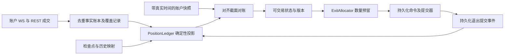

# 持仓批次反复不匹配：现场证据与系统性解决方案

状态：**审查快照 + 提案**。核验日期：2026-09-25。范围：实盘持仓重建、账户成交、批次身份、退出执行与迁移。本文未实施交易逻辑修改或生产部署。

## 1. 结论

反复出现的原因不是少一个匹配条件，而是**两套模型使用不同事实重建同一仓位，并在无法一致时把旧模型作为最终裁决者**。旧模型遗漏外部平仓，随后靠账户总数量裁剪；数量可以对齐，但旧生命周期、成本和身份仍可能残留。新账本发现差异后回退旧模型，使错误状态继续存在，每轮重建再次报警。

本次已用 AKEUSDT 现场数据和真实领域函数复现这一机制。SANDUSDT 的数量差额也已定位：两个正确但不同时间截面的输入被直接比较。解决目标应是“每个批次可由完整事实确定地重放、每个退出可追溯到明确分配”，而不是“让两套计算结果一致”或“让告警消失”。

## 2. 本次证据与边界

### 2.1 基线

- 本地 HEAD：`7e0fe80`；工作区原有 `README.md` 未提交修改，本次未改动它。
- 服务器 `43.167.191.253`，目录 `/opt/crypto-momentum-lab`：HEAD 与运行镜像标签均为 `86a89a911f3ae9b3385d1d7deced1c7b8beb261e`。
- 已核对运行中主策略容器：`position_batches.py`、`position_ledger.py`、`position_ledger_shadow.py` 的 SHA-256 与本地相同。`postgres_runtime.py` 宿主源码与本地不同，另行阅读了服务器上主路径与回退分支；不把两个 checkout 当成完全相同。
- 服务器仅执行容器清单、日志、源码读取和限范围 SELECT；未变更配置、订单、数据库或服务。文档不保存登录凭证。
- 日志取样为检查时最近 30 分钟、各容器最多 12000 行，不代表全部历史事故。下列事件时间统一为 UTC，北京时间加 8 小时。

### 2.2 AKEUSDT：数量一致但旧生命周期污染价格和身份

生产在 07:50:13—07:50:23 反复出现：

```text
category=lot_attribution_mismatch
legacy_count=1 ledger_count=1
legacy entry_price=0.05613591521617069062324536777
ledger entry_price=0.038197000000000000
position_amt=2618 ledger_total=2618 reconciliation_gap=0
position_ledger_primary_fallback
```

`primary` 和 `account-2` 的账户成交查询结果：

| 时间 | 事实 | 核验 |
| --- | --- | --- |
| 09-20 10:21 左右 | BUY 944 | 系统订单存在；订单价 0.105886，实际成交均价分别约 0.1030640583 / 0.1032411843 |
| 09-20 10:31:16 | SELL 944 | 账户成交存在；按 symbol + exchange_order_id 查询系统订单，匹配数为 0 |
| 09-25 04:59:17.355 | BUY 2618，成交价 0.038197 | 新开仓事实存在 |

这证明平仓事实已经被采集，但不在旧重建依赖的系统订单集合中；尚不能仅凭这些字段断言平仓由人工、第三方程序还是其他来源发起。

错误价恰好等于：

```text
(944 × 0.105886 + 2618 × 0.038197) / (944 + 2618)
= 0.05613591521617069062324536777
```

旧路径合并两笔开仓，之后从 3562 裁剪为 2618，既没有按外部平仓结束旧生命周期，也没有重算成本来源。最小复现的批次 ID 仍为旧开仓 ID。线上 06:00 的两个未成交限价退出价为 0.056630，与错误价格约加 0.88% 相吻合；这是影响退出定价的强线索，尚未逐笔重放退出决策，不能当作完整因果证明。

### 2.3 SANDUSDT：两次部分成交之间的快照被用于比较最终成交量（已定位）

同账户 `account-3`、方向 LONG、订单 `23149283042` 的精确时间线：

| UTC 时间 | 数据源 | 数量 / 身份 |
| --- | --- | --- |
| 07:25:20.591 | account_fill_events | trade 1000604297，BUY 1403，价格 0.04568 |
| 07:25:20.592 | ACCOUNT_UPDATE 交易所 E/T | position 1403；本地 observed_at 为 20.594640 |
| 07:25:20.899 | account_fill_events | trade 1000604298，BUY 786，价格 0.04568 |
| 07:25:20.899 | 下一条 ACCOUNT_UPDATE 交易所 E/T | position 2189；本地 observed_at 为 20.902586 |
| 07:25:21 | 策略日志 | 使用 position_amt=1403，ledger_total=2189，gap=-786，触发 fallback |
| 同一秒，后续日志 | 策略日志 | exact_match、primary_active、total_quantity=2189 |

**直接原因已确认：1403 - (1403 + 786) = -786，差额就是第二笔成交。** 两个对齐的截面都守恒，只有混合截面才有差额。这次不存在需要靠减少账本数量“修复”的真实仓位缺口。

实现机制：`_account_position_view_from_snapshot` 先持有 Hub snapshot，再异步查数据库里的订单和成交；成交查询没有与该 snapshot 绑定的上界/cut。`PositionLedger.project` 重放全部传入成交，然后用最新的传入 snapshot 直接减总量，不验证时间与覆盖是否可比。`LegacyOrderIdentityAdapter` 还会用订单 updated_at 代替真实 observed_at，使下游丢失纠错依据。

缓存 epoch 防止部分过期 context 发布，但不能让 Hub 与数据库成为同一事实版本；投影与差异日志也可能在外层 freshness 校验之前生成。现场日志证明混合比较与随后的自恢复，**没有完整请求 trace 证明这份中间 context 是否最终进入下单决策**，因此不能声称该次误报已经导致错误交易。

最小复现（真实 PositionLedger，无网络）：

```bash
rtk proxy env PYTHONPATH=src .venv/bin/python docs/runbooks/repro_sand_mixed_cut.py
```

实际结果：

```text
aligned_early: ledger=1403 snapshot=1403 gap=0
aligned_late: ledger=2189 snapshot=2189 gap=0
mixed_cut: ledger=2189 snapshot=1403 gap=-786
AssertionError: mixed cuts must be aligned or explicitly incomparable
```

复现保留数量和时刻，去掉与问题无关的手续费等字段；它验证比较算法的错误语义，不伪装成完整生产线程调度重放。不能通过扩大数量容差、增加固定 sleep 或吞掉该告警解决。

### 2.4 可重复验证

在仓库根目录运行：

```bash
rtk proxy env PYTHONPATH=src .venv/bin/python docs/runbooks/repro_batch_price_contamination.py
```

实际输出：

```text
control: qty=2618 price=0.038197 id=AKEUSDT:BOTH:new
missing_external_close: qty=2618 price=0.05613591521617069062324536777 id=AKEUSDT:BOTH:old
AssertionError: closed episode contaminated current batch
```

脚本调用真实 `rebuild_position_batches`，正常对照通过，增加旧开仓且缺少外部平仓输入后失败；不依赖网络、时钟或数据库。它是**机制最小复现**，不是完整生产输入导出。最终集成验收必须把外部 SELL 一并提供给事实加载器，不能以删除旧开仓或放宽断言让脚本变绿。

已有回归基线：

```bash
rtk proxy .venv/bin/python -m pytest tests/unit/execution/test_position_batches.py tests/unit/execution/test_position_ledger.py tests/unit/live_rollout/test_position_ledger_shadow.py -q
# 26 passed in 0.03s
```

这些测试通过与现场故障并不矛盾：它们未证明事实加载、旧模型回退、退出定价组成的生产闭环正确。

## 3. 第一性原理：系统究竟需要知道什么

### 3.1 数量事实、策略归属和观测必须分开

1. **成交改变真实数量。** 订单提交改变边界和预留，不等于成交；订单累计成交量是核验材料，不能与逐笔成交重复累加。
2. **交易所净持仓不包含内部批次身份。** 一个快照只有 2618，无法证明它来自旧仓剩余还是平仓后新开，更无法恢复开仓时间和成本。
3. **批次是确定性策略投影。** 沿用 [CONTEXT.md](../../CONTEXT.md)：退出提交前的追加开仓合并并更新锚点，提交后的开仓进入新批次；不把每笔 fill 当作策略批次。
4. **归零终结生命周期。** 已平生命周期的成本、ID、退出时限不能进入新生命周期。反向穿零成交拆成旧方向减仓和新方向开仓两个数量分量。
5. **快照是带时间和覆盖范围的校验点。** 不能用“最新成交”对“较早快照”直接判错，更不能通过裁剪把时差写成归属事实。
6. **未知必须可表达。** 没有完整历史或可信期初状态，就无法证明批次正确；总量吻合不消除这种未知。

在同一账户、市场、方向、覆盖截面上定义：

```text
Q_facts = Q_checkpoint + Σ signed(fill.quantity)
Q_facts = Σ signed(batch.quantity) + Q_unallocated
gap = Q_exchange_at_cut - Q_facts_at_cut
```

`Q_unallocated` 是已知数量但归属未知的事实；`gap` 是对齐截面后仍未解释的差额。二者不能互相替代，也不能默认为零就表示完整。双向持仓分别核算 LONG/SHORT；单向 BOTH 使用有符号数量。

### 3.2 身份不能依赖查询窗口和遍历次序

账户键至少包含 venue、environment、account、symbol、position mode/side；配置版本是策略归属，不能把同一真实仓位因配置变化复制成多个账户事实。

批次 ID 需由持久化创建事件或稳定开仓事实键确定，并保留显式旧 ID 映射。查询多一天、迟到成交补入、服务重启不得静默改变退出单的目标身份。若历史纠正确实改变分批，应发布新投影版本和映射/冲突记录，重新校验在途退出，不能偷偷换绑。

## 4. 为什么补丁一再失效

| 当前机制（本次代码核验） | 缺陷与后果 | 应有契约 |
| --- | --- | --- |
| `position_batches.py:rebuild_position_batches` 使用系统订单，`_reconcile_batch_quantities` 按快照裁剪 | AKE 已复现：总量对了，成本与 ID 仍错 | 完整账户成交驱动生命周期；快照差异不修改归属 |
| 一笔订单累计量放在一个 entry 事件上 | 无法准确表达同一订单多次成交跨退出边界 | 逐笔 fill 按事件顺序投影，订单只提供身份和边界 |
| `LegacyOrderIdentityAdapter` 无 fill 时合成成交；按最早订单减 5 分钟筛选 | 来源可信度和历史完整性未独立表达；窗口不能证明期初为零 | checkpoint + 完整增量 + coverage；合成输入明确降级 |
| `PositionLedger` 减仓对系统和外部统一 FIFO | 数量可以守恒，但系统指定退出批次仍可能扣错 | 系统成交按已保存 allocations；外部成交按版本化归属政策 |
| `PositionLedger` 的 `target_batch_id` 与新生成的 episode/batch ID 不同命名；未找到目标后选最后一个未封口批次 | 绑定可能无法命中，错误通过默认选择掩盖 | 身份映射必须唯一，失配为冲突，禁止猜测换绑 |
| 比较器排序后比较属性，返回主结果时按原始下标复制旧 ID 与恢复字段 | 比较一致不等于一一身份映射；多批次存在错配风险 | 返回显式身份映射，并核验在途订单关系 |
| 不一致或异常便返回旧 `result.batches` | AKE 已观察：新账本检测到错误却无法替代错误结果 | 权威路径由事实证据决定，旧算法只作诊断 |
| `PositionObservation` 不带实际快照时间；adapter 用订单更新时间构造观察时间 | 无法严格建立一致截面 | 原始 observed_at、接收时间、覆盖游标一路保留 |

上述风险不都已在生产逐项复现。AKE 的生命周期污染与 SAND 的混合截面比较已分别验证。已有修复，例如禁止跨批次尾仓吸收、比较逐批价格/锚点、检查 gap，不应再作为“完全未修复”报告；但它们没有消除表中事实契约的问题。

## 5. 目标方案：一个事实账本，一个权威投影



### 5.1 完整事实输入

- 在已有账户成交采集上补 coverage，优先复用现有表，不先另造一套采集服务。WS 低延迟接入，REST 带重叠窗口补漏，去重键使用交易所定义的完整 trade 命名空间。
- 同键同内容幂等；同键不同内容进入冲突，不采用“先来者永远正确”。保留来源、event time、received time、payload hash。
- 每个 PositionKey 有可信 checkpoint 或可证明的零起点；覆盖记录包含起止、分页完成、空区间确认和失败状态。最大 trade timestamp 不能单独证明中间无缺失。
- 数据保留必须受活跃生命周期及 checkpoint 依赖约束。不能因为开仓超过固定 lookback 就失去事实。
- 缺失方向或账户身份的事实隔离为 UNKNOWN，不靠 symbol 猜测归属。

### 5.2 生命周期与成本

- 按 fill 处理实际数量，按持久化提交事件处理策略边界；记录提交尝试、确认和不确定状态。网络超时不能当成“没有提交”，也不能伪装为已确认。
- 给同时间事件定义可验证排序；优先交易所序列/明确因果关系，时间精度无法判定的边界冲突显式暴露，不以字符串 trade ID 排序冒充因果顺序。
- 成本由该批次实际成交计算；限价订单价不得无标记地替代成交均价。部分减少保留剩余成本，追加只与当前剩余量计算均价；生命周期归零清空。
- 将 `first_fill_at`、策略锚点 `opened_at`、首次 `exit_submitted_at` 分开保存，避免追加更新锚点时覆盖不可变身份依据。

### 5.3 退出分配与并发

- `ExitPlan` 保存 PositionKey、projection_version、选中 batch ID、各自数量、原因和预留 ID。
- 事务内校验版本并预留可用量；同一批次的并发退出不得双重消费。提交器只能执行分配后的数量，不临时扩大或换批次。
- 订单与分配在发送前持久化，重试沿用幂等订单身份；超时保持预留并查单。部分成交消耗对应分配，取消/拒绝确认后释放余量。
- 外部平仓采用明确、版本化政策（例如 FIFO），并记录 attribution；它减少了已有预留覆盖量时，必须重新对账和调整在途退出。
- 紧急账户减仓属于独立授权的风险控制路径，不伪造某个策略批次的正常退出。

### 5.4 不一致时如何运行

为每个 PositionKey 输出 `READY / CATCHING_UP / INCOMPLETE / CONFLICT`，附 coverage、gap、unallocated 和证据版本。

- `READY` 才能驱动依赖批次价格和年龄的策略决策。
- 短暂数据不同步进入 CATCHING_UP，自动补取与重放；超过约定时限升级。
- INCOMPLETE/CONFLICT 停止该 key 的新增批次决策，保留账户级风险控制能力，不把旧结果重新标为正确。
- 对 AKE 这类新旧不一致，只要完整事实及绑定证据通过，旧模型错误不应阻止正确投影；**不能仅删除 concordance 检查就全量启用当前新账本**，因为当前身份、分配和 coverage 契约仍不完整。

## 6. 实施顺序与验收门槛

| 阶段 | 具体交付 | 完成判据 |
| --- | --- | --- |
| P0：固定证据与阻止错误继续传播 | AKE、SAND 冻结输入；结构化 discrepancy 记录；明确生产 key 的不可信状态及处理政策 | 可离线重放首次差异；不会因重启或裁剪而自动宣告健康 |
| P1：事实闭环 | 完整账户事件加载、coverage、checkpoint、真实 snapshot cut；取消生产合成 fill 的权威资格 | 外部全平后重开可重建新生命周期；缺页和迟到均被识别 |
| P2：归属与执行闭环 | 稳定批次 ID、历史映射、提交边界、ExitPlan allocations、事务预留 | 定向退出不扣其他批次；重试/并发不重复减仓；恢复字段对应真实批次 |
| P3：切换与删除旧路径 | 同输入影子重放、单账户逐 key 灰度、版本化切换、移除运行时旧裁剪和自动回退 | 独立不变量及故障矩阵通过；在途订单完成映射；影子差异有事实解释 |

P0 的线上行为变更需作为单独实施任务审查，本次只写方案。建议先落一个纵向闭环：**账户外部全平 → 新开仓 → 正确 ID/成本 → 正确退出分配 → 重启后一致**，不要先重构所有模块。

迁移时冻结事实截止点并补齐新投影，核验挂单与预留后原子切换 active projection version；恢复增量处理。回滚只能回到同样满足事实契约的上一个版本。无法保证正确时降级隔离，不能回到已知会污染生命周期的旧算法。

## 7. 必须补齐的验证矩阵

| 场景 | 必须断言 |
| --- | --- |
| AKE：旧 BUY → 外部 SELL 全平 → 新 BUY | 仅新数量、实际成本、新身份；旧退出锚点不继承 |
| 同订单两次 fill 跨退出提交边界 | 两次成交分别归属正确批次，不能整体放到最早成交时刻 |
| 部分外部减仓后加仓 | 剩余成本和追加加权正确，政策版本可追溯 |
| 系统指定第二批退出 | 只扣第二批，不默认 FIFO 扣第一批 |
| 快照早于/晚于成交、REST 缺一页 | 不误裁剪；缺覆盖不能判 READY |
| 重复成交、同 ID 冲突、迟到成交 | 幂等/冲突可见；重放与全量结果相同 |
| 不同账户同 order ID、LONG/SHORT 同 symbol | 不跨账户、市场或方向串账 |
| 穿零、窗口截断、历史清理 | 新生命周期隔离；无可信期初则明确未知 |
| 多批次排序变化、历史补录 | ID/恢复订单不按下标错配，绑定冲突可见 |
| 双退出并发、发送超时、崩溃恢复 | 预留不超额、下单幂等、订单状态与分配最终一致 |

测试层次：领域纯函数验证不变量；数据库集成验证真实加载与一致截面；冻结事故输入验证生产链路；故障注入验证并发、断线与恢复。不要只测试两个算法输出相等，它们可能同时错误。

上线观察至少覆盖完整的开仓、部分成交、外部减仓、全平、重开和重启过程；单纯“24 小时无报警”或“单批次 exact_match”不足以验收。

## 8. 让问题真正闭环

每条差异记录至少包含账户完整键、投影版本、代码版本、输入 hash、coverage cut、快照时间、首个分歧事实、数量/成本/身份/边界差异、受影响退出计划。按这些字段生成稳定 discrepancy ID，同版本重复检查更新计数，不刷成多个事故。

告警分类至少区分输入缺失、时间未对齐、数量、成本、身份、边界、在途绑定。保留首次/最近出现、次数、自动补取进度与解决证据。降低重复日志频率只改善可观测性，不算修复。

本次后续审计项：AKE 生产加载器完整输入导出及错误价格到退出决策的轨迹、SAND 中间 context 是否被外层 freshness 校验丢弃。这些影响范围尚未证明，但不影响两类直接故障机制已经确认。完整重构设计见下文第 9—14 节。

与既有文档的关系：[09-20 手动平仓复核](../runbooks/manual-close-batch-review-20260920.md) 已提出完整成交与显式退出分配；本方案补充当前生产复发证据、可运行最小复现，以及“新账本依赖旧账本认可”的切换缺陷。落实这些契约并删除旧权威路径，才是本问题的关闭条件。

## 9. 重构决策：收回分散在调用方的事实解释权

前面 P0—P3 是交付顺序，不是继续修补旧重建函数。最终系统只保留一条生产事实解释路径。用四个深 Module 收纳复杂度，先在现有 Python 应用/PostgreSQL 中实现，不新增微服务、消息中间件或第二套数据库。

| Module | 对调用方的 Interface | 内部负责的复杂度 | 明确禁止调用方做的事 |
| --- | --- | --- | --- |
| AccountJournal | `append(envelope)`、`read_cut(key, cut)` | 身份校验、幂等、冲突、WS/REST 覆盖、原始观测、顺序与迟到、检查点依赖 | 自己按 run_id 或最近 N 天裁出“完整账户事实” |
| PositionBook | `get_view(key, requirement)` | 生命周期、批次、成本、归属、截面对齐、健康状态、版本化投影 | 对数量裁剪、造 fill、以订单价格填补实际成本、自己匹配旧 ID |
| ExecutionCoordinator | `request(command, expected_version)`、`reconcile(order_event)` | 退出分配校验、预留、幂等 outbox、发送状态、重试和未知订单恢复 | 提交时扩大数量、重新选批次、超时释放预留 |
| PositionQuery | `read(key, version?)` | 同一个已发布 view 的 Hub/数据库/dashboard 读取与缓存 | 在读侧再查最新 fill 拼到旧快照上 |

`PositionBook` 内部的纯投影函数作为内部 Seam；数据库 Adapter 与冻结事实内存 Adapter 通过同一个输入契约测试。策略只消费不可变 `PositionView`，不需要知道历史窗口、两个成交表或旧订单身份恢复细节。

### 9.1 不采用的替代方案

- **只延长 lookback**：不能证明零起点，也解决不了 SAND 混合截面。
- **只增加事务隔离等级**：数据库一致读无法使已获取的 Hub snapshot 自动与数据库同版本；源事件本身仍可能异步到达。
- **只使用 snapshot 作为持仓真相**：无法恢复批次、成本与归属，AKE 仍会发生。
- **立即移除 concordance gate，直接启用当前 Ledger**：它尚未完整消费定向退出分配、coverage 和稳定 ID，不能拿一种错误替换另一种错误。
- **双算法永久兜底**：使错误处理重新成为隐式业务政策，无法形成唯一可审计结果。

## 10. 数据契约与持久化模型

以下是逻辑表/字段设计，实施时通过迁移复用现有 account_fill_events、exchange_orders、exchange_order_events，不机械复制所有表。

| 记录 | 关键字段与约束 |
| --- | --- |
| `account_fact_journal` | `fact_id`、完整账户键、kind、source_event_key、event_time、received_at、ingest_revision、payload_hash、source；唯一 source key，冲突 payload 保留独立审计记录 |
| `fact_coverage` | key、source、范围、source cursor、分页终结证据、状态、确认 revision；不能仅由 max timestamp 推导完整 |
| `account_observation` | observation_id、原始交易所 E/T、observed_at、received_revision、amount、direction、source；与 fill 的可比关系独立存储 |
| `position_checkpoint` | key、projection_schema、policy_version、cut、完整状态、依赖事实范围、hash；包括开放批次、归属、未决边界与预留引用，不只存总数量 |
| `position_projection` | key、version、input_revision、event_cut、coverage_ref、policy_version、schema_version、state、health、input_hash；历史不可变，active pointer 原子更新 |
| `batch_identity_map` | legacy key、canonical batch ID、projection version、mapping evidence、状态；歧义不做一对一伪映射 |
| `execution_command` / `exit_allocation` | command ID、业务幂等键、key、expected projection version、policy、每批分配、数量、理由、状态；分配总量等于命令数量 |
| `position_reservation` / `order_outbox` | reservation ID、command ID、batch ID、reserved/consumed/released 数量；发送负载不可变、attempt、fencing token、查单状态 |
| `position_discrepancy` | key、cut、input hash、类型、首次/末次时间、影响版本、解决证据；区分待追平与真正守恒冲突 |

区分三个版本维度：

1. `ingest_revision` 表示本系统何时持久化知道某事实，不代表交易所事件顺序。迟到成交的 revision 大、event_time 可以小。
2. `event_cut` 表示重放至哪个可证明截面，必须关联 coverage。它不能仅是“现在”。
3. `projection_version` 表示某次政策、输入与检查点产生的不可变结果，是策略与执行的并发令牌。

接口返回建议：

```python
PositionView(
    key, projection_version, input_revision, event_cut,
    policy_version, schema_version, coverage,
    episodes, batches, unallocated, reservations,
    observation_id, reconciliation_status, gap,
    health, diagnostics,
)
```

`gap` 在不可比较时为 `None`，不能用 0 代表“未核验”。`health` 与 `reconciliation_status` 分开：某个历史截面已对齐，不保证当前数据足够新。读取必须携带 freshness requirement，过期 view 不能用于新下单。

## 11. SAND 所要求的一致截面算法

### 11.1 一个事实版本不是一条 WebSocket 消息

交易所成交与持仓更新可能分开发送、跨源乱序；本系统不能虚构跨 stream 的全局序号。交易所时间也是证据的一部分，不是无条件的全序。该原则比加锁或缓存清理更基本。

正常更新顺序：

1. 接收并持久化原始 fill/observation，事务分配 ingest revision，再发出“有新事实”的通知。通知不携带自行拼接的最终批次。
2. 投影 worker 按 key 获取受 fencing 保护的所有权，在一个数据库一致读事务中冻结 input revision 和覆盖记录；读取相应检查点及增量。
3. 对候选 observation 判断是否具有可验证的事件截面。若有，重放至该 cut；cut 后的成交保留给下一版本，不能与旧 observation 比较。
4. 若同毫秒顺序、REST/WS 因果关系或覆盖尚不明确，输出 `NOT_COMPARABLE/CATCHING_UP` 并补取，不能直接判数量异常，更不能裁剪。
5. 比较通过后原子发布 view 与 active pointer。Hub 只通知该 projection version，策略按版本读取完整 view。

SAND 应产生：早截面 `1403=1403`，晚截面 `2189=2189`；当早 snapshot 与第二笔 fill 同时在数据库可见时，可以发布两个历史投影，或只发布完整晚投影。不能产生作为权威状态的 `1403 vs 2189`。

### 11.2 没有可靠截面的 REST 快照

REST 请求开始/结束时间只界定观察区间，不能精准关联区间内所有成交。此时保留区间与不确定性，补齐成交后重新获取观察；若仍无法建立唯一对应关系则保持 NOT_COMPARABLE。禁止通过“挑一个总量刚好匹配的前缀”证明因果关系，因为不同交易可能得到相同总量。

### 11.3 迟到与回放

迟到事实落在已发布 cut 之前时，标记最早受影响事件，从它之前有效的 checkpoint 重放并发布新版本；旧版本保留审计。checkpoint 必须因受影响依赖失效，不能把迟到事实简单加到当前批次。若活跃命令引用受影响批次，先进入重新核验，处理预留和在途订单后恢复 READY。

正常投影成本应与新增事实数有关；只有迟到/政策迁移触发有界重放。历史回放任务不得阻塞其他账户，积压体现在 watermark lag 与健康状态，不能靠静默跳事件追进度。

## 12. 批次状态机、并发与故障恢复

批次需要两个正交状态：`entry_phase=OPEN/SEALED` 与 `remaining_qty>=0`。退出提交封口不等于持仓数量归零；追加更新锚点不改变批次身份。episode 在有符号数量过零时终结。

退出发送流程：

```text
策略读取 READY view V
  → 生成目标批次及退出理由
  → 事务锁定 key，CAS 检查 V、health、fencing
  → 校验可用量，持久化 command + allocations + reservations + outbox
  → commit
  → dispatcher 记录发送尝试，发送固定 client order ID
  → ACK / UNKNOWN / REJECTED
  → fill 按 command allocations 消耗预留，发布新 view
```

纯创建命令尚未发送不构成 `CONTEXT.md` 中的退出提交。实际发送尝试持久化为边界候选，成功确认后成为边界事实；发送与本地记录之间无法跨交易所原子提交，因此任何 crash/timeout 都须保留 UNKNOWN 并通过订单身份查证。UNKNOWN 阶段不允许用“没收到 ACK”继续合并可能跨边界的新开仓。现有提交时间语义需要落实成明确的事件类型，不能继续用可变 order.updated_at 推断。

| 故障点 | 恢复行为 |
| --- | --- |
| 事实 commit 前崩溃 | WS 重连/REST 重叠补取；source key 去重 |
| 投影计算中崩溃 | active pointer 未变，重新从 checkpoint 计算 |
| 发布后通知丢失 | 查询版本/补拉可恢复，不重新计算另一套批次 |
| outbox 已 commit、未发送 | 同命令身份继续发送，预留仍在 |
| 已发送、未保存 ACK | 标记 UNKNOWN，按 client/exchange ID 查单；不能新 ID 重发 |
| 部分成交后撤单 | 已成交分配保留，确认撤销剩余后释放未用预留 |
| 外部成交侵占预留 | 标记预留不足，协调撤改在途退出；不把事实归属伪造为已批准命令 |
| worker 租约转移 | fencing token 使旧 worker 无法写入投影/预留；单靠进程锁不够 |

系统定向平仓优先命令 allocations；外部成交才按显式政策分配。缺命令映射的系统成交进入冲突，不能当作“外部 FIFO”掩盖丢失的执行证据。量化发生在计划阶段，残量留在批次中；任何额外退出范围都需要重新生成分配计划。

## 13. 代码替换路线与删除清单

| 现有位置 | 重构职责 |
| --- | --- |
| `execution_account` 采集、`account_repository` | 写统一事件身份、revision 与 coverage；保留原始时间与方向 |
| `domain/execution/position_ledger_models.py` | 将已有 coverage 从可选装饰字段变为可验证输入；增加 cut、health、版本、稳定身份与未知状态 |
| `domain/execution/position_ledger.py` | 确定性投影，处理 checkpoint、生命周期、边界、命令分配和迟到重放；不直接以任意最新 snapshot 判差额 |
| 新增 persistence PositionBook Adapter | 一致读、检查点、投影 CAS 发布、恢复；领域层不依赖 SQL |
| `domain/execution/trade_command.py` | 复用已有 ExitAllocator/TradeCommand，补版本与预留约束，不再建平行命令体系 |
| `execution_account/orders/trade_command_executor.py` | 落实 outbox、查单、fencing、状态恢复，严格执行已持久化分配 |
| `live_rollout/postgres_runtime.py`、`context.py` | 消费一个 PositionView；撤掉读侧分散的历史重建与属性拼接 |
| Hub、dashboard、replay | 读取/重放同一契约；展示版本、可比性和来源，不自行修正结果 |

最终删除生产路径中的：

- `_reconcile_batch_quantities` 式快照裁剪归属。
- 基于订单集合推断账户历史完整性的 horizon / earliest-order buffer。
- `LegacyOrderIdentityAdapter` 在实时权威路径的合成 fill 与伪造快照时间。
- 依赖 `diff_report.is_concordant` 才采纳新账本的 gate，以及异常/失配自动返回旧 batches。
- 按 list index 复制 batch ID、恢复订单等身份字段的逻辑。
- `_build_position_batches` 的双重计算；比较器保留在迁移审计工具中，不能决定执行。

旧订单兼容解析暂时只保留在一次性历史导入 Adapter；导入后得到显式事实和 identity map。每个兼容分支都应有剩余数据计数和删除条件，不能迁移结束后仍嵌在日常决策路径。

## 14. 可验收的迁移计划

### 14.1 交付包及依赖

1. **契约与事故基准**：固化 AKE/SAND 事实夹具、输入 hash、正确输出、状态机和时间语义；领域及数据库集成断言先失败。保留本次两个探针作为历史机制说明，正式验收通过新的完整 Interface。
2. **Journal 与 coverage**：迁移数据结构，现有采集双写新字段/事件记录，核对无丢失、无重复记账。事实双写可以，交易下单双写禁止。
3. **PositionBook**：从可信零起点或可验证 checkpoint 重放全部活跃 key，跑原始事实的影子输出。无可靠期初数据的仓位明确未归属，不能凭快照伪造开仓历史。
4. **执行闭环**：把所有在途订单和 reservations 映射到稳定批次；原子命令预留、outbox、幂等和恢复测试通过后才能接入实盘。
5. **单账户灰度**：暂停该账户新策略命令，持续采集与风险管理；处理未决订单并核验映射，在固定 cut 上校验，原子切换 active writer/view，再恢复决策。整个过程只有一个交易 writer。
6. **扩展并删除**：覆盖第 7 节场景后扩展其他账户；删除旧权威路径与临时开关。交付完成必须包含删除 diff，不能只新增类和配置。

### 14.2 验收指标

- 每个 READY view 均有完整身份、可信起点、coverage 与可比快照；未知不得统计成零差额。
- AKE：账户外部全平后重开的批次 ID、成本、锚点、退出计划只来源于新生命周期。
- SAND：精确复刻两笔相隔 308ms 成交与交错读取，输出对齐 view 或 CATCHING_UP；不产生权威 reconciliation gap=-786。
- 相同输入/政策/检查点重放的规范化结果 hash 一致；增量结果等于全量结果。
- 预留数量不超过各批次可用量，退出成交可逐笔追溯至分配；断线和崩溃不重复下单。
- 指标覆盖 ingest lag、coverage gap、projection lag、NOT_COMPARABLE 时长、真实 discrepancy、unknown order、reservation conflict。延迟门槛按当前策略时限与压测制定，不凭空承诺毫秒 SLA。
- 上线观察覆盖实际完整生命周期及恢复，不只看告警次数。性能验证按最大活跃 key 和积压规模验证增量成本；禁止每个策略 tick 扫全历史。

### 14.3 回滚原则

schema 先增量兼容，事实只追加，旧 projection 版本保留。切换失败时冻结受影响 key 的新命令，协调预留与在途订单，然后回到已验收的同契约版本；若不存在可证明正确的版本，维持隔离并保留独立风险控制，不回到旧数量裁剪算法。

最终完成标准是：**事实读取、生命周期归属、快照比较、交易预留和重启恢复都通过同一条可重放契约；旧的猜测与回退路径退出生产。** AKE 与 SAND 是两条必须长期保留的端到端回归，而不是两个特殊 symbol 分支。
