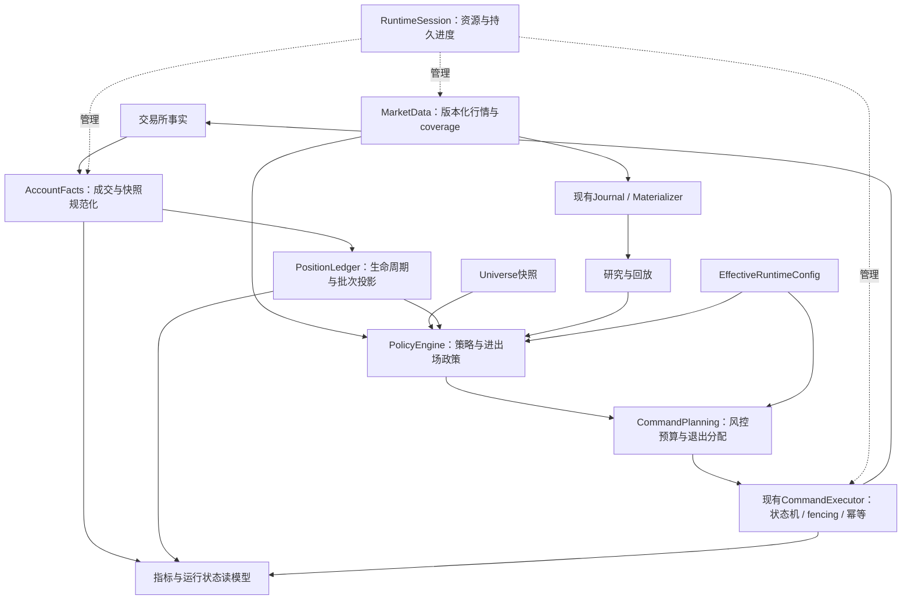

# 全系统模块设计复核：从第一性原理收敛反复补丁

日期：2026-09-20。基线：`62da99cf799a1596153da8d9b62209fd61699b3a`。

## 1. 结论与阅读指引

**需要重构，但应围绕事实、身份、进度和执行权限重新确定模块职责，不宜全仓重写，也不宜仅把大文件拆成更多文件。**

本次遍历了 `src/crypto_momentum_lab` 的 250 个 Python 文件（88,506 行，含空行及注释），分析顶层依赖，并检查全部 16 个一级包的主要入口、数据契约和关键实现；额外检查 dashboard 前端、部署脚本、维护脚本及测试。高风险链路深入到账户同步、批次重建、提交、恢复、检查点及停机。文件遍历不等于逐行证明全部实现正确；前端没有做浏览器交互验收，第三方 vendor 文件没有审计，生产数据库集成及生产压测没有运行。

最值得优先投入的工作：

1. **账户成交账本与批次投影**：从完整账户事实推导批次，替代系统订单历史加数量差补偿。
2. **交易命令与退出分配**：保留现有订单状态机、幂等和 fencing，把业务退出范围与数量预留收敛到单一契约。
3. **数据版本、完整性与进度**：区分实时已观察、持久化已确认、投影已应用，以及实盘决策当时看到的行情版本。
4. **运行时生命周期**：真正明确单一资源所有者，并让检查点失败影响停机结果。

后续处理：实盘/模拟/回放政策一致性、归档与保留期、指标口径、配置及部署状态。交易所适配器、领域纯函数、现有有界队列、分连接池和采集 journal 等基础应尽量保留。

本文中的 P1/P2/P3 表示重构实施优先级，不表示每个模块已经发生同等严重的线上故障。证据按“已复现”“代码确认”“架构风险/待验证”区分。

## 2. 必须先更新的上下文

上一份 [B2USDT 复核文档](../runbooks/manual-close-batch-review-20260920.md) 基于 `e88c069`。随后已有 `62da99c`：

- 归零查询新增 position_side 分组。
- 过滤逻辑加入订单终态与 updated_at，保留部分归零前下单、归零后更新的订单。
- 尾仓吸收增加批次数量检查，禁止已识别的多批次跨批次吸收。
- reduce-only 数量量化调整了最小名义金额检查，新增相关测试。

**这些局部修正不能在本文继续原样算成未修复缺陷。** 但账户事实仍以系统订单关联加载、订单时间仍承担生命周期推断、提交层仍有单批次数量扩大逻辑，因此长期设计问题仍在。本次没有重新连接服务器确认 `62da99c` 的部署范围，不把本地 HEAD 当作生产运行版本。

## 3. 第一性原理：用什么标准判断模块是否应该重构

### 3.1 六个问题

对每个模块依次问：

1. 它管理的是不可变事实、派生视图、业务决策，还是外部副作用？是否混在一起？
2. 一个状态的权威写入者是谁？其他模块是否也在用启发式修正它？
3. 身份键是否包含必要维度？账户、方向、运行代次、流 epoch、数据版本是否被省略？
4. “成功”意味着接收、落盘、应用还是完成？返回值是否被调用方尊重？
5. 进程在任意 await、数据库提交、网络请求前后失败，能否无歧义恢复？
6. 修复一条业务规则，需要改几个调用方？是否持续增加 fallback、兼容开关和特殊日期？

文件长、类多、出现重试本身都不是重构理由。真正的信号是：同一业务知识分散到多个调用方，或者模块的 Interface 要求调用方知道内部步骤、兼容模式和调用顺序。

### 3.2 不变量先于类划分

| 对象 | 必须守住的不变量 |
| --- | --- |
| 账户仓位 | 对齐覆盖点后，交易所数量 = 已归属批次 + 外部/未分配数量；差额不能静默抹平 |
| 订单 | 网络超时不等于失败；同一业务命令不得因重试产生第二个执行意图 |
| 退出 | 订单数量等于明确分配数量；执行模块不得扩大业务范围 |
| 行情 | 同一时间桶的修订版本可区分；完整性、事件时间与接收时间不能互相替代 |
| 检查点 | 已提交写入不等于已持久化；恢复水位不得越过无法重放的事实 |
| 归档 | 接受进度与物化进度分离；消费未覆盖之前不能删掉唯一恢复源 |
| 风控 | 规则计算可复用，最终提交权限须在执行临界区重新验证 |
| 运行时 | 每个资源一个最终所有者；停止成功不掩盖持久化失败 |
| 指标 | 每个数字带来源、观察时间、口径和范围；未知不等于零 |
| 发布 | 代码、配置、数据库迁移和各进程实际版本一起构成运行身份 |

## 4. 全模块覆盖表

规模仅帮助定位，不作为质量评分。下表涵盖所有一级包；顶层另有 `__init__.py`、`build_info.py`，共 2 文件/64 行。

| 模块 | Python 文件/行数 | 主要职责与设计判断 | 建议 |
| --- | ---: | --- | --- |
| `domain` | 23 / 3,537 | 市场、账户、订单、策略、风控与批次模型；扫描未发现对其他项目一级包的反向 import | 保留纯领域基础；补完整身份、coverage、allocation 模型；P1 |
| `market_data` | 24 / 8,313 | 连接、标准化、质量跟踪、补洞、实时/持久行情、Hub、报价 | 保留各阶段；统一行情版本与恢复契约，明确可合并/不可丢事件；P1/P2 |
| `universe` | 4 / 439 | 排名刷新、开盘价预取、监控义务与激活 | 边界较清楚，保留；补数据覆盖程度和历史选择快照测试；P3 |
| `strategies` | 12 / 3,321 | 三类策略运行逻辑、事件研究、运行状态及检查点编解码 | 保留计算核心；统一版本化输入/恢复契约，不强行把三策略合成一个框架；P2 |
| `strategy_runner` | 12 / 6,472 | 回放、paper、组合、模拟成交、退出及行情来源 | daemon 同时管理多账户与策略恢复，政策组合与 live 有多处接缝；抽共用决策政策与适配器；P2 |
| `research` | 5 / 528 | 原始数据衍生及策略研究入口 | 主要是合理流程组合；大区间衍生全量物化内存需要流式化；P3 |
| `research_collector` | 9 / 3,538 | 筛选、journal、物化、检查点与容量保护 | journal + 单 writer 是正确方向；完善跨层版本/coverage及崩溃恢复测试，避免另起存储框架；P2 |
| `execution_account` | 17 / 9,860 | REST/WS 账户同步、账户 Hub、订单执行、交易所适配 | 数量事实入口与执行副作用聚集于此；分清不可变成交、可替换快照、传输通知与命令；P1 |
| `risk` | 2 / 218 | 纯风控评估 | 保留纯计算；和 limits、提交事务建立规则责任表及共享输入；P1/P2 |
| `shadow_operation` | 5 / 533 | 影子评估、量化、抑制提交、演练报告 | 复用 Gateway/量化/状态机是优点；不把影子通过等同于完整实盘语义通过；接入共同政策轨迹；P2 |
| `live_rollout` | 63 / 24,672 | 实盘启动、上下文、进出场、租约、恢复、监控、停机 | 本轮重构重点；模块很多但事实/状态所有权仍交叉，需收敛账本、命令、进度和生命周期；P1 |
| `persistence` | 31 / 11,490 | Postgres、原始文件、Parquet、投影及保留期 | 已有事务、连接池隔离和分区；保留。改善跨事实/水位提交契约及保留期与恢复依赖；P1/P2 |
| `operator_dashboard` | 15 / 6,191 | 多类只读查询、收益口径、健康投影、前端展示 | 已做查询拆分；仍有硬编码现金流和多来源状态汇总，适合指标语义模块与可注入健康观察；P2 |
| `config` | 5 / 626 | YAML、环境变量、模型验证、凭据、行为 hash | 保留凭据独立与类型校验；把最终有效运行配置统一编译/展示；P2 |
| `health` | 4 / 300 | 本地心跳、数据库健康、启动与内存信息 | 小而明确；不需要大改。不要让“进程活着”冒充“数据完整/可交易”；P2 配合进度契约 |
| `apps` | 17 / 8,404 | 八类 CLI/应用装配入口 | 应只解析参数、装配和调用。live/market/paper 主入口仍较重，随职责收敛逐步精简；P2 |

额外范围：

- dashboard 自有 JS/CSS：已按 section、formatter、readiness、chart 拆分；保留。不要由浏览器再次独立定义收益和安全状态业务规则。
- `deploy/ops/update_server.sh`、Compose、`deploy/live-runtime.yaml`：已有 preflight、版本及健康收敛机制；需把发布结果变成可检验的多进程状态，而不是重新做一个部署平台。
- `deploy/ops/archive_and_trim.py`：已校验归档 manifest/行数后删除；增强恢复依赖的保留条件。
- `scripts/`：大量一次性研究/分析入口是实验资产，不都应产品化。只有已反复被生产、日报或策略对比依赖的计算应迁入稳定模块。
- tests：已覆盖大量领域、适配器和部署行为；仍需更多跨模块契约和故障点测试。

## 5. R1：账户事实账本与批次投影，P1

### 当前证据

- `live_rollout/postgres_runtime.py:1367` 仍用已加载系统订单的 exchange order IDs 查询 `AccountFillEventRow`。
- 同文件仍有 7 天 anchor lookback 和最终 `.limit(1000)`，以及旧身份展开、绑定修复、归零过滤。
- `domain/execution/position_batches.py` 输入仍以 `PositionOrderFact` 为主体，重建后按观察数量裁剪。
- `62da99c` 用 `created_at + updated_at + terminal` 改善归零前后过滤；订单 updated_at 仍不是逐笔成交时间和完整性证明。
- `execution_account/sync.py:804` 的 `persist_reconciliation_result` 在观察时间过旧时直接 return，连结果中的 fills 一起跳过。较旧快照不能覆盖新快照是合理的，但较旧结果可能携带此前未知成交。后续补采可能弥补，本次没有证明发生永久丢失；这里暴露的是两类数据共用新旧判定的风险。

### 第一性原理

成交是不可变事实，快照是某一观察点的投影；策略 run_id 是归属信息，不是账户事实全集的范围。窗口和数量上限属于性能策略，不应隐式决定事实存在与否。

### 重构方案

形成一个 `PositionLedger` Module，Interface 接受完整账户键、事实覆盖区间、版本化政策及检查点，返回批次、episode、未分配持仓、差额及水位。内部包含外部成交接纳、去重、归零/反手处理、减少量归属和重放。

- 成交唯一身份保留交易所实际唯一性范围；系统订单关联可为空。
- 快照更新可以因过期而忽略；新成交事实须单独去重接纳。
- FIFO 是显式外部减少政策，有分配记录及版本，不能只是差额裁剪方向。
- 沿用 `CONTEXT.md` 的“退出单提交为批次边界”，把该边界事件与数量改变的成交事件分开。
- 引入明确的 PositionKey、EpisodeId、BatchId，停止让调用方从字符串拆解隐含身份。
- 保留 legacy 证据，但将兼容翻译迁到导入/规范化环节；逐步退出每轮在线推断。

**验收：**B2 完整时间线、手动部分平仓、归零后重开、反手、晚成交、重复/乱序、run_id 切换、超过历史窗口均可确定重放；差额可解释，不通过静默裁剪“验收成功”。详见上一份 B2 文档的具体矩阵。

## 6. R2：订单命令、数量分配与风控责任，P1

### 应保留的基础

`execution_account/orders/state_machine.py` 已区分拒单、提交前失败、提交超时和待对账；`coordinator.py:222` 将 prepare 与执行放进同一 key 的调度中；`persistence/postgres/order_repository.py:156` 有事务性准备、lease/code_generation 校验和约束检查。**不能删掉这些机制，用一层通用 retry 替代。**

### 仍需收敛的职责

- 候选过滤/并发数量在 `entry_lane.py`，固定限额在 `limits.py`，通用评估在 `risk/gateway.py`，临界提交检查在 repository，实时权限在 `submission_fence.py`。
- 多层检查有合理的防竞态目的，但不同层各自解释“当前仓位/批次数量/未决订单”会产生语义偏移。`_count_symbol_concurrency` 当前把活跃批次数量和未决开仓单数量相加；部分成交订单是否与已形成批次重复计数，应纳入明确政策和测试，本文不认定其必然错误。
- 最新 submission 仍在单批次场景根据 dust 扩大 requested_quantity。禁止多批次扩量是进步，但部分减仓与全批退出仍应由业务计划决定。
- `execution_account/binance/client.py:45` 反向导入 `live_rollout.commands` 的授权内容，使通用交易所 Adapter 依赖高层实盘命令模块。

### 重构方案

`TradeCommand` 明确 account、position_key、业务原因、policy_version、输入版本、幂等键；退出附带 `allocations`。`TradeCommandExecutor` Interface 接受已建模命令并返回包含不确定状态的执行结果。

- 账户风险预算和批次数量预留在同一临界事务/受控调度中占用；部分成交、撤单、超时、拒绝各有释放规则。
- `ExitAllocator` 决定平哪些批次、多少数量；提交和交易所编码仅执行计划。向下量化返回余量，向上调整必须重新规划。
- 纯 RiskPolicy 统一规则定义与 reason code；事务临界区复核最新输入。不要为了“去重”删除临界复核。
- 将授权凭证/命令类型移到稳定领域契约，交易所 Adapter 依赖该契约而不是 CLI 命令模块；保留现有授权强度。
- 先沿用现有 coordinator/state_machine/repository 实现，逐步替换调用入口，不新增一套平行执行引擎。

**验收：**同一 key 并发、部分成交后取消、超时后查到成交、旧 lease/旧 generation 提交、手动减仓与系统退出交错；保证执行量不超分配、重试不重复下单、风控理由可追踪。

## 7. R3：统一数据版本、进度与完整性契约，P1/P2

### 当前证据

- `execution_account/daemon.py:608` 附近先发 applied 通知，再异步持久化；sync 明确允许实时发布先于数据库。这是延迟优化，不是天然错误。
- `AccountEvent` 有 sequence/stream_epoch、snapshot/delta，但没有独立明确的持久化进度字段；sequence 本身不能证明落库。
- `market_data/capture/coordinator.py:178` 先送 realtime sink，再完成归档副作用，之后送 archived sink。三者表示不同承诺。
- `research_collector/storage.py:80` 明确记载 Hub 与 Postgres 的时间桶关闭时钟不同，同一 bucket 的数值可能不同，回补时用 source priority 选更完整版本。
- checkpoint coordinator/writer 已引入提交 token 与持久化 token 区分。这是应推广的语义，不是待重新发明的机制。
- `live_rollout/context.py:185` 仍兼容多个可选方法名；reader 没有 currentness 方法时返回 True。当前生产 reader 可能提供校验，不能据此断言生产已使用过期上下文；但 Interface 允许“不支持校验”隐式视为有效。

### 第一性原理

实时快照、归档事实和决策输入可以采用不同延迟，但消费者必须知道读到了哪一种保证。回放“最终更完整行情”不一定能再现实盘当时的决策。

### 重构方案

统一进度词汇和数据载荷，但不强行把行情与账户协议合成一种大事件：

```text
identity: environment / account或market / symbol / side / stream_epoch
revision: 内容版本或规范内容哈希
event_at / received_at / observed_at
coverage: 完整区间、已知缺口、来源和质量
progress: observed / accepted_durable / materialized / applied
```

- 账户消费者显式选择快速视图或 durable 视图，组合查询带各来源版本，拒绝把不同覆盖点相减当作手动平仓。
- 行情保留“decision-visible revision”和“canonical revision”。记录信号/候选所引用的 revision、universe snapshot、EMA版本及配置 hash。
- 回放支持两种有名称的模式：重现当时可见输入、研究最终修订数据；报告声明模式，不能混用结果。
- 为 context reader 定义必需的 `read / is_current / invalidate` Interface；兼容旧 reader 的 Adapter 在装配处显式选择，线上默认不能将能力缺失视为 current。
- backpressure 政策按数据性质确定：报价最新值可合并，成交事实不可用最后值覆盖；缺口进入 coverage。

**验收：**实时先到/数据库后到、流 epoch 重启、回补与实时冲突、旧上下文失效、晚到行情修订等夹具；分别验证延迟路径可用和恢复路径完整。

## 8. R4：生命周期与检查点完成语义，P1

### 已复现问题

`RuntimeSession._execute_close` 等待 `_save_final_checkpoint(...)`，但没有使用其 bool 返回值，随后调用 terminal transition。当前 orchestrator 的 callback 在 reason=None 时转为 `COMPLETED`。

本次用当前真实 RuntimeSession，注入三个最小替身：supervisor.stop、lifecycle.close、返回 False 的 checkpoint callback。实际顺序：

```text
drained → checkpoint=False → terminal(None) → closed
最终本地状态：stopped
```

这证明“检查点未保存”仍会走正常终态 callback；没有操作数据库或运行真实交易。STOPPED 表示资源停止本身可以正确，但业务 COMPLETED 不应隐含持久化成功。

### 其他代码证据

- RuntimeSession 定义 CONSTRUCTING/RECOVERING，但构造时直接置 READY；orchestrator 在主要构造/恢复完成后才创建 session。
- `runtime_orchestrator.py:1332` 同时构造显式资源列表的 `LiveResourceLifecycle`，又把 `ResourceOwnershipRegistry` 交给 session；两边覆盖多项相同资源。
- 未构建 session 的 finally 先 registry teardown，再构造一份生命周期清理。当前可依赖资源的幂等 close 才安全，不应由所有资源各自补丁承担唯一性保证。

### 重构方案

一个从构造开始存在的 RuntimeSession，拥有资源注册、阶段任务、检查点与关闭结果。不同阶段的内部 Module 可以保留，但最终资源所有权只能注册一次，成功装配后显式转移而非重复注册/重复枚举。

停机返回结构化 `ShutdownResult`：drained、checkpoint_durable、terminal_recorded、resources_closed、failures、deadline_exceeded。检查点失败可仍关闭资源，但业务终态须表达 recovery_required/未完成持久化，不能假装正常完成。

统一截止时间由最外层传入，内部阶段只消费剩余预算。final checkpoint 记录确定的输入及命令水位；不能只保证策略内存快照写成功而忽略已发出的命令。

**验收：**每个构造步骤失败、重复 stop、取消与 stop 竞争、保存返回 False/抛异常/超时、某资源 close 卡住；验证资源恰当关闭、总时限、终态与恢复路径。运行时健康状态与业务终态分别检查。

## 9. R5：实盘、paper、shadow、回放的政策核心，P2

### 当前证据与保留项

三类策略共享 domain；registry 的 Interface 支持 on_market_state/checkpoint/restore。`domain/strategy/entry_policy.py` 已提供可复用政策，shadow 复用 risk 与量化。这些应保留。

但是 `strategy_runner/daemon.py`、`live_rollout/entry_lane.py`、`live_rollout/exits.py`、`exit_processor.py` 分别承担部分恢复、过滤及持仓退出组合；纯退出政策放在 `strategy_runner/position_exit.py`，反过来被 live 依赖。runner 还通过 getattr/signature 探测 checkpoint、warm、recovery、cooldown 等能力。

### 第一性原理与方案

同样的输入与政策，应得出同样的业务决定；模拟成交和真实交易所执行本来就不同，不能为统一而抹平。

将可共用的 EntryPolicy、ExitPolicy、PortfolioPolicy 定义放到明确的领域 Module。实时、paper、shadow、replay 使用不同 MarketInput/Execution Adapter；政策输出统一 DecisionTrace，包含理由、输入版本、目标批次、候选量与配置版本。

不把三种策略的不同算法泛化成万能 DSL。也不让 simulation 引擎执行 live 的网络恢复流程。对需要 warm/recover/checkpoint 的策略定义明确能力集合，在构建时验证，减少运行期探测。

**验收：**固定决策输入夹具在多运行模式下产生相同政策轨迹；模拟/真实执行的差异明确落在成交时延、费用、滑点和订单状态 Adapter。用 B2 及蜡烛边界事故做契约夹具。

## 10. R6：归档、物化与保留期，P2

### 当前判断

collector 的 ArchiveJournal、WindowMaterializer 已分别负责耐久接收和单 writer 物化；record_id、stream_id、空 receipt、covered keys 等机制都有实际意义。**不建议因为曾经修过 journal 就改用另一种队列或重写整个归档系统。**

需要继续收敛的，是 journal、sink、checkpoint、dashboard 与表保留策略之间的完成语义。`operational_retention.py` 按时间 cutoff 保留/删除，`deploy/ops/archive_and_trim.py` 验证归档后删除，但读取这些调用契约未见消费者恢复最低水位作为输入。现有归档可用于恢复，不过恢复可用性和在线覆盖需要证明，不能只靠“文件还在”。

### 方案

- 数据保留决策接受政策截止时间、消费者最小恢复需求、未决订单/未完成生命周期引用和归档验证凭证。
- 构建 `RetentionPlan`，列出可回收区间、被保护引用、恢复来源和校验状态；维护执行只消费该计划。
- collector 将 receipt 状态变化封装为一个 durable commit Interface，调用方不手工协调若干内存计数器和 checkpoint 字段。
- 增加恢复演练：已写 Parquet 未 ack、已 ack 未写 checkpoint、journal接收后未入队、epoch切换、空 selection、乱序物化。
- 研究数据修订保留输入版本及冲突理由，不能只靠行 key 覆盖解释研究/实盘差异。

性能上先度量 journal文件数、写放大、fsync、队列积压和目录扫描成本；只有证据表明每批小文件成为瓶颈，再考虑分段日志。当前架构审计没有证明 fsync 或 Parquet 是生产主瓶颈。

## 11. R7：收益、健康与 dashboard 读模型，P2

### 具体补丁信号

- `operator_dashboard/queries.py:148` 有硬编码 primary 账户、固定日期、200 的默认现金流修正。这是应落到带来源业务数据的内容，不应永久留在程序常量。
- `common_equity.py:245` 做现金流调整，`live_account_metrics_queries.py:243` 计算未调整账户权益变化和回撤。两者可以都是合法指标，但名称、口径与用途必须明确，不能靠展示页上下文猜。
- `collector_status.py:50` 直接构造 CapacityGuard 读取宿主磁盘。当前单元测试直接受机器剩余空间影响。
- 前端已按 section 拆分，但 `dashboard.js` 仍汇总多路独立轮询数据的状态；其中保留 legacy import/文案 marker。marker 本身不是运行 bug，但显示部分测试/兼容依赖实现文本，而不是公开契约。

### 方案

AccountPerformance Module 管理现金流、费用、已实现/未实现收益与比较基准的定义；MetricResult 带 metric_id、口径版本、时间范围、source_asof、coverage 和 unknown reason。现金流来自可审计记录；人工校正有来源、有效时间及撤销记录。

健康观察与状态判断分离：采集器读取磁盘/进程/数据库事实，纯函数计算状态及所有原因，UI消费结果。保留本地轻量 heartbeat；它不应升级为数量守恒证明。

独立轮询可以保留，前端显示各部分的时点与陈旧程度；关键总状态尽量由后端明确契约输出。前端测试验证渲染/交互和 schema，减少靠源码中留字符串“通过测试”。

**验收：**入金不被误叫策略盈利、提现不被误叫交易回撤；缺快照/过期数据不显示成零；多原因同时存在不互相掩盖；固定容量/时钟输入可确定测试。

## 12. R8：有效配置、装配与部署状态，P2

### 当前判断

配置分布在 config、profile、runtime_options、runtime_config、runtime_manifest、CLI 和 Compose/env。已经有 manifest、hash、generation fence，部署脚本也有 preflight 和最终版本收敛检查；不能说系统完全没有发布治理。

问题是调用方仍需理解多种默认值、覆盖顺序和 hash 范围。`apps/live_rollout/main.py` 2,586 行、`runtime_orchestrator.py` 1,835 行提示装配知识集中且广，但长文件不是单独的缺陷证据。

### 方案

一个 ConfigCompiler 输出不可变 EffectiveRuntimeConfig：最终策略参数、执行规则、风控限额、运行模式、迁移需求、字段来源及版本指纹。凭据继续独立，不进入可公开 hash payload/文档。

- strategy_hash 与 execution/risk/deployment fingerprint 分开命名，避免把“策略参数相同”误当“整个行为相同”。
- CLI/manifest/env 只向编译器提供输入；覆盖顺序可测试；未知字段和冲突尽早报错。
- 应用入口只完成输入、装配、运行；避免再在入口中实现账户/退出恢复政策。
- ReleasePlan 列出每个账户/进程的目标与实测 image/config/migration，合法混合版本须有理由；成功门槛检查实际进程，不检查 checkout 就结束。
- 沿用现有 shell 部署执行器，先将计划和结果结构化；不新增不必要的控制平台。

**验收：**同一配置输入多入口编译结果一致；覆盖来源可查；部分进程更新失败不会报告全部完成；回滚不绕过 schema/generation 不兼容检查。

## 13. 不建议重写的模块与可保留设计

| 设计 | 保留理由 | 改进边界 |
| --- | --- | --- |
| domain 纯类型/算法 | 无项目基础设施反向依赖，便于回放和不变量测试 | 补契约，不搬数据库进领域 |
| 交易所 Adapter 与订单状态机 | 已建模真实网络不确定性 | 规范命令入口，移走高层授权反向依赖 |
| coordinator 每 key 串行和提交前 fencing | 解决真实竞争条件，不是可随意删除的重复检查 | 扩展到分配与预算，不抹掉保护 |
| collector journal 与单 writer | 接收/物化分离具备恢复基础 | 明确版本和删除条件，补故障点验证 |
| 分用途数据库连接池 | 隔离行情、执行、观测、检查点资源竞争 | 核算总连接预算，不全部合成一个池 |
| universe ranking 与监控义务 | 计算、存储、监控义务有明确接口 | 覆盖程度与快照版本验收 |
| 三类策略算法 | 差异本身属于业务，不是重复代码 | 共用政策输入/输出，不强推统一算法框架 |
| 轻量本地健康文件 | 避免探针每次起解释器/连库 | 将健康保证限定为其真实含义 |
| dashboard 查询与前端 sections 拆分 | 已有实际职责划分 | 收敛语义，避免无收益前端框架迁移 |

暂不建议拆微服务、全面事件溯源、引入 Kafka/Redis 或更换数据库。当前证据更支持在现有进程及 Postgres/文件存储上修正契约和所有权。将来拆部署单元需有吞吐、团队协作或故障隔离证据。

## 14. 建议目标结构：少量深模块



图中是 Module 职责，不要求每个都是独立进程，也不要求每个新建顶层包。遵循“一个 Interface 隐藏完整知识”：例如 PositionLedger 内可以分多个文件，但调用方不应再指定哪个 legacy fallback、在哪个时间窗口补取订单。

## 15. 实施计划与依赖

### 阶段 A：把问题变成可重复的验收条件

交付：B2脱敏事件夹具、RuntimeSession checkpoint=False 用例、行情双版本夹具、容量注入测试、模块责任表。

先记录旧行为和正确预期，再改实现。生命周期 False 返回问题可独立小修；不要等账本重构完才处理。架构审计文档本身不代表这些修改已执行。

### 阶段 B：事实与身份先统一

交付：AccountFacts、完整 PositionKey、coverage、PositionLedger v2 影子投影、旧身份规范化 Adapter。旧执行路径保持唯一，新投影只比较不下单。

验收：同一输入重复/乱序/重启结果相同；外部成交可追踪；全部新旧投影差异分类说明。无法解释的差额不能用自动裁剪作为收敛方法。

### 阶段 C：命令与退出分配接入

交付：TradeCommand/allocations、预算及数量预留、统一政策理由、现有执行器的迁移入口。

验收：不双写交易、不重复下单、未知订单保留不确定态；完成跨批次及并发故障测试。只有这一阶段完成，才可认为“事实正确”与“执行范围正确”连成闭环。

### 阶段 D：生命周期、进度及多运行模式

交付：单一资源注册、ShutdownResult、明确 context currentness、决策输入 revision、多模式政策轨迹比较。

验收：构造任一点失败可清理；检查点未落盘不报告业务完成；回放能重现当时输入而非默认最终修订值。此阶段可与 B/C 的独立部分并行，但数据版本定义必须提前统一。

### 阶段 E：运维与展示收敛

交付：RetentionPlan、MetricResult、现金流记录、EffectiveRuntimeConfig、ReleasePlan 结果矩阵。

验收：恢复依赖在保留期之外仍有验证过的路径；指标有明确口径；不同账户实际版本可见；删掉已无读者的兼容分支。

不承诺没有工作量评估依据的固定天数。每阶段以不变量、差分结果和回滚验证作为完成条件，不能以新增类数量或文档勾选为准。

## 16. 测试与验证记录

### 本次已运行

```bash
rtk proxy .venv/bin/python -m pytest tests/unit -q
```

结果：**1406 passed、4 failed、4 skipped，13.40 秒**；另有一个依赖弃用 warning。跳过项是账户/行情 Hub 的本地 loopback socket 权限相关测试，不算通过。

4 个失败都在 `tests/unit/operator_dashboard/test_collector_status.py`：

- `test_collector_status_reports_fresh_contiguous_windows`
- `test_collector_status_does_not_alert_on_current_window_spool`
- `test_collector_status_surfaces_window_gaps`
- `test_collector_status_distinguishes_missing_checkpoint`

核查时本地磁盘余量约 14.33 GiB，低于 CollectorConfig 默认 15 GiB warning 门槛。对 `storage.shutil.disk_usage` 临时注入固定 150 GiB 可用容量，仅重跑该文件：**5 passed，0.23 秒**。没有修改源码或测试文件；这证明原失败受环境依赖影响，不证明生产采集链路有故障，也不能将首次全量结果改写成全部通过。

另外完成 RuntimeSession 的 checkpoint=False 最小复现，见 R4。B2 新修复所在模块包含在此次 unit suite 中。

部署静态/模拟测试另外运行：

```bash
rtk proxy .venv/bin/python -m pytest \
  tests/smoke/test_server_deployment_manifest.py \
  tests/smoke/test_deployment_script.py -q
```

结果：**38 passed，2.10 秒**。这些测试没有执行生产部署，不能替代目标机器的实际版本与健康验收。

### 后续必须增加的契约验证

| 接缝 | 验证内容 |
| --- | --- |
| AccountFacts → Ledger | 手动成交、旧快照带新成交、跨方向、反手、缺口、重复 |
| Ledger → CommandPlanning | 数量守恒、批次时间、外部减少归属、退出预留 |
| CommandPlanning → Executor | 重试幂等、未知结果、部分成交、撤单竞争、旧fence |
| Realtime → Durable → Replay | epoch、revision、coverage和水位，无提前确认 |
| RuntimeSession → Checkpoint/Resources | 返回False、超时、取消、构造失败、唯一所有者 |
| Journal → Parquet → Retention | 各崩溃点恢复、空receipt、重复覆盖、删前可恢复 |
| MetricFacts → Dashboard | 现金流口径、陈旧性、unknown与零、多个告警原因 |
| Config → Deployment | 有效配置一致性、指纹范围、部分发布和回滚 |

这些测试应跨真实 Interface 验证可观察行为，不能只检查源码里存在某个字符串，或针对每个小 wrapper 写等价实现测试。

## 17. 性能改进应服从正确性

当前静态证据支持以下候选，尚未证明生产收益：

| 候选 | 当前证据 | 优化前需要测量 |
| --- | --- | --- |
| 增量批次投影 | 每轮窗口加载、身份兼容和重建 | 每账户扫描行数、重建耗时、重复处理比、迟到重放范围 |
| 规范化决策上下文 | 多来源查询、缓存和失效协调 | context年龄/代次、查询耗时、失效频率、命中率 |
| 大区间研究流式读取 | `research/datasets.py` 将全部 events 转 tuple | 数据规模与峰值RSS；按窗口流式且保留跨窗口算法状态 |
| 物化/目录维护 | journal每批记录、窗口文件和容量扫描 | 文件数、fsync p95、IOPS、元数据扫描和写放大 |
| 指标读模型 | dashboard独立轮询多类账户曲线 | 查询计划、返回行数、缓存时效、投影更新成本 |
| 配置和部署预计算 | 多阶段重复解析与检查 | 部署每阶段耗时，不移除关键临界复核 |

保留用途隔离连接池和有界队列。只有测得瓶颈再调整并发、索引或缓存；不得以缩短查询窗口、跳过未知成交、扩大退出数量换取表面性能。

## 18. 如何避免重构变成下一轮补丁

每个重构提交必须回答：修复了哪个不变量、谁成为唯一事实/状态所有者、替代了哪些旧调用路径、故障后如何恢复、什么条件下删除旧兼容逻辑。

迁移期间允许双读比较，交易执行必须单写。持久化新增版本投影，保留原事实；回滚不得复用不兼容身份或重发历史命令。旧分支只有在历史迁移、影子对比及恢复演练通过后才能删除。

最重要的完成标准是：**同一根因下的多个反例都由同一个契约解决，调用方不再添加特例。** 若修复手动平仓还要同时改快照裁剪、订单时间窗口、退出金额补偿和看板文案，就说明知识仍没有收敛到正确的 Module。

本次仅生成审计与设计文档，没有实施以上重构，没有更改生产配置或执行部署。
