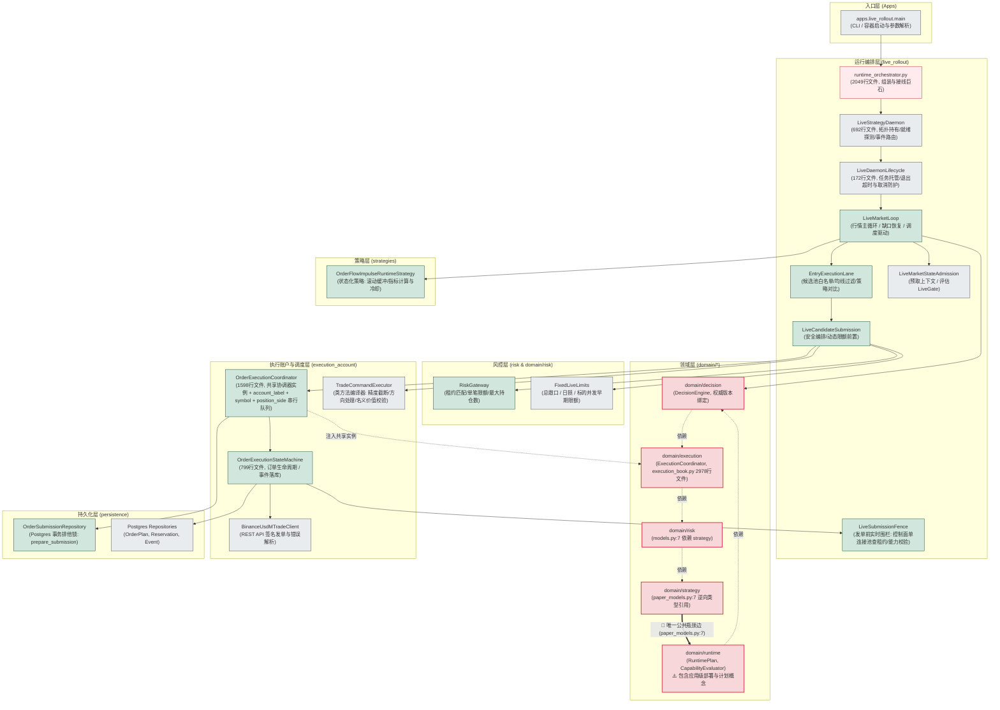

# 交易系统架构审视与设计边界诊断报告（实证评审版）

- **文档状态**：已完成多轮全量子包 AST 反事实复现、并发代码逐行核实与单测运行（85 个单元测试通过，基线命令：`rtk proxy .venv/bin/python -m pytest -q tests/unit/live_rollout/test_submission_fence.py tests/unit/live_rollout/test_submission.py tests/unit/live_rollout/test_order_event_runtime.py tests/unit/execution_account/orders/test_coordinator.py tests/unit/execution/test_trade_command_executor.py tests/unit/runtime/test_capability_evaluator.py`）。明确注意：这 85 个单测仅覆盖各组件局部逻辑，未证明敞口交接、生产崩溃恢复或最终 POST 边界完全无时间窗口。基于 2026-10-03 本地工作树，不代表线上当前部署状态。
- **关联基线**：本地工作树；参考[重构蓝图](system-refactor-blueprint-20260925.md)、[模块解耦审查（9/30）](module-coupling-audit-20260930.md)及[调整后架构（10/01）](trading-architecture-after-adjustment-20261001.md)。
- **核心目标**：梳理系统模块依赖与核心下单执行链路，区分“多并发窗口下的防御性分层”与“真正的过度设计/循环依赖”，对各道防御门禁的真实 I/O 成本、并发控制（TOCTOU）与分级仲裁机制进行深度实证分析，确立安全、可证且改动最小的高价值重构路径。

---

## 一、 核心结论与实证摘要

经过对本地源码（特别是 `apps/live_rollout`、`live_rollout/`、`execution_account/`、`domain/`、`risk/` 等核心模块）的全量子包 AST 解析、反事实消环实验及逐行并发逻辑核实，核心结论如下：

### 1. 经独立反事实复现确认的高价值重构点 ✅
- **`domain` 内部 6 个循环依赖环确凿存在，且“单边斩环”完全成立**：
  全量子包 AST 扫描证实了 6 个简单环的存在。经反事实实验验证，**只要切断 `domain/strategy/paper_models.py:7` 引用 `domain.runtime.runtime_plan.RuntimePlan` 这一条导入边，全部 6 个依赖环立即归零**。进一步核对发现，`RuntimePlan` 在 `paper_models.py:244` **仅用作类型注解字段**（`runtime_plan: RuntimePlan | None = None`）。由于该文件未启用 `from __future__ import annotations`，直接改用 `if TYPE_CHECKING:` 会在类定义期报 `NameError`；必须配合注解延迟求值或将类型注解改为字符串形式，即可在不迁移整个 `domain/runtime` 的前提下以极小代价达成消环。
- **`TradeCommandExecutor` 职责边界明确（纯函数化为可选简化）**：全部为 `@classmethod` 类方法，集中封装了方向处理、精度截断（`tickSize`/`stepSize`）与名义价值校验；将其平铺为纯函数属于可选的代码风格重构，现有封装本身并未引入外部依赖或状态副作用。
- **装配入口职责过载**：`runtime_orchestrator.py` 单文件达 **2049 行、88.1 KB**，混合了底层连接池管理、容错重试闭包、上下文预取和依赖注水，属于典型的装配巨石（Bloated Assembler），而非空心层。
- **历史状态脱节事实存在**：[current-state.md:23-27](../current-state.md#L23-L27)（记录 2026-09-26 13:58 服务器只读快照）确切记录了“8 条 ACTIVE 预留关联的订单已是 filled”以及“41 条预留均缺投影版本且使用合成批次”。历史重构蓝图 §E1（针对代码基线 `42d95a1`，后续实施与观测记录见 `16c2403`）曾将此类现象归因于当时旧代码的转发实现缺乏共用预留结算；而当前工作树已为持久化 Book 预留建立了统一结算入口（详见第六节第 1 点）。快照证实了当时服务器持久化状态脱节的存在，但根因需按当前实现重新验证。

### 2. 严谨核实后的防御性设计真实职责 🛡️
- **分级风控体系（早期快速失败 vs. 最终并发仲裁）**：
  - **早期内存快速拒绝**：`FixedLiveLimits`（[limits.py:49](file:///Users/zhangshuai/PycharmProjects/crypto-momentum-lab/src/crypto_momentum_lab/live_rollout/limits.py#L49)）在候选阶段基于内存事实检查总敞口、日损与持仓上限（`max_open_positions`）；`RiskGateway`（[risk/gateway.py:37](file:///Users/zhangshuai/PycharmProjects/crypto-momentum-lab/src/crypto_momentum_lab/risk/gateway.py#L37)）校验租约属主/ID、单笔名义价值与持仓上限（不包含总敞口与日损字段，实盘显式关闭行情时效校验）。
  - **最终数据库带锁仲裁**：`order_submission_repository`（[order_submission_repository.py:135,380](file:///Users/zhangshuai/PycharmProjects/crypto-momentum-lab/src/crypto_momentum_lab/persistence/postgres/order_submission_repository.py#L135)）在 Worker 出队后、发单落库前的事务内，通过 `SELECT ... FOR UPDATE` 锁租约行并调用 `pg_advisory_xact_lock` 锁定敞口键。**它并非重新读取所有最新账户事实，而是基于调用方传入的基线（`current_daily_pnl`、`current_gross_exposure`、`open_position_symbols`）与数据库内最新的未确认活跃 claims（`active_claim_sum`、`active_claim_symbols`）做原子带锁仲裁**。两者是“无锁快速拦截”与“带锁并发终审”的互补关系；*需注意，终态事件释放 claim 与账户基线刷新之间存在交接窗口，完全防止超限的前提是确保该窗口不出现敞口漏算*。
- **协调器内部真实的 TOCTOU 保护与 Book 事务**：
  Worker 出队后，`OrderExecutionCoordinator` 先执行 `admission#1`（校验入场开关与上下文有效性），随即调用 `_ensure_reservation`（通过实盘装配的 `AsyncPostgresExecutionUnitOfWork` 将批次命令提交至 `ExecutionBook` 并写入 Postgres），随后**立即执行 `admission#2`**。**二次准入并非完整的风控重评**，而是再次核对入场开关与上下文 Token 是否失效，以防御源码注释明确指出的：“账户/风控事实可能在预留提交期间向前推进”（TOCTOU 竞争窗口）。
- **发单前实时围栏（`LiveSubmissionFence`）存在真实数据库 I/O 与能力检查**：
  [submission_fence.py:164,184](file:///Users/zhangshuai/PycharmProjects/crypto-momentum-lab/src/crypto_momentum_lab/live_rollout/submission_fence.py#L164) 使用控制平面共享的单连接池（`heartbeat_engine`，`pool_size=1, max_overflow=0`，与心跳维护、租约管理共享）。在**入场路径**下，串行发起两次 Postgres 查询以动态确认租约与紧急暂停（`active_halts`）；而在 **`reduce_only` 平仓路径**下，围栏仍严格读取并校验租约有效性与围栏令牌（共用同一个单连接池发起 1 次租约查询，受相同的 `pool_size=1` 约束），但**豁免入场开关、draining 状态以及 `active_halts` 读库查询**（确保紧急熔断不阻断离场平仓，这是刻意的交易安全取舍）。此外，围栏还会调用 `CapabilityEvaluator` 校验行情时效（`market_freshness_seconds`）、账户一致性与在途订单（实盘在 `RiskGateway` 关闭行情时效并不代表全链路无时效检查）。围栏主要用于在发单前读取控制状态，缩小已知等待造成的风险窗口；但在当前调用顺序下，围栏检查后仍需经历 WebSocket 预期持仓注册（默认 10s 超时）、可能的冷配置查询及发单限速等待，才到达最终 HTTP POST，因此在发单前最后一刻依然存在需要收紧的物理等待窗口。

---

## 二、 模块依赖关系与真实循环拓扑

### 1. `domain` 内部真实依赖矩阵与 6 个简单环

通过 AST 扫描 `domain` 下 12 个子包的显式导入，跨子包直接依赖关系为：
```
account          -> market
decision         -> account, execution, market, operational, strategy    (无 runtime)
execution        -> account, market, risk, strategy                     (无 decision)
live_rollout     -> market
market           -> operational
risk             -> market, strategy                                    (models.py:7 依赖 strategy)
runtime          -> decision, execution, strategy
shadow_operation -> market
strategy         -> market, runtime                                     (paper_models.py:7 依赖 runtime)
operational / performance / universe -> 无跨子包依赖
```

静态检测出的 **6 个简单循环依赖环**（按实际物理导入边方向）：
1. `strategy -> runtime -> strategy`
2. `decision -> strategy -> runtime -> decision`
3. `execution -> strategy -> runtime -> execution`
4. `execution -> risk -> strategy -> runtime -> execution`
5. `decision -> execution -> strategy -> runtime -> decision`
6. `decision -> execution -> risk -> strategy -> runtime -> decision`

> **极小代价单边消环实证与架构边界说明**：
> 1. **单边斩环有效性**：经反事实实验验证，消除 `domain/strategy/paper_models.py:7` 对 `RuntimePlan` 的导入，**上述 6 个环路瞬间全部归零**。由于其仅用于类属性类型注解（第 244 行），通过在模块顶部添加 `from __future__ import annotations`（或将注解改为字符串 `"RuntimePlan | None"`），配合 `if TYPE_CHECKING:` 即可切断运行期的物理导入边。
> 2. **子包聚合环 vs. 模块级循环**：需要澄清，上述循环存在于**子包聚合依赖图**上，不等于 Python 模块级循环导入崩溃（未出现模块无法解析的 `ImportError`）。`if TYPE_CHECKING:` 消除的是运行期物理导入边，类型级逻辑依赖依然存在；普通 AST 扫描若未过滤类型检查分支，仍会计入此边。

### 2. 顶层包与核心模块依赖图（Mermaid graph TD）



---

## 三、 核心下单流程与真实防御阶段划分

在流经 `_KeyCommandScheduler` 时，调用方协程将命令压入队列并**异步挂起等待其关联的 `future`**（默认入场排队上限 30 秒，出场单不设超时）；后台 Worker 出队后驱动后续流程，在完成后唤醒调用方协程：

```mermaid
sequenceDiagram
    autonumber
    participant Feed as WebSocketMarketStateSource
    participant Loop as LiveMarketLoop
    participant Gate1 as LiveMarketStateAdmission
    participant Strat as OrderFlowImpulseRuntimeStrategy
    participant DecFilter as DecisionEngine.Filter (因果版本绑定)
    participant Lane as EntryExecutionLane
    participant Sub as LiveCandidateSubmission
    participant Risk as FixedLimits & RiskGateway
    participant Planner as TradeCommandExecutor
    participant Coord as OrderExecutionCoordinator
    participant Queue as _KeyCommandScheduler (Worker 协程)
    participant Book as ExecutionBook & UOW (Postgres事务)
    participant Repo as Postgres OrderSubmissionRepo
    participant SM as OrderExecutionStateMachine
    participant Fence as LiveSubmissionFence (发单前实时围栏)
    participant Hub as AccountEventHub (WebSocket)
    participant Client as BinanceUsdMTradeClient

    Note over Feed,Loop: 阶段 1：行情到达与环境准入 (15s 周期)
    Feed->>Loop: run() 摄取 MarketState15s
    Loop->>Gate1: prepare()
    Note over Gate1: 异步预取上下文；评估租约/审批/<br/>账户状态/暂停 (无行情延迟字段)
    Gate1-->>Loop: 准入通过

    Note over Loop,Lane: 阶段 2：策略计算与因果快照绑定
    Loop->>Strat: on_market_state(state)
    Strat-->>Loop: 意图提议 (OrderIntentCandidate)
    Loop->>DecFilter: filter(decision, state)
    Note over DecFilter: 锁定权威 PositionView，<br/>注入 projection_version，持久化 DecisionTrace
    DecFilter-->>Loop: 绑定版本后的候选集
    Loop->>Lane: process() 候选池/EMA规则检查
    Lane->>Sub: execute()

    Note over Sub,Planner: 阶段 3：意图风控与订单计划编译
    Sub->>Risk: evaluate_fixed_live_limits() & evaluate()
    Note over Risk: 早期快速失败：检查动态总敞口、日损上限 (Limits)；<br/>租约属主/ID、单笔上限、持仓上限 (Gateway)
    Risk-->>Sub: 意图通过
    Sub->>Planner: plan_execution(trade_command, rules)
    Note over Planner: 截断 tickSize/stepSize，验证 minNotional
    Planner-->>Sub: OrderExecutionPlan

    Note over Sub,Queue: 阶段 4：异步任务队列缓冲 (调用方协程挂起)
    Sub->>Coord: prepare_and_execute(plan)
    Coord->>Queue: _schedule(plan)
    Note over Coord,Queue: 压入 (account_label + symbol + position_side) 串行队列，调用方 await future 挂起，<br/>入场最多等待 30 秒排队超时，由 Worker 异步消费

    Note over Queue,Repo: 阶段 5：并发排他仲裁、预留与 TOCTOU 保护
    Queue->>Coord: Worker 出队执行
    Coord->>Coord: admission#1.rejection_reason() (出队瞬间时效初检)
    Coord->>Book: _ensure_reservation(plan) -> ExecutionBook.act()
    Note over Book: 先校验账本当前 projection_version，<br/>经 Postgres UOW 事务写入命令并执行批次 CAS 预留
    Book-->>Coord: 预留成功
    Coord->>Coord: admission#2.rejection_reason()
    Note over Coord: 核心 TOCTOU 保护：再次检查入场开关与本地上下文有效性，<br/>检测预留提交期间入口是否被关闭或上下文是否失效 (epoch/快照推进)
    Coord->>Coord: _mark_dispatching_if_accepted(plan)
    Coord->>Repo: prepare_submission(plan)
    Note over Repo: Postgres 事务中 SELECT ... FOR UPDATE 锁租约行，<br/>pg_advisory_xact_lock 锁敞口键；基于基线+最新claims仲裁
    Repo-->>Coord: PreparedOrderSubmission

    Note over Coord,Client: 阶段 6：终态发单与发单前实时物理围栏（修改前实际物理调用链）
    Coord->>SM: submit(plan, prepared)
    SM->>Fence: validate(plan) (前置 Hook: 共享 heartbeat_engine 查租约/halts/能力)
    Fence-->>SM: 围栏放行
    opt 非 reduce_only 订单
        SM->>Hub: register_expected_entry() (WebSocket 预期持仓注册，默认 10s 超时)
        Hub-->>SM: 确认注册
    end
    SM->>SM: _notify_exchange_boundary("submit_request_started")
    SM->>Client: submit_order(plan)
    opt 非 reduce_only 订单
        Client->>Client: 冷配置检查: _ensure_entry_margin_type / leverage (可能触发 REST API)
    end
    Client->>Client: _command_request_pacer.wait(priority) (限速排队等待)
    Client->>Client: _client.post("/fapi/v1/order") (实际 HTTP POST 发单)
    Client-->>SM: ExchangeOrderSnapshot
    SM->>SM: _notify_exchange_boundary("submit_response_received")
    Note over Coord,Queue: Worker 设置 future.set_result，唤醒阶段4挂起的调用方
```

---

## 四、 防御关卡职责分级与成本核对表

系统采用“前端内存快速拒绝 $\rightarrow$ 队列中 TOCTOU 保护 $\rightarrow$ 数据库带锁最终仲裁 $\rightarrow$ 发单前物理围栏”的分层防护模型：

| 防御关卡 | 所在组件与代码位置 | 真实校验事实与触发时机 | 运行开销 (工程估计*) | 适用范围与不可替代理由 |
| :--- | :--- | :--- | :--- | :--- |
| **1. 行情准入门禁** | `LiveMarketStateAdmission`<br/>[`market_admission.py:58`](file:///Users/zhangshuai/PycharmProjects/crypto-momentum-lab/src/crypto_momentum_lab/live_rollout/market_admission.py#L58) | **行情流到达时触发**：上下文提供器为非回填状态异步预取（[`context_prefetch.py:76`](file:///Users/zhangshuai/PycharmProjects/crypto-momentum-lab/src/crypto_momentum_lab/live_rollout/context_prefetch.py#L76)），预取期间 generation 变化则再次读取（`context_reloaded`）；校验租约、审批与账户就绪状态。遇暂时性门禁异常时，策略主循环（[`market_loop.py:314-325`](file:///Users/zhangshuai/PycharmProjects/crypto-momentum-lab/src/crypto_momentum_lab/live_rollout/market_loop.py#L314-L325)）继续运行策略以推进滚动指标与信号候选计算，跳过订单计划与提交流程，避免重启后指标断层。<br>*(注：`LiveGateContext` 无行情延迟字段)* | 上下文预取含数据库 I/O（毫秒级）；`LiveGate` 为纯内存校验（微秒级） | **交易准入与指标连续保护**：阻断不可交易状态下的发单链路；在暂时性异常时保持策略滚动指标连续推进，避免重启后指标断层。 |
| **2. 内存固定限额** | `FixedLiveLimits`<br/>[`limits.py:34,49`](file:///Users/zhangshuai/PycharmProjects/crypto-momentum-lab/src/crypto_momentum_lab/live_rollout/limits.py#L34) | **候选生成后触发**：基于内存缓存事实预估**总敞口**（`gross_exposure + pending_notional`）、**日内总亏损**（`realized_pnl + unrealized_pnl`）、**持仓上限**（`max_open_positions`）、标的并发数。 | 纯内存计算（微秒级） | **早期快速失败（Fast-fail）**：避免明显违规意图进入下游重量级数据库事务和队列。 |
| **3. 租约与单笔网关** | `RiskGateway`<br/>[`risk/gateway.py:37`](file:///Users/zhangshuai/PycharmProjects/crypto-momentum-lab/src/crypto_momentum_lab/risk/gateway.py#L37) | **候选生成后触发**：校验 `active_halts`、活跃租约属主与 ID 匹配、账户状态、单笔最大名义价值（`max_order_notional`）、**持仓上限**（`max_open_positions`）。<br>*(注：不查总敞口与日损；实盘调用点显式传入 `enforce_market_state_age=False` 关闭时效校验)* | 纯内存计算（微秒级） | **策略权限隔离**：确保订单严格归属于被授权的租约与策略，限制单笔过大意图。 |
| **4. 预留与 TOCTOU 保护** | `OrderExecutionCoordinator`<br/>[`coordinator.py:1350-1376`](file:///Users/zhangshuai/PycharmProjects/crypto-momentum-lab/src/crypto_momentum_lab/execution_account/orders/coordinator.py#L1350-L1376) | **Worker 出队后触发**：<br>1. 初次校验入场开关与上下文有效性；<br>2. `_ensure_reservation` 比对当前投影版本并经 `ExecutionBook` 提交 Postgres UOW；<br>3. 二次校验入场开关与上下文有效性（recheck，[`submission_admission.py:22`](file:///Users/zhangshuai/PycharmProjects/crypto-momentum-lab/src/crypto_momentum_lab/live_rollout/submission_admission.py#L22)）。 | 数据库写入（毫秒级） + 内存比较 | **TOCTOU 窗口保护**：代码注释明确指出“账户/风控事实可能在预留提交期间向前推进”。二次准入仅用于**检测入口关闭或本地上下文失效（epoch/快照版本推进）**，非全量重评风控规则；更广泛的限额与敞口并发冲突由后续数据库带锁仲裁负责最终校验。 |
| **5. 数据库原子仲裁** | `order_submission_repository`<br/>[`order_submission_repository.py:135,380`](file:///Users/zhangshuai/PycharmProjects/crypto-momentum-lab/src/crypto_momentum_lab/persistence/postgres/order_submission_repository.py#L135) | **Worker 出队后、发单落库前触发**：在 Postgres 事务中执行 `SELECT ... FOR UPDATE` 锁定活跃租约行，通过 `pg_advisory_xact_lock` 锁定敞口键。**基于调用方传入基线与数据库内最新未确认 claims（`active_claim_sum`、`active_claim_symbols`）**，原子校验 `max_open_positions`、`max_daily_loss`、`max_gross_exposure` 并声明未确认敞口，落库 `SUBMITTING`。 | 数据库事务写入（毫秒级） | **最终并发仲裁（带锁终审）**：并发协程同时通过内存快速限额时，在此处通过悲观锁串行化，结合未确认声明防止超限。*（注：完整防超限需保证终态 claim 释放与账户基线刷新间无漏算交接窗口）*。 |
| **6. 发单前实时围栏** | `LiveSubmissionFence`<br/>[`submission_fence.py:73,164,184`](file:///Users/zhangshuai/PycharmProjects/crypto-momentum-lab/src/crypto_momentum_lab/live_rollout/submission_fence.py#L73) | **HTTP 请求前触发**：使用控制平面共享单连接池（`heartbeat_engine`，`pool_size=1, max_overflow=0`，与心跳/租约共享）；**入场路径**串行发起两次 Postgres 查询确认租约与紧急暂停（`active_halts`）；**`reduce_only` 平仓路径**发起 1 次租约查询（**豁免 `active_halts` 读库查询**以保离场）；调用 `CapabilityEvaluator`（[`capability_evaluator.py:166`](file:///Users/zhangshuai/PycharmProjects/crypto-momentum-lab/src/crypto_momentum_lab/domain/runtime/capability_evaluator.py#L166)）校验行情时效（`market_freshness_seconds`）、账户一致性与在途订单；校验静态 DB revision。<br>*(注：修改前物理调用链中，围栏校验完成后至实际发出 HTTP POST 之间，仍需经历 WebSocket 预期持仓注册、冷配置确认与限速等待)* | 串行数据库查询（入场 2 次 / 平仓 1 次，毫秒级，受网络 RTT 影响） | **发单前读取控制状态，缩小已知等待造成的风险窗口**：在排队与事务落库的窗口期内若外部下发紧急注销、暂停或行情严重过期，在发单准备前物理拦截已知异常；平仓豁免熔断则是为了确保离场不受阻。（*注：批次 B 将进一步将其收紧至限速之后、实际订单 HTTP POST 之前*）。 |

> **关键架构与性能边界声明**：
> 1. \* 开销级别标注（微秒级 / 毫秒级）属于基于 I/O 特征与架构设计的工程估计，非线上基准测试结果。
> 2. 实时围栏与数据库行级排他锁是并发交易系统的物理底线，**绝不可降级为定时心跳**。

---

## 五、 组件分工与既有架构结论对齐

针对存在争议的三处设计，结合历史设计记录进行再审视：

### 1. `ExecutionBook` 与三套协调器（保留分工，降级重构建议）
- **既有结论对齐**：[module-coupling-audit-20260930.md](module-coupling-audit-20260930.md) 明确论证过：`execution_book.py`（2978 行文件）承担了内存持仓批次、CAS 投影版本与批次预留扣减的统一状态所有权，“不能仅按长度认定低内聚或上帝类”。
- **运行时共享实例事实**：[`execution_runtime.py:99-127`](file:///Users/zhangshuai/PycharmProjects/crypto-momentum-lab/src/crypto_momentum_lab/live_rollout/execution_runtime.py#L99-L127) 证实每次执行运行时装配（`build_live_execution_runtime`）创建一个共享的 `ExecutionCoordinator` 实例，并同时注入给 `ExecutionBook` 与 `OrderExecutionCoordinator`。三者是**应用层串行队列排队、内存批次账本与交易所状态机**的职责分工，并非各自维护冲突状态。
- **调整结论**：不建议冒进地强行将它们合并为一个大类。真正该解决的是历史上的**事件结算协议闭环**（见第六节）。

### 2. `DecisionEngine` 异步过滤器的定位
- **核心职责**：[`decision_engine.py:1146-1194`](file:///Users/zhangshuai/PycharmProjects/crypto-momentum-lab/src/crypto_momentum_lab/domain/decision/decision_engine.py#L1146-L1194) 的 `create_authoritative_async_decision_filter` 负责**锁定当时的权威仓位视图（`FrozenDecisionInputs`），并将此时此刻账本的投影版本（`projection_version`）强制注入候选订单的特征字典**，并提交持久化追踪（`DecisionTrace`）。
- **二次投影校验闭环**：该版本在后续出队时，由 [`coordinator.py:821-832`](file:///Users/zhangshuai/PycharmProjects/crypto-momentum-lab/src/crypto_momentum_lab/execution_account/orders/coordinator.py#L821-L832) 再次比对 `execution_book.read(scope)`，版本不一致即拒绝发单，构成了完整的版本因果闭环。
- **调整结论**：它是保证“策略决策基于确切账本版本”的因果证明机制，接口可考虑简化，但功能不能裁撤。

### 3. `Daemon` 与 `Lifecycle` 的存废
- 尽管 `LiveStrategyDaemon.run()` 是单行转调，但其构造期注入了 15+ 子组件，且持有全局就绪探测（`evaluate_readiness`）和账户事件分发；`LiveDaemonLifecycle` 负责后台 Task 的生命周期与 `asyncio.timeout(10.0)` 优雅退出保护。
- **调整结论**：将“砍掉 Daemon 与 Lifecycle”降级为待验证重构，短期内保持现状，避免破坏容器退出的安全收口机制。

---

## 六、 真正确证的高价值重构路径与优先级建议

基于实测源码核对、单测覆盖（85 个单元测试通过）与严谨并发边界分析，按“安全性与防御闭环 > 架构解耦与清晰度 > 代码局部风格”重新编排重构路径与优先级：

### 1. 优先等级 1（攻坚核心）：验证终态结算、敞口 Claims 释放与基线交接的恢复窗口
- **现状确认（多组件终态反应与非事务性切分）**：
  当交易所订单事件或对账事件到达时，系统在不同层级存在并列但非同一事务的反应机制：

  | 轨 / 机制 | 入口与组件 | 核心处理对象与职责 | 触发时机与上下文 |
  | :--- | :--- | :--- | :--- |
  | **轨 A** | `LiveLimitOrderLifecycle.observe`<br/>([`entry_orders.py:93`](file:///Users/zhangshuai/PycharmProjects/crypto-momentum-lab/src/crypto_momentum_lab/live_rollout/entry_orders.py#L93)) | **本地 GTD 过期计时器取消**：停止本地超时撤单 Task，防止已成交/已撤销订单被重复超时触发。 | 状态机 `_on_event` 回调，`event.state.terminal` |
  | **轨 B** | `LivePendingEntryRegistry.observe_order_event`<br/>([`daemon.py:529-541`](file:///Users/zhangshuai/PycharmProjects/crypto-momentum-lab/src/crypto_momentum_lab/live_rollout/daemon.py#L529-L541)) | **内存待入场预留释放**：终态时立即移除内存预留，避免该限价单在其 15 分钟生命周期内持续占用总敞口额度（不必等待下一次数据库上下文刷新）。 | 状态机 `_on_event` 回调，内部自行判断 |
  | **DB Claims 释放** | `order_event_repository.py:165-187`<br/>([`order_event_repository.py`](file:///Users/zhangshuai/PycharmProjects/crypto-momentum-lab/src/crypto_momentum_lab/persistence/postgres/order_event_repository.py#L165)) | **数据库活跃声明核销**：在 Postgres 事件落库事务中将关联的 `LiveExposureClaimRow.active` 与 `ExitEpisodeReservationRow.active` 置为 `False`。 | 订单终态事件落库事务内 |
  | **轨 C** | `ExecutionBook.observe`<br/>([`coordinator.py:1129`](file:///Users/zhangshuai/PycharmProjects/crypto-momentum-lab/src/crypto_momentum_lab/execution_account/orders/coordinator.py#L1129)) | **持久化账本批次与预留结算**：通过 `_observe_order_result_in_execution_book` 统一汇入账本，执行持久化批次推进与预留核销（`consume_reservation` / `release_reservation`）；账户对账亦通过协调器应用快照（[`order_reconciliation.py:149`](file:///Users/zhangshuai/PycharmProjects/crypto-momentum-lab/src/crypto_momentum_lab/live_rollout/order_reconciliation.py#L149)）。 | 协调器发单结果、快照对账与恢复收据 |

- **攻坚实施重点**：
  A/B 本地观察者在状态机事件回调中执行，C 的 Book 结算在协调器接收后端返回或对账后执行，而数据库 claims 则在事件存储仓库内释放；它们**并不处于同一个全局原子事务中**。
  因此，攻坚审计的核心必须针对：
  1. **敞口交接空当（Handover Gap）验证**：证明当终态事件将 `LiveExposureClaimRow` 设为非活跃时，调用方基线（`current_gross_exposure`）是否已同步包含该成交持仓，确保在此交接瞬间不会漏算敞口；
  2. **崩溃重放与幂等恢复**：排查 REST 轮询补扫、WebSocket 掉线重连与定期对账交替触发时的竞态窗口，确保在进程重启、网络抖动或重复回报注入下，多层预留、claims 与 GTD 计时器均能正确核销，彻底杜绝状态悬挂。

### 2. 优先等级 2（高性价比）：消除 `strategy -> runtime` 运行期导入边，化解子包架构环
- **改动点**：
  查看 `src/crypto_momentum_lab/domain/strategy/paper_models.py` 第 7 与 244 行：
  ```python
  from crypto_momentum_lab.domain.runtime.runtime_plan import RuntimePlan
  # ...
  runtime_plan: RuntimePlan | None = None
  ```
  `paper_models.py` 内部**没有任何业务逻辑调用 `RuntimePlan`**，纯粹用作类型注解。
- **实施方案**：
  1. 在 `paper_models.py` 顶部添加 `from __future__ import annotations`（或将注解改为字符串形式 `"RuntimePlan | None"`），解除运行期直接求值；
  2. 将导入包装在 `if TYPE_CHECKING:` 内，切断运行期的物理 import 边；
  3. 数学可证：切断后，子包聚合图上的 6 个循环依赖环立即全部消除；
  4. 后续单独评估 `RuntimePlan` 编译逻辑与 `CapabilityEvaluator` 是否进一步迁至应用配置层。

### 3. 优先等级 3（维护性）：分步拆解 2049 行的 `runtime_orchestrator.py` 装配巨石
- **改动点**：单文件行数达 2049 行，承担了所有基础设施引擎创建、健康探针、心跳通道、重试闭包以及组件拓扑装配。
- **实施方案**：按关注点逐步拆分为结构清晰的子装配器：
  - `storage_assembler.py`（Postgres 引擎、会话工厂与仓储注入）；
  - `market_pipeline_assembler.py`（行情源订阅、缺口恢复与主循环绑定）；
  - `execution_pipeline_assembler.py`（执行运行时、状态机与安全围栏装配）。

### 4. 优先等级 4（可选优化）：评估 `TradeCommandExecutor` 的纯函数化
- **改动点**：`TradeCommandExecutor`（[trade_command_executor.py](file:///Users/zhangshuai/PycharmProjects/crypto-momentum-lab/src/crypto_momentum_lab/execution_account/orders/trade_command_executor.py)）全为 `@classmethod`，承担了方向解析、批次匹配、精度截断与计划构建。
- **实施方案**：可作为后续低优先级的语法简化项，平铺为纯函数 `build_order_execution_plan(command, rules, ...)`；但由于现有类封装本身已隐藏了多项细碎规则且无外部依赖与状态，保留现有形式并不影响系统稳定性。
