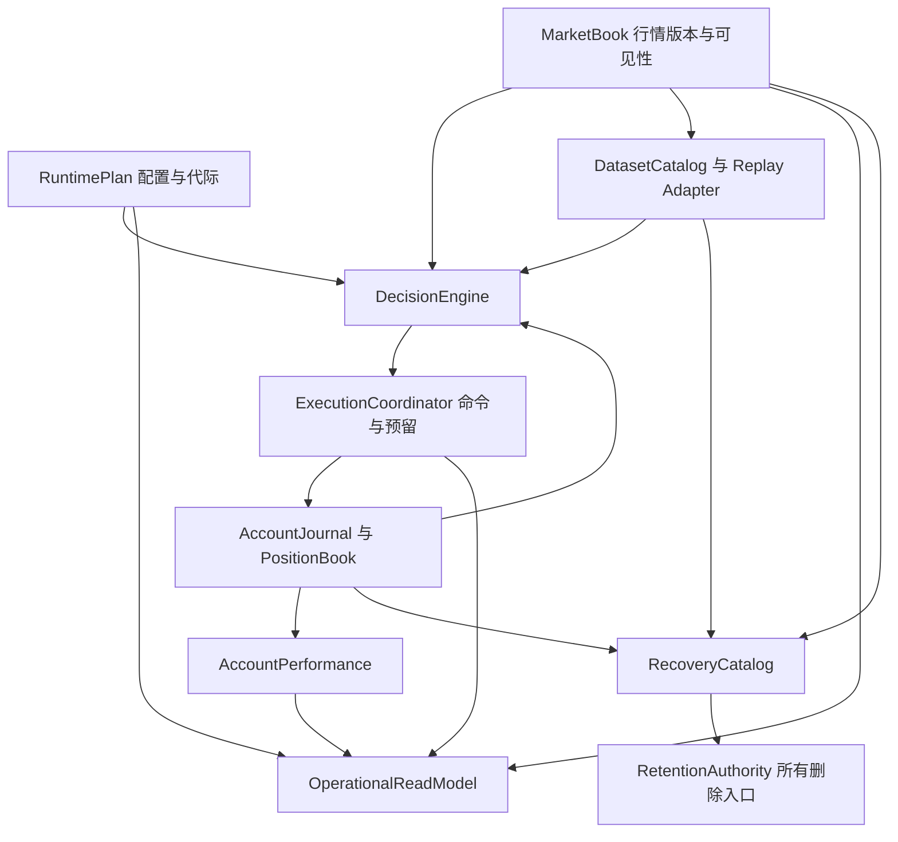

# 全系统第一性原理审视与完整重构蓝图

**状态：审查快照 + 重构提案，未实施。日期：2026-09-25。**

基线：`59ec2b5bef612774f8ac4ba9f646d4ee1b1adc6c`。本次对 `src/crypto_momentum_lab` 的 265 个 Python 文件做结构清点（95,481 行，含注释空行），沿行情、归档、策略、交易、生命周期、配置、指标的关键调用链阅读实现；另检查本地研究目录与运维删除入口。不是逐行审计全部代码。本轮未重新连接生产服务器，不把代码风险描述为已发生的线上事故。

## 1. 总结判断

**有。批次不匹配之外，至少五条链路值得以完整契约重构；共同根因是不同入口各自解释事实、版本、成功和恢复条件。**

重构目标不是更多类、更多目录或更小文件，而是把同一业务事实的解释权收归一个权威 Module，让生产调用方只使用它的 Interface，删除并行旧路径。继续增加模型和单测，却不接通生产写入、持久化、故障恢复与运维入口，会继续出现“文档说已统一、线上仍走旧算法”。

优先级是整改顺序，不代表每项都有已证实的生产故障：

| 顺序 | 重构主线 | 必须解决的根本问题 | 当前证据强度 |
| --- | --- | --- | --- |
| 1 | 数据可恢复性：归档、清理、消费者依赖 | 谁能证明一段事实已不再需要？所有删除入口是否遵守同一证明？ | 已确认入口分叉 |
| 1（并行设计） | 持仓与执行闭环 | 谁拥有账户事实、批次与交易预留？重启后是否仍成立？ | 前文事故已复现；新增 P0—P2 尚需生产接线验收 |
| 2 | 行情版本与研究数据集 | 回放的是当时看见的事实，还是后来修订的事实？ | 已确认核心模型/表与测试契约不一致 |
| 3 | 决策政策与多种执行环境 | 同一策略在实盘、Paper、研究中究竟哪里应相同？ | 已确认部分复用、部分独立模拟 |
| 3 | 运行代际、配置与能力判断 | 当前进程活着是否等于可以交易？哪组配置解释这次行为？ | 已确认契约分散；保留现有有效实现 |
| 4 | 账户收益与运营读模型 | 展示值的来源、口径、时间、完整性是什么？ | 已确认现金流人工配置与多种计算路径 |

不建议全系统一次重写，也不建议新增 Kafka、独立账本微服务或全局 Event Bus 作为前提。沿用现有 Python 多进程与 PostgreSQL，按纵向业务链切换，每次消灭一种重复解释。

## 2. 系统最基本的六条不变量

1. **事实只因新证据修订，不因界面需求或执行便利被改写。** 缺失不是零；未知不是成功；观测不是完整历史。
2. **同一结果必须能指出输入版本。** 时间戳、最大序号、代码 hash 各有用途，不能互相代替。
3. **副作用只能有一个权威执行者。** 幂等和预留必须跨进程、跨重启成立，内存字典不能提供数据库事务语义。
4. **被报告的进度必须兑现对应保证。** received、durable、materialized、applied、reconciled 分开记录；最大进度不是连续完整进度。
5. **恢复依赖不能被清理者猜测。** 消费者需要哪些事实，由可验证的恢复契约决定；备份存在不自动意味着在线恢复可用。
6. **相同政策与相同可见输入产生相同决策。** 实盘和模拟的成交可以不同，决策差异必须能定位到输入或显式政策版本。

不变量应落实为输入类型、存储约束、生产 Interface 与故障测试，不能只写在 Module 的 docstring 中。

## 3. 当前实现核验：哪些是基础，哪些仍是断点

### E1：新批次 Module 已存在，但不能按提交标题判完成

本次新增基线包含 `901f2e9`、`0f552dc`、`59ec2b5`。`domain/execution` 已有 AccountJournal、PositionBook、ExecutionCoordinator、PositionReservation，因此上一版“尚未新增这些类型”的描述已不适用。

但当前 `PositionBook.get_view` 使用进程内计数生成 `pv_<symbol>_<counter>` 与 input_revision；`ExecutionCoordinator` 把 reservations 存在 `_reservations_by_id` 字典。针对这三个新类的引用检索，生产包中仅见定义、领域内部使用和导出，构造调用出现在测试；实际 runtime 仍使用另一个 `OrderExecutionCoordinator`。`submission.py` 仍先生成旧 plan，再在 shadow concordant 时采用 shadow plan。

因此可以认可领域原型与单测进展，不能认可数据库 CAS、持久化预留、outbox 或整条生产链路已经完成。此项沿用[批次完整方案](position-batch-consistency-20260925.md)，本蓝图不再设计第二套账户账本。

### E2：行情双版本契约未贯穿生产身份

- `tests/fixtures/market_data_dual_revision.py` 中定义了 `MarketDataRevisionEnvelope`，测试区分 observed/canonical。
- 生产 `domain/market/models.py:MarketState15s` 没有该 revision identity；`persistence/postgres/models.py:RuntimeMarketState15sRow` 主键为 environment、symbol、bucket_start。
- `runtime_state_repository.py:runtime_state_row` 持有 source watermark、sequence range 和 updated_at，但这些不能唯一指向某次决策当时所见的内容。
- `strategy_runner/replay.py` 未提供贯穿加载与输出的 observed/canonical revision mode 契约。

结论是“无法凭当前这条公共模型/表链路证明当时所见版本完整保留”，不是断言所有原始行情都丢失。原始归档可以成为重建材料，但需要明确且可验证的关联。

### E3：清理的权威分裂

- `apps/market_data/main.py:_resolve_market_data_consumer_requirements` 和账户 retention 已接消费者约束，provider 异常时中止清理，这是应保留的进展。
- 市场侧当前按最早 checkpoint.saved_at、历史非零 position.observed_at 推导需求；它不等价于“活跃消费者明确声明的恢复起点”，可能过度保留，也不能证明所有依赖被涵盖。
- `deploy/ops/archive_and_trim.py` 独立按日期归档、比行数后删除，处理 account_position_snapshots、exchange_order_events、universe_snapshots 等；脚本未调用消费者水位契约。
- `deploy/ops/cml-archive-trim.service` 配置 `--retention-days 1`。本轮未确认该 unit 线上是否启用，不能据此宣称已删坏数据。

归档行数相等证明一项复制核验，不证明消费者恢复可用，也不防止计划与删除之间新增恢复依赖。单独把 daemon retention 改正确仍不足以保护运维入口。

### E4：策略复用已有基础，但完整状态政策仍散落

- live `exits.py` 与 Paper 已复用 `strategy_runner/position_exit.py:position_exit_reason`；不能说完全两套退出规则。
- grace、恢复订单、checked_until、冲突 epoch 等仍由 LiveExitManager 编排。
- `local_optimization/build_raw_opportunity_pool.py:simulate_opportunity_exit` 独立模拟阴线退出、恢复价、grace 超时与成交，包含政策和成交模型两种责任。
- 本地研究已有 snapshot manifest、内容 hash、walk-forward 输入校验，不是毫无数据治理；但研究源码与测试所在 `local_optimization/` 被根 `.gitignore` 排除，主 pytest 配置的 testpaths 为 `tests`，默认测试命令不会收集该目录。

差异未逐条证明都是 bug；问题是政策迁移必须人工同步多个路径，且核心实验不一定能从仓库基线重现。

### E5：运行身份、配置、可交易能力没有统一证据包

- live 已有冻结配置 dataclass、manifest hash 校验、RuntimeMetadataSnapshot，并实际接入 RuntimeSession；这些不能推倒重写。
- 行为配置同时存在 `config/loader.py`、`live_rollout/runtime_options.py`、`runtime_config.py` 等；`submission.py` 在执行路径读取环境变量开关，无法只凭启动 metadata 断言所有行为配置均被冻结。
- `daemon.latest_watermark` 合并市场与账户时间；`evaluate_readiness` 用 unmanaged symbols 与 unresolved orders 的条数作为名为 reconciliation_gap 的输入，返回 enum。它把数量对账、订单不确定、时间滞后压成相近信号。
- 领域 `ReadinessAssessment` 有 allows_entries/allows_exits，但当前 daemon 接口只返回 readiness；实际退出还依赖其他控制链，不能只看这个 enum 判断整个退出能力。

需要统一“运行代际 + 具体动作能力”，而不是新增一个笼统 health 布尔值。

### E6：收益口径仍依赖读侧配置

`operator_dashboard/queries.py` 有 `DEFAULT_LIVE_CASH_FLOW_ADJUSTMENTS`（primary 的指定日期 200 USDT 入金），也支持配置覆盖；`common_equity.py` 从权益扣累计现金流后计算曲线。它是明确的调整方法，不能自动称为 TWR，也不能证明全部真实资金流水完整覆盖。

看板已有 STALE cache header、查询错误与数据缺失区分，本轮不重复报告成未修复。后续应统一指标语义和 provenance，不能继续让每张图各自决定分母、基准日及现金流修正。

## 4. 目标系统：共享身份契约，各领域拥有自己的状态



图中是逻辑 Module，不等于新进程。不同领域不必共享一个全局序号或一个巨型事件表。共享的是身份、版本、coverage、receipt 的语义；每个领域自行保证其存储与重放。

每个跨 Module 输出必须带：完整 scope key、producer generation、schema/policy version、input refs、event/as-of cut、produced_at、coverage/quality、状态与明确错误原因。密码和 API secret 不进入这些审计包。

## 5. R1：RecoveryCatalog + RetentionAuthority

### Interface 与存储

```text
register_dependency(consumer, generation, recovery_spec) -> dependency_version
plan_prune(dataset, requested_range) -> immutable PrunePlan
execute_prune(plan_id, expected_dependency_version) -> PruneReceipt
restore(recovery_spec) -> verified RestoreReceipt
```

`recovery_spec` 指明 source/partition、最早事件或 checkpoint、依赖版本、恢复期限、热/冷恢复能力。消费者挂掉不代表可以删除其历史；依赖注销必须由退休/迁移流程确认，不以心跳 TTL 自动解除。

持久化 `consumer_dependencies`、`checkpoint_catalog`、`archive_manifests`、`prune_plans`、`prune_receipts`。PrunePlan 固化范围、覆盖证明、manifest hash、依赖 epoch、级联删除子表范围。NULL/查询失败/依赖缺失与“确认没有依赖”是不同结果。

### 原子性与恢复

归档完成先验证内容 hash、schema、分区清单和恢复抽样；删除前再检查依赖 epoch。依赖登记与清理计划进入同一锁/版本协议，防止刚登记的回放被旧计划删除。大表按已冻结分区/键范围分批执行，可恢复 receipt，禁止每批随意重算日期范围。

冷存储只有在消费者 Adapter 支持、访问凭证与恢复预算通过演练时才能替代热数据。否则即使已备份也要阻止删除。磁盘压力通过容量预警、扩容或有记录的停止采集处理，不能绕过事实保留证明。

### 迁移与删除

先让现有清理入口全部输出 dry-run 计划对照，再把 daemon、systemd 脚本、分区 drop 收敛到执行同一 PrunePlan。保留已有 ArchiveJournal/materializer，替换的是删除决策权。最终删除独立 `now-retention_days` 直接执行 DELETE/DROP 的旁路。

验收：活跃长生命周期、休眠消费者、恢复中断、清理中新增依赖、损坏归档、级联子表、重复计划均有集成测试；不能只测 `min(cutoff, watermark)` 纯函数。

## 6. R2：MarketBook + DatasetCatalog

### 明确两种合法目的

- `decision_visible`：某次决策当时实际可见的版本，用于解释线上行为。
- `canonical`：后续修订的研究版本，用于评估修复后的历史，不能冒充当时可见信息。

新增/补齐 `MarketRevisionRef(scope, bucket, revision, content_hash, published_at, source_epoch)`；业务 bucket key 与内容 revision key 分开。现有按 bucket 的运行表可以继续作为 latest projection，但不能独自承担不可变历史。

```text
publish(state, lineage) -> MarketRevisionRef
read(ref) -> immutable MarketEnvelope
build_dataset(scope, interval, visibility_mode, cut) -> DatasetManifest
open_dataset(manifest_id) -> verified ordered stream
```

每次修订 append，canonical pointer 可原子前移；旧 revision 仍可由决策引用读取。DecisionTrace 固化输入 ref，不查询“现在最新版本”来解释过去。dataset manifest 固化 universe 版本、标的覆盖、修订集合、有效区间、schema 与特征算法版本。

已存在 journal receipt、materialized sequence 与 rejection audit 继续复用。区分 ingest received、accepted durable、materialized 和 consumer applied；coverage 由区间/孔洞证明，不从最大 sequence 或最后文件推导。

迟到事件形成新 revision；同 input hash 幂等；相同 revision key 不同内容报冲突。序号重启须由 stream epoch 隔离。决策、checkpoint、manifest 引用的 revision 纳入 R1 恢复依赖。

迁移：并行记录 revision refs → 新决策持久化 refs → replay 显式选择模式 → 将 latest-only 读取限制在当前显示场景。历史无法恢复当时版本时输出 `unreproducible`，不以 canonical 补造。

验收：生产 publisher→存储→DecisionTrace→Replay 的集成场景中，同 bucket 两版本都可读取；现场所见回放重现原决策，canonical 回放允许不同但必须解释。现有只用测试夹具证明版本不同的测试不足以验收。

## 7. R3：DecisionEngine 与 SimulationExecution

```text
decide(DecisionInput, PolicyState, EffectivePolicy) -> DecisionResult
```

Input 包含 MarketRevisionRef、PositionView version、universe ref、risk/config version、显式 clock event。Result 包含 intent、next policy state、拒绝理由、input hash 与 decision ID。无数据库、网络、隐式 now、随机 ID 或环境变量读取。

先把已有 entry_policy、position_exit_reason 收入共享政策核心；将 grace、截止时刻、候选到期、追加锚点、冷却、跨日 sizing 等确属策略含义的状态迁入 versioned PolicyState。查单、撤单 ACK、延迟、部分成交属于 Execution Adapter，不塞回政策函数。

实盘 Adapter 提交真实命令；Paper/研究 Adapter 根据显式 FillModel 产生成交事件，再进入相同持仓/组合状态契约。模拟手续费、滑点、排队和资金费有独立版本，不能把“碰价即成交”伪装成交易所事实。

研究源码、schema 和测试进入正常版本控制与 CI；数据、缓存与生成报告继续忽略。保留现有 manifest 与 walk-forward 验证。跨切分携带现金、持仓、挂单、冷却和 sizing state；评估与训练使用不同权限的数据切片。

迁移以单个策略闭环开始：相同冻结输入在 live dry-run、Paper、research 都经过 decide，先比较 DecisionTrace，再解释成交模型造成的收益差异。保留专门的近似研究模式，但名字、能力和误差必须显式，不要求不同成交模型产生相同 PnL。

最终删除各 runner 中重复的政策解释；`simulate_opportunity_exit` 若保留，只负责驱动公共政策和成交模型。验收按决策及状态转换逐事件比较，不能仅比较最终收益或信号条数。

## 8. R4：RuntimePlan、CapabilityEvaluator 与恢复协议

### 配置与运行代际

在现有 runtime_options/manifest 基础上编译不可变 `RuntimePlan`：字段值、来源、override 链、strategy hash、execution-policy hash、risk-policy hash、deployment hash、schema compatibility。secret 只存引用，不进正文/hash 可枚举空间。

运行时禁止执行路径直接读取行为 env；热更新必须形成 ConfigChange 事件与新版本，并定义对已开仓/已发命令的影响。持仓保留适用政策；部署不能用新 defaults 静默解释旧 checkpoint。启动加载 plan、校验 schema/checkpoint、恢复在途命令、获取 generation fencing 后才宣告 ready。

### 按动作评估能力

```text
evaluate(action, versioned_evidence, runtime_plan) -> CapabilityDecision
```

动作至少区分 enter、normal_exit、cancel、reconcile、emergency_reduce。输入分别带行情新鲜度、账户可比性、订单未知状态、授权、租约、市场规则版本；输出允许/拒绝、原因、证据版本、有效截止点。

不能把“缺行情”与“批次身份冲突”都映射成“允许所有退出”。普通批次退出需要可信归属；撤单、查单和独立授权的风险减仓有各自前提。既不能因研究归档落后阻塞撤单，也不能用“减风险优先”绕过数量和账户身份校验。

### 生命周期

保留当前 RuntimeSession、supervisor 和结构化 ShutdownResult，逐个入口确认资源只归一个 owner。先停止新命令、持久化恢复状态和未决副作用，再释放 writer 权限与资源。SIGKILL 不可能依赖 finally，因此真正恢复必须依赖持续写入的 journal/outbox/checkpoint。

不同 daemon 复用协议与 receipt，不强迫把行情进程塞入 live 专用类。完成状态至少区分进程停止、checkpoint durable、未决命令可恢复和业务完成，分别暴露。

验收：配置来源冲突、未知字段、行为开关未入 hash、旧 checkpoint 不兼容、双 generation、任意阶段 kill、依赖滞后时不同动作的能力矩阵。完成后移除深层 env、重复 readiness 猜测及多重资源关闭责任。

## 9. R5：AccountPerformance 与 OperationalReadModel

统一现金流、手续费、资金费、已实现/未实现盈亏与权益观测的身份和来源。复用 AccountJournal 的相关事实，不从 dashboard 配置构造权威资金流水。历史人工调整迁入带证据和审批来源的 correction records；未知资金流水覆盖时只能给“未校正权益变化”或未认证值。

```text
calculate(metric_spec, account_cut, interval) -> MetricValue
read_health(scope, evidence_cut) -> OperationalView
```

MetricValue 包含 value/null、unit、metric_version、基准与区间、source refs、coverage、as_of、status。净权益变化、扣现金流收益、TWR、MWR 不互相冒名；有适当估值分段与现金流覆盖才计算对应收益率。

跨账户比较必须同区间同口径；原始价格与估值时点缺失显式标记。UI 格式化数值但不重新计算业务事实。API/缓存保留原始 source_asof，cache HIT 不刷新事实时间。

保留已有 STALE、UNKNOWN、QUERY_ERROR 区分，并把这些状态纳入统一 schema。健康至少分进程存活、消费进度、事实完整性、可执行能力、对账一致性；绿色 heartbeat 不能覆盖其他维度。

迁移先双算固定账户历史区间，逐项解释差异，再切 API；不同公式先标清名称，不追求数值强行一致。最终删除看板内硬编码现金流默认值与分散的收益分母规则。验收入金无交易、部分窗口、零/负基准、资金费、缺估值、陈旧缓存、跨账户比较。

## 10. 全局实施顺序、切换与回滚

| 交付阶段 | 交付物 | 进入下一阶段的门槛 |
| --- | --- | --- |
| A 契约基线 | 当前权威/旁路清单、样本输入、schema、历史兼容表；确认 P0—P2 生产接线状态 | 每个“完成”项均能给出真实调用链与 durable evidence |
| B 数据保护与账户闭环 | R1 所有清理入口统一；既有批次计划完成持久化/执行/恢复 | 无删除旁路；AKE/SAND 与跨重启预留通过集成验收 |
| C 输入可重现 | R2 版本 refs、DatasetManifest、checkpoint 依赖 | 一条生产决策能从冻结 refs 重放 |
| D 政策及运行闭环 | R3 单策略端到端、R4 RuntimePlan 和 capability 接入 | 多 Adapter 决策一致；故障与配置代际验证通过 |
| E 指标与收尾 | R5 读模型、扩账户/策略、删除旧分支与开关 | 发布来源一致的指标；旧路径无生产引用 |

R4 的配置编译可在 B/C 期间准备，但政策迁移使用哪个配置版本必须在 D 切换前确定。R5 的事实采集准备也可提前；不把看板重做当作前序正确性的替代品。

统一迁移步骤：扩 schema → 记录新证据 → 同输入影子验证 → 单 scope 切换 → 故障演练 → 扩大范围 → 删除旧路径。影子允许双计算，不允许双下单或两个清理者各自删除。

回滚按投影/配置/消费指针版本执行，保留不可变事实。降级回滚不得重新启用已知破坏不变量的算法；没有可验证旧版本时暂停受影响动作并保持恢复/风险能力。数据库破坏性 schema 删除在兼容期和恢复演练之后单独执行。

## 11. 如何防止重构再次变成补丁集合

每个交付包必须同时提交六类证据：

1. **生产调用证据**：从 CLI/daemon 到新 Interface 的真实路径；不得只有 export 与测试引用。
2. **持久化证据**：表约束、事务、幂等键与恢复读取路径；内存实现只作 Adapter/测试原型。
3. **不变量测试**：冻结输入、边界情形、并发和崩溃；覆盖原事故机制。
4. **影子差异解释**：用事实裁决，不以旧算法一致作为唯一通行证。
5. **删除清单**：旧实现、开关、旁路脚本、重复推断的删除或明确到期计划。
6. **运维可操作性**：状态、证据 ID、恢复命令、演练结果与回滚指针。

对 AccountJournal/PositionBook/ExecutionCoordinator 等名称，应区分“领域原型”“生产接入”“持久化恢复通过”“旧路径已删除”四级状态，禁止只用“已完成”一个标签。

## 12. 本次验证与保留项

已运行以下相关基线测试，结果 **52 passed in 1.53s**：

```bash
rtk proxy .venv/bin/python -m pytest \
  tests/unit/market_data/test_market_data_revision_contract.py \
  tests/unit/operational/test_retention_contract.py \
  tests/unit/execution/test_progress_contract.py \
  tests/unit/live_rollout/test_runtime_session.py \
  tests/unit/live_rollout/test_runtime_options.py \
  tests/unit/domain/strategy/test_entry_policy.py \
  tests/unit/research_collector/test_journal.py \
  tests/unit/research_collector/test_materializer.py -q
```

该结果说明已有能力应复用，不证明上述跨 Module 契约已经闭合。本次没有执行生产删除、故障注入、全量集成测试或交易所操作；未将静态风险标为已发生事故。

不建议重写：交易所基础解析、数量量化、已有 entry/exit 纯函数、ArchiveJournal/WindowMaterializer、RuntimeSession 的有效实现、现有现金流校正数学工具及 snapshot manifest。它们应作为目标 Module 内部实现保留，重点改权威、输入、持久化与调用契约。

文档与研究代码当前受 `.gitignore` 排除，本报告仍保存为工作区文件；落地时应把架构规范、必要研究源码与测试纳入版本控制，生成数据继续忽略。本次没有修改忽略规则或暂存其他工作。

本蓝图承接 [09-20 系统审视](system-module-first-principles-review-20260920.md) 与[批次重构方案](position-batch-consistency-20260925.md)，以本次代码基线重新确认断点，不将历史文档的建议或模块名当作已实施事实。真正的终点是：**每类事实、决策、副作用和删除行为只有一个可验证的权威契约，故障恢复后仍然成立。**
