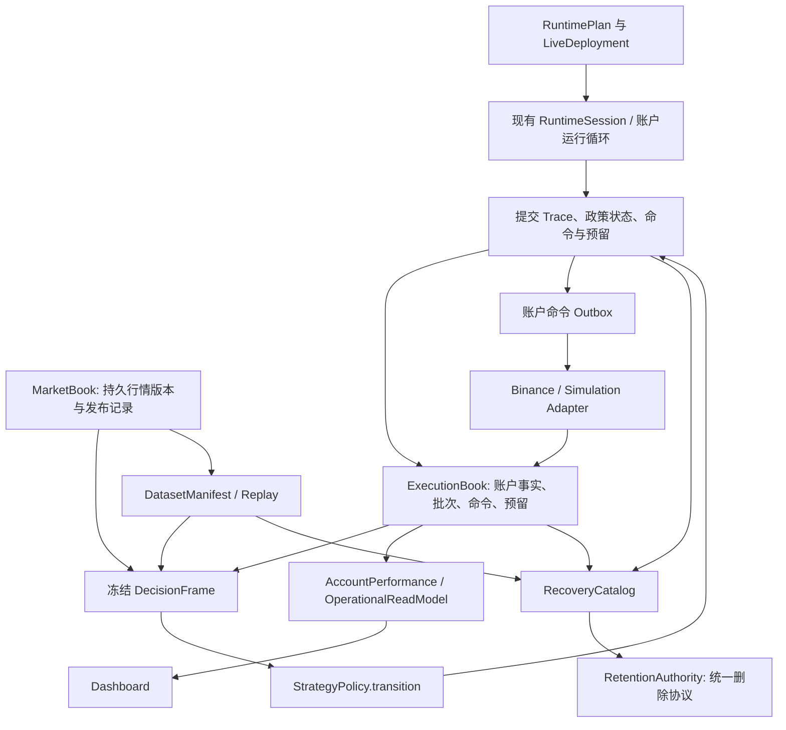
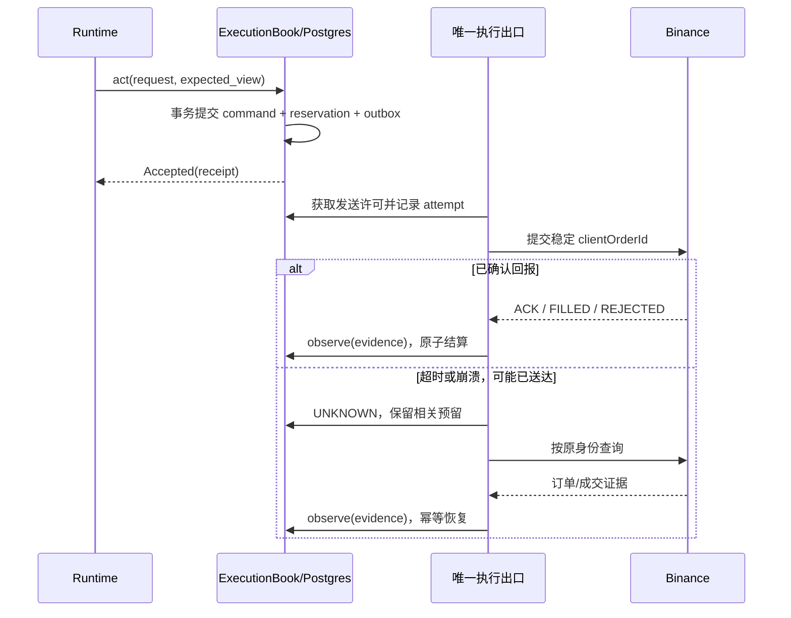

# 全系统第一性原理审视与完整重构方案

**状态：审查快照 + 重构提案；本次只更新文档，未实施重构、未修改生产服务。**

初版：2026-09-25。**最近实证修订：2026-09-26。**

代码基线：`42d95a1dd15176501cec698de63655c86fe06685`。服务器：`43.167.191.253`，只读观测时间为 2026-09-26 13:58—14:06（Asia/Shanghai，UTC+8）。

本文直接修订原蓝图，作为后续重构的统一入口。9 月 25 日的领域原型、阶段 A 清单和旧审查保留历史价值，但其“尚未实现”或“已完成”结论均需按本次证据重新判断。文件名保留，避免再产生一份相互竞争的“最新版”。

## 1. 结论与系统目标

**需要系统性重构。主要问题不是缺少新类，而是新契约没有完全取代旧的状态所有权、事务和恢复路径。** 最近的改动已增加持久预留、行情修订、决策类型、清理权威和收益计算；它们是可复用的基础。继续在每个入口补检查、补回调、补 `READY` 条件，会让同一业务事实仍由几套算法解释。

系统最基本的任务是：**将可追溯的市场和账户事实，转成可解释的策略决策；只执行被授权的副作用；在重复、延迟、超时和重启之后仍能证明持仓、订单与资金状态。** 研究和看板是这条事实链的消费者，不能反过来构造交易事实。

本次最强的现场证据是：

- 线上 41 条 `position_reservations` 全部没有 `expected_projection_version`，全部使用 `batch_{symbol}_{position_side}` 合成批次；其 `client_order_id` 字段也全部为空，当前实际通过 `command_id` 关联订单。
- 9 条预留仍为 `ACTIVE`，其中 **8 条关联的 `exchange_orders.state` 已是 `filled`**，四个账户各 2 条。这证明持久状态转换存在脱节；**不据此推断发生了重复下单、超额平仓或资金损失**。
- 行情修订表已真实写入，统计估计约 20 万行；`decision_traces` 与 `dataset_manifests` 均为 0。结合代码调用链，可以确认“行情版本 → 完整决策 → 精确重放”尚未闭合。
- 四个 Live 的局部 readiness 写着 `entry_enabled=true`，全局 `/api/readiness` 为 `DEGRADED`；局部 readiness 中的市场 age 是上次发布时的值。它们目前表达不同范围、不同采样时刻的状态，不能拼成一个交易能力证明。

建议优先级：**执行一致性与恢复/清理 → 输入可重现 → 完整策略政策 → 运行能力与发布 → 收益和运营读模型**。配置身份和现金流采集可以提前准备，不必等待串行完成全部阶段。

沿用现有 Python 包、多进程和 PostgreSQL。此次重构不以 Kafka、Kubernetes、独立账本微服务、通用插件平台或更换语言为前提；也不按文件行数机械拆分。目标是减少重复解释和状态写入者。

## 2. 核查范围与现状

### 2.1 覆盖范围

清点 `src/crypto_momentum_lab` 的 **285 个 Python 文件、103,536 行**（含注释和空行），以及 260 个 Python 测试文件。沿以下纵向链路阅读关键实现，并检查 Compose、迁移模型、部署脚本、看板和本地研究入口：

| 范围 | 当前职责 | 本次判断 |
| --- | --- | --- |
| Universe、Binance 行情、15s 聚合、hub | 采集、标的池、实时状态发布 | 保留成熟实现；统一发布身份、时间和覆盖证据 |
| raw archive、research collector、materializer、Parquet | 持久接收、研究数据物化 | 保留 journal/recovery 基础；接入统一 dataset 与恢复依赖 |
| StrategyRunner、Replay、Paper、local_optimization | 策略与研究模拟 | 完整政策、输入和模拟模型需要统一 |
| 账户同步、用户流、REST reconciliation | 账户事实摄取 | 保留双通道；所有事实进入同一幂等应用协议 |
| Live entry/exit、批次账本、订单协调、风险 | 决策与副作用 | 首要重构：统一权威、事务及恢复 |
| Runtime config/session、lease、capability | 配置、资源、交易能力 | 保留现有能力；接通完整计划与按动作证据 |
| retention、分区、运维归档 | 历史保留和删除 | 统一数据集身份、冻结集合和破坏性事务 |
| dashboard、收益计算、健康查询 | 运营读模型 | 统一来源、口径、覆盖与时效 |
| Compose、update_server、测试 | 发布及验收 | 从格式检查提升到可恢复的业务切换协议 |

这不是对全部源码逐行审计，也不是长期性能压测。`local_optimization/` 有 69 个 Python 文件，本次抽查其策略/模拟/产物链；不把它被 Git 忽略本身判为缺陷，也不改变其跟踪方式。重现性应由代码摘要、依赖版本、输入 manifest 和政策版本证明。

### 2.2 服务器只读快照

| 项目 | 本次事实 | 解读边界 |
| --- | --- | --- |
| 代码/镜像 | 服务器 checkout 与 11 个应用容器均为 `42d95a1` | 镜像标签与源码身份一致，不能单独证明全部业务契约通过 |
| 拓扑 | 4 Live + 4 account sync + market-data + collector + dashboard + PostgreSQL，共 12 个运行容器，均 healthy | 此时无 Paper 容器；仓库有 Paper 配置不等于它在运行 |
| 主机 | 2 核，内存约 3.7 GB；采样可用约 1.3 GB；根盘使用 51% | 单次快照不足以确认 CPU、内存或 I/O 瓶颈 |
| PostgreSQL | `postgres:16-alpine`；库约 2,447 MB；Alembic 为 `20260925_0043` | 未做写库、迁移或故障注入 |
| 数据库用途 | primary Live 的 execution/market/observability URL 最终相同 | 逻辑 plane 当前没有物理隔离；先把同库事务做正确 |
| 运维归档 | `cml-archive-trim.timer` 为 inactive/disabled | 不能再把“该 timer 仍在每日危险删除”写成当前事实；daemon retention 仍工作 |
| 行情修订 | `pg_stat_user_tables` 估计 200,994 行、321 MB；后续 30 分钟窗口有 4,667 次发布 | 行数估计不是精确计数，也不代表所有历史都能重放 |
| 新追踪/研究表 | `decision_traces=0`、`dataset_manifests=0` | 表为空结合无生产调用，证明该条新追踪链尚未接入；旧 signal 记录仍存在 |
| 预留表 | 41 行；9 ACTIVE，其中 8 对应 filled、1 对应 acknowledged | 需要按事实重新结算，不能直接批量释放 ACTIVE |
| 资金读模型 | `cash_flow_corrections=0`、`account_performance_metrics=0` | 指标可即时计算，空指标表本身不是故障；缺资金覆盖证据则不能认证收益 |
| 依赖/清理计划 | durable 依赖仅见两个物理数据集各 2 条；已完成计划使用 `market_data`、`account_snapshots_*` 等名字 | 尚有旧 consumer requirement 保护，不能据此宣称已误删；需统一命名与锁协议 |

本次未读取/导出 `.env`、账户密钥或凭据内容；未执行交易所私有请求、下单、撤单、配置变更、重启、清理或部署。文档不保存登录凭据。

## 3. 从第一性原理确定不变量

以下是目标 Interface 必须承诺的业务条件，不是类的命名规范。

1. **事实、推导、决策和副作用分开。** 交易所观测不等于完整历史；候选不等于获准命令；本地事务成功不等于订单成交。
2. **身份包括完整作用域。** 持仓至少包含 venue、environment、account、symbol、position side。strategy 是归属，run 是运行溯源，不能代替账户身份或隔开同一物理仓位的容量约束。
3. **每项可变状态只有一个权威写入协议。** 多个进程可以摄取事实，但必须经过同一去重和状态转换规则；缓存不拥有独立业务状态。
4. **版本由已提交事实决定。** 重复读取不产生新版本，重启不重置版本；相同 version 不允许对应不同语义内容。
5. **每次决策固定实际输入。** 市场窗口、账户 cut、持仓批次、universe、政策、风险、时钟和前置状态均可追溯；canonical 修订不能改写当时所见输入。
6. **预留、命令与恢复是一件事。** `reserved = active + consumed + released`；同批活动预留不超过可信剩余量。结果未知时不能按普通失败或 TTL 释放。
7. **收到数据不等于完整覆盖。** received、durable、materialized、applied、reconciled 分列；最大序号、最后时间和“有几条事实”都不能独自证明没有缺口。
8. **删除必须证明恢复依赖已满足。** 清理者无权猜测消费者已退休；归档存在也不等于恢复可用。
9. **收益与健康状态必须带证据。** 一条现金流内容正确不等于整个区间没有漏流水；进程健康不等于某项交易动作获准。
10. **上线成功必须包含切换与恢复证明。** 新模块被导入、表被写入、单元测试通过，都只是中间状态；对应旧权威路径退出后才能完成收敛。

沿用 [CONTEXT](../../CONTEXT.md)：持仓批次是连续开仓成交集合，**平仓边界是平仓单提交时刻**，不是决策生成、平仓成交或订单过期。发送结果/时刻无法确认时保留未决归因，不凭最新快照猜出批次。

## 4. 本次确认的六个结构性断点

以下代码行号均对应 `42d95a1`。根因优先级与改造顺序相关，不代表每条静态风险都已经造成生产事故。

### E1：账户执行还没有一个完整的状态机

已实现：`runtime_orchestrator.py:626–655` 注入真实异步 Postgres reservation repository；已有订单超时查单、串行调度和容量检查。PositionLedger 与新 TradeCommandExecutor 在条件满足时参与真实路径，不能描述成“全是测试原型”。

断点：

- `execution_account/orders/coordinator.py:394–566` 在应用层重新解释批次、容量和预留；`runtime_orchestrator.py:644` 的领域 `ExecutionCoordinator()` 另维护内存状态。
- `quantization.py:119–135`、`shadow_auditor.py:263–278` 没把真实 allocations/projection version 带入实际 plan；`order_repository.py:206–224,1022–1044` 也不持久化/恢复这些字段。线上 41/41 合成批次、缺版本与此一致。
- `coordinator.py:739–755` 的预留与订单 prepare 是两个事务。prepare 返回 None（包含订单已存在情形）或外层异常会释放预留，未证明已有副作用不存在。
- `coordinator.py:820–852` 的 REST/WS 回报只转发 backend，没有共用预留结算；取消在 `:802–810` 只释放第一个 allocation。零成交拒绝还会被 `:612–617` 提前返回挡住终态释放。
- reservation 的版本比较使用其他 reservation 的字符串版本，不是数据库中的权威 projection head；调用方还可以传入 `batch_quantities` 作为容量依据。
- `PositionBook.get_view` 仍有读取自增版本，`AccountJournal.read_cut` 在缺覆盖证据时可从已有成交时间范围推成 CONFIRMED；这两个原型不能原样晋升为 Live 权威。

**根因：** submit、查单、成交、撤单、恢复分别拥有“订单完成后该怎么做”的知识。应重构整个接受命令与应用证据协议，而不是每个 handler 再补一次 release。

### E2：行情版本已落库，但决策引用和哈希不是同一个契约

- 生产发布 `runtime_state_repository.py:209–236` 写入带环境、bucket 和内容 hash 的 revision。
- `decision_engine.py:445–456` 却临时生成 `rev_{symbol}_{timestamp}`，并把 `published_at` 设为 bucket end。消费者重新发明身份，无法据此读取生产发布记录。
- `compute_market_state_hash`（`market_book.py:47–80`）遗漏 `closed_kline_1m_*` 字段，而 `portfolio.py:125–179` 用这些字段聚合退出蜡烛。
- `compute_decision_input_hash`（`decision_engine.py:197–211`）只包含 policy/state 的版本标签，未覆盖完整参数、cooldown 内容、候选、批次和账户身份等语义。
- `DecisionTraceService` 没有生产调用者；其重放判断主要比较 intent 是否存在及拒绝理由，尚不能证明数量、价格、分配和 next state 相同。

本地源函数探针确认：保持 policy id/version 但改变阈值、保持 state version 但改变 cooldown、只反转一分钟蜡烛方向，分别仍得到相同哈希。这不是理论上的哈希碰撞，而是**序列化输入遗漏**。

**根因：** 发布者、消费者、研究侧各自定义“同一个输入”，而不是传递生产者生成的不可变引用。

### E3：DecisionEngine 目前是过滤器，尚未拥有完整政策

- Live `create_authoritative_decision_filter` 没候选就返回；持仓退出不会仅凭这条链被驱动。
- `runtime_orchestrator.py:1048–1052` 未接 `on_decision_result`；`LiveDecisionFactSource.set_policy_state` 没有生产调用者。next state 没有持续落到 Live 政策状态。
- exit 仍走独立 `LiveExitManager`；Paper 先执行旧组合退出，再评估新引擎；Replay 和本地机会池仍有独立政策/模拟路径。
- 新引擎自身在 `decision_engine.py:238–255` 将 15 秒状态包装成 `ClosedCandle15m`，且退出方向写死 LONG。它不能只靠接线就接管原生产退出。
- `tests/unit/decision/test_multi_adapter_consistency.py:170–195` 主要对手造输入直接调用两次 `decide`，没有经过真实 Live/Paper/Research 入口。

**根因：** 抽出了“某次评估”的函数，却没收回指标记忆、cooldown、追加锚点、退出时钟和政策状态转换。完整的策略状态机仍在 runner 中。

### E4：清理的计划、依赖、锁和归档对象仍分裂

已实现：高风险 timer 已停；运维脚本已有持续 session lock、冻结目标和计划表；daemon 的旧 consumer requirements 仍会收紧 cutoff。不能重复指责已修正的临时连接锁问题，也不能把当前描述为“完全没有保留保护”。

剩余结构问题：

- account plan 用 `account_snapshots_{account}`，market plan 用 `market_data`；持久依赖与 DELETE 锁却使用物理表名。名字不同的锁不会形成同一互斥协议。
- `runtime_state_partitions.py:138–199` 的分区 DROP 没走相同 retention advisory lock；不能只收编行 DELETE。
- `archive_and_trim.py:517–554,735–817` 先归档后冻结删除集合，主要比较数量，指纹只输出。相同行数不能证明归档内容等于删除内容。
- `execution_account/retention.py:103–104` 返回 `(total_deleted, 0)`，上层按 `(rows_archived, rows_deleted)` 解读；市场侧也把两类删除数套进相同元组，分区数与行数还可能混用。

**根因：** “可以删什么”与“实际删了什么”不由同一份稳定计划和事务负责。继续补 cutoff 会同时留下误删窗口和不可解释的过度保留。

### E5：运行配置、能力与发布仍有多套证据

已实现：真实 Live manifest/options、冲突检查、`RuntimeSession`、资源归属、entry fence、严格 preflight 和结构化 readiness 均存在，必须复用。

- 新 `RuntimePlanCompiler/CapabilityEvaluator` 的生产源码调用者仅 Paper 启动路径；编译器仍含示例阈值/固定风险参数。不能把类存在当成 Live 已统一配置。
- `submission_fence.py:72–73` 对 `reduce_only` 直接返回。应保留减风险优先，但所有交易所写动作仍需要正确账户、有效执行者和命令身份。
- `readiness.py:410–415,552–580` 在 warmup 计数未变化时不重新发布；本次读取时文件已约 82 秒旧，里面却仍是约 0.49 秒的市场 age。应从原始时间戳计算读取时 age。
- 四账户 readiness 声明 migration=`20260911_0036`，同库实际为 `20260925_0043`。当前部署比较的是配置/approval 声明，不能把它当作实际数据库版本证明；这不等于已证明 schema 不兼容。
- `update_server.sh:1269–1366` 校验了身份和字段格式，但允许 age=None 或任意非负数。发布成功尚未完整验证恢复与动作能力。

**根因：** 配置声明、数据库观测、进程状态和交易许可没有各自明确的身份与有效期，也没有共同发布收据。

### E6：收益认证仍由读侧推断完整性

已实现：现金流 correction 表、统一 calculator、无证据时隐藏收益值、STALE/UNKNOWN 等状态已有基础；不能再说仍靠旧的默认 200 USDT 硬编码构造全部收益。

- `performance_builder.py:130–281` 校验“所给现金流记录”的内容 hash 和 approval，再据此认证区间；没有权威现金流扫描范围、游标、分页完成或已证明零流水的 receipt。
- 本地纯输入探针只提供期初 100、期末 220、期中入金 100、两端估值；没有入金时点估值或完整流水覆盖证明，仍得到 `is_certified=True`、`twr=0.133333`、`modified_dietz=0.133333`。
- `account_performance.py:186–246` 实际在子区间使用时间加权资金分母，属于 Dietz 类近似；应明确方法和估算状态。精确 TWR 与近似方法的区别参见 [GIPS 官方计算说明](https://www.gipsstandards.org/standards/gips-standards-for-asset-owners/gips-standards-handbook-for-asset-owners/)，本方案不声称系统取得任何 GIPS 认证。
- builder 使用 wallet balance 构建 equity；另一路已有 wallet+unrealized 等曲线，必须明确指标是钱包收益还是按市值权益收益。
- `/api/account-performance` 的查询只按 account label 和起点筛选，缺少 environment、asset 和明确终点过滤；本次线上每账户仅见一种资产，尚未观察到实际多资产混算。
- 本次 API 实际返回 `status=confirmed`，同时 `is_certified=false`、收益值为 null。状态来自两个层级，含义不统一。

**根因：** 事实覆盖、估值基础和计算方法没有作为 calculator 的强制输入，而在 UI builder 内再次解释。

## 5. 比较三种结构并作出选择

### 方案 A：最小账户执行 Interface

`ExecutionBook.read / act / observe` 三个入口封装事实、批次、预留、命令和恢复。调用方无需理解 reserve→prepare→submit→query→release 的顺序。Depth 高，状态变化集中，能直接解决 E1；代价是必须真正合并事务和持久模型，不能仅增加 facade。

### 方案 B：策略包 + 运行会话

`TradingRuns.open / advance / reproduce / fork` 支持多策略、多执行模型与研究分支；策略包提供完整 `transition`。扩展方便，但引入状态 schema、版本兼容、策略预算仲裁等成本。当前无需动态插件加载或通用工作流引擎。

### 方案 C：面向操作者的发布 Interface

`LiveDeployment.prepare / apply / status` 封装四账户计划、代际交接、恢复和发布结果。操作者不再手工协调六套顺序；代价是发布本身要有持久状态，不能只靠 shell 退出码。

**选择：A 作为资金与订单核心，吸收 B 的完整策略 transition 和冻结输入，C 作为运行外壳。** 三者处理不同责任，不建三个相互套娃的新框架。已有 AccountJournal、PositionBook、ExecutionCoordinator、RuntimeSession 等实现收进各自 Implementation；外部 Seam 只放在确实需要替换的地方。

- 纯策略、数量量化、批次投影属于 in-process，不为每个函数创建 port。
- PostgreSQL/文件属于 local-substitutable。内存 Adapter 只证明计算；锁、唯一约束和崩溃恢复必须用独立真实 PostgreSQL。
- 已有 market/account hub 属于 remote-but-owned，保留生产通信 Adapter 和内存测试 Adapter。
- Binance 属于 true-external，保留生产 Adapter 和可脚本化 fake Adapter；不把交易所协议渗透到策略函数。

## 6. 目标系统与唯一所有权



图中是逻辑 Module，不等于新增容器。市场采集、账户摄取、Live、collector、dashboard 保持现有进程隔离；不为了逻辑拆分立即拆数据库。

| Module | 唯一拥有的状态与 Interface | 明确不能做的事 |
| --- | --- | --- |
| MarketBook | `publish/read`；不可变 revision、发布时间、lineage、canonical 指针 | 消费者不能自行构造生产 ref |
| DatasetCatalog | `freeze/open`；有序 refs/chunk hash、coverage、schema、feature version | 不能静默用新 canonical 替换旧输入 |
| ExecutionBook | `read/act/observe`；账户事实、持仓投影、预留、订单/effect 状态 | caller 不直接释放预留，不以旧算法兜底为 READY |
| StrategyPolicy | `transition(frame, state, parameters)`；完整政策状态转换 | 不持有 DB、网络、隐式 now/env，不私自改账户仓位 |
| RuntimePlan + RuntimeSession | 编译计划、资源归属、恢复代际、动作能力 | 不把某个 heartbeat 当成所有动作许可 |
| RecoveryCatalog + RetentionAuthority | 依赖、checkpoint、归档/恢复证明、删除计划与收据 | 不按失联 TTL 猜测消费者已退休 |
| AccountPerformance | `calculate(spec, certified_cut)`；收益方法与证明 | 不由读侧现金流条数推断完整性 |
| OperationalReadModel | `read(scope, evidence_cut)`；多维状态和来源时间 | UI 不重算交易许可、收益或事实覆盖 |

代码依赖方向收敛为 `apps → application/runtime → domain`，`adapters/persistence → domain`。domain 不依赖 runner 或 dashboard。当前 `decision_engine/runtime_plan → strategy_runner.position_exit`、`metric_models → operator_dashboard.common_equity` 的反向依赖应消除；移动的是共享政策/类型的所有权，不是复制一份实现。包 `__init__` 不应为导出少数类型而加载整个运行栈。

## 7. R1：账户执行的完整重构

### 7.1 外部契约

```python
class ExecutionBook:
    async def read(self, scope, requirement) -> PositionView: ...
    async def act(self, request) -> Accepted | AlreadyAccepted | Blocked | StaleView: ...
    async def observe(self, evidence) -> Applied | Duplicate | EvidenceConflict: ...
```

`TradeRequest` 必须带 request id、完整 scope、策略归属、decision ref、expected view token、动作、目标批次/退出政策、请求数量和订单约束。caller 提交意图，Module 从权威投影计算真实容量和最终 allocations；不能接受 caller 提供的 batch quantity 作为真相。

- `Accepted` 只表示命令及待执行工作已持久提交，不表示交易所已确认。
- 同 request id/内容返回原 receipt；同 ID 不同内容报冲突，不释放前次预留。
- view token 是已提交 projection head，不能是读计数或从字符串猜新旧的版本。
- 未知副作用、事实缺口和未决归因显式返回原因；只限制受影响 scope/动作，不随意扩大成全系统停止。

### 7.2 事务与持久化

复用现有 order/fill/event/reservation 表，增补完整 scope、不可变命令、allocation、projection head、inbox/outbox/effect、apply cursor 的模型；哪些可以扩列、哪些必须独立表，由迁移验证决定。不要创建一套永远与旧表双写的第二账本。

接受命令在同一数据库事务中：

1. 在已核实的 scope 内，按固定顺序锁账户风险 head、再锁 position head，查询持久 request identity。同 ID/同内容立即返回原 receipt；同 ID/异内容报冲突，均不再次发送或释放预留。
2. 仅对新请求验证 generation/epoch、expected token、coverage 和风险额度，再从数据库计算批次剩余量、已有预留及账户级预算。重复请求不能因原 token 已过期而被误判为新请求失败。
3. 按交易所规则量化最终可执行数量，再形成精确覆盖该数量的 allocations。
4. 写命令、allocations、reservations、待发送记录；同步提交对应 DecisionTrace、next PolicyState、输入游标和恢复依赖。
5. 提交后执行 Adapter 才能获得发送许可。策略评估可在事务外进行，提交时 CAS 失败必须重新读取/评估，不拿旧 token 下单。

账户观测也用一个事务：去重 evidence → 更新订单单调进度 → 结算 allocations/reservations → 更新持仓投影和版本 → 保存消费游标。REST、WS、POST 回应、重启恢复共用这个入口。

```text
reserved = active + consumed + released
sum(allocations) = 最终可执行订单数量 <= 请求数量
每批 active reservation 总量 <= 该批可证明剩余量
累计成交回报 3 → 3 → 5，只消耗 5，不能累计成 11
```

成交 identity 按账户/标的/交易所 trade identity 去重；不能把订单累计成交和 fill 增量重复入账。终态先结算已确认成交，再释放所有批次残量；知道累计量却缺明细时标 `UNSETTLED`，不能伪造成交补齐归因。

PostgreSQL 的事务锁只有参与同一锁协议的路径才互相约束；隔离级别、重试和唯一约束需一起设计，参见 [PostgreSQL 16 锁文档](https://www.postgresql.org/docs/16/explicit-locking.html) 与 [事务隔离文档](https://www.postgresql.org/docs/16/transaction-iso.html)。

### 7.3 外部副作用与恢复



- `PREPARED → DISPATCHING → ACKNOWLEDGED / REJECTED / UNKNOWN` 必须持久化。重启看到 DISPATCHING 时按“可能已发送”处理。
- UNKNOWN 不按 TTL 释放，不创建新 client order ID 盲目重发；一次 NOT_FOUND 不自动证明从未执行。Binance 官方明确某类 503 表示执行状态未知，应先通过事件/查单确认：[官方接口说明](https://developers.binance.com/en/docs/products/derivatives-trading-usds-futures/general-info)。
- 平仓边界沿用提交时刻。发送不确定时保留待确认边界/未决归因，策略不能据猜测继续追加或按错误批次退出。
- 恢复按账户 scope 查全部未终结 command/effect/reservation，不只查当前 run；恢复证据不完整则不开放相应动作。
- 数据库 fencing 不能直接约束交易所。单宿主切换必须确认旧 writer 已停止，并处理它的在途/未知请求；不能声称“加 epoch 即实现交易所 exactly-once”。

### 7.4 迁移与删除

先导入现存订单、成交、边界和预留为带来源的 legacy evidence。对现场 8 条 filled+ACTIVE 输出逐命令对账结果，再通过统一 observe 协议结算；不能用一次 SQL 全释放来掩盖来源缺失。

离线重放 → 只计算不发送的影子比较 → 单账户完整移交 → 重启/故障验收 → 扩至四账户。用事实与不变量裁决差异，不要求新结果必须等于旧结果。

完成后删除：旧批次重建保底、按下标混合新旧批次、shadow concordance 决定实际执行 plan、分散 consume/release、缺 scope 的默认 primary、版本字符串排序。保留队列调度、量化纯函数、订单超时查单与已有有效风控实现，将其收入 Implementation。

## 8. R2：行情、数据集与决策重现

### 8.1 生产者生成一次身份

`publish(state, lineage) → PublishedMarketRef`；hub、数据库读取、Paper 与 Replay 传递同一 ref。记录 event time、received/observed time、published time 和 source epoch，不能用 bucket end 代替实际可见时间。

生产持久 revision 与 latest pointer 原子更新；只有可读取的已持久版本才能用于可审计决策。继续保留 latest 投影优化查询，但它不是过去决策的原始输入。

规范序列化覆盖全部决策相关内容：Decimal、UTC、enum、各窗口蜡烛、特征、quality/coverage、schema。内容摘要、代码摘要、参数摘要和状态摘要分开。未知字段不能被静默忽略；不存在“相同 id/version 可以有不同内容”的兼容规则。

### 8.2 冻结输入与追踪

`DecisionFrame` 包含真实市场窗口 refs、账户 cut/view token、universe ref、policy code/parameters/state digest、risk plan、时钟事件和 scope。跨领域采用版本向量；不假设市场时间与账户时间是同一条序列，显式验证允许的时间差。

`DecisionTrace` 保存前置输入、完整语义输出、next state、command links、拒绝原因和提交 receipt。精确重放比较规范化输出及状态，不只比较“有无候选”。

- `decision_visible`：按原 refs 重现当时所见。
- `canonical`：使用指定修订集进行研究；属于另一个 run，不能冒充原决策重现。
- 原 ref 无法恢复时输出 `UNREPRODUCIBLE`；历史临时 ref 不可靠映射时标 legacy，不补造历史证明。

### 8.3 Dataset/RunManifest

DatasetManifest 固定有序 refs 或 chunk hash、symbol/interval、区间、visibility cut、coverage holes、schema 与特征版本。RunManifest 再固定策略包、参数、风险、模拟模型、初始账户状态和代码构建摘要。

checkpoint、trace、manifest 的引用闭包登记至 RecoveryCatalog。大规模 refs 用分块/内容寻址避免巨大 JSON 列表，不先引入外部平台。保留已有 research collector journal、物化回执、Parquet、研究 snapshot manifest 和 walk-forward 校验。

第一条验收切片必须是：**真实 publisher → 持久 ref → 真实 runner → trace → 新进程精确重放**。这一链通过后，删除 runner 中自造 revision 的路径。

## 9. R3：完整策略政策与不同执行环境

```python
transition(frame, prior_state, policy_artifact) -> PolicyTransition
# 返回 next_state、entry/exit intents、定时器请求及结构化原因
```

共享的是完整政策状态转换：信号记忆、warmup、cooldown、追加锚点、退出条件、grace、持有截止和 sizing state。真实 15m candle 必须带周期与完整性验证；支持的多空/持仓模式是显式类型，不能默认 LONG/BOTH。

策略不处理撤单 HTTP、查单 ACK、部分成交协议；这些属于 ExecutionBook/Adapter。Simulation Adapter 只负责延迟、滑点、手续费、资金费和撮合假设，产出相同种类的 submission/fill/cancel 事实，返回相同账户投影链。

没有 entry candidate 的事件同样必须驱动持仓退出与政策计时。next state、trace 和已接受命令必须共用原子提交；不通过可选 callback 决定是否保存核心状态。

先迁移一个现有策略的完整生命周期，复用现有 entry/exit 纯函数。Live dry-run、Paper、Research 对**同一冻结输入和前置状态**输出相同政策结果；不同执行模型可以产生不同成交、后续输入和 PnL，不能用最终收益相同作为唯一验收。

研究机会检测可以保留为独立派生工具；进入可执行回测之后，使用同一政策与 FillModel。walk-forward 切分需显式携带或重置现金、持仓、挂单、cooldown 和 sizing，记录选择；训练与评估输入不能混用未来修订。

删除同一迁移范围内的第二套退出/宽限期公式、重复政策 holder 和吞异常的模拟账本旁路。已有本地研究工具的保存方式不在本次变更范围内，但其运行产物必须带足够的来源摘要。

## 10. R4：恢复目录与安全清理

### 10.1 一种 DatasetId 和一种锁协议

统一 `DatasetId + Scope(environment, account?)`，通过显式映射展开物理表、分区和文件。计划、依赖登记、锁、archive manifest 和 receipt 使用同一身份；一次计划涉及多个数据集时按固定顺序获取锁。

消费者在使用历史前登记恢复依赖，checkpoint 持久成功后才推进 watermark。新 generation 完成恢复之前不能注销旧 generation 的依赖。允许已证明没有依赖，不允许把查询失败、没有登记或心跳过期当成没有依赖。

### 10.2 冻结 → 归档 → 验证 → 删除 → 收据

1. 持久保存计划，冻结稳定键及内容版本；分区先封存并禁止继续写入。`ctid` 只能在受控事务内定位，不能充当跨归档阶段的持久业务身份。
2. 从同一冻结集合归档，记录内容 hash、schema、数量和分区清单。
3. 验证读取/恢复能力以及引用闭包；只声明 `cold_recovery_supported=True` 不足以替代恢复演练。
4. 每个破坏性事务在共同数据集锁内重读依赖 epoch、核对冻结对象和归档证明、执行 DELETE/DROP、记录批次进度。分批可释放锁，下批必须重验。
5. 输出有名 `PruneOutcome(rows_archived, rows_deleted, partitions_dropped, bytes_deleted, batches, status)`，部分成功也保留已提交数量。

daemon、运维脚本、分区 DROP、raw file 删除及 thinning 统一调用 Interface。它们可以拥有不同保留政策，但不能自行拥有另一套删除授权规则。PostgreSQL advisory lock 是协作协议，遗漏任何删除入口都会破坏保证。

当归档/依赖无法证明时暂停对应删除，通过容量预警、缩减非关键采集或扩容处理压力；不能删除还在使用的恢复历史来维持表面健康。当前约 51% 磁盘只是采样，不是取消保留约束的依据。

验收必须使用两个真实数据库连接并发登记依赖与清理，覆盖行删除、分区删除、清理中崩溃、归档内容变化和实际恢复。无名 tuple 测试或只比较 cutoff 的单元测试不足以证明安全。

## 11. R5：运行计划、动作能力和发布

### 11.1 扩展现有实现，统一身份

从实际 manifest/options 编译 RuntimePlan，冻结策略、execution、risk、schema compatibility 和部署配置，保留字段来源与覆盖链。secret 只存引用。移除示例参数编译器及执行深处的行为 env 读取。

明确区分：

- `plan_hash`：完整有效配置内容身份；编译时间不参与 hash。
- `runtime_generation`：每账户每次运行/恢复代际。
- `fencing_epoch`：实际执行者交接代际。
- `declared_schema_compatibility` 与 `observed_database_revision`：声明兼容性和真实数据库观测分别保存。

持仓和在途命令固定适用政策；升级不能用新默认值解释旧 checkpoint。嵌套 dict 也不能因 dataclass frozen 就被视为不可变。

### 11.2 按动作提供能力

`evaluate(action, evidence, plan) → CapabilityDecision` 绑定 scope、plan hash、generation/epoch、事实版本、source_as_of、有效期和拒绝原因。未知证据不能默认 True。

| 动作 | 必须具备的证据 | 应避免的错误耦合 |
| --- | --- | --- |
| ENTER | 计划/approval 对齐、有效执行者、账户/持仓可信、策略输入有效、风险额度 | 无关研究归档落后不应单独阻断 |
| NORMAL_EXIT | 有效执行者、可信批次及容量、相关订单无冲突、退出所需输入有效 | 禁止开仓不等于禁止正常退出 |
| CANCEL | 正确账户、已知订单身份、有效执行者及幂等命令 | stale market 不应阻断已知订单撤销 |
| RECONCILE | 正确账户、只读证据与幂等应用能力 | approval 过期不应阻断恢复可见性 |
| EMERGENCY_REDUCE | 明确应急授权、有效执行者、最新交易所风险数量、只减仓约束 | 批次归因冲突不能直接变成“允许任意普通退出” |

现有 RuntimeSession 扩展到构造、恢复、运行、排空、停止全过程，继续使用资源归属登记；不再另建一套 shutdown 管理。readiness 周期发布证据时间，读取方计算当前 age，缺必需维度不能输出全绿。

### 11.3 发布作为可恢复协议

目标操作者 Interface：

```python
candidate = await deployment.prepare(manifest, build=build_ref)
receipt = await deployment.apply(candidate, operation_id=change_id)
view = await deployment.status()
```

prepare 只读检查实际 schema、配置、账户 generation 和恢复条件，产出冻结 candidate；apply 持久保存每账户进度，重复 operation id 返回/继续同一操作。

切换顺序：禁止旧代新开仓 → 停止接收新交易指令 → 持久标记未决副作用和 checkpoint/依赖 → 确认旧 writer 停止 → 授予新 epoch → 恢复订单/事实/政策 → 发布能力证据 → 按计划恢复动作。

已有 `update_server.sh` 的 preflight、停旧、日志保存和容器操作保留，逐步把业务校验迁入可测试的发布 Implementation。脚本最终是薄入口，不能继续维护第二套账户状态机。

发布通过不要求每时每刻 `ENTER=true`：停盘窗口内禁止开仓可能正确。要求的是**能力与当前计划、账户风险和新鲜证据一致**。部分账户成功时输出 PARTIAL；部署进程崩溃后按 operation id 续做。

## 12. R6：资金事实、收益和运营读模型

### 12.1 先证明输入，再计算

建立资金事实输入：入金/出金、手续费、资金费、已实现损益、估值。每条带账户、资产、外部 identity、发生/观测时间和来源；人工 correction 保留证据、理由及审计来源，不能替代交易所流水完整采集。

CoverageReceipt 必须说明账户/资产/区间、数据源、扫描游标/页边界、结束条件、缺口和修订版本。**已证明没有现金流**是合法完整状态；**表里没有现金流**是未知，不能混同。单条记录自带 hash 只证明其内容未变，不证明来源可信或区间完整。

`AccountEquityCut` 必须包含估值基础（wallet 或 wallet+unrealized 等）、币种/换算来源、时点、覆盖 receipt 与完整 source refs。跨资产/环境查询显式隔离；不能将多币钱包余额直接相加。

### 12.2 每项指标有独立语义

- raw equity delta：只需两端可信且同口径的估值，清楚标为权益变化。
- cash-flow-adjusted PnL：再要求外部现金流覆盖完整。
- exact TWR：要求对应现金流事件的充分估值证据；缺少时不伪称精确。
- Modified Dietz / 链接近似收益：公开算法、估算性质和适用输入，不把近似名称藏在实现中。
- MWR：明确区间/年化口径、求根失败与多解情况。
- 回撤、风险曲线：明确是否现金流调整、估值频率和覆盖。

统一 `MetricValue(value, status, method, version, unit, interval, source_refs, source_asof, coverage)`。certification 与 reliability 在领域输出处决定，API/前端只展示，不再额外猜一个 `confirmed`。缺值可以是 null；不能一边 confirmed 一边缺认证而无说明。

### 12.3 运营读模型

至少分别展示 process liveness、consumption lag、fact integrity、action capability、reconciliation。缓存保留 source_asof，HIT 不延长证据有效期。跨账户汇总必须同区间同口径；部分未知不能被其它账户绿色抵消。

`account_performance_metrics` 是否物化按读取成本决定，空表不是必须补写的“完成项”。真正验收是每个输出能解释来源、覆盖和公式，并可重算。

## 13. 数据迁移、历史兼容与回滚

采用 expand → capture → replay/shadow → 单 scope 接管 → 验收 → contract，不做全系统停机重写。

| 对象 | 迁移方式 | 禁止的捷径 |
| --- | --- | --- |
| 旧订单/成交/预留 | 补完整 scope 和关联，按原始证据重放；未知项隔离 | 根据最新净持仓剪掉旧成交或直接清空 ACTIVE |
| 旧批次 | 固定旧来源和转换版本，验证平仓边界/追加归属 | 依赖遍历下标把新旧 batch 拼成同一身份 |
| 市场历史 | 保留可证实 revision；旧 latest-only 数据标 canonical/legacy | 给未知的当时可见历史补造 decision-visible 标签 |
| 策略 checkpoint | 明确 schema、参数与状态迁移函数；不兼容先阻断 | 用新 defaults 静默恢复旧状态 |
| 清理/归档 | 统一映射旧 DatasetId，重新验证计划和恢复依赖 | 复用只按日期/数量证明的旧删除授权 |
| 收益历史 | 原始值、修正记录及方法分列，未知覆盖继续未知 | 为让图表好看人工补齐认证状态 |

回滚是**新的 generation 接管现有事实和未决命令**，不是把数据库倒回去。切换前准备兼容版本和具体 rollback manifest；旧代码读不懂新 command/checkpoint 时，不允许回滚为 writer，可保持只读/受限恢复态。破坏性 schema 删除必须晚于兼容窗口和恢复演练。

允许短期双计算和差异记录，不允许同账户两套发单或两套独立删除。每个临时开关有 scope、owner、准出条件和删除阶段；不保留永久的“新模块失败就走旧算法”。

## 14. 分阶段实施和验收门槛

以下工作量是工程规划区间，假设一名熟悉系统的工程师，含设计、实现和测试，不含外部数据修复与生产观察等待；不是已承诺的交付日期。更重要的是门槛，不按代码量或新类数验收。

| 阶段 | 工作包与依赖 | 核心交付 | 准出门槛 | 估计工作量 |
| --- | --- | --- | --- | --- |
| P0 契约与基线 | 先做 | 固定不变量、现存未决清单、scope/data/command schema、权威/旁路清单 | 每个断点有样本与验收场景；原数据可恢复 | 2–3 人日 |
| P1A 账户执行 | 依赖 P0 | command/allocation/reservation/inbox/outbox/head 原子协议，统一 observe | 现场脱节可解释；重复/乱序/未知结果/重启场景通过真实 PG + fake exchange | 6–10 人日 |
| P1B 恢复与清理 | 与 P1A 可并行设计 | DatasetId、共同锁、冻结归档、恢复演练和准确 receipt | 所有删除入口收编；新依赖与 DELETE/DROP 并发时无受保护数据丢失 | 4–6 人日 |
| P2 输入重现 | 依赖 P1B 的依赖保护，接 P1A 状态版本 | 真 ref、完整 hash、DecisionTrace、Dataset/RunManifest | 从真实 runner 产生的一条决策可在新进程逐字段重现；canonical 修订不改旧 trace | 4–6 人日 |
| P3 政策闭环 | 依赖 P1A/P2 | 单策略完整 transition，Paper/Research/Live dry-run 共用，原子政策状态 | 同冻结输入的完整输出/状态一致；退出时钟、多空、部分成交、跨日/切分验证 | 5–8 人日 |
| P4 运行与发布 | 配置编译可提前；切换依赖 P1A/P3 | 真 RuntimePlan、按动作能力、可恢复发布、scope 灰度 | 旧 writer 未停不能新发单；部署中断可续做；声明/实测 schema 和 stale 状态可解释 | 3–5 人日 |
| P5 资金与收尾 | 事实采集提前；读模型依赖前述身份 | coverage receipt、方法明确的指标、统一健康、删除旧权威 | 真实零流水/漏流水/多资产等场景正确；旧路径无写入引用，恢复/回滚演练通过 | 4–6 人日 |

合计约 **28–44 人日**，需在 P0 后根据历史缺口重新估算。不要同时把四账户切成新的执行 writer。先离线/仿真，再单账户、再逐步扩大；灰度期至少覆盖计划中的交易周期、退出、重启和故障场景，不能仅凭运行若干小时无报错放行。

### 14.1 必须具备的纵向验收

| 验收场景 | 可观察结果 |
| --- | --- |
| 两个连接/进程对同一版本并发退出 | 不越过批次容量；冲突请求在外部副作用之前失败 |
| 接受命令事务任一点崩溃 | 不出现孤儿预留或无对应命令的可发送记录 |
| POST 已接受、回执写库失败/进程终止 | 原命令身份查单恢复，无盲目重发/错误释放 |
| ACK 后由 WS 或 REST 得到 FILLED | 所有 allocations 正确结算，ACTIVE 与终态不长期脱节 |
| 零成交 REJECTED、两批取消、重复 prepare | 残量全部释放；重复请求不释放原在途预留 |
| 累计成交 3/3/5 加重复 fill | 总 consumed=5；订单、持仓与预留一致 |
| 平仓边界前后追加开仓，叠加乱序与重启 | 批次归属稳定；不确定证据显式未决 |
| 一个 bucket 两个 revision；修改 1m candle/policy/cooldown | ref/语义摘要正确改变，旧决策仍可精确重放 |
| 无 entry candidate 但持仓到了退出时刻 | 同一策略 transition 产生正确退出/next state |
| 新恢复依赖与行/分区删除竞争 | 受保护集合未删；失败/部分成功 receipt 准确 |
| 归档被截断/内容替换/冷恢复不可用 | 删除被阻止；restore 明确失败 |
| 四账户同 symbol、多空与相同外部 trade ID | 完整 scope 隔离；共同账户风险预算仍协调 |
| 旧 epoch、readiness 陈旧、缺一种必要证据 | 对应动作拒绝；正确保留撤单/对账等独立能力 |
| 发布第二账户失败、部署进程崩溃 | PARTIAL 可读，可幂等续做，无双 writer |
| 已证明零流水、漏流水、期中入金缺估值、负/零基准 | status、数值与方法一致，无凭证不认证 |
| 旧代码回滚遇到新 checkpoint/未知订单 | 不兼容被阻断，事实和原命令身份保留 |

### 14.2 度量完成，不以“没有告警”代替证明

硬性门槛：可发送命令的 scope/version/decision link 覆盖率 100%；声明可精确重现的决策 refs 可解析率 100%；故障演练重复副作用为 0；批次/预留不变量违例为 0；受保护数据误删为 0；已切范围旧写入路径为 0。

终态预留结算延迟、market-to-decision 延迟、重启恢复时间、CPU/内存和数据库增长设置基线后再定数值预算。未测量前不编造性能提升百分比；不能通过关闭证据采集换取漂亮延迟。

## 15. 怎样保证这次不会再次成为补丁集合

每个纵向工作包只设一个负责收敛的 owner，并提交六类证据：

1. **调用证据**：真实 CLI/daemon → 新 Interface → 持久提交；可选 callback/导出/测试引用不算完整接入。
2. **事务证据**：实际 schema、约束、锁、幂等键和恢复读取；证明同一生命周期没有两份权威状态。
3. **输入证据**：scope、版本、coverage、配置与政策摘要可追溯。
4. **故障证据**：用真实 PG 和可脚本化交易所 Adapter，从 Interface 注入崩溃、未知结果、重复、乱序。
5. **删除证据**：旧算法、旧旁路、临时开关和实现耦合测试的删除清单；保留行为覆盖，不机械删有效测试。
6. **运维证据**：恢复、回滚、能力与发布 receipt，以及现场对账结果。

成熟度继续分四级：**L1 领域原型；L2 生产接入；L3 真实持久化/并发/故障恢复验收；L4 旧权威路径删除。** 当前 reservation、market revision 等已有 L2 进展；本文没有把局部数据库写入或 162 项单测通过标成 L3/L4。

新增结构守卫：domain 不反向依赖 runner/dashboard；业务执行路径不直接读行为 env；无范围身份的订单/批次/资金输入不进入核心；预留终态只能经统一 observe；物理删除只能经 RetentionAuthority。守卫应针对不可变架构契约，不测试私有方法名称和回调排列。

## 16. 本次验证、复核方式与限制

### 16.1 已执行

初始本地工作区干净；本次没有修改应用源码。运行了以下现有测试，**162 passed in 0.20s**（pytest 输出的测试运行时间，不含启动）：

```bash
rtk proxy env -u CML_DATABASE_URL -u CML_EXECUTION_DATABASE_URL \
  -u CML_MARKET_DATABASE_URL -u CML_OBSERVABILITY_DATABASE_URL \
  -u CML_TEST_ASYNC_DATABASE_URL -u CML_TEST_DATABASE_URL \
  .venv/bin/python -m pytest \
  tests/unit/decision tests/unit/market tests/unit/execution \
  tests/unit/runtime tests/unit/operational tests/unit/performance \
  tests/unit/live_rollout/test_decision_facts.py \
  tests/unit/execution_account/orders/test_reservation_integrity.py \
  tests/unit/ops/test_archive_and_trim_tables.py \
  -m 'not integration and not live' -q --tb=short
```

另做安全本地探针：语义 hash 遗漏、无完整区间证明的收益认证、真实 `OrderExecutionCoordinator` 配 FakeBackend 的四种预留转换：

| 本地输入 | 实际结果 | 目标结果 |
| --- | --- | --- |
| 预留 10，REJECTED 且 0 成交 | active 仍 10 | 已证明终态后释放残量 |
| ACK 后 reconcile 得到 FILLED 10 | active 仍 10 | 同一 observe 完成结算 |
| 两批 6+4，cancel 得 CANCELED | repository active 4，缓存仍 10 | 两批均结算，读模型同版本 |
| ACK 后重复 prepare 返回 None | 原 active 变 0 | 返回原 receipt，保留原订单预留 |

这些是具体本地路径的复现，不声称所有分支都已在生产发生。正常独立导入 `domain.decision` 还触发 domain→runner→persistence→paper→domain 的循环；哈希探针通过 AST 提取源函数隔离运行，没有创建数据库或网络 Adapter。

### 16.2 现场状态的只读复核查询

以下只描述复核方法，不是修复 SQL。应在明确连接目标后使用只读事务与短 statement timeout；输出可以只保留聚合，避免导出账户明细。

```sql
BEGIN READ ONLY;
SET LOCAL statement_timeout = 5000;
SELECT version_num FROM alembic_version;

SELECT r.account_label, o.state, count(*)
FROM position_reservations r
LEFT JOIN exchange_orders o ON r.command_id = o.client_order_id
WHERE r.status = 'ACTIVE'
GROUP BY r.account_label, o.state;

SELECT count(*) AS total,
       count(*) FILTER (WHERE expected_projection_version IS NULL) AS no_version,
       count(*) FILTER (WHERE client_order_id IS NULL) AS no_explicit_order_link,
       count(*) FILTER (
         WHERE batch_id = 'batch_' || symbol || '_' || position_side
       ) AS synthetic_batch_identity
FROM position_reservations;

SELECT count(*) FROM decision_traces;
SELECT count(*) FROM dataset_manifests;
SELECT dataset_name, count(*) FROM consumer_dependencies GROUP BY dataset_name;
COMMIT;
```

### 16.3 本次没有证明的事

未执行完整 integration/e2e、生产故障注入、备份恢复演练、交易所权限核验或长期性能测试；没有把测试里的内存/SQLite repository 等同于 PostgreSQL 并发证明。旧日志抽样未形成可靠的结构化统计，因此不声称“最近没有错误”。

本文中的目标 Interface、表扩展、阶段预算和验收阈值是重构提案，不是已上线能力。既有 [持仓批次方案](position-batch-consistency-20260925.md)、[生命周期契约](lifecycle-ownership-contract.md)、[读模型与保留契约](read-model-and-retention-contract.md)继续提供领域场景；与当前实现不符的完成状态，应以本次基线及后续工作包证据更新。
