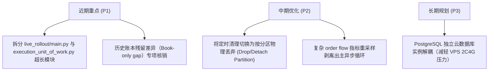

# Crypto Momentum Lab 技术栈最佳实践评估报告

**评估基准版本**：HEAD (`616096dec29e`)  
**评估对象**：[crypto-momentum-lab](file:///Users/zhangshuai/PycharmProjects/crypto-momentum-lab) 核心技术栈与工程实现  
**对标行业标准**：
* 架构规范：《Architecture Patterns with Python》 / DDD / Ports & Adapters
* 异步并发：《Using Asyncio in Python》 / PEP 492 / 525
* 数据库实践：《The Art of PostgreSQL》 / PostgreSQL 16 官方性能调优指南
* Web API 规范：FastAPI / Pydantic v2 生产级设计标准
* 数据工程规范：Apache Arrow / Parquet 列式存储规范

---

## 一、综合评估结论

```
+--------------------------------------------------------------------------+
| 总体评级: 生产硬化级 (8.5 / 10)                                          |
|                                                                          |
| 优点: 领域驱动设计严苛、连接池防挤占隔离出色、反压控制与确定性血缘极佳。  |
| 短板: 单文件代码膨胀（上帝模块）、历史账本脱节债务、小内存 VPS 下的资源边界。|
+--------------------------------------------------------------------------+
```

| 技术维度 | 评估等级 | 行业最佳实践符合度 | 核心结论简述 |
| :--- | :---: | :---: | :--- |
| **1. 架构与领域分层** | **优秀 (A-)** | 90% | 极高水准的 DDD、Unit of Work 与不可变契约；缺陷是存在超长上帝模块。 |
| **2. Python 异步与并发** | **卓越 (A)** | 92% | WebSocket 反压机制、反重连风暴、跨进程限频设计极其成熟。 |
| **3. 数据库与持久化** | **优秀 (A-)** | 88% | 多平面连接池隔离、`work_mem` 精细调优；但大表 retention 清理仍有债务。 |
| **4. 数据存储与分析** | **卓越 (A+)** | 96% | 完美的冷热分层架构（PostgreSQL + Parquet + Zstd）；具备确定性数据血缘。 |
| **5. Web API 与看板** | **优秀 (A)** | 90% | FastAPI 与 Pydantic v2 标准用法，防穿透 TTL 缓存；纯原生前端零构建负担。 |
| **6. 部署运维与治理** | **良好 (B+)** | 82% | 权限与网络隔离完善，无锁文件心跳优秀；但 2C4G 小主机资源贴着上限运行。 |

---

## 二、分维度深度分析

### 1. 软件架构与分层设计（DDD / Ports & Adapters）

#### ✅ 最佳实践落地亮点
1. **纯粹的不可变领域模型**：
   * 在 [`domain/`](file:///Users/zhangshuai/PycharmProjects/crypto-momentum-lab/src/crypto_momentum_lab/domain) 目录中，几乎所有业务实体均使用 `@dataclass(frozen=True, slots=True)` 实现不可变性。
   * **金融数值精度安全**：严格使用 `Decimal` 处理价格、数量、名义价值与收益率，彻底杜绝了浮点数（Float）在二进制运算中的精度漂移。
2. **六边形架构与严格的契约隔离**：
   * 业务核心通过 [`ports.py`](file:///Users/zhangshuai/PycharmProjects/crypto-momentum-lab/src/crypto_momentum_lab/domain/execution/ports.py)（基于 `typing.Protocol`）定义外部抽象契约，完全独立于具体数据库或网络协议。
3. **健壮的工作单元（Unit of Work）模式**：
   * [`execution_unit_of_work.py`](file:///Users/zhangshuai/PycharmProjects/crypto-momentum-lab/src/crypto_momentum_lab/persistence/postgres/execution_unit_of_work.py) 实现了严格的事务一致性与幂等提交边界，包含显式冲突检查（`DecisionCommitConflict`）、证据摘要（`evidence_digest`）和分布式租约（`TradingLease`）。

#### ⚠️ 偏离最佳实践与技术债务
> [!WARNING] **“上帝模块”（God Module）与职责过度集中**
> * [`apps/live_rollout/main.py`](file:///Users/zhangshuai/PycharmProjects/crypto-momentum-lab/src/crypto_momentum_lab/apps/live_rollout/main.py) 高达 **2,533 行**。
> * [`execution_unit_of_work.py`](file:///Users/zhangshuai/PycharmProjects/crypto-momentum-lab/src/crypto_momentum_lab/persistence/postgres/execution_unit_of_work.py) 高达 **1,642 行**。
> 
> 单个文件中混合了状态机扭转、序列化、恢复日志切割、指标打点等多个维度的逻辑，违反了单一职责原则（SRP），代码认知复杂度与后期重构阻力极大。

---

### 2. Python 异步并发与网络通信（Asyncio & WebSockets）

#### ✅ 最佳实践落地亮点
1. **完备的反压机制与防重连风暴（Anti-Storm）**：
   * 在 [`websocket.py`](file:///Users/zhangshuai/PycharmProjects/crypto-momentum-lab/src/crypto_momentum_lab/market_data/binance/websocket.py#L251-L256) 中，当遇到持久化饱和引发的 `CaptureQueueFull` 时，连接直接置为 `HALTED` 并主动停止重连：
     ```python
     if isinstance(error, CaptureQueueFull):
         # 避免重连风暴冲刷下游已饱和的存储队列
         self._stopping = True
     ```
2. **跨进程速率治理（REST Pacer）**：
   * 采用基于共享文件锁的 `binance-rest-pacer`，在 Docker 多容器并发下协同对 Binance API 的访问节奏，彻底防止因瞬间突发请求触发 429 封禁。
3. **微观性能指标内建**：
   * `BinanceWebSocketMetricsSnapshot` 详尽记录了队列高水位、丢包数、ACK 超时及消息接收延迟，支持细粒度的运行期体检。

#### ⚠️ 偏离最佳实践与改进空间
* **事件循环的微小抖动隐患**：部分高阶订单流指标（Order Flow Imbalance 计算、多级重采样）在行情剧烈波动期直接挂在主异步循环内计算，极端瞬时可能带来数十毫秒的调度延迟。建议将耗时指标计算调度至后台工作进程或线程池。

---

### 3. 数据库与持久化体系（PostgreSQL / asyncpg / Alembic）

#### ✅ 最佳实践落地亮点
1. **多平面连接池隔离（Multi-Plane Connection Pooling）**：
   * 在 [`session.py`](file:///Users/zhangshuai/PycharmProjects/crypto-momentum-lab/src/crypto_momentum_lab/persistence/postgres/session.py) 中，系统将连接池硬性划分为不同平面：
     * `EXECUTION_POOL` (4)：专供订单决策与关键成交入库
     * `ACCOUNT_POOL` (2)：专供账户对账
     * `MARKET_POOL` (2)：专供行情状态落库
     * `DASHBOARD_POOL` (4) / `OBSERVABILITY_POOL` (2)：专供查询与运维
   * **价值**：哪怕看板执行了高负荷统计或行情出现洪峰，核心执行交易通道的数据库连接永远不会被耗尽！
2. **契合硬件与业务的针对性调优**：
   * 在 [`compose.server.yaml`](file:///Users/zhangshuai/PycharmProjects/crypto-momentum-lab/compose.server.yaml) 中针对低内存配置优化：
     * 调大 `work_mem=16MB`，彻底消除了此前单次统计产生 7.9GB 临时磁盘文件的问题。
     * 限制 `max_parallel_workers_per_gather=1`，防止单个慢查询把 CPU 核心占满。
3. **分表分区（Partitioning）架构落地**：
   * 为超大体量的状态表和运行事件表实现了时间分区（`runtime_state_partitions.py`），避免了单表过亿行造成的 B-Tree 索引膨胀。

#### ⚠️ 偏离最佳实践与历史隐患
> [!CAUTION] **数据留存清理策略的脆弱性**
> * 历史文档记录，定时任务 `cml-archive-trim.timer` 曾尝试在单事务中批量 DELETE 几万行历史记录并引发内存崩溃。在最佳实践中，时序类历史数据清理应当依赖**按分区直接 `DETACH/DROP PARTITION`**，而非在高频写入的表上执行大事务 DELETE。

---

### 4. 时序与大数据归档（Parquet / PyArrow / Zstandard）

#### ✅ 最佳实践落地亮点
1. **教科书级别的冷热数据分层**：
   * **热数据**：高频实盘状态、未平持仓、活动订单存入 PostgreSQL。
   * **温数据/研究数据**：15 秒衍生市场特征落入 Parquet 列式存储，兼顾高压缩比与极速分析检索。
   * **冷数据/原始流**：原始 WebSocket 数据直接通过 Zstandard 压缩为 `.jsonl.zst`，保留最原始的订单簿与逐笔成交。
2. **量化研究的确定性数据血缘（Data Lineage）**：
   * [`datasets.py`](file:///Users/zhangshuai/PycharmProjects/crypto-momentum-lab/src/crypto_momentum_lab/persistence/parquet/datasets.py) 强制要求记录 `input_sha256`、`output_sha256` 与 `schema_version`，确保策略回测与特征工程 100% 具备复现性，完全符合专业 QuantOps 标准。

---

### 5. Web API 与运维看板（FastAPI / Vanilla ES Modules）

#### ✅ 最佳实践落地亮点
1. **FastAPI 与 Pydantic v2 标准规范**：
   * 严格使用 `Annotated[..., Depends(...)]` 做依赖注入。
   * 所有的请求/响应模型均由 Pydantic v2 强类型驱动，没有出现任意字典传递（No raw dict passing）。
2. **防击穿分级缓存与硬超时保护**：
   * [`api.py`](file:///Users/zhangshuai/PycharmProjects/crypto-momentum-lab/src/crypto_momentum_lab/operator_dashboard/api.py) 为慢统计接口（如 24 小时决策 SLO 分析、收益曲线）设置了分级缓存（`_PAPER_EQUITY_CACHE_TTL_SECONDS = 30.0`）及 10 秒硬查询超时，保护后端不被频繁刷新的前端击穿。
3. **极简高效的前端设计（Vanilla + ECharts）**：
   * 没有引入庞大的 Node 构建流和现代重型框架，而是直接采用浏览器原生 **ES Modules** + **ECharts 6.1.0** 本地化引入。在运维看板这类强调高稳定性、极简加载、无升级碎裂风险的场景下，这是极为务实且高效的工程选择。
4. **全面的安全防御**：
   * Nginx 配置了完备的安全响应头（CSP、X-Frame-Options、nosniff）及 Basic Auth 认证。

---

### 6. 部署运维与运行环境治理（Docker / Systemd / cgroups）

#### ✅ 最佳实践落地亮点
1. **安全边界与最小权限**：
   * Dockerfile 中强制新建无特权用户 `cml` 运行，容器内无 root 特权。
   * 读写密钥物理隔离：只读监控容器仅注入 `BINANCE_READ_API_KEY`，交易策略容器才享有 `BINANCE_TRADE_API_KEY`。
2. **零开销轻量级文件心跳检查器**：
   * 彻底摒弃了“每 30 秒执行一次 python 进程或直连一次 PostgreSQL”的劣质健康检查反模式。
   * 使用 [`cml-local-healthcheck`](file:///Users/zhangshuai/PycharmProjects/crypto-momentum-lab/docker/local-healthcheck) 仅通过 Shell 读取 `/run/cml/health` 下的标记文件 mtime，几乎零 CPU 和内存开销。

#### ⚠️ 基础设施瓶颈与风险
> [!IMPORTANT] **2C4G 云主机的资源天花板**
> * 在单机上同时运行 PostgreSQL、12 个微服务容器、监控与日志。
> * PostgreSQL 的 `mem_limit: 1280m` 在高水位时占用率极高，曾出现过内存告警并导致系统借用 swap。虽然配置了 `memswap_limit` 防打穿，但若遇到突发行情暴增，宿主机的 I/O 与内存调度将处于承压红线边缘。

---

## 三、演进建议与行动优先级


