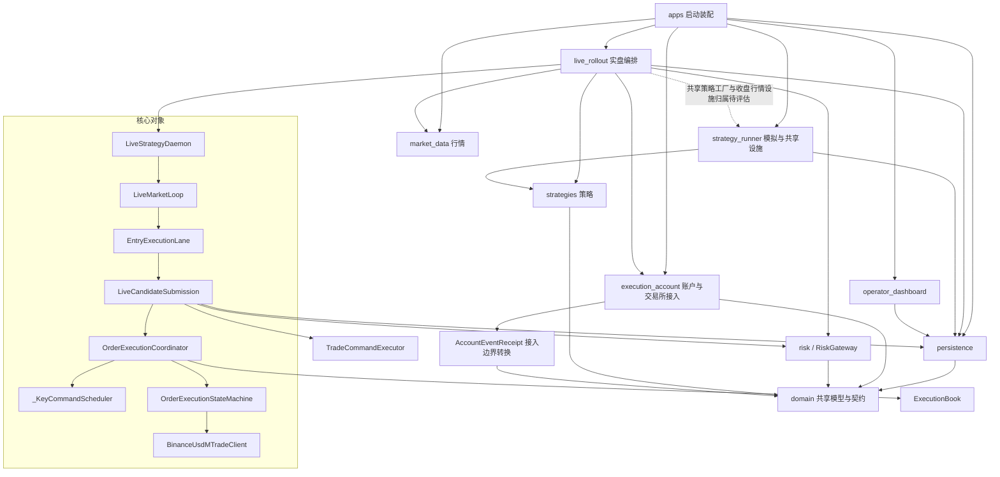

# 交易系统调整后的架构快照

日期：2026-10-01。范围：基于 `242fabec23c47a1dcd9481fef8e4199ddf70f01f` 加本轮未提交工作树；不代表生产部署。实施记录见[调整计划](trading-architecture-adjustment-plan-20261001.md)。

## 模块依赖

箭头表示引用或注入依赖。为便于阅读省略辅助包和各业务包对 domain 的重复引用；虚线为仍需评估的归属问题，不表示已证实循环。



事件收据转换位于 BinanceUserDataEvent.to_receipt，经账户同步服务调用，不属于订单下单步骤。

静态 AST 扫描未发现顶层包导入环。persistence 的项目内跨顶层依赖仅为 domain，原 persistence → execution_account 已消除。纯重导出模块 commands、position_exit，以及 daemon 行情运行和协调器提交的兼容转发入口已删除。Daemon 仍有控制门面方法，但生命周期与运行控制有实际消费者，不标为整个空心层。

## 核心下单时序

选择首次实盘开仓、准入及风控通过、无需重试且交易所正常接单。只显示方法流转，省略预热、遥测、细粒度规则与后续成交。接单确认不代表完全成交。

```mermaid
sequenceDiagram
    participant Feed as 行情输入
    participant Loop as LiveMarketLoop
    participant Admission as LiveMarketStateAdmission
    participant Strategy as 策略运行时
    participant Lane as EntryExecutionLane
    participant Submission as LiveCandidateSubmission
    participant Risk as RiskGateway
    participant Planner as TradeCommandExecutor
    participant Coordinator as OrderExecutionCoordinator
    participant Scheduler as _KeyCommandScheduler
    participant Store as 提交仓储
    participant Machine as OrderExecutionStateMachine
    participant Client as BinanceUsdMTradeClient
    participant HTTP as HTTP客户端
    participant Exchange as Binance
    Feed->>Loop: run()
    Loop->>Loop: _run_prefetched()
    Loop->>Admission: prepare()
    Admission-->>Loop: 准入通过
    Loop->>Strategy: on_market_state()
    Strategy-->>Loop: 决策
    Loop->>Lane: process()
    Lane->>Submission: execute()
    Submission->>Risk: evaluate()
    Risk-->>Submission: 授权
    Submission->>Planner: plan_execution()
    Planner-->>Submission: 计划
    Submission->>Coordinator: prepare_and_execute()
    Coordinator->>Coordinator: _schedule()
    Coordinator->>Scheduler: submit()
    Note over Coordinator,Scheduler: 队列任务切换，非连续调用栈
    Scheduler->>Scheduler: _run()
    Scheduler->>Coordinator: operation()
    Coordinator->>Coordinator: _run_entry_submission()
    Coordinator->>Coordinator: prepare_and_submit()
    Coordinator->>Submission: prepare_for_execution()
    Note over Coordinator,Submission: 保留排队后的许可及上下文复查
    Submission->>Store: prepare_submission()
    Store-->>Submission: 准备结果
    Submission-->>Coordinator: 准备结果
    Coordinator->>Machine: submit()
    Machine->>Machine: _execute_approved_intent()
    Machine->>Machine: _exchange_call()
    Machine->>Client: submit_order()
    Client->>Client: _signed_post()
    Client->>HTTP: post()
    HTTP->>Exchange: 发单
    Exchange-->>HTTP: 接单确认
    HTTP-->>Client: 响应
    Client-->>Machine: 订单快照
    Machine-->>Coordinator: 执行结果
    Coordinator-->>Scheduler: 完成任务
    Scheduler-->>Coordinator: 返回结果
    Coordinator-->>Submission: 执行结果
    Submission-->>Lane: 执行结果
    Lane-->>Loop: 下单结果
```

主提交通道仍穿透 7 个类：Loop、Lane、Submission、Coordinator、Scheduler、StateMachine、Client。加准入、策略、风控、计划生成和仓储，共 12 个项目内参与角色。图中从 run 到 HTTP post 显示 23 次方法进入；这是简化图口径，不是全部函数调用数或调用栈深度。

正常的 prepare_and_execute 路径原本不经过已删除的协调器兼容别名，因此没有宣称正常提交减少一层。改进主要是删去两条提交回退、兼容入口、跨层导入以及调度门禁重复状态；保留并发、订单状态与交易所协议边界。

## 剩余边界与停止条件

live_rollout 对 strategy_runner 剩余引用集中在 registry 和 candle_source：前者实际创建共享策略配置与运行时，后者提供收盘行情和 EMA 设施。它们有实际职责，不是空心透传，也不进入逐订单提交主通道。位置归属可以后续调整，但仅移动文件不会减少运行复杂度，本轮先保留。

准备回调保留队列执行时的最终检查；不为消除往返箭头引入新框架。调度门禁以 LiveEntryControlGate 为实际许可来源，协调器保留提交保护。当前达到已确认的结构删减范围，应先完成累计验证，再依据实际业务问题决定后续调整。

真实 Postgres 事务、进程恢复及生产正常交易闭环仍需单独验收；本轮本地检查不替代这些证据。
