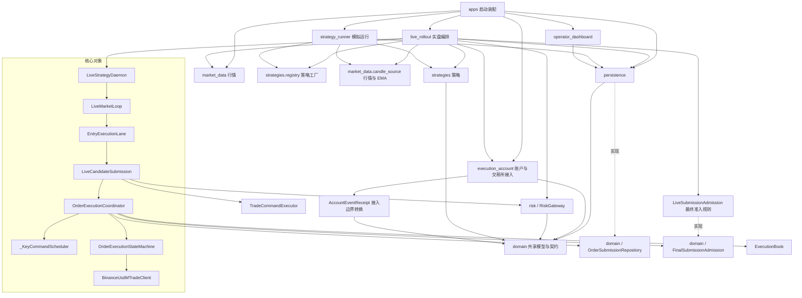

# 交易系统调整后的架构快照

日期：2026-10-01。范围：本轮执行链路重构后的提交内容；不代表生产部署。实施记录见[调整计划](trading-architecture-adjustment-plan-20261001.md)。

## 模块依赖

箭头表示引用或注入依赖。为便于阅读省略辅助包和各业务包对 domain 的重复引用；实线表示引用/持有，虚线表示实现领域契约；不表示循环依赖。



事件收据转换位于 BinanceUserDataEvent.to_receipt，经账户同步服务调用，不属于订单下单步骤。

静态 AST 扫描未发现顶层包导入环。persistence 的项目内跨顶层依赖仅为 domain，原 persistence → execution_account 已消除。纯重导出模块 commands、position_exit，以及 daemon 行情运行和协调器提交的兼容转发入口已删除。Daemon 仍有控制门面方法，但生命周期与运行控制有实际消费者，不标为整个空心层。

## 核心下单时序

选择首次实盘开仓、准入及风控通过、无需重试且交易所正常接单。只显示方法流转，省略预热、遥测、细粒度规则与后续成交。接单确认不代表完全成交。

```mermaid
sequenceDiagram
    participant Feed as 行情输入
    participant Loop as LiveMarketLoop
    participant Admission as LiveMarketStateAdmission
    participant Strategy as 策略运行时
    participant Lane as EntryExecutionLane
    participant Submission as LiveCandidateSubmission
    participant Risk as RiskGateway
    participant Planner as TradeCommandExecutor
    participant Coordinator as OrderExecutionCoordinator
    participant Scheduler as _KeyCommandScheduler
    participant Final as LiveSubmissionAdmission
    participant Store as 提交仓储
    participant Machine as OrderExecutionStateMachine
    participant Client as BinanceUsdMTradeClient
    participant HTTP as HTTP客户端
    participant Exchange as Binance
    Feed->>Loop: run()
    Loop->>Loop: _run_prefetched()
    Loop->>Admission: prepare()
    Admission-->>Loop: 准入通过
    Loop->>Strategy: on_market_state()
    Strategy-->>Loop: 决策
    Loop->>Lane: process()
    Lane->>Submission: execute()
    Submission->>Risk: evaluate()
    Risk-->>Submission: 授权
    Submission->>Planner: plan_execution()
    Planner-->>Submission: 计划
    Submission->>Coordinator: prepare_and_execute()
    Coordinator->>Coordinator: _schedule()
    Coordinator->>Scheduler: submit()
    Note over Coordinator,Scheduler: 队列任务切换，非连续调用栈
    Scheduler->>Scheduler: _run()
    Scheduler->>Coordinator: operation()
    Coordinator->>Coordinator: _run_entry_submission()
    Coordinator->>Coordinator: prepare_and_submit()
    Coordinator->>Final: rejection_reason()
    Final-->>Coordinator: 最终准入通过
    Coordinator->>Store: prepare_submission()
    Store-->>Coordinator: 已提交事务的准备结果
    Coordinator->>Machine: submit()
    Machine->>Machine: _execute_approved_intent()
    Machine->>Machine: _exchange_call()
    Machine->>Client: submit_order()
    Client->>Client: _signed_post()
    Client->>HTTP: post()
    HTTP->>Exchange: 发单
    Exchange-->>HTTP: 接单确认
    HTTP-->>Client: 响应
    Client-->>Machine: 订单快照
    Machine-->>Coordinator: 执行结果
    Coordinator-->>Scheduler: 完成任务
    Scheduler-->>Coordinator: 返回结果
    Coordinator-->>Submission: 执行结果
    Submission-->>Lane: 执行结果
    Lane-->>Loop: 下单结果
```

主提交通道仍穿透 7 个类：Loop、Lane、Submission、Coordinator、Scheduler、StateMachine、Client。加运行准入、最终提交准入、策略、风控、计划生成和仓储，共 13 个项目内参与角色（不计图中未展开的执行账本）。图中从 run 到 HTTP post 显示 23 次方法进入；这是简化图口径，不是全部函数调用数或调用栈深度。

正常的 prepare_and_execute 路径原本不经过已删除的协调器兼容别名，因此没有宣称正常提交减少一层。改进主要是删去两条提交回退、兼容入口、跨层导入以及调度门禁重复状态；保留并发、订单状态与交易所协议边界。

## 剩余边界与停止条件

共享策略工厂已迁至 strategies.registry，收盘行情和 EMA 设施迁至 market_data.candle_source，全部调用方直接引用新位置；live_rollout 对 strategy_runner 的直接与已验证的运行导入依赖已切断。

Coordinator 不再接收提交准备函数，改为接收纯数据 OrderSubmissionPreparation；最终准入规则与仓储由执行侧持有并在出队后直接调用。Submission 保留风险评估、执行计划生成和提交后业务记账；EntryExecutionLane 保留池过滤、开仓政策与不确定结果熔断。未合并为大类。

事务边界：仓储在既有数据库事务中做 lease/session/risk fencing、幂等仲裁和耐久准备，事务提交后才返回 PreparedOrderSubmission；交易所 HTTP 请求在事务外执行。同一个 key 的准备与提交仍为一个调度任务，对账/撤单不能插入两者之间。执行账本预留使用其既有事务边界，不把独立事务或 HTTP 宣称为同一数据库原子事务。

真实 Postgres 事务、进程恢复及生产正常交易闭环仍需单独验收；本轮本地检查不替代这些证据。

异常恢复验证见[下单恢复验收](order-recovery-acceptance-20261001.md)：HTTP 接单后响应超时及重建执行器对账测试通过；真实数据库强制退出测试已编写、未执行。查询不到订单时保留未知状态是当前行为，不代表已观察到交易所订单长期不可查。
