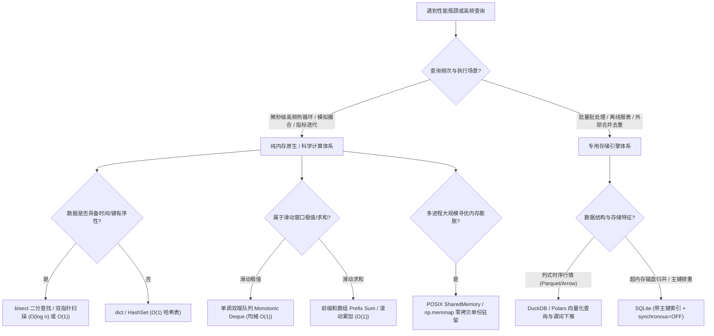

# 高性能量化回测与计算系统优化实践指南
## High-Performance Quantitative Backtesting & Computing Best Practices Guide

> **文档状态**：系统性能架构与算法选型规范 (Performance Architecture & Algorithm Guide)  
> **核对日期**：2026-10-03  
> **代码基线**：`02e6581f3bc71feac0f91f84fa405460ea26730f`  
> **文档目的**：针对高频连续 MTM 净值核算、策略回放撮合、因果对账及多维网格寻优中的热点计算，总结算法降阶、内存紧凑布局、多进程共享内存及列式数据引擎的工程实践与实施路径。

---

## 目录
1. [技术背景与工程边界厘清](#1-技术背景与工程边界厘清)
2. [核心算法降阶与关键瓶颈治理](#2-核心算法降阶与关键瓶颈治理)
   - [2.1 回测撮合引擎：$O(M \times N)$ 线性遍历 $\to$ 二分/双指针有序匹配](#21-回测撮合引擎om-times-n-线性遍历-to-二分双指针有序匹配)
   - [2.2 滑动窗口极值：切片全量重算 $\to$ 单调双端队列（Monotonic Deque）](#22-滑动窗口极值切片全量重算-to-单调双端队列monotonic-deque)
   - [2.3 多维因果对账：两重循环与内存搬移 $\to$ 标的分桶 + 双指针扫描](#23-多维因果对账两重循环与内存搬移-to-标的分桶--双指针扫描)
   - [2.4 日切在途浮盈：历史交易全量重扫 $\to$ 扫描线（Sweep-line）在途持仓池](#24-日切在途浮盈历史交易全量重扫-to-扫描线sweep-line在途持仓池)
   - [2.5 动态出场触发：逐 Tick 解释器标量循环 $\to$ NumPy 向量化掩码](#25-动态出场触发逐-tick-解释器标量循环-to-numpy-向量化掩码)
3. [内存布局与数据引擎选型](#3-内存布局与数据引擎选型)
   - [3.1 历史行情处理：对象解包 $\to$ 紧凑列式引擎（Polars / DuckDB）](#31-历史行情处理对象解包-to-紧凑列式引擎polars--duckdb)
   - [3.2 数值精度体系隔离：“计算层（`float64`）”与“账本层（`Decimal`）”的分界](#32-数值精度体系隔离计算层float64与账本层decimal的分界)
4. [大规模并行与网格寻优架构](#4-大规模并行与网格寻优架构)
   - [4.1 多进程寻优内存风暴：Pickle 序列化复制 $\to$ POSIX 共享内存 / `mmap`](#41-多进程寻优内存风暴pickle-序列化复制-to-posix-共享内存--mmap)
   - [4.2 8D 参数搜索解耦：信号生成池与资金风控两阶段分离](#42-8d-参数搜索解耦信号生成池与资金风控两阶段分离)
5. [项目中已有的优秀工程范例](#5-项目中已有的优秀工程范例)
6. [量化计算选型决策树与优化路线图](#6-量化计算选型决策树与优化路线图)

---

## 1. 技术背景与工程边界厘清

在业界工程讨论中，有一种观点认为：“从 $O(n)$ 到 $O(n \log n)$ 或近 $O(1)$ 的优化，能用 SQLite 就不要手搓，因为自带 B+ 树、索引、Page 和缓存，自己写容易卡在 CPU Cache 和 RAM 瓶颈”。

结合本项目高频量化交易与海量历史仿真的工程实践，该观点需做客观区分：

| 维度 | 原生内存结构 / 科学计算 (Memory / NumPy) | 嵌入式列式/关系引擎 (DuckDB / SQLite) |
| :--- | :--- | :--- |
| **单次点查延迟** | **纳秒级（10~50 ns）**：直接内存指针寻址 | **微秒级（5~50 $\mu s$）**：SQL 解析 + VDBE 执行 + 类型转换 |
| **CPU 缓存局部性** | **极高**：连续数组完美利用 CPU L1/L2 缓存线（64 字节） | **中等**：针对磁盘扇区页（4KB Page）设计，非 CPU 缓存专用 |
| **海量数据防 OOM** | 需合理规划内存，Python 原生对象易引发内存膨胀 | **自带磁盘置换与分页**：超过物理内存时自动 Spill to Disk |
| **复杂度降阶手段** | 标准库自带 `dict` ($O(1)$)、`bisect` ($O(\log n)$)、`heapq` ($O(\log n)$) | 通过 `CREATE INDEX` 建立 B+ 树或倒排索引 |
| **适用场景** | 高频热循环、微秒级撮合、矩阵/向量化回测、流水线因果对账 | 大文件去重、多维组合过滤、分析型 OLAP 聚合、冷数据归档 |

**核心准则**：在极高频的热循环内，**优先利用语言原生数据结构与连续内存向量化**；在离线海量数据批处理、需要持久化或多维复杂 Join 时，**利用成熟引擎（如 DuckDB / SQLite）**。

---

## 2. 核心算法降阶与关键瓶颈治理

### 2.1 回测撮合引擎：$O(M \times N)$ 线性遍历 $\to$ 二分/双指针有序匹配

* **涉及文件**：[`src/crypto_momentum_lab/strategy_runner/fills.py#L82-L104`](file:///Users/zhangshuai/PycharmProjects/crypto-momentum-lab/src/crypto_momentum_lab/strategy_runner/fills.py#L82-L104)
* **现状分析**：
  在 `simulate_candidate_fill` 中，对每一个待撮合意图候选单（Candidate）：
  ```python
  fill_state = next(
      (
          state
          for state in states
          if target_fill_at <= state.bucket_end <= candidate.expires_at
      ),
      None,
  )
  ```
  如果回测周期为多日（单币种每日 5,760 个 15s 状态），每次撮合都从头开始执行 Python 迭代器全量扫描。若有 $M$ 个候选单、$N$ 个状态，复杂度为 **$O(M \times N)$**。
* **优化方案**：
  1. `states` 集合本身按时间单调递增；
  2. 提取 `bucket_ends` 时间戳列表，通过 `bisect.bisect_left(bucket_ends, target_fill_at)` 进行二分定位；
  3. 单次查找复杂度降至 **$O(\log N)$**；如果输入的候选单自身按时间有序，使用双指针滚动游标，可实现均摊 **$O(1)$**，整体达到 $O(M + N)$。

---

### 2.2 滑动窗口极值：切片全量重算 $\to$ 单调双端队列（Monotonic Deque）

* **涉及文件**：[`src/crypto_momentum_lab/strategies/compression_breakout/event_study.py#L181-L201`](file:///Users/zhangshuai/PycharmProjects/crypto-momentum-lab/src/crypto_momentum_lab/strategies/compression_breakout/event_study.py#L181-L201)
* **现状分析**：
  在计算窗口长度为 $W$ 的最高价和最低价时：
  ```python
  while index < len(states):
      lookback = states[index - config.compression_window_buckets : index]
      highs = tuple(_state_high(state) for state in lookback)
      range_high = max(high_values)
      range_low = min(low_values)
  ```
  窗口每前进一步，都会做一次切片、构造生成器、生成临时元组，并调用 `max()` / `min()`。
  * **复杂度**：时间复杂度 $O(N \times W)$，每一步都产生大量小对象，造成垃圾回收压力。
* **优化方案**：
  1. **单调双端队列算法**：维护一个单调递减的双端队列（存储元素索引）。新元素入队前从队尾弹出所有小于该值的索引，队首元素即为当前窗口最大值；窗口滑过则从队首弹出过期索引。
  2. **复杂度收益**：每个元素最多进队、出队一次，极值查询为均摊 **$O(1)$**，全流程时间复杂度降至 **$O(N)$**。
  3. 若在向量化底层，可直接使用 `bottleneck.move_max` / `scipy.ndimage.maximum_filter1d`，由 C 语言加速。

---

### 2.3 多维因果对账：两重循环与内存搬移 $\to$ 标的分桶 + 双指针扫描

* **涉及文件**：[`local_optimization/reconciliation.py#L802-L822`](file:///Users/zhangshuai/PycharmProjects/crypto-momentum-lab/local_optimization/reconciliation.py#L802-L822)
* **现状分析**：
  在 `match_per_symbol_trades`（实盘成交与回测成交对账）中：
  ```python
  for l_trade in live_trades:
      for i, r_trade in enumerate(unmatched_replay):
          r_dt = parse_dt(r_trade.get("entry_at")) # 内层反复解析字符串时间
          diff = abs((l_dt - r_dt).total_seconds())
          if diff <= time_window_sec and diff < best_diff:
              best_diff = diff
              match_idx = i
      if match_idx is not None:
          r_match = unmatched_replay.pop(match_idx) # O(R) 连续内存搬移
  ```
  * **复杂度**：$L$ 笔实盘与 $R$ 笔回放，总复杂度为 $O(L \times R)$；同时在热循环中反复调用字符串正则解析，并在命中时执行 `list.pop(i)` 产生线性内存拷贝。
* **优化方案**：
  1. **时间戳预规范化**：加载时统一转为 `float` 纪元秒，杜绝比对时的字符串解析；
  2. **按币种 Hash 分桶**：建立 `dict[str, list[Trade]]`，对账范围立即缩小数十倍；
  3. **双指针有序扫描**：两组同币种交易天然按时间递增，双指针推进只需遍历一次，时间复杂度为 **$O(L + R)$**；
  4. **消除内存搬移**：用 `set` 记录已匹配交易的 ID 或使用布尔掩码，避免 `list.pop` 带来的数组重排。

---

### 2.4 日切在途浮盈：历史交易全量重扫 $\to$ 扫描线（Sweep-line）在途持仓池

* **涉及文件**：[`local_optimization/evaluation_context.py#L227-L235`](file:///Users/zhangshuai/PycharmProjects/crypto-momentum-lab/local_optimization/evaluation_context.py#L227-L235)
* **现状分析**：
  在计算复利曲线的每日浮盈时：
  ```python
  def _calc_floating_at(target_epoch: float) -> float:
      unreal = 0.0
      for e_ep, _, x_ep, _, ev in events_sorted:
          if e_ep < target_epoch < x_ep:
              # 获取价格并累加浮盈
  ```
  对回测窗口内的每一天（日始、日终），代码都会全量遍历历史上所有的成交事件 `events_sorted`，复杂度为 **$O(\text{Days} \times \text{Trades})$**。
* **优化方案**：
  * 实盘或策略并发持仓受参数严格限制（如 `max_positions` 通常仅 1~3 笔）。
  * 采用**扫描线算法（Sweep-line）**：维护一个活跃持仓集合（Active Positions），当时间推进到日切点时，动态加入新入场交易、移出已平仓交易。日切估值仅需计算当前在途的 1~3 笔持仓，耗时降至 **$O(1)$**。

---

### 2.5 动态出场触发：逐 Tick 解释器标量循环 $\to$ NumPy 向量化掩码

* **涉及文件**：[`local_optimization/simulation_ledger.py#L249-L276`](file:///Users/zhangshuai/PycharmProjects/crypto-momentum-lab/local_optimization/simulation_ledger.py#L249-L276)
* **现状分析**：
  在海量参数网格寻优（如 `six_scenarios_optimizer.py` 需评估成千上万次候选组合）的账本仿真中，每次判定动态止损止盈均通过 Python 标量逐点循环：
  ```python
  for k in range(idx, end_idx):
      t_curr = float(ts[k])
      p_curr = float(ps[k])
      if stop_price is not None and ((direction == "LONG" and p_curr <= stop_price) ...):
          ...
  ```
* **优化方案**：
  * 行情数组 `ps` 为连续 NumPy `float64` 内存块；
  * 使用 NumPy 向量化布尔比对与首项快速定位：
    ```python
    cond = (ps[idx:end_idx] <= stop_price) if direction == "LONG" else (ps[idx:end_idx] >= stop_price)
    hit_indices = np.nonzero(cond)[0]
    first_hit = idx + hit_indices[0] if len(hit_indices) > 0 else None
    ```
  * 将条件匹配完全下沉至 C 级向量指令执行，消除 Python 虚拟机逐 tick 解释开销。

---

## 3. 内存布局与数据引擎选型

### 3.1 历史行情处理：对象解包 $\to$ 紧凑列式引擎（Polars / DuckDB）

* **现状分析**：
  在早期数据集加载函数中，从 Parquet 读出后执行 `.to_pylist()`，把数百万行数据逐一转为包含字符串、`Decimal`、`datetime` 的 Python 字典与 dataclass 实例。
  * **内存膨胀机制**：一个 64 位浮点数仅需 8 字节，而封装为 Python `Decimal` 并在 dataclass 中引用，单行占用飙升至数百字节，在长周期多标的回测中极易耗尽系统内存（OOM）。
* **更优架构实践**：
  * **采用列式引擎（Polars / DuckDB）**：
    * 保持数据在 Arrow 列式紧凑内存中流转；
    * 具备高效的谓词下推（Predicate Pushdown），只加载用到的列与满足时间/币种条件的行；
    * 支持零拷贝内存映射（`mmap`），内存占用降低 90% 以上。

---

### 3.2 数值精度体系隔离：“计算层（`float64`）”与“账本层（`Decimal`）”的分界

* **现状分析**：
  部分特征提取函数（如 [`feature_extractor.py: build_notional_volume_ratio_lookup`](file:///Users/zhangshuai/PycharmProjects/crypto-momentum-lab/local_optimization/feature_extractor.py#L146-L165)）在做大量中间统计指标（如 5m 对比 30m 成交量比率）时，全流程使用 Python `Decimal` 做逐项累加与除法。
* **分层架构规范**：
  ```
  +-------------------------------------------------------------------------+
  | 账本层 (Financial Journal & Orders)                                     |
  | 涉及: 实际账户余额、交易所下单数量、扣费清算、逐笔资金凭单                     |
  | 规约: 严格采用 Decimal 精度，杜绝二进制浮点精度漂移与舍入误差                   |
  +-------------------------------------------------------------------------+
                                      │ 边界隔离
                                      ▼
  +-------------------------------------------------------------------------+
  | 统计计算层 (Signals, Features & MTM Simulation)                         |
  | 涉及: 动量指标、成交量比率、波动率 ATR、网格参数寻优、15s 净值浮盈模拟          |
  | 规约: 全面采用 float64 / NumPy 紧凑数组，利用 CPU 寄存器与 SIMD 加速      |
  +-------------------------------------------------------------------------+
  ```

---

## 4. 大规模并行与网格寻优架构

### 4.1 多进程寻优内存风暴：Pickle 序列化复制 $\to$ POSIX 共享内存 / `mmap`

* **涉及文件**：[`local_optimization/six_scenarios_optimizer.py#L368-L384`](file:///Users/zhangshuai/PycharmProjects/crypto-momentum-lab/local_optimization/six_scenarios_optimizer.py#L368-L384)
* **现状分析**：
  多进程寻优中，主进程通过 `multiprocessing.Pool` 初始化每个 worker，在 macOS / Linux（`spawn` 模式）下，各 worker 独立持有/反序列化一份完整的全标的价格字典。
  * **资源消耗**：500 个标的 30 天 15s 网格约 650MB，开 8 个 worker 就会吃掉超过 5GB 内存，在小内存服务器上极易引发 OOM 崩溃。
* **优化方案**：
  * **基于 `multiprocessing.shared_memory.SharedMemory` 或 `np.memmap`**：
    主进程将对齐后的 2D 价格矩阵（`[num_symbols, num_ticks]`）一次性写入命名共享内存，各子进程仅传入内存块名称，建立只读映射视图。
  * **收益**：所有工作进程**物理内存单份驻留**，跨进程零内存复制、零 IPC 序列化耗时。

---

### 4.2 8D 参数搜索解耦：信号生成池与资金风控两阶段分离

* **设计思想**：
  8 维网格参数中，入场参数（如动量窗口、确认桶数、ROC 阈值）与仓位管理参数（如 `max_positions`、`stop_loss`、`atr_mult`）在因果上具有单向依赖性：
* **两阶段流水线设计**：
  1. **Stage 1（信号生成池）**：仅遍历入场指标空间，生成与参数独立的候选交易意图池（RawOpportunity Pool），并将特征预对齐固化；
  2. **Stage 2（仓位与风控仿真）**：固定 Stage 1 输出的候选池，只对仓位并发数、硬止损比例与追踪止盈倍数进行回放仿真；
  3. **收益**：在调整风控参数时，避免重复执行庞大的时间序列特征计算。

---

## 5. 项目中已有的优秀工程范例

代码库中已包含两个完全契合上述理论的经典设计：

1. **纯内存极致 $O(1)$ 查找：`AlignedPriceGrid`**
   * 文件：[`local_optimization/mtm_engine.py#L239-L260`](file:///Users/zhangshuai/PycharmProjects/crypto-momentum-lab/local_optimization/mtm_engine.py#L239-L260)
   * **实践亮点**：高频 MTM 连续核算需要频繁查询任意时刻的价格。代码并未盲目依赖数据库查询，而是将离散时间序列对齐为等距 15s 的 NumPy 连续数组。时间点定位直接退化为**纯内存数组切片与数组下标映射（严格 $O(1)$）**，单次获取耗时在纳秒级。
2. **外部排序排重的正确引擎选型：`merge_runtime_state_exports.py`**
   * 文件：[`scripts/merge_runtime_state_exports.py#L75-L89`](file:///Users/zhangshuai/PycharmProjects/crypto-momentum-lab/scripts/merge_runtime_state_exports.py#L75-L89)
   * **实践亮点**：合并多个超大 CSV 导出文件时，若全量加载到 Python `set` 或 `dict` 中极易造成内存溢出。代码建立了一个带主键索引的本地 SQLite，设置 `PRAGMA synchronous=OFF` 与 `PRAGMA journal_mode=OFF`，借助数据库的 B+ 树主键排重和磁盘缓冲完成流式归并，充分发挥了数据库作为外部排序器的优势。

---

## 6. 量化计算选型决策树与优化路线图



### 优化实施推荐优先级：
1. **P0（立即见效）**：将 `fills.py` 中的线性撮合扫描替换为 `bisect`，消除回测核心瓶颈；
2. **P0（对账加速）**：将 `reconciliation.py` 中的双重循环重构为按标的分桶与双指针匹配；
3. **P1（多进程加固）**：在 `six_scenarios_optimizer.py` 中引入共享内存，彻底解决多 worker 内存翻倍问题；
4. **P2（架构清晰度）**：将统计指标层与资金账本层的 `float64` / `Decimal` 边界彻底固化。
