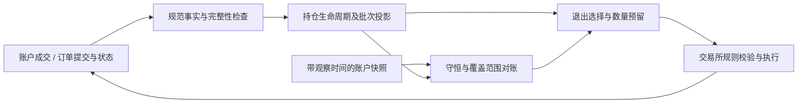

# B2USDT 手动平仓修复复核与批次账本演进方案

核查日期：2026-09-20。代码基线：`e88c0694bb8bb51253baff2f5c34ad8bfea1a4d1`。现场核查约北京时间 09:30–09:35。本文是只读审计和设计方案；没有修改生产代码、部署服务或操作交易。

## 1. 结论

**这次修复解决了一个真实的批次裁剪方向错误，但还不能判定整个手动平仓问题已经完整、正确地解决。**

- FIFO 修改在新增回归场景中正确：同一测试运行在父提交失败，在当前提交通过。
- 手动成交已经进入账户成交表，但批次重建仍主要围绕系统订单加载成交证据。外部平仓没有完整成为批次账本的一等事实，数量差仍靠快照裁剪补偿。
- 新增归零截断存在两个边界缺陷：没有按持仓方向隔离；使用订单创建时间排除历史，会排除归零前挂单、归零后成交的有效开仓。
- 新增尾仓吸收会扩大退出意图，实际可以把另一批次一起平掉。已通过当前提交层代码和模拟执行器复现。
- 运行版本未统一：account-3/4 策略进程已运行这次修复；primary/account-2 策略进程仍运行旧版。服务器目录 HEAD 更新不等于所有进程更新。
- 数据库最后保存的 B2USDT 快照中，account-3 已归零，account-4 仍是 7 枚。后者是有时间戳的历史观测，不能等同于核查瞬间交易所实时余额。

因此，建议先补齐明确的正确性缺口，再沿“完整成交事实 → 可重放批次投影 → 显式退出分配”演进。继续增加“数量不对就裁剪、尾数太小就扩大订单”的分支，会让账面暂时一致，但批次身份、持有时间和退出范围仍可能错误。

## 2. 核查范围与证据等级

重点检查 `position_batches.py`、`postgres_runtime.py`、`submission.py`、订单数量量化器，以及服务器账户成交、持仓快照、系统订单和容器运行版本。也检查了批次链路中的历史订单身份兼容逻辑。

本文不是整个仓库所有模块的穷尽审计，也没有运行生产压测或真实下单实验。下文区分：

| 标记 | 含义 |
| --- | --- |
| 现场事实 | 来自只读数据库查询或运行进程版本 |
| 本地复现 | 执行当前实际函数，外部接口使用测试替身 |
| 代码确认 | 控制流、查询条件直接支持，尚无对应生产事件证据 |
| 推断 | 与现有证据吻合，但缺少完整历史决策输入，不能当作已证明因果 |

现有测试运行：

```bash
rtk proxy .venv/bin/python -m pytest \
  tests/unit/execution/test_position_batches.py \
  tests/unit/live_rollout/test_postgres_runtime.py \
  tests/unit/live_rollout/test_submission.py -q
```

结果：**50 passed，0.17 秒**。这说明现有用例通过，不代表这些用例覆盖了手动成交、方向隔离、晚成交及跨批次尾仓吸收。

## 3. B2USDT 现场时间线

以下统一使用北京时间（UTC+8）；数据库存储时间为 UTC。B2 在本次事故中对应交易对 B2USDT，不是内部名为“B2”的批次 ID。

| 北京时间 | account-3 | account-4 | 证据含义 |
| --- | --- | --- | --- |
| 09-19 19:37:13 | 买入 120 | 买入 120 | 本轮较早开仓 |
| 09-19 20:54:33 | 买入 127 | 买入 127 | 加仓 |
| 09-19 21:05:14 | 买入 127 | 买入 127 | 加仓；合计 374 |
| 09-19 22:00:05–07 | 系统卖出 120 | 系统卖出 120 | 剩余 254 |
| 09-19 22:47:03 | — | 外部订单卖出 254，快照归零 | 订单 823890995 |
| 09-19 22:47:52 | 外部订单卖出 254，快照归零 | — | 订单 823928390 |
| 09-19 23:59:30–31 | 买入 172 | 买入 172 | 已经是归零后的新持仓 |
| 09-19 23:59:32–33 | 系统卖出 112 + 22 | 系统卖出 40 + 94 | 两边均卖出 134，仅剩 38 |
| 09-20 00:29:00 | 买入 174 | 买入 174 | 合计 212 |
| 09-20 01:00:01 | 系统卖出 167 | 系统卖出 167 | 剩余 45 |
| 09-20 01:59:31–32 | 系统卖出 38 | 系统卖出 38 | 剩余 7 |
| 09-20 08:18:18 | — | 最后保存的快照为 LONG 7 | 不能冒充实时交易所查询 |
| 09-20 08:20:28 | 外部订单卖出 7，快照归零 | — | 订单 837473466，不属于已匹配的系统订单 |

成交数量校验：

```text
手动平仓之前：120 + 127 + 127 - 120 = 254
手动平仓之后：172 - (112 + 22) + 174 - 167 - 38 = 7  [account-3]
手动平仓之后：172 - (40 + 94)  + 174 - 167 - 38 = 7  [account-4]
```

外部订单的识别方法：账户成交中的 exchange order ID 在现有 `exchange_orders` 中找不到同 symbol 的匹配记录；两次卖出 254 后都有 LONG 归零快照。结合用户描述，符合手动平仓事件。仅凭数据库不能证明实际点击操作的人员身份。

这条链路证明：外部平仓事实存在；归零后的新开仓几秒内被系统部分卖出；7 枚遗留量可由成交记录解释。**“旧批次生命周期错误地作用于新持仓”与这些证据及修复内容高度吻合，但本次未逐步重放当时所有策略输入，不能声称已经证明每一笔异常退出的唯一触发原因。**

account-3 最后 7 枚通过外部成交归零，不能把该结果作为新系统自动清尾成功的证据。上述异常交易也发生在当前修复部署之前，不能将它们表述成新版本上线后的复发。

## 4. 三项修改分别是否正确

### 4.1 FIFO 数量裁剪：方向修正成立，但不足以构成账本

位置：`src/crypto_momentum_lab/domain/execution/position_batches.py`，`_reconcile_batch_quantities`，约 351–408 行。

普通分支由倒序扣减改为顺序扣减。新增测试 `test_rebuild_position_batches_reconcile_fifo_preserves_newest` 构造旧批次 254、新批次 172、账户剩余 172；旧实现削减新批次，当前实现优先削减旧批次，保留新批次 172。

本次对相同测试进行了父提交/当前提交差分执行：

```text
e88c069^: FAIL — manual-close remaining-lot assertion
e88c069 : PASS
```

这项修改对于“外部减少按 FIFO 归属”的业务政策是合理的。问题在于测试没有实际外部成交事件，也没有数据库加载、行情/快照延迟、完整归零重开时间线。

账户总量只能证明剩下多少，不能证明减少发生在何时、由哪笔成交导致、应当终结哪个生命周期。特别是快照落后于成交、历史窗口缺失时，相同差值不一定代表手动平仓。当前 `total_quantity < target_quantity` 还会直接返回已有批次；上层即使将其归类为未管理，也不能凭此恢复缺少的事实。

**判断：保留该回归修正；最终应将 FIFO 作为外部减仓的显式、可审计分配政策，而不是每轮按总量重新猜测。**

### 4.2 归零截断：需要修正身份与时间语义（P1）

位置：`src/crypto_momentum_lab/live_rollout/postgres_runtime.py`：

- `_load_order_anchor_events` 约 156–214 行；
- `_load_position_orders_bounded` 约 218–343 行。

归零查询按账户和 symbol 查 `position_amt == 0`，但只 `GROUP BY symbol`，没有 `position_side`。如果同币种 SHORT 有零快照，LONG 仍持仓，SHORT 的时间可能成为 LONG 历史的截断点。这是代码确认的风险；本次 B2 数据没有提供该情形，不能说它就是本次事故原因。

同时，加载器按 `order.created_at < zero_at` 排除订单，最终窗口与补取绑定开仓单也受到同样约束。合法反例：

```text
10:00 挂入场限价单，尚未成交
10:02 旧仓手动平完，账户归零
10:03 10:00 的限价单成交，形成新仓
```

按创建时间截断会丢掉新仓来源。本次向实际 `_load_order_anchor_events` 注入上述时序的已成交订单，结果为 `events=()`、`anchors={}`，确认了过滤行为。该实验验证时间过滤逻辑，不宣称覆盖完整数据库/provider 集成链路。

**整改：**归零生命周期键至少为 `(environment, account, symbol, position_side)`；用成交时间与已确认事件覆盖范围识别新生命周期。归零前尚未终结订单必须继续跟踪，不能因放单时间旧而丢弃后续成交。快照观察时间只是证据之一，不能直接当作成交账本的完备边界。

### 4.3 尾仓吸收：改变退出范围，当前实现不应视为通用正确方案（P1）

位置：`src/crypto_momentum_lab/live_rollout/submission.py` 约 353–398 行。

当前实现把同 symbol、匹配 position_side 的 managed position 总量减去本次 requested_quantity；差额名义金额低于 min_notional 时，直接将 requested_quantity 改为总持仓。它没有检查其他批次是否到期、是否有其他退出预留，也没有生成对应的跨批次分配记录。features 没有 position_side 时还会放宽匹配范围。

本次使用实际 submission 与测试执行器复现：

```text
旧批次 older：0.0004 BTC，60 分钟前建立
新批次 newer：0.0003 BTC，1 分钟前建立
价格：10000
退出目标：older，requested_quantity=0.0004
结果：plan.quantity=0.0007
```

即使携带 `exit_batch_id=older`，提交层也会把 newer 的 0.0003 一起纳入订单。实验只验证提交数量扩大；没有发送真实订单，也没有声称已在现场发生该例。

还有一个前提问题：`tests/unit/live_rollout/test_submission.py` 的 dust 测试注释将低于最小名义金额描述成 Binance 无法独立平仓；`execution_account/orders/quantization.py:98` 无条件应用 `min_notional`。币安 USDⓈ-M 官方错误码 -4164 明确存在 reduce-only 豁免，因此该注释不能作为所有平仓场景的规则。参见 [Binance Error Codes](https://developers.binance.com/en/docs/products/derivatives-trading-usds-futures/error-code)。

另一方面，Hedge Mode 的 `reduceOnly` 参数受限制，不能简单给双向持仓订单加该字段。应按账户模式、订单方向和实际接口编码平仓能力，并验证数量步长、最小数量等独立条件。参见 [Binance USDⓈ-M Trade API](https://developers.binance.com/en/docs/catalog/core-trading-derivatives-trading-usd-s-m-futures/api/rest-api/trade)。这两条规则并不证明现场 LONG 的 7 枚在任何价格下都可直接提交。

**整改：**提交层只执行已批准的退出分配。需要合并时，由上游明确选择可退出批次并生成 allocations；普通批次退出不能静默升级为全仓退出。先确认真实交易所约束，再决定是否需要尾仓策略。

## 5. 根因层面的缺口：外部成交仍未进入统一批次事实流（P1）

位置：`postgres_runtime.py` 的 `_load_order_identity_metadata`，约 1240–1340 行。它先从已加载的系统订单/订单事件提取 exchange order IDs，然后以 `AccountFillEventRow.order_id.in_(...)` 查询成交。

因此，账户成交表虽然记录了手动卖出 254，外部订单没有系统订单身份时，不能通过该路径成为批次重建的独立减少事件。系统依赖“从旧订单推算持仓，再按实际快照裁剪”的补偿。

这也是本次修复尚未到根因层的核心：**账户事实采集到了，批次投影却仍以策略运行产生的订单为事实边界。** `run_id` 适合标记策略归属，不适合限定真实账户仓位的全部来源。

建议将外部成交接入账户级事实源；系统订单关联可为空，不能因关联为空丢失成交。外部增加进入明确的未分配持仓，外部减少按已记录政策分配。对缺失事实的历史段标记不完整并补采，而不是生成虚构成交掩盖差额。

## 6. 是否存在补丁堆积

在本次检查的“持仓重建—退出提交”链路，答案是**存在，而且问题集中在多层对同一事实作不同解释**。不能由此推断整个仓库都需要重写。

| 当前机制 | 原本解决的问题 | 叠加后的风险 | 演进方向 |
| --- | --- | --- | --- |
| legacy 订单拆分、身份冲突识别、旧绑定修复 | 兼容历史订单身份 | 每轮在线重建都承担历史迁移，规则分散 | 迁移为版本化规范事实；保留冲突诊断 |
| 指定退出批次失配后向其他批次回退 | 避免退出成交丢失归属 | 可能将错误身份转移到别的生命周期 | 显式未分配减少与修复记录 |
| 普通/legacy 分支分别裁剪总量 | 与交易所数量一致 | 相同快照可能掩盖不同历史错误 | 一处守恒校验，差额不静默消失 |
| 窗口、锚点、补取绑定单、归零裁剪 | 减少历史读取与幽灵批次 | 性能边界决定了业务事实是否存在 | 检查点加完整增量，不依赖固定窗口猜完整性 |
| 提交层尾仓吸收 | 避免剩余小额持仓 | 更改上游退出范围 | 显式退出分配与交易所规则能力 |

具体来源还包括 `position_batches.py` 约 236 行的逆序 fallback、约 363 行的 legacy reconciliation，以及 `postgres_runtime.py` 中 `_repair_legacy_exit_batch_bindings`、`_expand_legacy_order_row` 等函数。这些机制不全是错误：历史歧义 fail-closed、幂等、恢复、日志都应保留。目标是让兼容逻辑在规范化边界完成，让在线领域算法只处理一种稳定模型。

已有正向基础：批次重建已抽成独立领域函数，有不可变输入类型及回归测试；账户成交已落库。下一步应补齐输入事实和不变量，而不是再增加一层只转发调用的服务，也不需要立刻拆微服务。

## 7. 第一性原理：哪些事实不能妥协

1. **成交改变仓位；订单提交不等于成交。** 提交事件可以改变批次边界、预留状态，实际数量只随成交或有来源的修正事实变化。
2. **批次是策略的归属模型。** 同账户同方向的交易所持仓不能直接表达“某个内部批次被手动平掉”。外部减少应采用确定、版本化的归属政策，FIFO 可以是该政策。
3. **沿用项目现有批次定义。** 从开仓成交开始，到下一次退出订单提交为边界；边界前连续加仓更新开仓锚点，边界后开仓属于新批次。不能擅自改成每笔成交一个批次，也不能把退出成交时间替代提交边界。
4. **归零结束一个方向的持仓生命周期。** 新开仓不得继承旧生命周期的退出期限、恢复单或减仓意图。旧限价单在归零后成交属于新生命周期，同时保留原订单关联。
5. **快照用于对账，不负责猜成交历史。** 只有对齐事件覆盖范围才能比较；延迟、不完整和无法归属必须显式表达。
6. **退出执行不得扩大业务授权数量。** 订单量等于选中批次分配量之和；不能因为尾数小就把不满足退出条件的批次一起卖掉。

建议不变量（在同账户、币种、持仓方向、同一已确认覆盖点上）：

```text
交易所持仓量 = Σ策略批次剩余量 + 外部/未分配持仓量
批次剩余量 = 已归属入场成交量 - 已归属退出成交量
订单退出数量 = Σ本次 allocations.quantity
任一批次：0 ≤ 已预留退出量 ≤ 剩余量
同一成交按稳定去重键只应用一次
新生命周期不继承旧生命周期退出计划
```

单向 BOTH 模式还要表达净方向及反手时的平旧/开新拆分，不能只对所有 quantity 取绝对值。缺失历史时等式的差额应成为 reconciliation discrepancy，不应自动成为无来源“调整成交”。

## 8. 目标模块与数据契约



### 8.1 CanonicalPositionFacts：规范事实入口

- 账户级读取完整成交，系统/手动/其他来源共享一条数量事实流；策略 run_id 是归属属性。
- 成交稳定去重键使用交易所实际唯一性范围，至少包含 environment、account、symbol、trade_id；保留订单 ID、方向、成交时间、接收时间、来源。
- position_side 应是规范字段。旧记录不能可靠解析时标记 unknown，不能默认合并 LONG/SHORT。
- 订单提交作为独立边界事件。成交归属与订单提交排序分别表达，不能把订单累计成交量全压到 created_at。
- 记录 coverage：已补采的交易时间区间、缺口和投影水位。trade_id 不假设在不同 symbol 间全局单调。

### 8.2 PositionLedger：深模块负责批次与生命周期

建议入口 `rebuild(key, checkpoint, ordered_facts, policy_version)`；输出 `episodes, batches, unallocated, diagnostics, watermark`。不让调用方传一组“跳过老数据/偏爱最新批次”的开关来拼业务规则。

- episode 由完整方向键与确认的归零边界标识；batch ID 是结构化持久身份，不靠 `split(':')[-1]` 反解订单 ID。
- 外部减少写出 `ReductionAllocation`，含成交 ID、批次 ID、数量、政策版本和原因。无绑定也能重放。
- 外部增加默认进入 unallocated；是否纳入策略属于明确业务决定。
- 历史歧义作为输出诊断，禁止由 fallback 无痕改写归属。

### 8.3 Reconciler：只校验、补采与控制可执行性

输入同一覆盖点的投影与快照；输出 matched、awaiting_data、unexplained_difference 等结构化状态。只影响相应账户/方向的可执行性；事实不全时限制新增风险，同时保留有明确数量上界的减风险处理路径。

不要因为旧快照少于新成交投影就马上删除批次。迟到成交应触发从适当检查点重放，得到可审计修订；归零证明不完整时不强行生成新 episode。

### 8.4 ExitAllocator：退出范围只在一处决定

输入目标批次、退出原因、可用数量、已有预留与交易所规则，输出 allocations、总量、依赖水位、幂等 ID。同一账户/币种/方向的分配与预留应事务性串行或用乐观版本校验。

执行层只能提交计划范围内数量；必要的向下量化必须反馈未执行余量和释放预留，向上扩大必须重新生成分配。提交失败、部分成交、撤单与超时均有明确的预留回收状态。

尾仓政策分开表达：指定批次退出、合并已具备退出条件批次、明确全仓退出。账户模式相关规则由适配器决定，不能由通用 submission 根据金额自行转换。

## 9. 实施顺序与验收门槛

| 阶段 | 具体工作 | 完成标准 |
| --- | --- | --- |
| A：补齐回归与发布证据 | 保存脱敏 B2 事件夹具；补跨方向、晚成交、两批次尾仓测试；核对各进程 SHA | 事故时间线可重复运行；缺陷用例先失败；代码与部署矩阵可查 |
| B：修正确认缺口 | 方向完整键；保留归零前未终结订单的后续成交；禁止提交层静默跨批次扩量；模式化平仓规则 | 四类边界测试通过；无新批次被旧生命周期误退出 |
| C：规范事实与影子投影 | 在现有 account_fill_events 上完善规范字段和覆盖水位；外部成交独立进入投影；新旧双算 | B2 完整成交重放归零后剩余172，无立即继承旧退出；迟到/重复事件结果稳定 |
| D：退出分配与预留 | 持久化 allocations；执行器消费计划；并发版本校验与恢复 | 并发、重试、部分成交、撤单均不超分配、不重复消费 |
| E：迁移与收敛 | 小范围切读；核对订单意图差异；迁移旧身份；删除不再需要的在线兼容分支 | 每个差异有解释，回放一致，回滚不会重复下单，所有目标进程版本一致 |

这些是设计阶段，不表示已经完成。阶段 B 不能只改两个 if 就宣布终结根因；阶段 C/D 才建立长期正确性。也不建议未经规则验证直接把当前修复全量部署当作验收。

迁移应新增版本化投影/关联表并保留原始事实。影子路径绝不发订单。切换时复用稳定执行幂等键；已有 open orders 和预留必须导入，不能在新投影视角重新生成同一退出。回滚只回切读模型，不能删除已执行订单对应的事实。

## 10. 必须补充的验收矩阵

| 用例 | 必须验证的结果 |
| --- | --- |
| 真实 B2 夹具：374、退出120、手动254、重开172 | 前 episode 已闭合；新172不继承旧退出 |
| 外部部分平仓 | 每个减少成交仅应用一次，FIFO政策分配有记录 |
| 快照滞后于开仓/平仓成交 | 等待数据或重放；不直接裁剪新批次 |
| LONG 持仓、SHORT 归零 | LONG 历史与持有时间不变 |
| 归零前挂单、归零后成交 | 新 episode 能找到有效入场成交 |
| 单个订单跨归零边界分次成交 | 按各成交归属，不能整单丢弃或全算进旧 episode |
| 老批次退出、新批次尚未到期 | 提交数量不得包含新批次 |
| 合法小额 reduce-only 与 Hedge Mode 编码 | 用接口模式规则验证；不写死所有小额退出都拒绝 |
| 两个退出任务并发与重试 | 同一剩余量不重复预留、提交、扣减 |
| 手动归零后旧恢复单仍存在 | 不作用于新 episode；撤单/终结状态有明确处理 |
| 缺历史、超过窗口、run_id变更 | coverage 明示缺口；不把有限查询当完整账本 |
| 部分成交后撤单、失败后恢复 | 已成交保留、未成交释放、幂等不变 |
| 单向模式反手与双向独立持仓 | 数量及方向守恒，平旧开新正确拆分 |
| 事件重复/乱序、服务重启 | 相同规范事实集得到相同投影及分配 |

验证优先围绕领域纯函数、加载器数据库集成和执行分配边界。无需对每个封装写镜像测试，但上述资金数量相关不变量应有持续回归。

## 11. 性能演进：正确性边界确定后再优化

目前固定回看窗口、锚点和订单数上限承担了控制查询成本的职责，但也影响事实完整性。建议改为每账户/方向的版本化检查点加增量成交读取，只有迟到事件或缺口修复触发局部重放。

- 先量化每轮加载行数、查询耗时、批次重建耗时、补采次数、水位滞后和差额数量，再决定索引或缓存。
- 结合实际查询计划评估 `(environment, account_label, symbol, position_side, observed_at)` 的快照访问，以及账户/币种/成交时间的增量访问。本文未执行 EXPLAIN ANALYZE 或确认现有索引覆盖，不能把建议当作已证明缺索引。
- 缓存与检查点必须按完整身份键及规则版本失效。跨 run 复用事实，不跨 account/side 复用投影。
- 延迟到达触发有限区间重建，避免每次策略 tick 重跑所有 legacy 修复；对外输出扫描行数与重放原因。
- checkpoint 只有在事实、投影及水位一致落地后才推进，避免追求性能跳过未处理成交。

当前没有证据证明吞吐不足是这次事故主因，优先级应低于数量和生命周期正确性。

## 12. 发布状态与关闭条件

现场观察：

| 对象 | 运行版本 |
| --- | --- |
| 本地及服务器 checkout HEAD | e88c069 |
| account-3/4 策略、账户服务 | e88c069 |
| market-data | e88c069 |
| primary/account-2 策略、账户服务 | 7a94277 |
| collector/dashboard | 7a94277 |

服务运行健康不等于批次语义正确。关闭本问题至少需要：完整 B2 回放通过；外部成交进入账本；跨方向及晚成交回归通过；退出数量不静默跨批次扩大；各目标策略进程版本核实；每个账户的实际持仓、批次、未决订单在同一覆盖点可解释。

本次交付是以上审计结论和实施设计。未进行生产修复、批量部署或自动清理残留仓位。
