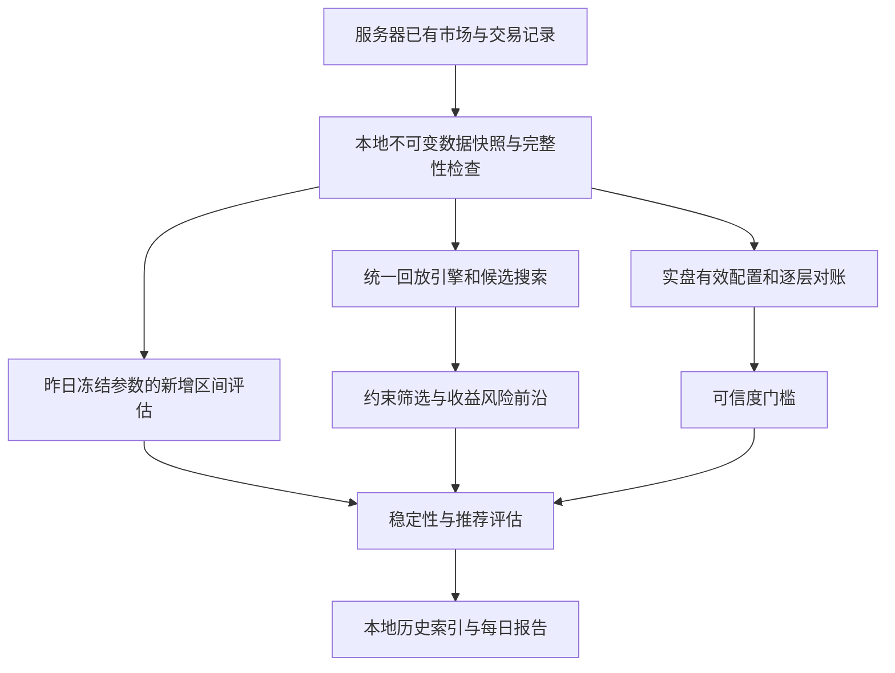

# 本地参数寻优、稳定性跟踪与实盘校验设计

日期：2026-09-18。状态：设计建议，尚未实现；本次只新增/更新文档，不改交易代码或服务器配置。

## 1. 设计结论

将目前分散的寻优脚本整理为一个**本地实验系统**：每天导入不可变数据快照，先对账和评估昨天冻结的参数，再寻找新候选，最后保存可复现的纵向与横向报告。服务器继续负责采集和交易，只读取已有数据；计算、指标、搜索、历史索引及报告都在本地完成。

核心选择如下：

1. **同一条件是一份有版本的实验协议**，不只是“保证金 ≤280U”。数据窗口规则、策略及执行语义、参数范围、成本、目标函数也必须一致。
2. **每天同时保存历史最优、稳定推荐、实盘实际配置**。第一项满足每天看最优参数的需求，第二项避免被微小分数差驱动频繁换参，第三项用于真实校验；三者可以不同。
3. **风险以包含浮盈浮亏的账户净值路径为准**。最大回撤保留为安全底线；主要用 Ulcer Index（回撤平方的时间均值再开方）描述反复、持续的回撤，搭配尾部回撤 CDaR 和水下时长。
4. 默认采用**风险硬约束下最大化净收益、在近优集合中挑稳健参数**。收益与风险前沿完整展示；加权总分保留为可选实验，避免一组任意权重决定全部结论。
5. “收敛”定义为**有新增证据支持的阶段稳定**，不能保证参数永久不变。参数相同、交易行为相近、未来表现稳定是三个不同层次。
6. 实盘校验按照**信号 → 下单意图 → 订单 → 成交 → 持仓批次 → 权益**逐层解释。信号相同不代表模拟成交可靠，权益接近也不代表逐笔正确。

## 2. 现有基础及需要修正的口径

本节基于本地仓库阅读，不表示已经核验服务器当前配置或数据。

| 已有能力 | 本地证据 | 新设计中的处理 |
|---|---|---|
| A–G 条件组、全量网格、冻结旧参数回放 | [现有操作手册](../../runbooks/local-full-data-optimization.md)、[寻优脚本](../../../scripts/optimize_local_live_constrained.py)、[冻结回放](../../../scripts/replay_frozen_local_live_strategies.py) | 保留旧结果为 legacy 系列，迁移为正式协议 |
| 七维联合网格、共享候选表后按约束选优 | [七维研究](../../research/volume-feature-seven-dimensional-optimization-20260909.md) | 沿用共享回放、不同条件独立筛选的思路 |
| 版本对比和参数历史热图 | [版本对比](../../../scripts/build_versioned_optimization_comparison.py)、[参数历史](../../../scripts/build_parameter_history_html.py) | 改由结构化实验记录生成，不从 HTML、文件名推断实验身份 |
| 实盘信号、订单、成交、余额对照 | [已有审计](../../../scripts/audit_live_baseline_replay.py) | 从总体数量和信号键交集升级为逐层对账 |
| 实盘配置身份、信号上下文 | [runtime manifest](../../../src/crypto_momentum_lab/live_rollout/runtime_manifest.py)、[持久化模型](../../../src/crypto_momentum_lab/persistence/postgres/models.py) | 保存完整有效配置与生效区间，不能只存入场参数 hash |

已经确认的限制：

- `metrics_for_split` 的最大回撤由选中的已平仓交易 PnL 逐项累加，未使用持仓盯市权益；该函数内部也没有按实际退出时刻重新排序。`build_pnl_series` 则按退出时刻汇总。指标和图表必须收敛到同一份组合权益序列。
- 当前历史自然保证金约等于同时持仓笔数 ×100U/5，不能完整代表订单预占、价格变化、分批成交和实际账户风险。
- 本地研究使用本地币种集的 Top10 代理；缺少完整历史排名时不能验证精确选币一致性。
- 旧脚本固定了 B8、Top10、手续费、配置 hash 等研究假设。它们不是服务器“当前实际配置”的权威来源。
- 当前按入场区间且已在切分结束前平仓的交易统计收益，会遗漏跨区间持仓贡献；新设计改为边界权益差。
- 旧手册分别 COPY 多张表，不能仅凭“完整历史导出”认定它们属于同一个数据库一致性快照。
- 旧全量选优结果中的 `validation/holdout`，如果参与了全量排名，就只是分段描述，不再是真正样本外结果。

这些问题不要求推翻原有研究结论，但旧版“回撤”“前向”“实盘一致”的标签必须保留版本与适用范围。

## 3. 使用流程与模块划分

采用本地单进程协调器配合有界工作进程，不引入分布式任务队列、独立服务器服务或新的线上寻优入口。

| 模块 | 小接口（概念，非已实现命令） | 模块内部承担的复杂性 |
|---|---|---|
| 数据快照 | 导入、校验、按快照读取 | 增量去重、晚到修订、时区、数据质量、来源 |
| 统一回放 | 输入快照/完整配置/区间/初始状态，返回事件账本与权益 | 因果时钟、策略状态、订单和批次、风险、成本 |
| 实验运行 | 输入协议与快照，返回不可变运行记录 | 搜索预算、候选缓存、约束、排名、失败恢复 |
| 实盘校验 | 输入历史实盘配置段与相同输入，返回差异账本 | 身份映射、分层匹配、误差归因、可信度 |
| 比较报告 | 输入指定运行集合，返回历史表及本地 HTML | 可比性检查、纵横比较、稳定性及证据展示 |

**策略逻辑复用，执行环境分适配器**：优先复用已有事件检测、入场规则及持仓批次领域逻辑；离线时钟和模拟交易所作为可替换处。不把实盘数据库/网络调用拖入每个候选回放，也不继续复制策略规则到每个脚本。现有 Replay/Paper 并非完整账户模拟器，具体差异沿用[执行语义文档](../../paper-live-replay-execution-semantics.md)。

## 4. 数据合同与每天早上的导入

### 4.1 数据范围

| 数据 | 已有候选来源 | 必须保留的含义 |
|---|---|---|
| 市场状态、K 线、报价、标记价 | research Parquet、`runtime_market_states_15s`、已有 raw archive | 数据时间、当时可用时间、修订版、缺口、来源；15 秒状态不能声称 tick 级执行精度 |
| 历史选币与交易规则 | `universe_snapshots/entries`、`monitoring_memberships`、`contract_metadata` | 实际激活时刻、历史成员、tick/step/min notional、上市退市 |
| 策略信号及判定上下文 | `live_strategy_signals`、runtime events/checkpoints | account/run/config/code、源状态时刻、特征、过滤原因、候选 ID |
| 意图、订单、订单事件、成交 | `order_intents`、`exchange_orders/events/fills`、`account_fill_events` | 部分成交、撤单、拒单、提交未知、原始 ID、手续费资产 |
| 账户和期初状态 | balance/position/open-order/config snapshots、有效 checkpoint | 钱包、未平仓批次、挂单、冷却、恢复状态、杠杆和账户模式 |
| 风控和运行状态 | risk config/evaluations/rejections/halts、live transitions、已有运行日志 | 风控拒绝、暂停、重启、生效时间、持仓限额 |
| 配置历史 | 脱敏 runtime manifest、profile/limits、启动实参、部署记录 | 展开默认值后的完整配置、代码版本、执行设置及生效区间 |
| 资金费与外部现金流 | 先核实已有导出和交易所账单是否可用 | 资金费、转入转出及其他调整；缺失必须显式标注，不能由余额残差猜成策略收益 |

表名表示仓库已有模型，不保证服务器全部记录齐备。`account_config_snapshots` 是账户模式等信息，不能替代策略参数历史。`exchange_fills` 与 `account_fill_events` 可能覆盖同一成交，按账户、交易所、symbol、trade_id 统一去重，禁止双计。

### 4.2 不可变快照

默认按 UTC 完整日结算，Asia/Shanghai 仅作展示；例如北京时间 09:00 导入时，目标截止为当日北京时间 08:00（UTC 00:00）。日报排除未结束的当天 UTC 日。选择其他日界线属于协议版本变更。

每次导入生成 manifest：`snapshot_id`、导入时间、目标截止时间、各流实际 watermark、文件内容 hash/行数/范围、schema、时区、币种覆盖、缺口和修订来源。只有各必需流都覆盖截止时间才能标为 complete；否则退到共同可用边界或标记 partial，不默默用不同截止日比较。

数据库表使用同一只读一致性快照或可关联的导出批次；文件仅拉取已封口分区并核验 checksum。两种介质之间通过共同截止时间、完整性标记和必要的重叠重拉衔接，不能宣称跨介质原子快照。对数据库长事务设置导出预算，优先已有分区与归档，避免为了研究长期持有服务器快照。

增量拉取同时重查可配置的近期重叠区间（初版建议 48 小时，按实际晚到分布修订），还要补查尚未终结订单及其成交，不能只依赖事件发生时间游标。晚到修订生成新 snapshot revision；原结果不覆盖。老数据校正属于 restatement，不能伪装成当天新增收益。

服务器数据保留时长需与拉取频率及补拉窗口核对。已被清理的证据标为 unavailable；未来逐笔验证需要的证据如未采集，单列后续数据缺口，本设计不默认为此改服务器。

### 4.3 能力标签

数据至少分为 `research_proxy`（代理选币/近似执行）、`decision_replay_ready`（足以还原决策）、`execution_audit_ready`（订单成交及状态可对账）。按账户/日期/模块分别标记。全局一个绿色“通过”不足以描述覆盖情况。

数据不足仍可出探索报告，但不能产生“实盘一致、可采用”的推荐结论。

## 5. 如何定义同一条件与可复现运行

### 5.1 实验身份

- `scenario_family`：用户识别的场景，如 margin280-free-cooldown。
- `protocol_id`：规范化协议的内容 hash。包含策略/特征版本、固定执行配置、参数域及单位、搜索方法和预算、窗口规则、成本、资金规模、保证金语义、质量门槛、目标与权重、稳定推荐规则。
- `series_id`：同一 protocol 的连续日更系列；每日 snapshot 和实际 cutoff 可变，但窗口规则不变。
- `run_id`：一次真实执行，关联 snapshot、protocol、代码 commit、dirty diff hash（若有）、依赖环境、随机 seed、开始/结束及结果状态。
- `parameter_id`：规范化全参数向量的 hash；数值用规范 Decimal 字符串，明确百分比小数与展示百分数，关闭过滤与零阈值的含义。
- `evaluation_id`：参数 + 快照 + 评估区间 + 初始状态 + 引擎/指标/成本版本的身份；这也是缓存正确性的基础。

搜索维度、目标权重、过滤时段、TopN、回测规则、保证金语义任一变化，都建立新 protocol。代码变动如果经回归确认语义等价，可记录实现版本继续系列；改变交易或指标结果的修复必须断开系列，并另作同数据的桥接重算。

旧 A–G 字母作为显示别名。导入 legacy 时保留原始字段，包括 `best_validation` 的实际 selection scope；无法确认的值记 unknown，不能据文件名补成“等价”。

### 5.2 每轮必须存的结果

保存所有已评估候选的参数、可行性及拒绝原因、训练/验证/全窗口指标、搜索顺序与预算、Pareto 前沿、Top K、当天最优、昨日最优、稳定推荐、实盘配置。最优只在“本次候选空间及已完成搜索”内成立；非穷举或被中断的运行不得标成全局最优。

同分使用预先固定的确定性排序，不由并行完成顺序决定。失败/超时/数据不足与“无可行参数”是不同状态；无可行参数不自动放宽风险上限。

## 6. 权益、保证金和回撤的统一定义

### 6.1 权益账本

研究默认固定每次名义仓位并配置共同研究本金 E0，不默认为复利。杠杆影响保证金和风险，不重复放大已经按仓位计算的 PnL。

无外部现金流的研究路径：

`E(t) = E0 + 累计已实现毛收益 - 累计手续费 + 累计资金费净收入 + 当前未实现收益`

实盘对账同时保留真实账户权益和剔除外部现金流的策略归因。发生转账时，百分比收益使用按现金流切段的时间加权净值；不能直接拿发生大额充值后的余额算收益率。其他策略、手工单、未知调整单独列示。

组合权益在共同固定时间网格上采样（初版 15 秒，且保留成交/风险事件时点）；优先使用可用的标记价盯市。粗采样的 MDD 是该分辨率下观测值，可能漏掉桶内极值，不把它写成连续市场的真实最大回撤。更细数据用于入围候选复核。

区间收益是 `E(end)-E(start)`；开始前已有仓位、结束时未平仓都保留并盯市。跨天交易收益按权益变化落到相应日期，不把全部收益挤到平仓日。禁止为提高分数丢弃期末浮亏，也不默认强平期末仓位。

### 6.2 保证金两种语义必须分开

1. **自然需求约束（默认继承现有意图）**：没有额外研究资金截断时，回放这组参数本来需要的峰值资金是否低于上限；超限则整个参数组合不可行。既有策略/线上风控规则仍按固定配置执行，不能为满足该研究上限临时删除订单。
2. **运行时资金预算**：不足时拒绝或排队新订单，会改变成交与后续状态。这是另一协议，应记录仲裁顺序、挂单预占、撤单释放、费用缓冲及拒单数。

分别记录持仓初始保证金、未成交订单预占、组合总预占、可用余额、维持保证金和压力场景余量。280U/350U 是历史研究条件示例，不是研究本金 E0，也不代表未来峰值保证。若仍用固定名义仓位/杠杆近似，字段应叫 `estimated_initial_margin`，不能冒充交易所可用余额或强平安全性。

## 7. 低回撤持续上涨：指标与目标函数

### 7.1 指标定义

设 H(t) 为从统一评估起点开始的权益历史最高值，绝对回撤 `D(t)=H(t)-E(t)`，百分比回撤 `d(t)=D(t)/H(t)`。本金必须为正；权益非正时直接触发不可行，不能继续计算对数或普通比例收益。固定仓位研究也展示 `D(t)/E0`，该值叫固定本金归一化回撤，与 d(t) 分开。

| 指标 | 定义和用途 | 局限及处理 |
|---|---|---|
| 最大回撤 MDD | `max d(t)`，最坏历史下跌 | 保留硬上限，但不能概括频率、持续时间 |
| Ulcer Index，UI | `sqrt(sum(w_t*d(t)^2))`，w 按时间归一且总和为 1 | 同时惩罚深、久、反复回撤；作为主要路径风险量。经典定义及采样影响见[研究说明](../../research/parameter-optimization-metrics.md) |
| CDaR 95% | 对 d(t) 的时间加权分布取最差 5% 尾部平均，分位边界用分数权重 | 关注持续严重回撤；不是“每日最大回撤的尾部平均”，也不是逐笔亏损 VaR |
| 回撤面积 ADD | `sum(w_t*d(t))` | 更易解释的平均水下深度，展示为辅；与 UI 高相关，不重复堆进目标 |
| 水下时间 | `d(t)>epsilon` 的时间比例、最长持续时长 | 没有再创新高的长平台也会被惩罚；epsilon 是固定数值容差。末尾未恢复事件记 censored，不删除 |
| 日内回撤 RMS | 每日重置局部高水位得到 m_j，`sqrt(mean(m_j^2))` | 回答每天持仓体验；必须同时保留跨日 d(t)，防止午夜重置藏住持续亏损 |
| 日亏损尾均值 | 每日亏损 `L_j=-r_j` 的最差 10% 平均 | 展示每日尾部风险；样本少时会退化为一两天，标注尾部有效天数 |
| 滚动净收益 | 预先固定 7 日/30 日窗口收益、正收益窗口占比、最差窗口 | 观察增长是否持续；重叠窗口不是独立证据。样本不足记 NA |
| 收益集中度 | 单日、单币种、少数盈利交易贡献及剔除最大盈利日后的结果 | 揭示一次暴涨撑起全局；总收益近零时不使用不稳定的比值 |

UI 的“时间权重”与“近期更重要”不同。标准主榜等时间权重；若另做指数衰减，必须预先固定半衰期、记录新目标版本，并保留不衰减指标。不能每天为了让喜欢的参数胜出改权重。

用户提出的“每天日内最大回撤加权相加 + 盈利”比单个全局极值覆盖更多信息，但存在两个问题：每日只留一个极值仍丢失持续时间；每天重置会忽略跨日缓慢下跌。建议把**日内回撤 RMS/尾部值作为辅助约束，把全程 UI 作为主要路径风险量**。跨天数量不同使用均值或归一权重，不直接相加。

简单例子：两条等长路径都有 5% MDD；A 仅 1% 时间回撤为 5%，其余在高点，UI 约 0.5%；B 有一半时间停留在 5% 回撤，UI 约 3.54%。MDD 相同，UI 能区分难熬的长期水下路径。

不把 Sharpe、Sortino、Calmar、线性回归 R² 或 K-ratio 作为默认唯一目标。前两者不完整表达路径回撤，Calmar 仍依赖单个最大值，R² 高也可能是平稳下跌；短样本年化及收益自相关还会使解释失真。可作为附加诊断，但收益斜率为正仍不等于未来有正收益。

### 7.2 默认目标：先可行，再收益，再稳健

每个场景预先固定保证金、MDD、UI、CDaR、水下最长时长等启用的阈值，以及最低交易覆盖要求。无需一开始全设硬约束：初版建议保证金 + MDD + UI，CDaR/水下时长先展示，积累数据后另开有这些约束的协议。

**第一步**：数据质量合格；保证金及风险硬约束满足；交易数量/活跃天数满足；净收益达到预设下限。否则不可行。零交易路径即便 UI=0 也不能成为推荐。

**第二步**：可行集合内按指定窗口净收益最大选出 `daily_best`。它严格回答“同一限制条件内目前哪个参数最好”。全量窗口用于历史发现；真正推荐另检查前向证据。

**第三步**：构建收益近优集合 `P(theta) >= P_best - delta_P`。delta_P 用固定 U 或 E0 的固定比例预先定义，不每天按候选分布归一化。集合内先要求参数邻域足够稳健，再优先较低 UI、较低 CDaR；仍接近时保留现有稳定参数。固定顺序及容差全部写入协议。

**第四步**：用冻结的未来数据判断是否将候选升级为 `recommended`。`daily_best` 即使每日变化也不必带着 recommended 变化。状态包括 insufficient_evidence、candidate、stable、degraded、unavailable。

同时存收益/UI/CDaR/保证金的 Pareto 前沿。风险阈值尚未决定时，先运行前沿探索，展示各收益对应的风险价格；此时不假装已经存在唯一推荐。历史 280U/350U 可做首批保证金轴，其他风险阈值不能未经用户取舍就写成实盘安全标准。

### 7.3 可选标量目标

确实需要单一平滑评分做搜索时，可单列实验：

`J = mean(日净收益/E0) - lambda_UI*UI - lambda_tail*CDaR95 - lambda_stag*(最长水下天数/固定参考天数)`

各量都采用明确小数单位，lambda 和参考天数跨日固定；收益日均避免样本增长造成总收益越来越大而平均回撤不变。仍保留 MDD/保证金硬约束及最低活跃度。UI 与 CDaR 有重叠，初版只用 UI 惩罚即可，加入尾部项需展示它实际改变了什么。

此式是工程效用函数，不是文献证明的普适最优目标。收益天尺度与回撤路径尺度不同，权重表达个人取舍；不能因都无量纲就说权重天然合理。不推荐收益/UI 直接比值：接近零的分母会奖励几乎没交易的偶然路径。

## 8. 每日纵向比较与收敛判断

### 8.1 固定三条观察轨道

- **扩展历史轨道**：固定起点 S，每天结束 T_d 延长；满足原本的全量寻优习惯，用于观察历史最优是否稳定。
- **滚动轨道**：固定长度，如 30/90 天（按实际可用历史启用），观察旧样本是否掩盖当前失效。与扩展轨道是不同 series。
- **冻结前向轨道**：每天运行前已经选定的参数，在后来到达、未参与选择的数据上评估。这是验证的主证据。

每日必须并排保存：昨日参数原窗口的历史结果、昨日参数在今日共同窗口的结果、今日最优在同一窗口的结果、昨日冻结参数的新增区间结果。新参数在新增区间表现是事后描述，不能与旧参数的前向表现同标 OOS。

历史变化分解为：

`数据追加影响 = P(旧参数,新窗口)-P(旧参数,旧窗口)`

`本轮重选收益 = P(新参数,新窗口)-P(旧参数,新窗口)`

只有数据版本、引擎、状态延续相同且收益采用边界权益差时，第一项才等于纯新增期间收益。MDD/UI 等不能作相同的可加性解释。历史数据修订和引擎修复另列 restatement 影响。

### 8.2 保存参数与行为稳定性

每天记录 exact parameter hash、与昨日不同字段、按固定参数域归一的距离、最近 K 个有效日的众数占比、近优集合重叠、冠军分数差、邻域可行比例和性能分布。

参数邻域初版定义为每次仅一个数值维度在网格上走一步，分类维度按预声明邻接关系；记录邻居数量，网格边界覆盖不足单独标记。不要把遍历 25,200 个近似参数当成 25,200 个独立试验。

行为稳定性在**同一固定比较窗口**上测量：信号/开仓意图 Jaccard、成交数量变化、持仓暴露差及净收益差。连续阈值小变但交易集合不变，属于行为稳定；参数完全相同但交易模式或 OOS 收益变化，不能判定稳定。

### 8.3 阶段稳定判据

初版可配置的观察默认值：最近 7 个有效新增数据日 exact winner 全相同，或 80% 以上落在预定义近优参数簇；固定推荐连续 14 个完整前向日没有硬约束违例；累计至少 30 次实际/模拟开仓批次且覆盖至少 7 个活跃日；冻结窗口累计净收益为正，并展示逐日和尾部表现；邻域不存在普遍性能崩塌；对应回测能力门槛通过。

这些数量是**工作流的初始门槛，不是统计显著性或金融安全保证**。同一行情中的 30 笔高度相关交易不能当成独立样本。日报明确展示证据不足与分块不确定性，不能仅因计数够了升级。

“有效日”必须有新完整数据和足够新增市场观察，重复运行同一快照不累计天数。状态展示“阶段稳定，仍持续验证”，不用“已永久收敛”。风险违例/数据失真优先撤销 stable；稳定推荐未通过新候选升级规则时保持原值，但持续展示其退化，不掩盖失败。

## 9. 不同限制条件横向比较

一批横比共享 snapshot、起止窗口、E0/固定名义仓位、行情/执行/成本版本、候选空间和搜索预算，只变声明的约束轴。若搜索空间、资金规模或执行规则不同，报告标为不同实验，不直接按净收益排名为“约束效果”。

建议初版矩阵：保证金 ∈ {280U,350U,无限制参考} × cooldown ∈ {固定0,自由}；每格可选“收益优先”与“UI 约束的平滑增长”。无约束场景只作机会成本参考；风险阈值另经历史前沿探索确定后冻结。

报告每行显示 daily_best/recommended 参数、全窗口净收益、前向净收益、UI、CDaR、MDD、最长水下、日内 RMS、峰值资金需求、交易数、活跃天数、样本长度、可信等级。不同目标的 score 不直接相互比较，只比较共同原始指标。

增加“从 280U 到 350U 释放资金约束，多获得多少收益、多承担多少回撤”的边际表和风险收益散点。也把各场景冠军放到同一组约束下检查可行性，避免把限制更松的高收益误称全面更好。固定仓位/同本金比较为主；允许改变仓位大小的资金效率研究另立系列。

## 10. 防止反复寻优造成过拟合

全量历史最优可以每天找，但每看一次结果、修改一次权重或参数范围，都是研究选择的一部分，必须留记录。

时间顺序验证分为：训练/搜索 → 过去的验证期筛选 → 冻结配置 → 后续从未见过的新数据。可做嵌套 walk-forward：外层每段测试之前，只在更早数据中完成内层选参，外层测试段不重叠。今天全量使用过的旧 holdout，明天不能继续称 untouched holdout。

严格区分回测 cutoff 和真实参数可用时刻：早上运行到 09:30 才产出的配置，不能冒充已经从 08:00 开始前向部署。真正前向期从 `selected_at` 之后预定执行时点开始；若做历史模拟 walk-forward，按预声明的计算延迟和日程执行，标记为历史模拟。

跨边界状态不清零：特征预热可读过去市场数据，但不能偷看未来；未平仓、挂单、冷却和批次保留。训练标签/交易结果若需依赖切点后的平仓才完整，就从训练计分剔除该未来结果，或使用切点盯市权益。采用 purge/embargo 时按实际信息/持仓跨度设定；持仓无有限上限时不可随便选一个固定隔离天数并宣称消除了泄漏。

评价收益差时使用按连续日期分块的配对重采样等方法，保留同一天多币种相关性；报告区间、块长敏感性及有效样本。样本过短不产出假精确置信度。PBO/Deflated Sharpe 可在数据足够时作为研究辅助，不能用单个漂亮概率替代真正前向结果；详见[指标研究](../../research/parameter-optimization-metrics.md)。

压力验证包含固定的不利手续费、滑点、延迟、保守限价成交、少数缺口及去掉最佳盈利日；这些场景提前固定，不在看完结果后挑最有利的场景。交易频率/复杂度和局部敏感性用于近优选择，不无限增加搜索维度。第一版沿用已有七维，退出与仓位固定，之后再独立研究退出参数，避免同时搜所有旋钮。

## 11. 同参数实盘逐笔校验

### 11.1 完整配置和初始状态

按账户及 `[effective_from,effective_to)` 切分配置生效段。保存完整展开配置：入场七维、TopN、过滤/时段、方向、退出/grace、名义仓位、杠杆、订单类型/TTL、价格数量量化、持仓限额、账户模式、风控、代码和特征版本。策略 config hash 不一定覆盖执行设置；另生成完整 `effective_config_hash`。

配置变更时已经存在的持仓继续用实际批次归属及历史生效规则，不能机械套用新参数。遵循 [CONTEXT.md](../../../CONTEXT.md)：追加开仓是否属于同一持仓批次由平仓单提交边界决定，而非每个 fill 一批。恢复期初批次、挂单、冷却、暂停和重启状态；缺少期初状态时等待可证明的干净锚点或标记局部可比，不假装空仓起跑。

### 11.2 三条回放轨道

1. **决策复现**：重放当时实际可见输入、配置和账户状态，比较信号及下单意图。实盘状态可作为条件输入，但绝不能把真实信号注入后宣称信号复现成功。
2. **成交账本重建**：用真实 fill 和资金流水重建批次及权益，对账真实账户。这验证记账和归因，不验证成交预测。
3. **独立模拟**：使用与寻优相同的模拟执行适配器和当时配置，自主生成订单/成交/状态，再逐笔对比真实记录。这条轨道才能检验寻优执行假设。

如果策略核心/执行规则在服务器期间变过，优先按归档代码逐段复现。用新引擎重放旧数据另记 counterfactual，不能把行为差都归因成市场误差。

### 11.3 匹配规则和差异分类

先以 account/run/signal/candidate/intent/clientOrderId/orderId/tradeId 链接。交易所订单/成交 ID 加 account 和 symbol 命名空间，防止跨账户碰撞。缺少确定性 ID 时，才使用账户+symbol+方向+配置段+源状态时刻的受限匹配；候选冲突记 ambiguous，不按最近时间强配成功。部分成交是订单一对多，持仓批次也不是订单一对一。

差异表以事件为粒度，至少包含真实/回测值、关联 ID、时间差、价差 bps、数量差、特征差、层级、原因、证据指针、影响金额、是否已解释。

| 层级 | 关键检查 | 典型原因 |
|---|---|---|
| 输入/特征 | universe、源状态、特征、当时可见时刻 | 回补/晚到数据、代理排名、预热缺口、未来信息 |
| 信号/意图 | 多出/漏掉/重复，信号 precision/recall，限价/数量/TTL | 参数不同、过滤、冷却、精度、状态差 |
| 风险/订单 | 本应下单却未下、拒单/撤单/超时 | 账户资金、交易规则、运行暂停、网络/提交未知 |
| 成交 | 匹配率、成交率偏差、价格和延迟分布、部分成交 | 触价不等于能成交、排队、撮合、延迟模型 |
| 批次/退出 | 锚点、平仓边界、剩余量、退出理由和时间 | 追加开仓、grace、重启恢复、模型简化 |
| 权益 | 毛收益/手续费/资金费/浮盈亏/外部现金流分别对齐 | 费用资产换算、其他策略、漏账或重复账 |

对信号集合 L（实盘）和 B（回放）分别给出 `precision=匹配/B`、`recall=匹配/L`，零分母为 NA；用严格匹配和解释后覆盖两套口径，不把已解释差异计为精确匹配。不能只对两边都成交的幸存订单计算精度，还要列出实盘独有及模拟独有订单。

决策确定性在相同输入与状态下要求 100% 一致；不符即回归问题或输入证据不足。数量/价格先按当时 tick/step 对齐，金额容差与币种精度固定。成交质量以价格/延迟/数量/漏成交的分布评价，不能要求真实交易所与粗粒度模拟逐笔完全相同；初版先建立误差基线，再冻结可接受阈值，未设置阈值时状态为 measuring。

### 11.4 可信度门槛

- 账本无重复成交，真实成交到订单身份映射完整；缺失单列而非丢弃。
- 可复现区间的确定性决策无未解释差异；非可比区间列明覆盖率。
- 真实成交重建的资金变化与账户快照在已知费用/资金费/现金流后闭合，未知残差不得充作策略利润。
- 独立模拟的成交误差经多个日期和市场状态校准，且压力模型下候选优势仍存在；对历史实盘参数通过的校验不能自动外推到全新极端高频参数。
- 数据和执行模型升级重新运行固定基准样本、实盘对照和候选复核。

首个状态分歧会影响之后所有仓位与订单。报告指出首个因果分歧及其后续影响，不把后续每一笔都算独立根因；可另开条件重放定位，但完整自由运行结果必须保留。

## 12. 本地性能、产物和日报

共享市场解析、因果特征和候选事件池；执行轨迹仅在独立性成立时缓存。只要资金仲裁、批次合并、冷却或退出受其他持仓影响，就必须组合级重放，不能把独立单笔结果直接拼起来。

先用可标识的快速模式粗筛，再用完整引擎复核入围及临近风险边界的候选；近似分数与正式分数分栏。复核失败返回候选池，不保留快速冠军作为正式结果。并行度和内存预算本地配置；中断保存已完成 trial，重跑按身份恢复，原子完成后才能被日报引用。

建议产物沿用现有目录习惯：

- `server_exports/<snapshot_id>/`：原始只读导入、manifest、完整性报告。
- `data/derived/optimization/`：内容寻址的特征与回放缓存，可重建。
- `reports/optimization/<series_id>/<run_id>/`：protocol/manifest、trial metrics、daily metrics、equity、signals/intents/orders/fills/batches、reconciliation、JSON/Markdown/HTML。
- 本地 SQLite 只存实验索引、身份、状态与产物路径；大表用 Parquet。JSON/Parquet 是可导出事实，HTML 是展示，不反向解析 HTML 当数据库。

旧目录不移动。以上是未来落点建议，本次不创建运行产物或迁移数据。

日报需要五个入口：

1. **今天**：数据截至何时、是否完整、实盘校验状态、各场景最优/推荐/实盘参数。
2. **纵向**：参数热图、变更字段、旧参数同窗重放、真正新增前向收益、稳定证据与中断原因。
3. **横向**：共同指标表、资金边际表、收益风险 Pareto 图；不可比行显著标记。
4. **权益路径**：盯市权益、全程回撤、日内回撤、保证金和水下时长；实盘与模拟可分层对照。
5. **逐笔差异**：可筛选的订单和批次表，点开查看第一处分歧及证据。

每日上午一次本地任务的顺序是：导入校验 → 冻结旧参数前向评价 → 实盘同参对账 → 当日搜索 → 候选精确复核 → 横纵对比 → 写不可变报告。暂不创建自动化任务；以后可手动触发或本地定时运行。生成推荐报告不自动把配置推送服务器。

## 13. 分阶段建设与验收

| 阶段 | 交付 | 验收条件 |
|---|---|---|
| P0 数据与身份 | 快照合同、完整配置历史、legacy 导入和差距报告 | 同一快照重跑身份可追溯，重拉不重复，旧结果不覆盖，缺证据不伪造 |
| P1 可信回放 | 统一组合账本/盯市权益、固定实盘基准、三轨对账 | 未平仓/跨日/部分成交/追加开仓/配置变更均有可核对案例；确定性决策差异可定位 |
| P2 正式寻优 | 协议、约束、UI/CDaR、共享候选、前沿 | 相同输入和 seed 重现结果，风险失败不能入选，零交易不能胜出，无候选不放宽条件 |
| P3 持续研究 | 纵向、横向、冻结前向、阶段稳定、本地报告 | 换目标断开系列；新数据与换参数贡献分开；没新数据不增加稳定天数 |
| P4 增强 | 搜索加速、分块不确定性、多个市场阶段和模型压力 | 快速/精确模式差异受控；搜索加大不破坏重现性和验证纪律 |

设计验收应特别覆盖：乱序成交与多笔同刻退出、跨午夜浮亏、零回撤但零交易、期末未恢复、资金转入、窗口开始前持仓、缺失排名、修订历史数据、同日重复运行、搜索中断、相同 hash 不同执行设置，以及分段结果不能使用未来平仓收益。

第一版优先顺序是 **P0 → P1 → P2/P3**。先把数据与回测可信度补齐，收益函数的优化才有意义。

## 14. 已确定的默认值与实施前配置项

默认采用本地执行、UTC 完整日、固定名义仓位、自然需求保证金约束、扩展历史与冻结前向双轨、保证金/MDD/UI 约束下最大收益、近优集合稳健推荐；先沿用七维，不同步扩大退出/仓位搜索。

实施时必须显式配置 E0、风险容忍阈值、收益近优容差、最低活动门槛、搜索预算、数据覆盖范围和实际执行成本。文中观察天数等是可调整的初始研究设置。缺少用户偏好时可以完成数据/对账/前沿探索，但报告只给候选与取舍，不自行宣布唯一可上实盘的最优参数。

研究依据与指标适用限制见[回撤与参数寻优研究说明](../../research/parameter-optimization-metrics.md)。本设计没有执行寻优、访问服务器、修改实盘参数或宣称现有回测已通过实盘验证。

复利扩展见[复利仓位机制与目标函数研究](../../research/2026-09-19-compounding-position-sizing-and-objectives.md)：每日按权益调整新开仓规模，并以净对数增长及路径风险约束评价。该扩展应使用独立的寻优协议和比较系列，不与上述固定名义仓位结果混用；文档中的机制是待验证设计，不代表当前实现已经支持或通过验收。
